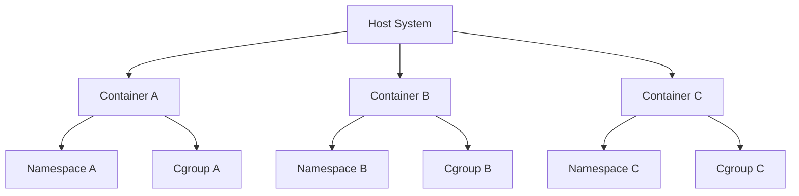
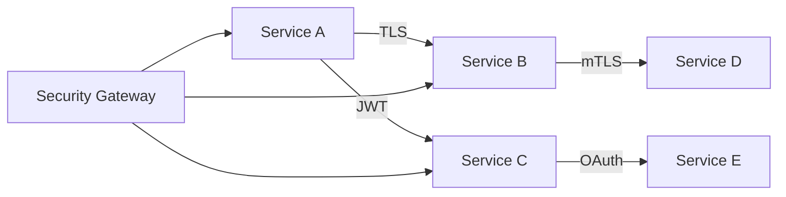
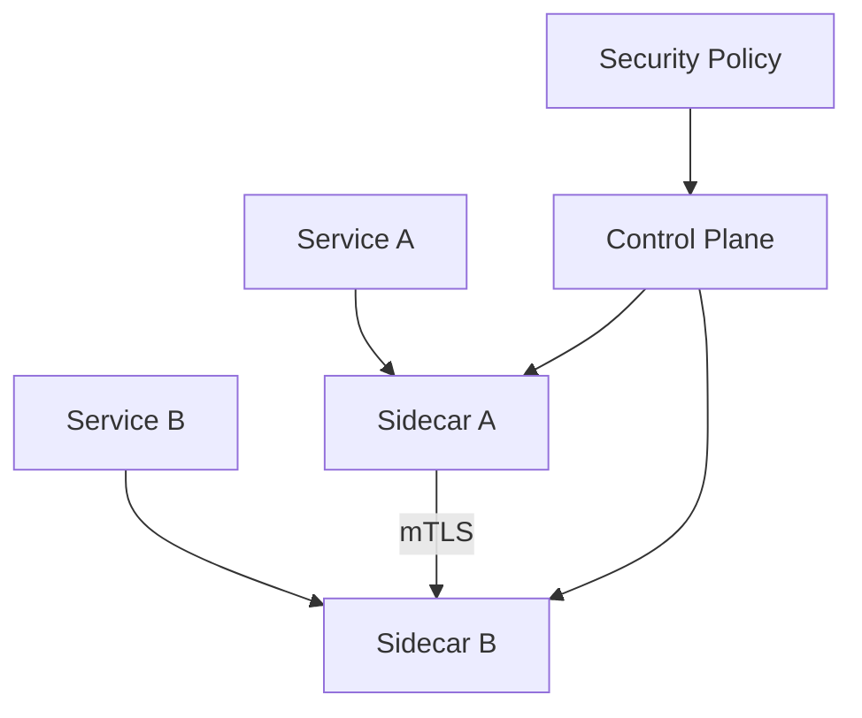
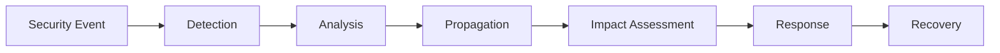

# 安全关系模型 / Security Relationship Model

## 1. 概述 / Overview

本文档建立容器与微服务系统的安全关系模型，包括容器安全关系、微服务安全关系、服务网格安全关系等核心概念的关系建模。

This document establishes security relationship models for container and microservice systems, including container security relationships, microservice security relationships, and service mesh security relationships.

## 2. 容器安全关系 / Container Security Relationships

### 2.1 容器隔离关系 / Container Isolation Relationships

**定义2.1.1（容器隔离关系）：**
容器隔离关系是一个五元组 $CIR = (Namespaces, Cgroups, Network, Storage, Security)$，其中：

- $Namespaces$：命名空间隔离（Namespace Isolation）
- $Cgroups$：资源控制隔离（Cgroup Isolation）
- $Network$：网络隔离（Network Isolation）
- $Storage$：存储隔离（Storage Isolation）
- $Security$：安全策略隔离（Security Policy Isolation）

**隔离关系图：**



### 2.2 容器安全边界关系 / Container Security Boundary Relationships

**定义2.1.2（安全边界关系）：**
安全边界关系是一个四元组 $CSBR = (Boundary, Access, Control, Audit)$，其中：

- $Boundary$：安全边界定义（Security Boundary Definition）
- $Access$：访问控制关系（Access Control Relationship）
- $Control$：安全控制关系（Security Control Relationship）
- $Audit$：审计关系（Audit Relationship）

**安全边界模型：**
$$Security_{Boundary} = \{(Container_i, Boundary_i, Access_i, Control_i) | i \in [1, n]\}$$

## 3. 微服务安全关系 / Microservice Security Relationships

### 3.1 服务间安全通信关系 / Inter-Service Security Communication Relationships

**定义3.1.1（安全通信关系）：**
安全通信关系是一个六元组 $ISCR = (Authentication, Authorization, Encryption, Integrity, NonRepudiation, Audit)$，其中：

- $Authentication$：身份认证关系（Authentication Relationship）
- $Authorization$：权限授权关系（Authorization Relationship）
- $Encryption$：加密通信关系（Encryption Relationship）
- $Integrity$：完整性保护关系（Integrity Protection Relationship）
- $NonRepudiation$：不可否认关系（Non-Repudiation Relationship）
- $Audit$：审计追踪关系（Audit Trail Relationship）

**安全通信图：**



### 3.2 服务安全依赖关系 / Service Security Dependency Relationships

**定义3.1.2（安全依赖关系）：**
安全依赖关系是一个五元组 $SSDR = (Dependencies, Trust, Chain, Propagation, Impact)$，其中：

- $Dependencies$：安全依赖集合（Security Dependency Set）
- $Trust$：信任关系（Trust Relationship）
- $Chain$：信任链（Trust Chain）
- $Propagation$：安全传播（Security Propagation）
- $Impact$：安全影响（Security Impact）

**依赖关系矩阵：**
$$D_{security} = \begin{bmatrix}
d_{11} & d_{12} & \cdots & d_{1n} \\
d_{21} & d_{22} & \cdots & d_{2n} \\
\vdots & \vdots & \ddots & \vdots \\
d_{n1} & d_{n2} & \cdots & d_{nn}
\end{bmatrix}$$

其中 $d_{ij}$ 表示服务 $i$ 对服务 $j$ 的安全依赖强度。

## 4. 服务网格安全关系 / Service Mesh Security Relationships

### 4.1 代理安全关系 / Proxy Security Relationships

**定义4.1.1（代理安全关系）：**
代理安全关系是一个五元组 $PSR = (Sidecar, Policy, Enforcement, Monitoring, Response)$，其中：

- $Sidecar$：Sidecar代理关系（Sidecar Proxy Relationship）
- $Policy$：安全策略关系（Security Policy Relationship）
- $Enforcement$：策略执行关系（Policy Enforcement Relationship）
- $Monitoring$：安全监控关系（Security Monitoring Relationship）
- $Response$：安全响应关系（Security Response Relationship）

**代理安全拓扑：**


### 4.2 零信任安全关系 / Zero Trust Security Relationships

**定义4.1.2（零信任关系）：**
零信任关系是一个六元组 $ZTR = (Identity, Device, Network, Application, Data, Continuous)$，其中：

- $Identity$：身份验证关系（Identity Verification Relationship）
- $Device$：设备安全关系（Device Security Relationship）
- $Network$：网络安全关系（Network Security Relationship）
- $Application$：应用安全关系（Application Security Relationship）
- $Data$：数据安全关系（Data Security Relationship）
- $Continuous$：持续验证关系（Continuous Verification Relationship）

**零信任模型：**
$$ZeroTrust = \min(Identity, Device, Network, Application, Data) \times Continuous$$

## 5. 安全策略传播模型 / Security Policy Propagation Model

### 5.1 策略传播定义 / Policy Propagation Definition

**定义5.1.1（安全策略传播）：**
安全策略传播是一个五元组 $SPP = (Policy, Source, Target, Propagation, Enforcement)$，其中：

- $Policy$：安全策略（Security Policy）
- $Source$：策略源（Policy Source）
- $Target$：策略目标（Policy Target）
- $Propagation$：传播机制（Propagation Mechanism）
- $Enforcement$：执行机制（Enforcement Mechanism）

**传播算法：**
```python
def propagate_security_policy(policy, source, targets):
    """安全策略传播算法"""
    propagated_policies = {}

    for target in targets:
        # 计算传播路径
        path = find_propagation_path(source, target)

        # 应用传播规则
        propagated_policy = apply_propagation_rules(policy, path)

        # 验证策略有效性
        if validate_policy(propagated_policy, target):
            propagated_policies[target] = propagated_policy

    return propagated_policies
```

### 5.2 策略冲突检测 / Policy Conflict Detection

**定义5.1.2（策略冲突）：**
策略冲突是一个四元组 $PC = (Conflicts, Detection, Resolution, Prevention)$，其中：

- $Conflicts$：冲突类型（Conflict Types）
- $Detection$：冲突检测（Conflict Detection）
- $Resolution$：冲突解决（Conflict Resolution）
- $Prevention$：冲突预防（Conflict Prevention）

**冲突检测算法：**
```python
def detect_policy_conflicts(policies):
    """检测策略冲突"""
    conflicts = []

    for i, policy1 in enumerate(policies):
        for j, policy2 in enumerate(policies[i+1:], i+1):
            if has_conflict(policy1, policy2):
                conflict = {
                    'policy1': policy1,
                    'policy2': policy2,
                    'type': get_conflict_type(policy1, policy2),
                    'severity': calculate_conflict_severity(policy1, policy2)
                }
                conflicts.append(conflict)

    return conflicts
```

## 6. 安全事件传播模型 / Security Event Propagation Model

### 6.1 事件传播定义 / Event Propagation Definition

**定义6.1.1（安全事件传播）：**
安全事件传播是一个五元组 $SEP = (Event, Source, Propagation, Impact, Response)$，其中：

- $Event$：安全事件（Security Event）
- $Source$：事件源（Event Source）
- $Propagation$：传播路径（Propagation Path）
- $Impact$：影响范围（Impact Scope）
- $Response$：响应机制（Response Mechanism）

**事件传播图：**


### 6.2 影响传播分析 / Impact Propagation Analysis

**定义6.1.2（影响传播）：**
影响传播是一个四元组 $IPA = (Impact, Propagation, Assessment, Mitigation)$，其中：

- $Impact$：影响类型（Impact Types）
- $Propagation$：传播机制（Propagation Mechanism）
- $Assessment$：影响评估（Impact Assessment）
- $Mitigation$：缓解措施（Mitigation Measures）

**影响传播函数：**
$$Impact_{Propagation}(t) = \sum_{i=1}^{n} Impact_i \times Propagation_i(t) \times Severity_i$$

## 7. 安全监控关系模型 / Security Monitoring Relationship Model

### 7.1 监控关系定义 / Monitoring Relationship Definition

**定义7.1.1（安全监控关系）：**
安全监控关系是一个五元组 $SMR = (Monitoring, Collection, Analysis, Alert, Response)$，其中：

- $Monitoring$：监控点（Monitoring Points）
- $Collection$：数据收集（Data Collection）
- $Analysis$：数据分析（Data Analysis）
- $Alert$：告警机制（Alert Mechanism）
- $Response$：响应机制（Response Mechanism）

### 7.2 监控拓扑关系 / Monitoring Topology Relationships

**定义7.1.2（监控拓扑）：**
监控拓扑是一个四元组 $MTR = (Nodes, Edges, Metrics, Coverage)$，其中：

- $Nodes$：监控节点（Monitoring Nodes）
- $Edges$：监控连接（Monitoring Connections）
- $Metrics$：监控指标（Monitoring Metrics）
- $Coverage$：监控覆盖（Monitoring Coverage）

**监控覆盖模型：**
$$Coverage_{Security} = \frac{\sum_{i=1}^{n} Monitored_i}{Total_{Components}} \times 100\%$$

## 8. 安全合规关系模型 / Security Compliance Relationship Model

### 8.1 合规关系定义 / Compliance Relationship Definition

**定义8.1.1（安全合规关系）：**
安全合规关系是一个五元组 $SCR = (Standards, Requirements, Assessment, Validation, Reporting)$，其中：

- $Standards$：安全标准（Security Standards）
- $Requirements$：合规要求（Compliance Requirements）
- $Assessment$：合规评估（Compliance Assessment）
- $Validation$：合规验证（Compliance Validation）
- $Reporting$：合规报告（Compliance Reporting）

### 8.2 合规映射关系 / Compliance Mapping Relationships

**定义8.1.2（合规映射）：**
合规映射是一个四元组 $CMR = (Mapping, Coverage, Gap, Remediation)$，其中：

- $Mapping$：标准映射（Standard Mapping）
- $Coverage$：覆盖范围（Coverage Scope）
- $Gap$：合规差距（Compliance Gaps）
- $Remediation$：补救措施（Remediation Measures）

## 9. 安全风险评估模型 / Security Risk Assessment Model

### 9.1 风险评估定义 / Risk Assessment Definition

**定义9.1.1（安全风险评估）：**
安全风险评估是一个五元组 $SRA = (Threats, Vulnerabilities, Impact, Likelihood, Risk)$，其中：

- $Threats$：威胁识别（Threat Identification）
- $Vulnerabilities$：漏洞评估（Vulnerability Assessment）
- $Impact$：影响分析（Impact Analysis）
- $Likelihood$：可能性评估（Likelihood Assessment）
- $Risk$：风险计算（Risk Calculation）

**风险计算公式：**
$$Risk = Threat \times Vulnerability \times Impact$$

### 9.2 风险传播关系 / Risk Propagation Relationships

**定义9.1.2（风险传播）：**
风险传播是一个四元组 $RPR = (Propagation, Dependencies, Cascading, Mitigation)$，其中：

- $Propagation$：传播路径（Propagation Path）
- $Dependencies$：依赖关系（Dependency Relationships）
- $Cascading$：级联效应（Cascading Effects）
- $Mitigation$：风险缓解（Risk Mitigation）

## 10. 安全治理关系模型 / Security Governance Relationship Model

### 10.1 治理关系定义 / Governance Relationship Definition

**定义10.1.1（安全治理关系）：**
安全治理关系是一个五元组 $SGR = (Policies, Procedures, Roles, Responsibilities, Accountability)$，其中：

- $Policies$：安全策略（Security Policies）
- $Procedures$：安全程序（Security Procedures）
- $Roles$：安全角色（Security Roles）
- $Responsibilities$：安全责任（Security Responsibilities）
- $Accountability$：安全问责（Security Accountability）

### 10.2 治理层次关系 / Governance Hierarchy Relationships

**定义10.1.2（治理层次）：**
治理层次是一个四元组 $GHR = (Strategic, Tactical, Operational, Technical)$，其中：

- $Strategic$：战略层（Strategic Level）
- $Tactical$：战术层（Tactical Level）
- $Operational$：操作层（Operational Level）
- $Technical$：技术层（Technical Level）

## 11. 总结 / Summary

安全关系模型提供了：

1. **容器安全关系**：容器隔离和安全边界的关系建模
2. **微服务安全关系**：服务间安全通信和依赖关系
3. **服务网格安全关系**：代理安全和零信任关系
4. **策略传播模型**：安全策略的传播和冲突检测
5. **事件传播模型**：安全事件的传播和影响分析
6. **监控关系模型**：安全监控的拓扑和覆盖关系
7. **合规关系模型**：安全合规的映射和评估关系
8. **风险评估模型**：安全风险的评估和传播关系
9. **治理关系模型**：安全治理的层次和责任关系

这些关系模型为容器与微服务系统的安全设计、实现和运维提供了理论基础。

---

**参考文献 / References**

1. NIST Cybersecurity Framework. "Framework for Improving Critical Infrastructure Cybersecurity"
2. OWASP. "OWASP Top Ten"
3. Cloud Security Alliance. "Cloud Controls Matrix"
4. Kubernetes Security Documentation. "Kubernetes Security Best Practices"
5. Istio Security Documentation. "Istio Security"
6. Docker Security Documentation. "Docker Security"
7. CNCF Security Documentation. "Cloud Native Security"
8. ISO/IEC 27001. "Information Security Management Systems"
