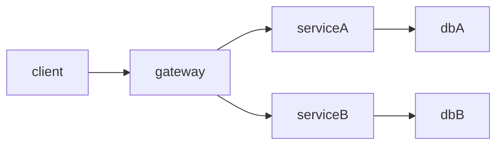

# 7.3.2 拓扑结构

## 1. 容器网络拓扑

- **Overlay网络**：如Flannel、Calico，支持跨主机容器通信。
- **CNI插件**：实现网络隔离、IP分配、网络策略。
- **多集群与多云拓扑**：支持跨数据中心、跨云的容器网络互联。

## 2. 微服务通信拓扑

- **点对点通信**：服务间直接调用，适合小规模系统。
- **服务总线（ESB）**：集中式消息中介，适合企业集成。
- **API网关与服务发现**：API网关统一入口，服务注册中心动态发现。
- **服务依赖图**：用有向图描述服务间依赖关系。

## 3. 服务网格拓扑

- **控制面与数据面分离**：控制面负责策略下发，数据面负责流量转发。
- **流量路由与治理**：支持灰度发布、A/B测试、流量镜像等。
- **多租户与多环境拓扑**：支持不同租户、环境的网络隔离与治理。

## 4. 拓扑建模方法

- **图论建模**：用有向图、邻接矩阵描述服务依赖与网络结构。
- **Mermaid结构图**：

- **结构图与流程图**：结合UML、Mermaid等工具进行可视化。

---
> 本文件为7.3.2拓扑结构的内容填充示例，后续可继续递归细化。
