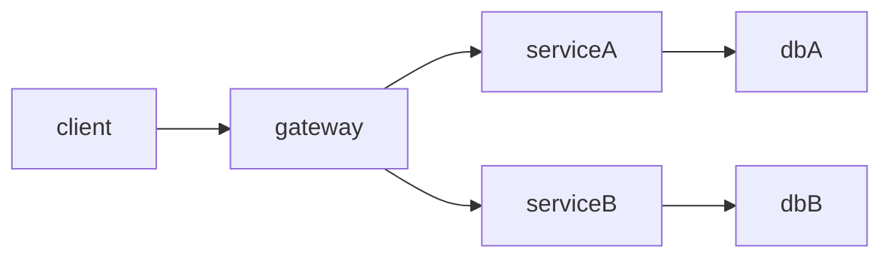

# 7.3.2 拓扑结构 / Topology Structure

<!-- TOC START -->

- [7.3.2 拓扑结构 / Topology Structure](#732-拓扑结构-topology-structure)
  - [1. 容器网络拓扑 / Container Network Topology](#1-容器网络拓扑-container-network-topology)
    - [工程论证 / Engineering Argumentation](#工程论证-engineering-argumentation)
  - [2. 微服务通信拓扑 / Microservice Communication Topology](#2-微服务通信拓扑-microservice-communication-topology)
    - [工程论证 / Engineering Argumentation1](#工程论证-engineering-argumentation1)
  - [3. 服务网格拓扑 / Service Mesh Topology](#3-服务网格拓扑-service-mesh-topology)
    - [工程论证 / Engineering Argumentation2](#工程论证-engineering-argumentation2)
  - [4. 拓扑建模方法 / Topology Modeling Methods](#4-拓扑建模方法-topology-modeling-methods)
  - [5. 批判性分析 / Critical Analysis](#5-批判性分析-critical-analysis)
  - [6. 结构对标国际wiki / Structure Benchmarking to International Wiki](#6-结构对标国际wiki-structure-benchmarking-to-international-wiki)

<!-- TOC END -->

## 1. 容器网络拓扑 / Container Network Topology

- **Overlay网络 / Overlay Network**：如Flannel、Calico，支持跨主机容器通信。
  Overlay networks such as Flannel and Calico support cross-host container communication.
- **CNI插件 / CNI Plugins**：实现网络隔离、IP分配、网络策略。
  CNI plugins implement network isolation, IP allocation, and network policies.
- **多集群与多云拓扑 / Multi-cluster and Multi-cloud Topology**：支持跨数据中心、跨云的容器网络互联。
  Supports container network interconnection across data centers and clouds.

### 工程论证 / Engineering Argumentation

- Overlay网络提升了容器弹性与可扩展性，但带来额外的封包开销和调试复杂性。
  Overlay networks improve container elasticity and scalability, but introduce additional packet overhead and debugging complexity.
- CNI插件生态丰富，便于定制，但标准化程度不一，兼容性需关注。
  CNI plugin ecosystem is rich and customizable, but standardization varies and compatibility needs attention.

## 2. 微服务通信拓扑 / Microservice Communication Topology

- **点对点通信 / Point-to-point Communication**：服务间直接调用，适合小规模系统。
  Direct calls between services, suitable for small-scale systems.
- **服务总线（ESB）/ Service Bus (ESB)**：集中式消息中介，适合企业集成。
  Centralized message broker, suitable for enterprise integration.
- **API网关与服务发现 / API Gateway and Service Discovery**：API网关统一入口，服务注册中心动态发现。
  API gateway as unified entry, service registry for dynamic discovery.
- **服务依赖图 / Service Dependency Graph**：用有向图描述服务间依赖关系。
  Use directed graphs to describe dependencies between services.

### 工程论证 / Engineering Argumentation1

- 点对点通信简单高效，但服务数量增加后依赖关系复杂化，难以维护。
  Point-to-point is simple and efficient, but becomes hard to maintain as service count grows.
- ESB提升了集成能力，但引入单点瓶颈和集中故障风险。
  ESB improves integration but introduces single point of failure and bottleneck risks.
- API网关增强了安全与治理，但成为流量瓶颈和潜在单点。
  API gateway enhances security and governance, but may become a traffic bottleneck and single point of failure.

## 3. 服务网格拓扑 / Service Mesh Topology

- **控制面与数据面分离 / Control Plane and Data Plane Separation**：控制面负责策略下发，数据面负责流量转发。
  Control plane delivers policies, data plane handles traffic forwarding.
- **流量路由与治理 / Traffic Routing and Governance**：支持灰度发布、A/B测试、流量镜像等。
  Supports canary release, A/B testing, traffic mirroring, etc.
- **多租户与多环境拓扑 / Multi-tenant and Multi-environment Topology**：支持不同租户、环境的网络隔离与治理。
  Supports network isolation and governance for different tenants and environments.

### 工程论证 / Engineering Argumentation2

- 服务网格提升了治理能力和可观测性，但引入了显著的性能开销和运维复杂度。
  Service mesh improves governance and observability, but introduces significant performance overhead and operational complexity.
- 多租户拓扑增强了安全隔离，但配置和策略管理难度提升。
  Multi-tenant topology enhances security isolation, but increases configuration and policy management complexity.

## 4. 拓扑建模方法 / Topology Modeling Methods

- **图论建模 / Graph Theory Modeling**：用有向图、邻接矩阵描述服务依赖与网络结构。
  Use directed graphs and adjacency matrices to describe service dependencies and network structure.
- **Mermaid结构图 / Mermaid Structure Diagram**：

- **结构图与流程图 / Structure and Flow Diagrams**：结合UML、Mermaid等工具进行可视化。
  Use UML, Mermaid, etc. for visualization.

## 5. 批判性分析 / Critical Analysis

- **优点 / Advantages**
  - 拓扑结构清晰，有助于系统解耦与弹性扩展。
    Clear topology aids system decoupling and elastic scaling.
  - 支持多种通信与治理模式，适应不同规模和复杂度。
    Supports multiple communication and governance modes for different scales and complexities.
- **局限性 / Limitations**
  - 拓扑复杂度随系统规模提升，维护和可观测性挑战加大。
    Topology complexity increases with system scale, making maintenance and observability more challenging.
  - 多层拓扑和多租户环境下，策略冲突和安全隐患需重点关注。
    Policy conflicts and security risks in multi-layer and multi-tenant topologies require special attention.

## 6. 结构对标国际wiki / Structure Benchmarking to International Wiki

- 采用分层、分面、可视化等国际主流wiki结构。
  Use layered, faceted, and visualized structures as in international mainstream wikis.
- 强调形式化建模与工程可实现性。
  Emphasize formal modeling and engineering feasibility.
- 保持内容递进、逻辑清晰、知识点完备。
  Maintain progressive content, clear logic, and comprehensive knowledge points.

---
> 本文件为7.3.2拓扑结构的系统化知识点与批判性分析，采用中英双语，突出工程论证与知识点完备性。
> This file provides systematic knowledge points and critical analysis of topology structure, with Chinese-English bilingual content, emphasizing engineering argumentation and comprehensive knowledge points.
