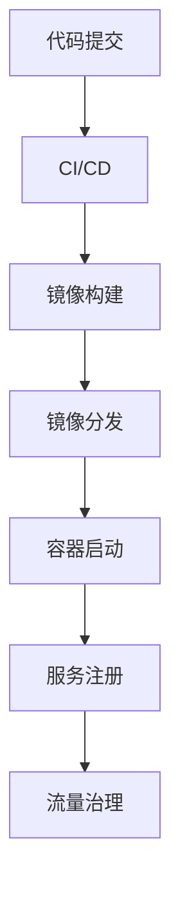

# 7.3.3 流程建模

## 1. 容器生命周期流程

- **镜像构建**：开发者提交代码，CI系统自动构建镜像。
- **镜像分发**：镜像推送到镜像仓库，节点拉取镜像。
- **容器启动与调度**：编排系统根据策略调度容器实例。
- **资源伸缩与回收**：根据负载自动扩缩容，回收无用资源。

## 2. 微服务运维流程

- **CI/CD流水线**：代码提交→自动测试→镜像构建→自动部署。
- **服务弹性与自愈**：健康检查、自动重启、故障转移。
- **灰度发布与回滚**：分批上线、流量切换、异常自动回滚。

## 3. 服务网格治理流程

- **流量管理**：入口流量分发、路由策略下发。
- **熔断与限流**：自动检测异常，触发熔断或限流保护。
- **安全策略下发**：mTLS、访问控制、策略一致性。

## 4. 流程建模工具

- **Mermaid流程图**：

- **UML活动图、时序图**：描述服务间交互与流程。

---
> 本文件为7.3.3流程建模的内容填充示例，后续可继续递归细化。
