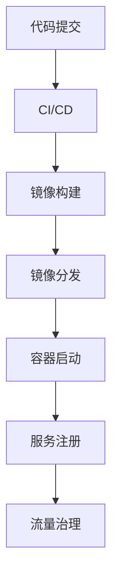

# 7.3.3 流程建模 / Process Modeling

## 1. 容器生命周期流程 / Container Lifecycle Process

- **镜像构建 / Image Build**：开发者提交代码，CI系统自动构建镜像。
  Developers submit code, CI system automatically builds images.
- **镜像分发 / Image Distribution**：镜像推送到镜像仓库，节点拉取镜像。
  Images are pushed to registry, nodes pull images.
- **容器启动与调度 / Container Startup and Scheduling**：编排系统根据策略调度容器实例。
  Orchestration system schedules container instances according to policies.
- **资源伸缩与回收 / Resource Scaling and Reclamation**：根据负载自动扩缩容，回收无用资源。
  Auto scaling and resource reclamation based on load.

### 工程论证 / Engineering Argumentation

- 自动化流程提升了交付效率和一致性，但依赖于CI/CD平台的稳定性和安全性。
  Automation improves delivery efficiency and consistency, but depends on CI/CD platform stability and security.
- 镜像分发涉及网络带宽和安全认证，需防止镜像污染和泄露。
  Image distribution involves network bandwidth and security authentication, requiring prevention of image pollution and leakage.

## 2. 微服务运维流程 / Microservice Operations Process

- **CI/CD流水线 / CI/CD Pipeline**：代码提交→自动测试→镜像构建→自动部署。
  Code commit → automated test → image build → automated deployment.
- **服务弹性与自愈 / Service Elasticity and Self-healing**：健康检查、自动重启、故障转移。
  Health checks, auto-restart, failover.
- **灰度发布与回滚 / Canary Release and Rollback**：分批上线、流量切换、异常自动回滚。
  Batch release, traffic switching, auto rollback on exception.

### 工程论证 / Engineering Argumentation1

- CI/CD流水线提升了发布频率和质量，但增加了工具链复杂性和维护成本。
  CI/CD pipeline increases release frequency and quality, but adds toolchain complexity and maintenance cost.
- 弹性与自愈机制提升了系统可用性，但依赖于监控和自动化治理能力。
  Elasticity and self-healing improve availability, but depend on monitoring and automation.

## 3. 服务网格治理流程 / Service Mesh Governance Process

- **流量管理 / Traffic Management**：入口流量分发、路由策略下发。
  Ingress traffic distribution, routing policy delivery.
- **熔断与限流 / Circuit Breaking and Rate Limiting**：自动检测异常，触发熔断或限流保护。
  Auto anomaly detection, trigger circuit breaking or rate limiting.
- **安全策略下发 / Security Policy Delivery**：mTLS、访问控制、策略一致性。
  mTLS, access control, policy consistency.

### 工程论证 / Engineering Argumentation2

- 服务网格治理流程提升了安全性和可观测性，但引入了额外的延迟和资源消耗。
  Service mesh governance improves security and observability, but introduces extra latency and resource consumption.
- 流量管理和熔断机制需精细配置，防止误伤正常流量。
  Traffic management and circuit breaking require fine-tuned configuration to avoid affecting normal traffic.

## 4. 流程建模工具 / Process Modeling Tools

- **Mermaid流程图 / Mermaid Flowchart**：

- **UML活动图、时序图 / UML Activity and Sequence Diagrams**：描述服务间交互与流程。
  Describe inter-service interactions and processes.

## 5. 批判性分析 / Critical Analysis

- **优点 / Advantages**
  - 流程自动化提升了效率和一致性，降低了人为失误。
    Automation improves efficiency and consistency, reduces human error.
  - 支持弹性、可观测性和安全治理，适应复杂业务需求。
    Supports elasticity, observability, and security governance for complex business needs.
- **局限性 / Limitations**
  - 流程链路复杂，依赖多工具协同，调试和排障难度大。
    Process chains are complex, require multi-tool collaboration, making debugging and troubleshooting difficult.
  - 自动化流程一旦配置失误，影响范围广，风险高。
    Misconfiguration in automation can have wide-ranging and high-risk impacts.

## 6. 结构对标国际wiki / Structure Benchmarking to International Wiki

- 采用分层、分面、可视化等国际主流wiki结构。
  Use layered, faceted, and visualized structures as in international mainstream wikis.
- 强调流程建模的工程可实现性与可维护性。
  Emphasize engineering feasibility and maintainability of process modeling.
- 保持内容递进、逻辑清晰、知识点完备。
  Maintain progressive content, clear logic, and comprehensive knowledge points.

---
> 本文件为7.3.3流程建模的系统化知识点与批判性分析，采用中英双语，突出工程论证与知识点完备性。
> This file provides systematic knowledge points and critical analysis of process modeling, with Chinese-English bilingual content, emphasizing engineering argumentation and comprehensive knowledge points.
