# 7.5.2 流程图 / Flowchart

## 1. 容器生命周期流程图 / Container Lifecycle Flowchart

### 1.1 容器创建与启动流程 / Container Creation and Startup Flow

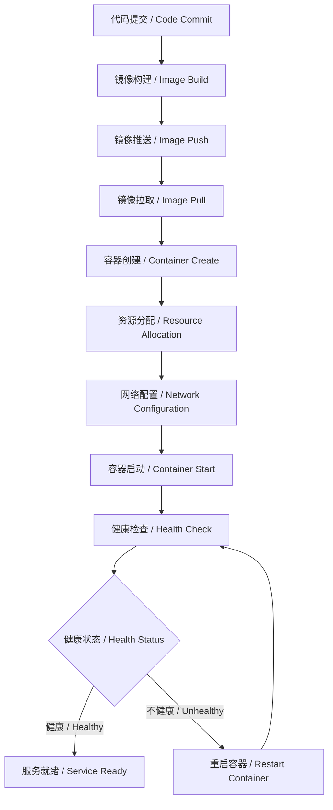

### 1.2 容器编排调度流程 / Container Orchestration Scheduling Flow

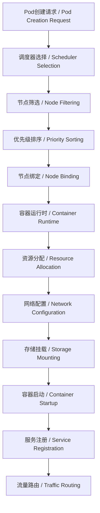

## 2. 微服务部署流程图 / Microservice Deployment Flowchart

### 2.1 CI/CD流水线流程 / CI/CD Pipeline Flow

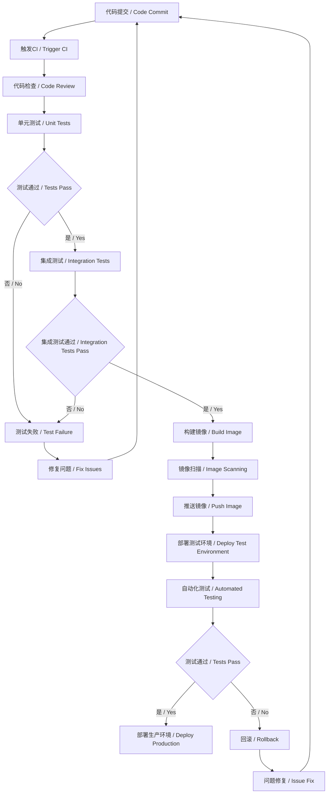

### 2.2 微服务通信流程 / Microservice Communication Flow

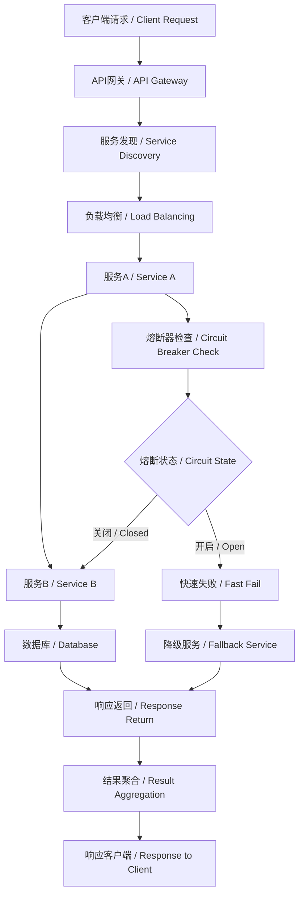

## 3. 服务网格治理流程图 / Service Mesh Governance Flowchart

### 3.1 流量管理流程 / Traffic Management Flow

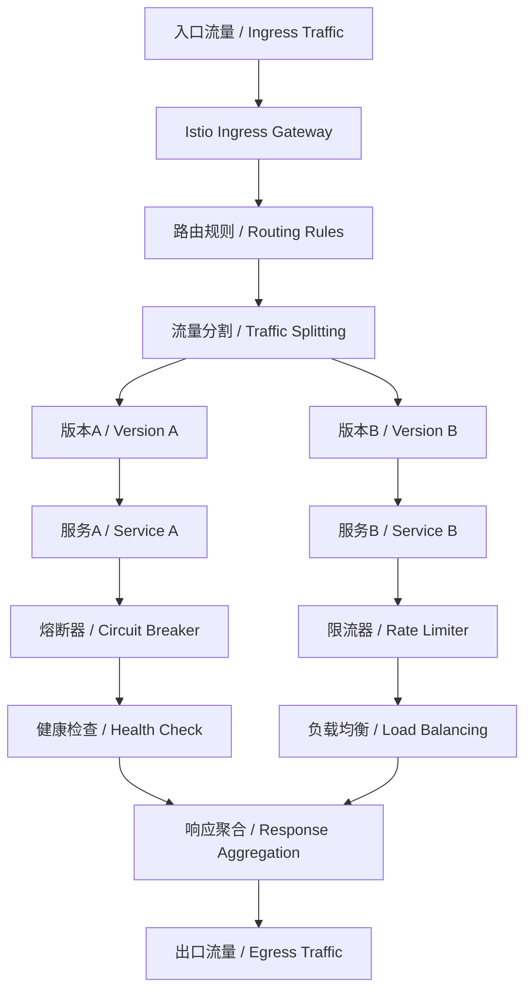

### 3.2 安全策略流程 / Security Policy Flow

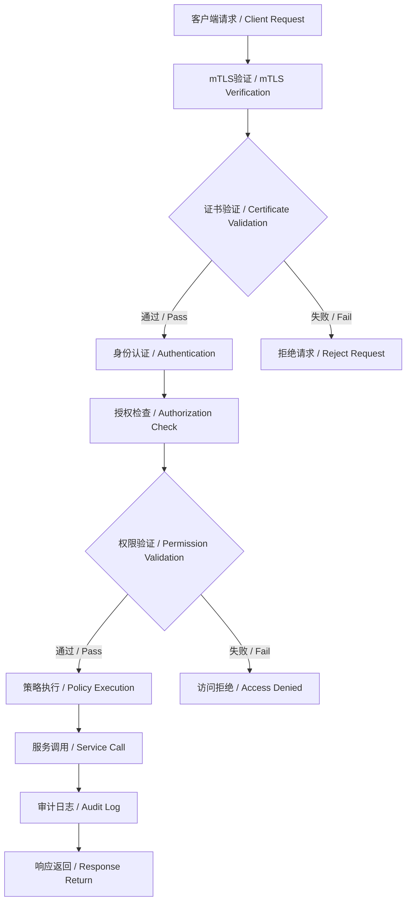

## 4. Serverless函数执行流程图 / Serverless Function Execution Flowchart

### 4.1 函数调用流程 / Function Invocation Flow

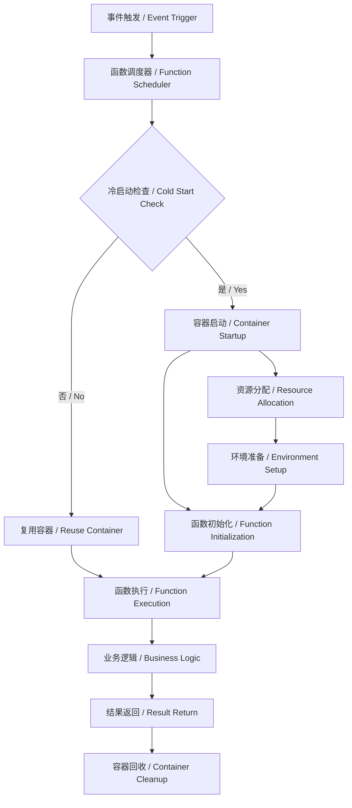

### 4.2 弹性伸缩流程 / Auto Scaling Flow

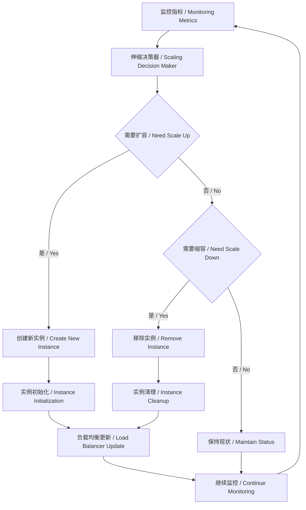

## 5. 监控与可观测性流程图 / Monitoring and Observability Flowchart

### 5.1 数据收集流程 / Data Collection Flow

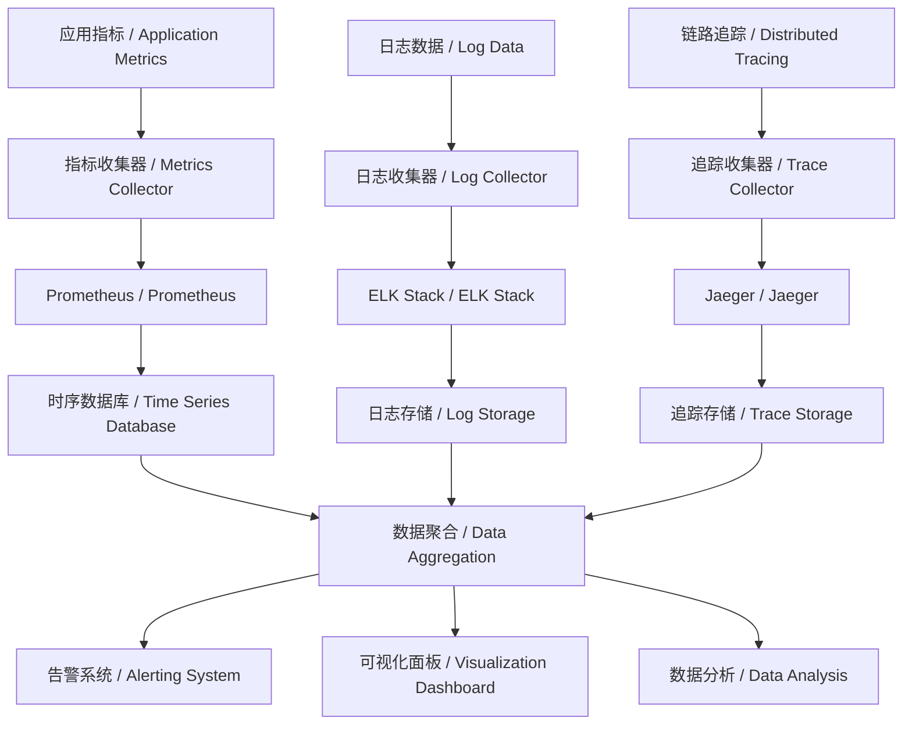

### 5.2 告警处理流程 / Alert Handling Flow

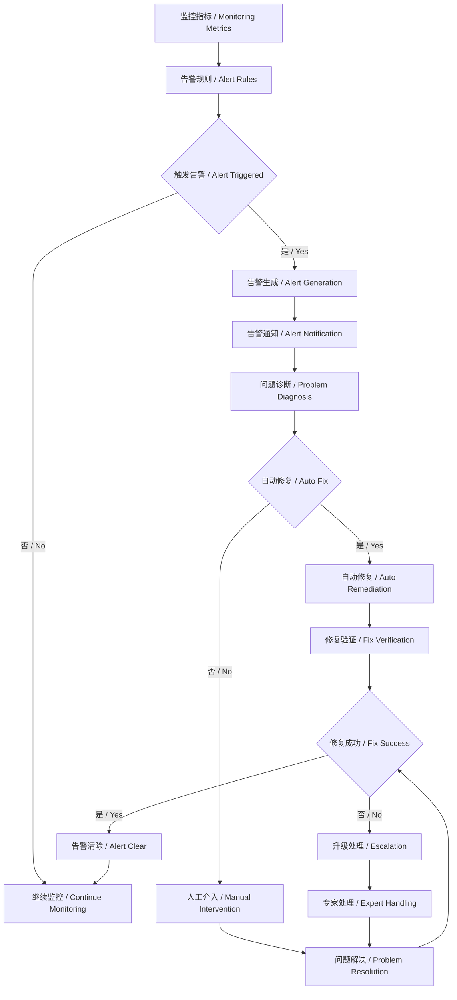

## 6. 故障处理流程图 / Fault Handling Flowchart

### 6.1 故障检测与恢复流程 / Fault Detection and Recovery Flow

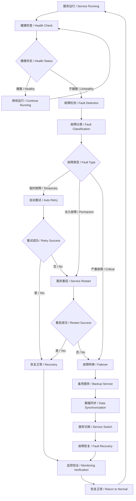

### 6.2 灾难恢复流程 / Disaster Recovery Flow

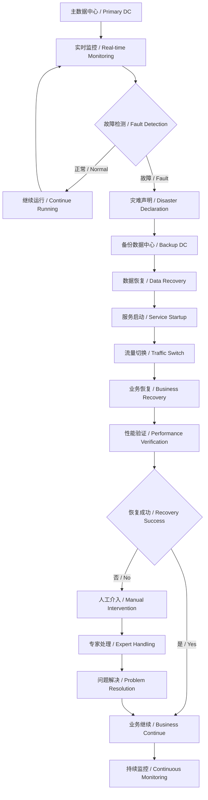

## 7. 批判性分析 / Critical Analysis

### 7.1 流程设计优势 / Flow Design Advantages

- **自动化程度高**：减少人工干预，提高效率  
  High automation: reduces manual intervention, improves efficiency
- **标准化流程**：确保操作一致性和可重复性  
  Standardized processes: ensures operational consistency and repeatability
- **快速响应**：自动化检测和修复，缩短故障恢复时间  
  Fast response: automated detection and repair, shortens fault recovery time

### 7.2 流程设计挑战 / Flow Design Challenges

- **复杂性管理**：流程链路长，依赖关系复杂  
  Complexity management: long process chains, complex dependencies
- **异常处理**：边界情况处理困难，容错机制复杂  
  Exception handling: difficult boundary case handling, complex fault tolerance mechanisms
- **性能影响**：监控和治理流程可能影响系统性能  
  Performance impact: monitoring and governance processes may affect system performance

### 7.3 工程权衡 / Engineering Trade-offs

- **自动化 vs 可控性**：高度自动化 vs 人工控制  
  Automation vs controllability: high automation vs manual control
- **性能 vs 可靠性**：流程优化 vs 系统稳定性  
  Performance vs reliability: process optimization vs system stability
- **简单性 vs 功能性**：流程简化 vs 功能完整  
  Simplicity vs functionality: process simplification vs complete functionality

## 8. 结构对标国际wiki / Structure Benchmarking to International Wiki

- 采用分层、分面、可视化等国际主流wiki结构  
  Use layered, faceted, and visualized structures as in international mainstream wikis
- 强调流程建模的工程可实现性与可维护性  
  Emphasize engineering feasibility and maintainability of process modeling
- 保持内容递进、逻辑清晰、知识点完备  
  Maintain progressive content, clear logic, and comprehensive knowledge points

---

> 本文件为7.5.2流程图的系统化流程建模，采用中英双语对照，突出工程论证与知识点完备性。
> This file provides systematic process modeling with flowcharts, with Chinese-English bilingual content, emphasizing engineering argumentation and comprehensive knowledge points.
