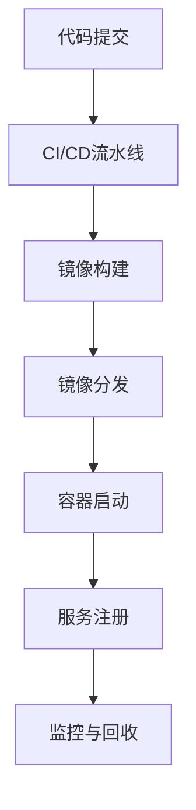
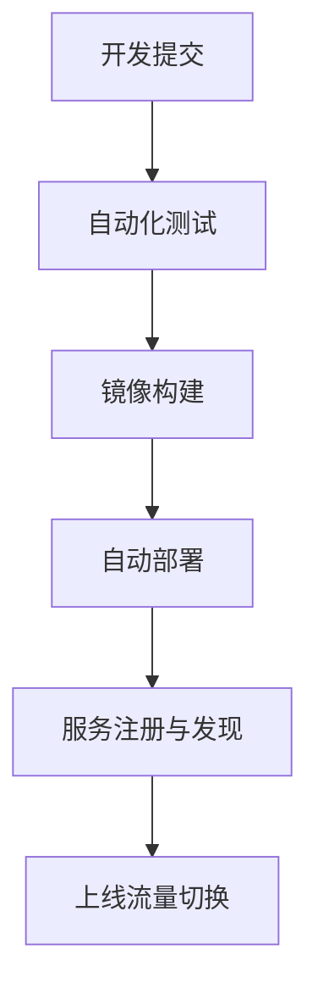
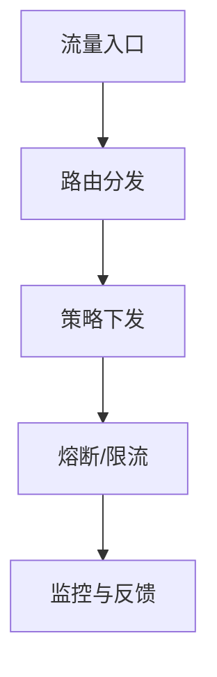

# 7.5.2 流程图

## 1. 容器生命周期流程图

- 说明：该流程图展示了从代码提交到容器运行、注册、监控与回收的全生命周期。

## 2. 微服务部署流程图

- 说明：该流程图展示了微服务从开发到上线的CI/CD自动化部署流程。

## 3. 服务网格流量治理流程图

- 说明：该流程图展示了服务网格中流量治理的关键环节，包括路由、策略、熔断、监控等。

---
> 本文件为7.5.2流程图的内容填充示例，后续可继续递归细化。
