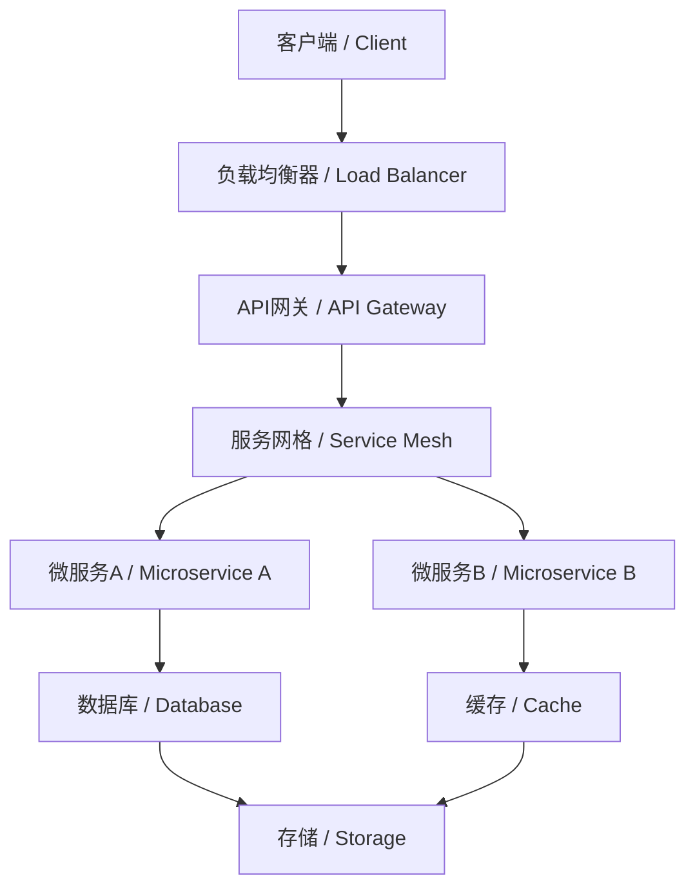

# 7.5.3 多角度表达 / Multi-perspective Expression

<!-- TOC START -->

- [7.5.3 多角度表达 / Multi-perspective Expression](#753-多角度表达-multi-perspective-expression)
  - [1. 技术架构角度 / Technical Architecture Perspective](#1-技术架构角度-technical-architecture-perspective)
    - [1.1 分层架构视角 / Layered Architecture Perspective](#11-分层架构视角-layered-architecture-perspective)
    - [1.2 组件交互视角 / Component Interaction Perspective](#12-组件交互视角-component-interaction-perspective)
  - [2. 业务价值角度 / Business Value Perspective](#2-业务价值角度-business-value-perspective)
    - [2.1 敏捷开发价值 / Agile Development Value](#21-敏捷开发价值-agile-development-value)
    - [2.2 运维价值 / Operations Value](#22-运维价值-operations-value)
  - [3. 安全治理角度 / Security Governance Perspective](#3-安全治理角度-security-governance-perspective)
    - [3.1 安全防护体系 / Security Protection System](#31-安全防护体系-security-protection-system)
    - [3.2 合规治理 / Compliance Governance](#32-合规治理-compliance-governance)
  - [4. 性能优化角度 / Performance Optimization Perspective](#4-性能优化角度-performance-optimization-perspective)
    - [4.1 系统性能 / System Performance](#41-系统性能-system-performance)
    - [4.2 可扩展性 / Scalability](#42-可扩展性-scalability)
  - [5. 可观测性角度 / Observability Perspective](#5-可观测性角度-observability-perspective)
    - [5.1 监控体系 / Monitoring System](#51-监控体系-monitoring-system)
    - [5.2 链路追踪 / Distributed Tracing](#52-链路追踪-distributed-tracing)
  - [6. 成本效益角度 / Cost-benefit Perspective](#6-成本效益角度-cost-benefit-perspective)
    - [6.1 成本分析 / Cost Analysis](#61-成本分析-cost-analysis)
    - [6.2 效益评估 / Benefit Evaluation](#62-效益评估-benefit-evaluation)
  - [7. 风险管控角度 / Risk Management Perspective](#7-风险管控角度-risk-management-perspective)
    - [7.1 技术风险 / Technical Risks](#71-技术风险-technical-risks)
    - [7.2 业务风险 / Business Risks](#72-业务风险-business-risks)
  - [8. 未来发展趋势角度 / Future Development Trend Perspective](#8-未来发展趋势角度-future-development-trend-perspective)
    - [8.1 技术演进趋势 / Technology Evolution Trends](#81-技术演进趋势-technology-evolution-trends)
    - [8.2 行业应用趋势 / Industry Application Trends](#82-行业应用趋势-industry-application-trends)
  - [9. 批判性分析 / Critical Analysis](#9-批判性分析-critical-analysis)
    - [9.1 多角度优势 / Multi-perspective Advantages](#91-多角度优势-multi-perspective-advantages)
    - [9.2 多角度挑战 / Multi-perspective Challenges](#92-多角度挑战-multi-perspective-challenges)
    - [9.3 工程权衡 / Engineering Trade-offs](#93-工程权衡-engineering-trade-offs)
  - [10. 结构对标国际wiki / Structure Benchmarking to International Wiki](#10-结构对标国际wiki-structure-benchmarking-to-international-wiki)

<!-- TOC END -->

## 1. 技术架构角度 / Technical Architecture Perspective

### 1.1 分层架构视角 / Layered Architecture Perspective

**基础设施层（Infrastructure Layer）：**

- 物理硬件、虚拟化平台、云服务  
  Physical hardware, virtualization platform, cloud services
- 网络、存储、计算资源管理  
  Network, storage, computing resource management

**容器运行时层（Container Runtime Layer）：**

- Docker、containerd、CRI-O等容器引擎  
  Docker, containerd, CRI-O and other container engines
- 容器生命周期管理、资源隔离  
  Container lifecycle management, resource isolation

**编排管理层（Orchestration Layer）：**

- Kubernetes、Docker Swarm等编排平台  
  Kubernetes, Docker Swarm and other orchestration platforms
- 服务调度、负载均衡、自动扩缩容  
  Service scheduling, load balancing, auto scaling

**应用服务层（Application Service Layer）：**

- 微服务、API网关、服务网格  
  Microservices, API gateway, service mesh
- 业务逻辑、数据访问、外部集成  
  Business logic, data access, external integration

### 1.2 组件交互视角 / Component Interaction Perspective

## 2. 业务价值角度 / Business Value Perspective

### 2.1 敏捷开发价值 / Agile Development Value

**快速交付能力：**

- CI/CD流水线自动化部署  
  CI/CD pipeline automated deployment
- 容器化标准化交付  
  Containerized standardized delivery
- 微服务独立发布  
  Microservice independent release

**开发效率提升：**

- 环境一致性保证  
  Environment consistency guarantee
- 开发测试环境快速搭建  
  Rapid setup of development and testing environments
- 代码到生产的快速流转  
  Fast flow from code to production

### 2.2 运维价值 / Operations Value

**自动化运维：**

- 自动扩缩容、故障自愈  
  Auto scaling, fault self-healing
- 监控告警、日志聚合  
  Monitoring alerts, log aggregation
- 配置管理、版本控制  
  Configuration management, version control

**成本优化：**

- 资源利用率提升  
  Improved resource utilization
- 按需付费模式  
  Pay-as-you-go model
- 运维人力成本降低  
  Reduced operational manpower costs

## 3. 安全治理角度 / Security Governance Perspective

### 3.1 安全防护体系 / Security Protection System

**网络安全：**

- 网络策略、防火墙规则  
  Network policies, firewall rules
- 服务间通信加密  
  Inter-service communication encryption
- 流量监控、异常检测  
  Traffic monitoring, anomaly detection

**应用安全：**

- 镜像安全扫描  
  Image security scanning
- 运行时安全监控  
  Runtime security monitoring
- 漏洞管理、补丁更新  
  Vulnerability management, patch updates

### 3.2 合规治理 / Compliance Governance

**数据保护：**

- 数据加密、访问控制  
  Data encryption, access control
- 隐私保护、数据分类  
  Privacy protection, data classification
- 审计日志、合规报告  
  Audit logs, compliance reports

**治理框架：**

- 策略管理、权限控制  
  Policy management, permission control
- 风险评估、安全审计  
  Risk assessment, security audit
- 合规监控、违规处理  
  Compliance monitoring, violation handling

## 4. 性能优化角度 / Performance Optimization Perspective

### 4.1 系统性能 / System Performance

**资源优化：**

- CPU、内存、存储优化  
  CPU, memory, storage optimization
- 网络带宽、I/O性能  
  Network bandwidth, I/O performance
- 缓存策略、数据库优化  
  Caching strategies, database optimization

**应用性能：**

- 响应时间优化  
  Response time optimization
- 吞吐量提升  
  Throughput improvement
- 并发处理能力  
  Concurrent processing capability

### 4.2 可扩展性 / Scalability

**水平扩展：**

- 服务实例动态扩缩容  
  Dynamic scaling of service instances
- 负载均衡、流量分发  
  Load balancing, traffic distribution
- 数据库分片、读写分离  
  Database sharding, read-write separation

**垂直扩展：**

- 单机资源优化  
  Single machine resource optimization
- 性能调优、参数优化  
  Performance tuning, parameter optimization
- 硬件升级、架构优化  
  Hardware upgrade, architecture optimization

## 5. 可观测性角度 / Observability Perspective

### 5.1 监控体系 / Monitoring System

**指标监控：**

- 系统指标、应用指标  
  System metrics, application metrics
- 业务指标、用户指标  
  Business metrics, user metrics
- 自定义指标、告警规则  
  Custom metrics, alert rules

**日志管理：**

- 结构化日志、日志聚合  
  Structured logs, log aggregation
- 日志分析、日志存储  
  Log analysis, log storage
- 日志检索、日志审计  
  Log search, log audit

### 5.2 链路追踪 / Distributed Tracing

**全链路追踪：**

- 请求链路、调用链分析  
  Request tracing, call chain analysis
- 性能瓶颈、异常定位  
  Performance bottlenecks, exception location
- 依赖关系、拓扑分析  
  Dependency relationships, topology analysis

**可视化分析：**

- 链路图、拓扑图  
  Trace diagrams, topology diagrams
- 性能热图、异常分布  
  Performance heatmaps, exception distribution
- 实时监控、历史分析  
  Real-time monitoring, historical analysis

## 6. 成本效益角度 / Cost-benefit Perspective

### 6.1 成本分析 / Cost Analysis

**基础设施成本：**

- 计算资源成本  
  Computing resource costs
- 存储资源成本  
  Storage resource costs
- 网络资源成本  
  Network resource costs

**运维成本：**

- 人力成本、工具成本  
  Manpower costs, tool costs
- 培训成本、维护成本  
  Training costs, maintenance costs
- 许可证成本、服务成本  
  License costs, service costs

### 6.2 效益评估 / Benefit Evaluation

**直接效益：**

- 资源利用率提升  
  Improved resource utilization
- 部署效率提升  
  Improved deployment efficiency
- 故障恢复时间缩短  
  Reduced fault recovery time

**间接效益：**

- 开发效率提升  
  Improved development efficiency
- 运维复杂度降低  
  Reduced operational complexity
- 业务敏捷性提升  
  Improved business agility

## 7. 风险管控角度 / Risk Management Perspective

### 7.1 技术风险 / Technical Risks

**架构风险：**

- 系统复杂性风险  
  System complexity risks
- 技术债务风险  
  Technical debt risks
- 依赖关系风险  
  Dependency relationship risks

**运维风险：**

- 故障扩散风险  
  Fault propagation risks
- 性能瓶颈风险  
  Performance bottleneck risks
- 安全漏洞风险  
  Security vulnerability risks

### 7.2 业务风险 / Business Risks

**可用性风险：**

- 服务中断风险  
  Service interruption risks
- 数据丢失风险  
  Data loss risks
- 性能下降风险  
  Performance degradation risks

**合规风险：**

- 数据保护合规风险  
  Data protection compliance risks
- 安全合规风险  
  Security compliance risks
- 审计合规风险  
  Audit compliance risks

## 8. 未来发展趋势角度 / Future Development Trend Perspective

### 8.1 技术演进趋势 / Technology Evolution Trends

**云原生演进：**

- 边缘计算、混合云  
  Edge computing, hybrid cloud
- 无服务器架构、事件驱动  
  Serverless architecture, event-driven
- AI/ML集成、智能化运维  
  AI/ML integration, intelligent operations

**新兴技术融合：**

- 区块链、物联网  
  Blockchain, IoT
- 5G网络、量子计算  
  5G networks, quantum computing
- 绿色计算、可持续发展  
  Green computing, sustainable development

### 8.2 行业应用趋势 / Industry Application Trends

**行业数字化转型：**

- 金融科技、医疗健康  
  FinTech, healthcare
- 智能制造、智慧城市  
  Smart manufacturing, smart cities
- 教育科技、娱乐媒体  
  EdTech, entertainment media

**新兴应用场景：**

- 元宇宙、数字孪生  
  Metaverse, digital twins
- 自动驾驶、机器人  
  Autonomous driving, robotics
- 太空计算、深海计算  
  Space computing, deep sea computing

## 9. 批判性分析 / Critical Analysis

### 9.1 多角度优势 / Multi-perspective Advantages

- **全面性**：从技术、业务、安全、性能等多维度分析  
  Comprehensiveness: multi-dimensional analysis from technical, business, security, performance perspectives
- **系统性**：各角度相互关联，形成完整知识体系  
  Systematic: interconnected perspectives forming complete knowledge system
- **实用性**：结合实际应用场景，提供工程指导  
  Practicality: combining real application scenarios, providing engineering guidance

### 9.2 多角度挑战 / Multi-perspective Challenges

- **复杂性**：多维度分析增加了理解和实施的复杂度  
  Complexity: multi-dimensional analysis increases understanding and implementation complexity
- **平衡性**：各角度间存在权衡，难以同时优化  
  Balance: trade-offs between perspectives, difficult to optimize simultaneously
- **一致性**：多角度表达需要保持逻辑一致性  
  Consistency: multi-perspective expression needs to maintain logical consistency

### 9.3 工程权衡 / Engineering Trade-offs

- **技术先进性 vs 稳定性**：新技术 vs 成熟技术  
  Technical advancement vs stability: new technology vs mature technology
- **功能完整性 vs 简单性**：功能丰富 vs 易于理解  
  Functional completeness vs simplicity: feature-rich vs easy to understand
- **性能优化 vs 成本控制**：高性能 vs 低成本  
  Performance optimization vs cost control: high performance vs low cost

## 10. 结构对标国际wiki / Structure Benchmarking to International Wiki

- 采用分层、分面、可视化等国际主流wiki结构  
  Use layered, faceted, and visualized structures as in international mainstream wikis
- 强调多角度表达的工程可实现性与可维护性  
  Emphasize engineering feasibility and maintainability of multi-perspective expression
- 保持内容递进、逻辑清晰、知识点完备  
  Maintain progressive content, clear logic, and comprehensive knowledge points

---

> 本文件为7.5.3多角度表达的系统化多维度分析，采用中英双语对照，突出工程论证与知识点完备性。
> This file provides systematic multi-dimensional analysis with multi-perspective expression, with Chinese-English bilingual content, emphasizing engineering argumentation and comprehensive knowledge points.
