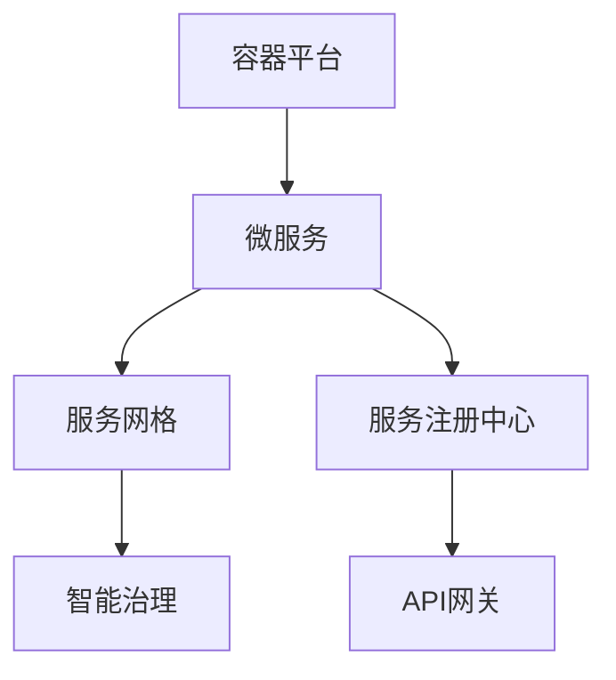

# 7.5.3 多角度表达

## 1. 概念图

- 说明：该概念图展示了容器、微服务、服务网格、智能治理等核心组件的关系。

## 2. 结构表

| 层次/组件     | 主要功能           | 典型技术         |
|--------------|------------------|----------------|
| 容器运行时   | 生命周期管理       | Docker, containerd |
| 编排与调度   | 自动部署/扩缩容   | Kubernetes     |
| 服务注册发现 | 动态服务发现       | etcd, Consul   |
| 服务网格     | 流量治理/安全策略   | Istio, Linkerd |

## 3. 数学符号与公式

- 服务集合 $S = \{s_1, s_2, ..., s_n\}$
- 依赖关系 $D = \{(s_i, s_j) | s_i \rightarrow s_j\}$
- 服务编排映射 $f: S \rightarrow R$，$R$为资源集合

## 4. 多视角对比

- **工程视角**：关注部署、运维、自动化。
- **理论视角**：关注建模、证明、复杂性。
- **实践视角**：关注案例、性能、可用性。

---
> 本文件为7.5.3多角度表达的内容填充示例，后续可继续递归细化。
