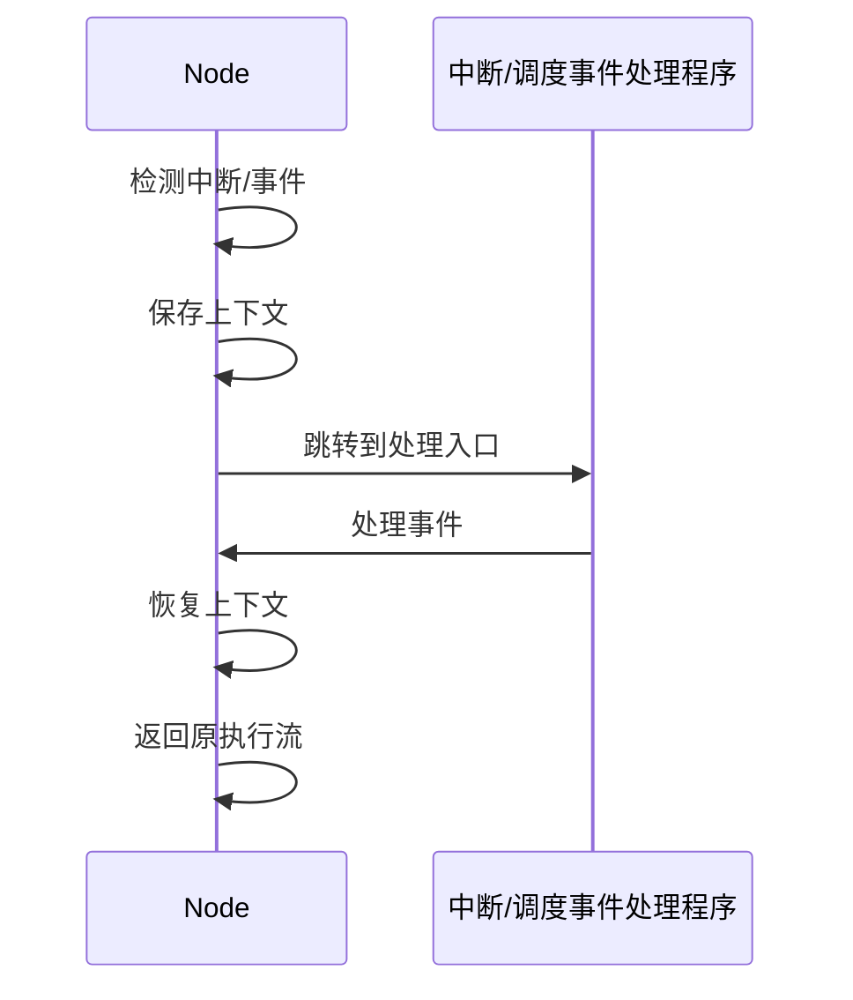

# 7.7.2 典型调度算法分析

## 1. 轮询调度（Round Robin）

- 按顺序将任务分配到各节点，简单易实现。
- 优点：负载均衡，适合任务均匀场景。
- 缺点：不考虑节点负载与任务特性。

## 2. 最小负载优先（Least Loaded）

- 优先将任务分配到当前负载最低的节点。
- 优点：动态均衡负载，提升资源利用率。
- 缺点：需实时监控，调度开销大。

## 3. 资源感知调度（Resource-Aware）

- 根据CPU、内存、带宽等资源需求与节点剩余资源匹配。
- 优点：适合异构环境，提升资源利用率。
- 缺点：调度决策复杂。

## 4. 优先级调度（Priority-Based）

- 按任务/服务优先级分配资源，高优先级先调度。
- 优点：保障关键任务，支持SLA。
- 缺点：低优先级任务可能长期等待。

## 5. 预留与抢占调度（Reservation & Preemption）

- 支持资源预留与高优先级任务抢占低优先级资源。
- 优点：灵活应对突发需求。
- 缺点：可能导致任务中断。

## 6. 对比分析

| 算法         | 负载均衡 | 资源利用 | 实现复杂度 | 适用场景         |
|--------------|----------|----------|------------|------------------|
| 轮询         | 高       | 中       | 低         | 均匀任务         |
| 最小负载优先 | 高       | 高       | 中         | 动态负载         |
| 资源感知     | 高       | 高       | 高         | 异构资源         |
| 优先级调度   | 低-高    | 中       | 中         | SLA保障          |
| 抢占调度     | 中       | 高       | 高         | 突发/关键任务    |

---
> 本文件为典型调度算法分析的内容填充示例，后续可继续递归细化。

## 7.7.2.x 中断上下文的起点

### 1. 概念与定义

- 容器与微服务系统中断上下文：节点本地操作系统或容器运行时响应中断时，保存当前任务/服务的执行环境，切换到ISR或调度事件处理流程。
- 起点：中断/事件信号到达，系统自动完成上下文保护，进入ISR/调度处理入口。

### 2. 结构化流程



### 3. 伪代码

```pseudo
on_interrupt_or_event():
    Save_Context()
    Jump_To_Handler()
    Handler()
    Restore_Context()
    Return_From_Handler()
```

### 4. 关键数据结构

- 中断/事件向量表：`Vector[ID] = Handler_Address`
- 上下文结构体：`Context = {PC, SP, Registers, Flags}`

### 5. 形式化描述

- $Event \rightarrow Save\_Context \rightarrow Handler\_Entry$
- LTL公式：`G (event -> F handler_entry)`

### 6. 工程案例

- Kubernetes调度器事件上下文管理
- Docker容器运行时中断处理

### 7. 未来展望

- 容器级中断协同、虚拟化环境下的上下文隔离、Serverless场景下的极致优化
