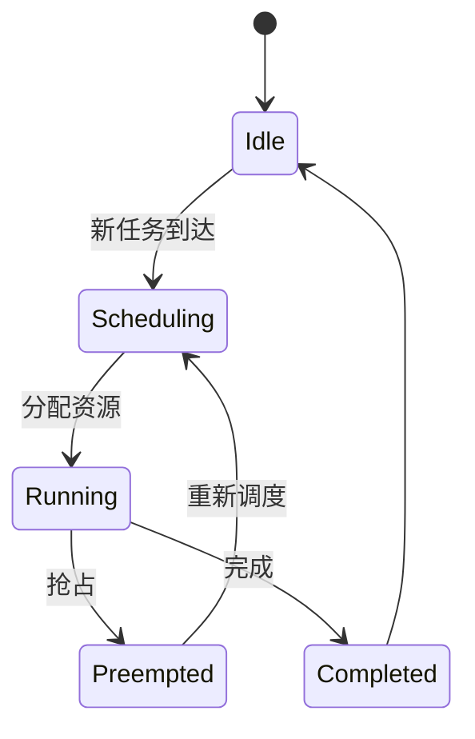

# 7.7.3 调度语义建模与形式化验证

## 1. 调度语义定义

- 调度语义描述调度决策的行为、约束与目标。
- 包括任务分配、资源匹配、优先级、抢占、回退等语义。

## 2. 建模方法

- **有限状态机（FSM）**：建模调度状态与转移。
- **Petri网**：描述并发调度、资源竞争与同步。
- **时序逻辑（LTL/CTL）**：表达调度行为的时序约束。
- **Mermaid状态机图**：

## 3. 形式化验证

- **模型检测**：用NuSMV等工具验证调度策略的安全性、活性、公平性。
- **定理证明**：用逻辑推理证明调度算法的正确性。

## 4. 工程案例

- Kubernetes调度器公平性验证
- Mesos多级调度模型检测

---
> 本文件为调度语义建模与形式化验证的内容填充示例，后续可继续递归细化。
