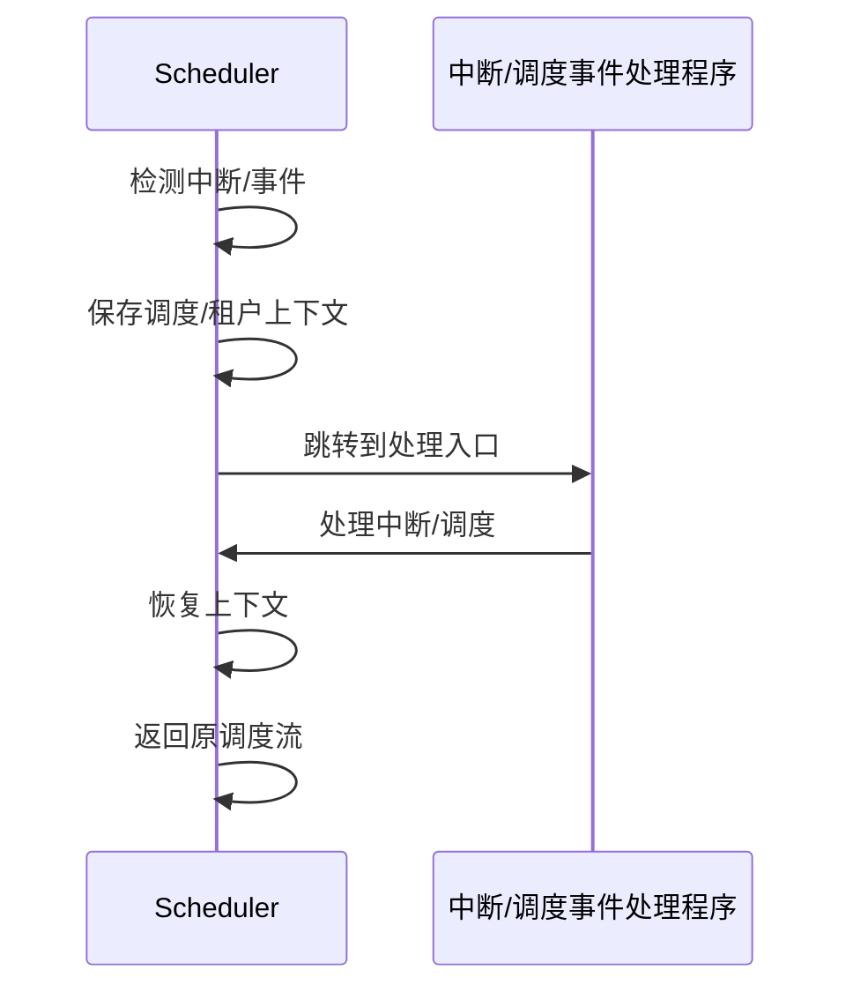

# 7.7.4 多租户与多级调度

## 1. 多租户调度模型

- 多租户环境下，调度需保障租户间资源隔离与公平性。
- 支持租户级、服务级、任务级多层次调度。

## 2. 多级调度架构

- **全局调度器**：负责跨租户/集群资源分配。
- **租户调度器**：每个租户独立调度其任务/服务。
- **本地调度器**：节点/机房级别的资源分配。

## 3. 隔离与公平性

- 资源配额、优先级、抢占等机制保障租户隔离。
- 公平调度算法（如DRF、轮询）提升多租户体验。

## 4. 典型案例

- Kubernetes多租户调度、YARN队列调度、Mesos多级调度。

---
> 本文件为多租户与多级调度的内容填充示例，后续可继续递归细化。

## 7.7.4.x 中断上下文的起点

### 1. 概念与定义

- 多租户/多级调度场景中断上下文：调度器在多租户或多级资源分配时，遇到中断（如租户抢占、优先级切换、资源隔离事件等），需保存当前调度/租户状态，切换到中断处理流程。
- 起点：中断/事件信号到达，系统自动完成上下文保护，进入中断/调度处理入口。

### 2. 结构化流程



### 3. 伪代码

```pseudo
on_interrupt_or_event():
    Save_Context()
    Jump_To_Handler()
    Handler()
    Restore_Context()
    Return_From_Handler()
```

### 4. 关键数据结构

- 调度/租户上下文结构体：`Context = {TenantID, QueueState, Priority, ResourceState}`
- 事件向量表：`Vector[ID] = Handler_Address`

### 5. 形式化描述

- $Event \rightarrow Save\_Context \rightarrow Handler\_Entry$
- LTL公式：`G (event -> F handler_entry)`

### 6. 工程案例

- Kubernetes多租户调度中断管理
- Mesos多级调度器上下文切换

### 7. 未来展望

- 多租户/多级调度下的中断隔离、动态优先级调整、跨域资源抢占
