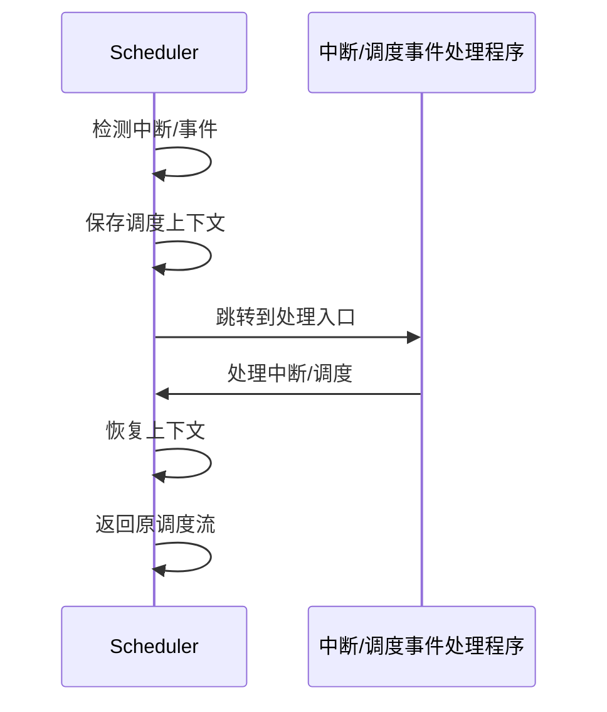

# 7.7.5 动态与自适应调度

## 1. 动态调度机制

- 根据系统负载、资源变化、任务特性实时调整调度决策。
- 支持任务迁移、弹性伸缩、负载均衡等。

## 2. 自适应调度算法

- 基于反馈的自适应调度（如PID控制、强化学习）。
- 结合历史数据与实时监控动态优化调度参数。

## 3. 实时反馈与调整

- 监控系统状态，动态调整调度策略。
- 支持异常检测、自动恢复、策略切换。

## 4. 工程案例

- Kubernetes自适应调度、云平台弹性伸缩、AI推理任务动态调度。

---
> 本文件为动态与自适应调度的内容填充示例，后续可继续递归细化。

## 7.7.5.x 中断上下文的起点

### 1. 概念与定义

- 动态/自适应调度场景中断上下文：调度器在动态资源调整、自适应优化时，遇到中断（如负载突发、策略切换、资源抢占等），需保存当前调度状态，切换到中断处理流程。
- 起点：中断/事件信号到达，系统自动完成上下文保护，进入中断/调度处理入口。

### 2. 结构化流程



### 3. 伪代码

```pseudo
on_interrupt_or_event():
    Save_Context()
    Jump_To_Handler()
    Handler()
    Restore_Context()
    Return_From_Handler()
```

### 4. 关键数据结构

- 调度上下文结构体：`Context = {PolicyState, ResourceState, LoadState, AdaptState}`
- 事件向量表：`Vector[ID] = Handler_Address`

### 5. 形式化描述

- $Event \rightarrow Save\_Context \rightarrow Handler\_Entry$
- LTL公式：`G (event -> F handler_entry)`

### 6. 工程案例

- Kubernetes自适应调度中断管理
- 强化学习调度器上下文切换

### 7. 未来展望

- AI驱动自适应调度下的中断优化、策略级上下文隔离、极端负载场景下的弹性切换
