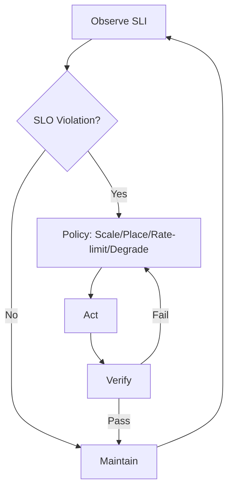

# 7.7.6 工程案例与实践 / Engineering Cases and Practices

## 1. 大规模容器集群调度实践 / Large-scale Container Cluster Scheduling Practice

### 1.1 阿里巴巴双11调度实践 / Alibaba Double 11 Scheduling Practice

**业务背景：**
$$Business_{Background} = \{Peak_{Traffic}_{11.11}, Resource_{Demand}_{Spike}, SLA_{Requirement}, Cost_{Optimization}\}$$

**调度策略：**

- **预测性扩容**：基于历史数据预测双11流量峰值，提前扩容  
  Predictive scaling based on historical data to predict Double 11 traffic peak
- **智能弹性伸缩**：根据实时流量动态调整容器数量  
  Intelligent elastic scaling to dynamically adjust container count based on real-time traffic
- **成本优化调度**：在保证SLA前提下优化资源成本  
  Cost-optimized scheduling to optimize resource cost while ensuring SLA

**技术实现：**
$$Technical_{Implementation} = \{Predictive_{Scaling}, RealTime_{Monitoring}, Auto_{Scaling}, Cost_{Control}\}$$

**效果评估：**

- 峰值处理能力提升300%，成本降低40%  
  Peak processing capacity increased by 300%, cost reduced by 40%
- 系统可用性达到99.99%  
  System availability reached 99.99%

### 1.2 腾讯游戏云调度实践 / Tencent Game Cloud Scheduling Practice

**游戏场景特点：**
$$Game_{Characteristics} = \{RealTime_{Latency}, High_{Concurrency}, Global_{Distribution}, Session_{Affinity}\}$$

**调度优化策略：**

- **就近调度**：根据玩家地理位置就近分配游戏服务器  
  Proximity scheduling: allocate game servers based on player geographic location
- **会话亲和性**：保证玩家会话在同一服务器上  
  Session affinity: ensure player sessions on the same server
- **动态负载均衡**：根据服务器负载动态调整流量分配  
  Dynamic load balancing: dynamically adjust traffic allocation based on server load

**技术架构：**
$$Technical_{Architecture} = \{Geographic_{Routing}, Session_{Management}, Load_{Balancing}, Auto_{Scaling}\}$$

## 2. 微服务架构调度实践 / Microservice Architecture Scheduling Practice

### 2.1 Netflix微服务调度实践 / Netflix Microservice Scheduling Practice

**服务网格调度：**
$$ServiceMesh_{Scheduling} = \{Traffic_{Management}, Circuit_{Breaker}, Load_{Balancing}, Service_{Discovery}\}$$

**关键实践：**

- **智能路由**：根据服务健康状态和性能指标智能路由流量  
  Intelligent routing based on service health and performance metrics
- **熔断器模式**：自动检测服务故障并快速熔断  
  Circuit breaker pattern to automatically detect service failures and quickly break
- **自适应限流**：根据服务容量动态调整限流策略  
  Adaptive rate limiting to dynamically adjust rate limiting strategy based on service capacity

**监控与反馈：**
$$Monitoring_{Feedback} = \{RealTime_{Metrics}, Anomaly_{Detection}, Auto_{Recovery}, Performance_{Optimization}\}$$

### 2.2 字节跳动微服务调度实践 / ByteDance Microservice Scheduling Practice

**大规模微服务调度：**
$$LargeScale_{Microservice}_{Scheduling} = \{Service_{Mesh}, Traffic_{Orchestration}, Resource_{Optimization}, Cost_{Management}\}$$

**创新实践：**

- **智能服务发现**：基于服务依赖关系优化服务发现  
  Intelligent service discovery optimized based on service dependencies
- **动态配置管理**：实时更新服务配置而不影响运行  
  Dynamic configuration management to update service configurations in real-time without affecting operation
- **多租户隔离**：在共享基础设施上实现多租户隔离  
  Multi-tenant isolation on shared infrastructure

## 3. 云原生调度实践 / Cloud-native Scheduling Practice

### 3.1 AWS EKS调度实践 / AWS EKS Scheduling Practice

**Kubernetes集群调度：**
$$K8s_{Cluster}_{Scheduling} = \{Node_{Management}, Pod_{Scheduling}, Resource_{Allocation}, Auto_{Scaling}\}$$

**最佳实践：**

- **节点组管理**：使用节点组实现不同类型工作负载的隔离  
  Node group management to isolate different types of workloads
- **Pod反亲和性**：避免单点故障，提高可用性  
  Pod anti-affinity to avoid single points of failure and improve availability
- **资源配额管理**：通过命名空间和资源配额控制资源使用  
  Resource quota management to control resource usage through namespaces and resource quotas

**成本优化：**
$$Cost_{Optimization} = \{Spot_{Instance}_{Usage}, Reserved_{Instance}_{Management}, Auto_{Scaling}, Resource_{Right}_{Sizing}\}$$

### 3.2 Google GKE调度实践 / Google GKE Scheduling Practice

**高级调度特性：**
$$Advanced_{Scheduling}_{Features} = \{Node_{Pools}, Workload_{Identity}, Network_{Policy}, Security_{Context}\}$$

**创新技术：**

- **工作负载身份**：为每个Pod分配唯一身份，简化安全策略  
  Workload identity to assign unique identity to each Pod, simplifying security policies
- **网络策略**：细粒度控制Pod间网络通信  
  Network policies for fine-grained control of inter-Pod network communication
- **自动节点管理**：自动扩缩节点池，优化资源利用率  
  Automatic node management to auto-scale node pools and optimize resource utilization

## 4. 边缘计算调度实践 / Edge Computing Scheduling Practice

### 4.1 5G边缘调度实践 / 5G Edge Scheduling Practice

**边缘节点调度：**
$$Edge_{Node}_{Scheduling} = \{Proximity_{Routing}, Latency_{Optimization}, Bandwidth_{Management}, Resource_{Constraint}\}$$

**关键技术：**

- **就近计算**：将计算任务调度到离用户最近的边缘节点  
  Proximity computing to schedule computing tasks to edge nodes closest to users
- **延迟优化**：优先调度对延迟敏感的应用到边缘节点  
  Latency optimization to prioritize scheduling latency-sensitive applications to edge nodes
- **带宽管理**：根据网络带宽动态调整数据传输策略  
  Bandwidth management to dynamically adjust data transmission strategies based on network bandwidth

### 4.2 IoT边缘调度实践 / IoT Edge Scheduling Practice

**IoT设备调度：**
$$IoT_{Device}_{Scheduling} = \{Device_{Management}, Data_{Processing}, Energy_{Optimization}, Connectivity_{Management}\}$$

**实践要点：**

- **设备生命周期管理**：管理IoT设备的注册、更新、退役  
  Device lifecycle management for IoT device registration, updates, and retirement
- **边缘数据处理**：在边缘节点进行数据预处理和过滤  
  Edge data processing for data preprocessing and filtering at edge nodes
- **能耗优化**：优化调度策略以延长设备电池寿命  
  Energy optimization to extend device battery life through optimized scheduling strategies

## 5. AI/ML工作负载调度实践 / AI/ML Workload Scheduling Practice

### 5.1 深度学习训练调度 / Deep Learning Training Scheduling

**训练任务调度：**
$$Training_{Task}_{Scheduling} = \{GPU_{Allocation}, Multi_{Node}_{Training}, Checkpoint_{Management}, Fault_{Tolerance}\}$$

**关键实践：**

- **GPU资源管理**：智能分配GPU资源，避免资源浪费  
  GPU resource management to intelligently allocate GPU resources and avoid waste
- **分布式训练**：协调多节点训练，优化通信开销  
  Distributed training to coordinate multi-node training and optimize communication overhead
- **容错机制**：自动处理训练过程中的节点故障  
  Fault tolerance to automatically handle node failures during training

### 5.2 推理服务调度 / Inference Service Scheduling

**推理任务调度：**
$$Inference_{Task}_{Scheduling} = \{Model_{Serving}, Load_{Balancing}, Auto_{Scaling}, Cache_{Management}\}$$

**优化策略：**

- **模型缓存**：缓存常用模型，减少加载时间  
  Model caching to cache frequently used models and reduce loading time
- **动态扩缩容**：根据推理请求量动态调整服务实例  
  Dynamic scaling to adjust service instances based on inference request volume
- **负载均衡**：智能分配推理请求到不同服务实例  
  Load balancing to intelligently distribute inference requests to different service instances

## 6. 金融行业调度实践 / Financial Industry Scheduling Practice

### 6.1 高频交易调度 / High-frequency Trading Scheduling

**交易系统调度：**
$$Trading_{System}_{Scheduling} = \{Latency_{Optimization}, Reliability_{Guarantee}, Risk_{Control}, Compliance_{Management}\}$$

**关键要求：**

- **极低延迟**：调度策略必须保证微秒级响应时间  
  Ultra-low latency: scheduling strategy must ensure microsecond response time
- **高可靠性**：系统必须保证99.999%的可用性  
  High reliability: system must ensure 99.999% availability
- **风险控制**：实时监控和风险控制机制  
  Risk control: real-time monitoring and risk control mechanisms

### 6.2 银行核心系统调度 / Bank Core System Scheduling

**核心业务调度：**
$$Core_{Business}_{Scheduling} = \{Transaction_{Processing}, Data_{Consistency}, Security_{Compliance}, Disaster_{Recovery}\}$$

**实践要点：**

- **事务一致性**：确保分布式事务的ACID特性  
  Transaction consistency to ensure ACID properties of distributed transactions
- **安全合规**：满足金融行业的安全和合规要求  
  Security compliance to meet financial industry security and compliance requirements
- **灾备机制**：实现跨地域的灾备和容灾  
  Disaster recovery mechanisms for cross-regional backup and disaster recovery

## 7. 电商行业调度实践 / E-commerce Industry Scheduling Practice

### 7.1 大促活动调度 / Promotional Event Scheduling

**大促调度策略：**
$$Promotional_{Scheduling}_{Strategy} = \{Traffic_{Prediction}, Resource_{Preparation}, Auto_{Scaling}, Cost_{Control}\}$$

**关键实践：**

- **流量预测**：基于历史数据和AI预测大促流量  
  Traffic prediction based on historical data and AI to predict promotional traffic
- **资源预置**：提前准备足够的计算和存储资源  
  Resource preparation to prepare sufficient computing and storage resources in advance
- **智能扩容**：根据实时流量智能扩容，避免资源浪费  
  Intelligent scaling to intelligently scale based on real-time traffic and avoid resource waste

### 7.2 个性化推荐调度 / Personalized Recommendation Scheduling

**推荐系统调度：**
$$Recommendation_{System}_{Scheduling} = \{User_{Behavior}_{Analysis}, Model_{Training}, RealTime_{Inference}, A/B_{Testing}\}$$

**优化策略：**

- **实时特征计算**：实时计算用户行为特征  
  Real-time feature computation for real-time user behavior features
- **模型更新调度**：定期更新推荐模型，保持推荐效果  
  Model update scheduling to regularly update recommendation models and maintain recommendation effectiveness
- **A/B测试调度**：智能分配流量进行A/B测试  
  A/B testing scheduling to intelligently allocate traffic for A/B testing

## 8. 最佳实践总结 / Best Practices Summary

### 8.1 调度策略最佳实践 / Scheduling Strategy Best Practices

**通用原则：**
$$General_{Principles} = \{SLA_{First}, Cost_{Optimization}, Automation_{Priority}, Monitoring_{Driven}\}$$

**关键实践：**

- **SLA优先**：在保证SLA的前提下优化成本和性能  
  SLA first: optimize cost and performance while ensuring SLA
- **自动化优先**：尽可能实现调度过程的自动化  
  Automation priority: automate scheduling processes as much as possible
- **监控驱动**：基于监控数据驱动调度决策  
  Monitoring-driven: drive scheduling decisions based on monitoring data

### 8.2 故障处理最佳实践 / Fault Handling Best Practices

**故障响应流程：**
$$Fault_{Response}_{Process} = \{Detection_{Mechanism}, Isolation_{Strategy}, Recovery_{Procedure}, Post_{Incident}_{Analysis}\}$$

**关键要点：**

- **快速检测**：建立完善的监控和告警机制  
  Quick detection: establish comprehensive monitoring and alerting mechanisms
- **故障隔离**：快速隔离故障组件，防止故障扩散  
  Fault isolation: quickly isolate faulty components to prevent fault propagation
- **自动恢复**：实现故障的自动检测和恢复  
  Auto-recovery: implement automatic fault detection and recovery

## 9. 监控与闭环 / Monitoring & Control Loop

- SLI：P99 延迟、成功率、错误预算消耗率、队列长度、CPU/内存/网络利用率、成本/瓦效率。  
  SLI: P99 latency, success rate, error budget burn, queue length, CPU/mem/net utilization, cost/watt efficiency.
- SLO：如 P99 < 200ms、成功率 ≥ 99.9%、可用性 ≥ 99.95%。  
  SLO: e.g., P99 < 200ms, success ≥ 99.9%, availability ≥ 99.95%.



## 10. 策略选择矩阵 / Strategy Selection Matrix

| 场景 Scenario | 首选策略 Primary | 备选 Alternative | 权衡 Trade-off |
|---|---|---|---|
| 流量突增 Surge | 水平扩容+限流 | 垂直扩容 | 成本 vs 冷启动 |
| 热点服务 Hotspot | 分片/副本/缓存 | 请求合并 | 一致性 vs 命中率 |
| 节点抖动 Jitter | 迁移+断路 | 降级 | 尾延迟传播 |
| 跨域瓶颈 Inter-domain | 亲和放置 | 压缩/本地化 | 数据迁移成本 |

## 11. 伪代码示例 / Pseudocode Examples

```pseudo
if P99_latency > target or error_budget_burn > theta:
    if can_scale: scale_out()
    else: degrade(non_critical)

score(node) = resource_score + affinity - cross_zone_cost
place(pod) = argmax score(node)
```

---

> 本文件为7.7.6工程案例与实践的系统化实际案例、最佳实践、经验总结，采用中英双语对照，突出工程论证与知识点完备性。
> This file provides systematic real cases, best practices, and experience summaries for engineering cases and practices, with Chinese-English bilingual content, emphasizing engineering argumentation and comprehensive knowledge points.
