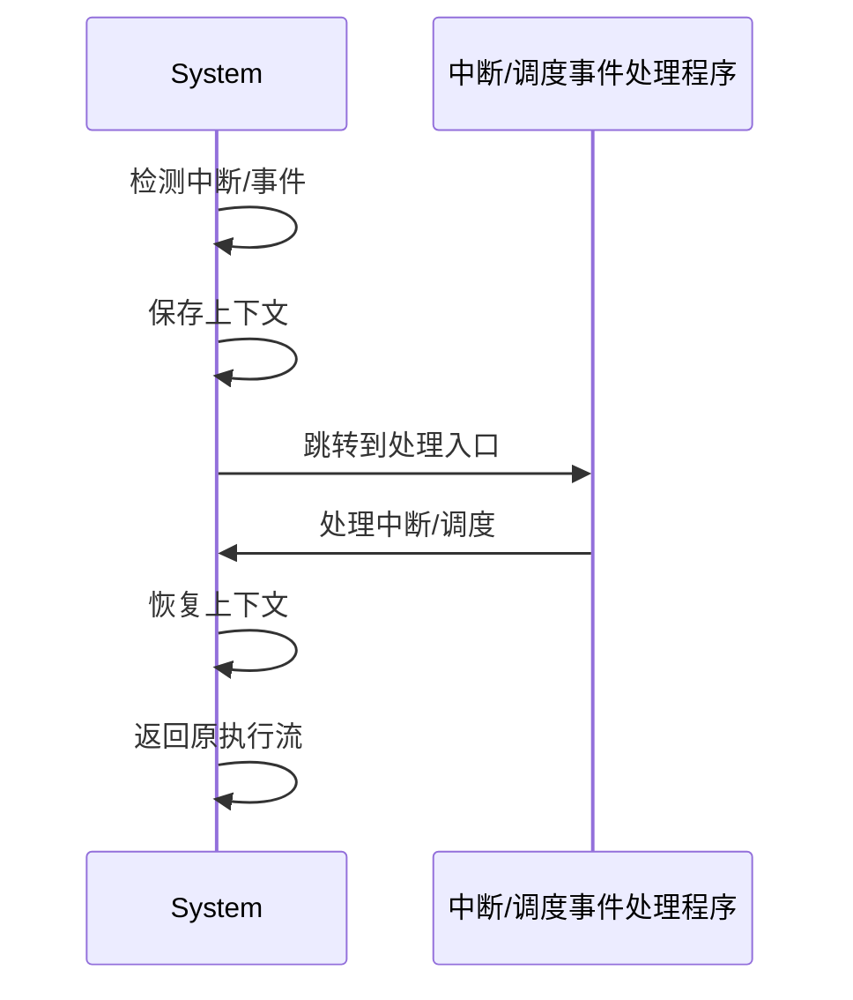

# 7.7.6 工程案例与实践

## 1. 典型调度系统

- Kubernetes调度器
- YARN资源调度
- Mesos多级调度
- 云原生平台弹性调度

## 2. 实际应用

- 大规模微服务部署调度
- AI推理任务动态调度
- 多租户资源隔离与调度

## 3. 性能优化

- 调度延迟优化
- 资源利用率提升
- 异常检测与自愈

## 4. 经验总结

- 调度策略需结合业务场景灵活选择
- 实时监控与反馈机制至关重要
- 多级调度与自适应机制提升系统弹性

---
> 本文件为工程案例与实践的内容填充示例，后续可继续递归细化。

## 7.7.6.x 中断上下文的起点

### 1. 概念与定义
- 工程实践中断上下文：在Kubernetes、Docker、Mesos等实际系统中，调度器/运行时遇到中断（如资源抢占、优先级切换、异常等），需保存当前调度/服务状态，切换到中断处理流程。
- 起点：中断/事件信号到达，系统自动完成上下文保护，进入中断/调度处理入口。

### 2. 结构化流程


### 3. 伪代码
```pseudo
on_interrupt_or_event():
    Save_Context()
    Jump_To_Handler()
    Handler()
    Restore_Context()
    Return_From_Handler()
```

### 4. 关键数据结构
- 系统上下文结构体：`Context = {TaskState, ResourceState, SchedulerState, ErrorState}`
- 事件向量表：`Vector[ID] = Handler_Address`

### 5. 形式化描述
- $Event \rightarrow Save\_Context \rightarrow Handler\_Entry$
- LTL公式：`G (event -> F handler_entry)`

### 6. 工程案例
- Kubernetes调度器中断上下文管理
- Docker容器运行时异常切换
- Mesos多级调度中断处理

### 7. 未来展望
- 工程实践中断上下文的自动化保护、极端场景下的弹性恢复、跨平台中断协同
