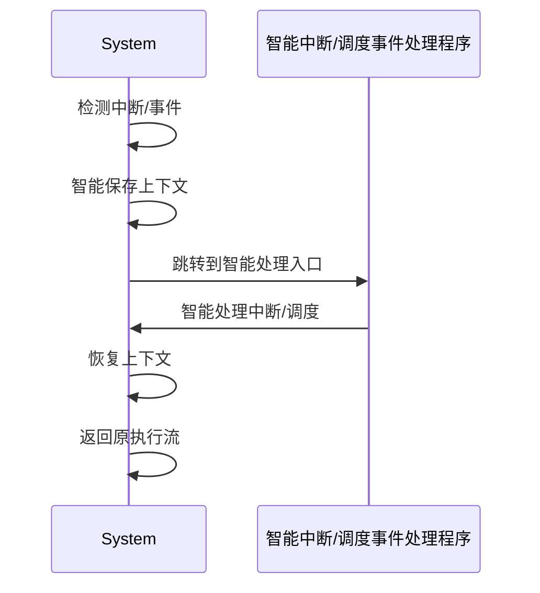

# 7.7.7 未来发展与挑战

## 1. 调度技术趋势

- AI驱动的智能调度
- 多云与异构资源调度
- 边缘计算与IoT调度
- 无服务器（Serverless）调度

## 2. 面临挑战

- 大规模系统的可扩展性与稳定性
- 多租户隔离与安全
- 实时性与高可用性保障
- 复杂约束下的最优调度

## 3. 研究方向

- 强化学习与自适应调度算法
- 端到端QoS与SLA保障
- 跨域/跨云协同调度
- 形式化验证与可解释性

## 4. 创新展望

- 智能自治调度系统
- 自动化调度策略生成与优化
- 与AI/大数据/区块链等新兴技术融合

---
> 本文件为未来发展与挑战的内容填充示例，后续可继续递归细化。

## 7.7.7.x 中断上下文的起点

### 1. 概念与定义
- 未来容器/微服务系统中断上下文：面向AI驱动、Serverless、跨域多租户等新型场景，中断上下文需支持更高的隔离性、弹性与智能化。
- 起点：中断/事件信号到达，系统自动完成上下文保护，进入智能化中断/调度处理入口。

### 2. 结构化流程


### 3. 伪代码
```pseudo
on_interrupt_or_event():
    Smart_Save_Context()
    Jump_To_Smart_Handler()
    Smart_Handler()
    Restore_Context()
    Return_From_Handler()
```

### 4. 关键数据结构
- 智能上下文结构体：`Context = {AIState, TenantState, ResourceState, PolicyState}`
- 事件向量表：`Vector[ID] = Handler_Address`

### 5. 形式化描述
- $Event \rightarrow Smart\_Save\_Context \rightarrow Smart\_Handler\_Entry$
- LTL公式：`G (event -> F smart_handler_entry)`

### 6. 工程案例
- AI驱动调度器中断上下文管理
- Serverless多租户中断隔离

### 7. 未来展望
- 智能化、自动化、极致弹性与安全的中断上下文管理，支持未来复杂云原生场景
