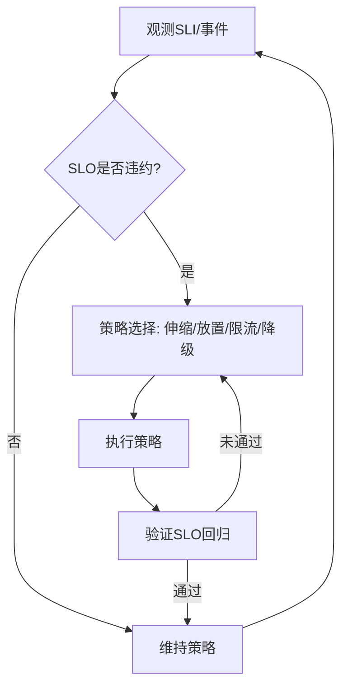

# 容器与微服务运行时调度语义分析

## 概述

容器与微服务运行时调度语义分析研究容器编排和微服务架构中的调度机制、语义建模和形式化验证，为云原生应用的运行时调度优化提供理论基础。

## 目录结构

- **7.7.1 调度基本概念与模型** - 容器调度的基本概念和数学模型
- **7.7.2 典型调度算法分析** - 常见容器调度算法的分析
- **7.7.3 调度语义建模与形式化验证** - 调度语义的形式化建模和验证
- **7.7.4 多租户与多级调度** - 多租户环境下的多级调度机制
- **7.7.5 动态与自适应调度** - 动态和自适应的调度策略
- **7.7.6 工程案例与实践** - 实际工程中的调度应用案例
- **7.7.7 未来发展与挑战** - 调度领域的发展趋势和挑战

## 核心概念

### 调度基础

- **容器调度**：容器资源的分配和调度机制
- **微服务调度**：微服务的部署和调度策略
- **资源管理**：计算、存储、网络资源的统一管理
- **负载均衡**：服务负载的均衡分配

### 调度算法

- **优先级调度**：基于优先级的调度策略
- **公平调度**：保证公平性的调度算法
- **资源感知调度**：基于资源状态的调度
- **成本优化调度**：优化成本的调度策略

### 语义建模

- **调度语义**：调度操作的语义定义
- **资源语义**：资源管理的语义描述
- **服务语义**：微服务行为的语义建模
- **性能语义**：性能指标的语义定义

## SLO/SLI 驱动的调度闭环

- SLI：成功率、P99 延迟、吞吐、错误预算消耗率、队列长度。
- SLO：声明目标（如 P99 < 200ms, 成功率 99.9%），驱动策略触发。
- 闭环：观测 → 诊断 → 策略合成 → 执行 → 验证 → 回滚/巩固。

## Mermaid 调度策略闭环



## 伪代码示例

```pseudo
// 负载+SLO 联动调度
if P99_latency > target 或 错误预算消耗率 > θ:
    if 可扩资源: 水平扩容()
    else: 启用降级(关闭非关键路径)

// 放置：拓扑/亲和约束
score(node) = 资源得分 + 亲和得分 - 跨域成本
选择 argmax score(node)
```

## 策略选择矩阵（示例）

| 场景 | 首选策略 | 备选 | 风险与权衡 |
|---|---|---|---|
| 突发高峰 | 水平扩容 + 限流 | 短期垂直扩容 | 成本与冷启动 |
| 热点服务 | 分片/副本热点转移 | 请求合并/缓存 | 一致性与命中率 |
| 节点抖动 | 迁移 + 断路 | 降级 | 尾延迟与抖动传播 |
| 跨域瓶颈 | 拓扑亲和放置 | 压缩/本地化 | 数据迁移成本 |

## 工程实践要点

- 观测：统一指标字典与标签；Tracing 采样；红/金象限看板。
- 策略：冷却时间、窗口回归、灰度执行与自动回滚。
- 资源：亲和/反亲和、污点容忍、拓扑/成本/碳约束协同。
- 安全：多租户隔离、限流/舱壁、零信任 sidecar 策略。

## 学习目标

1. **理解容器与微服务调度的基本概念**
2. **掌握容器调度算法的设计和分析**
3. **学会调度语义的形式化建模**
4. **了解多租户环境下的调度策略**
5. **掌握动态和自适应调度方法**
6. **理解调度系统的性能优化**

## 应用领域

- **容器编排平台**
- **微服务架构**
- **云计算平台**
- **边缘计算**
- **DevOps自动化**
- **云原生应用**

## 相关资源

- **经典文献**：《Kubernetes in Action》、《Microservices Patterns》
- **学术期刊**：IEEE Transactions on Cloud Computing、ACM Computing Surveys
- **会议论文**：SOSP、OSDI、NSDI、SIGCOMM
- **在线资源**：Kubernetes/Docker 文档、CNCF 项目文档

## 实践项目

1. **调度器实现**：实现基本的容器调度算法
2. **负载均衡系统**：设计微服务负载均衡策略
3. **资源管理系统**：实现容器资源的统一管理
4. **性能监控平台**：构建调度系统的性能监控
