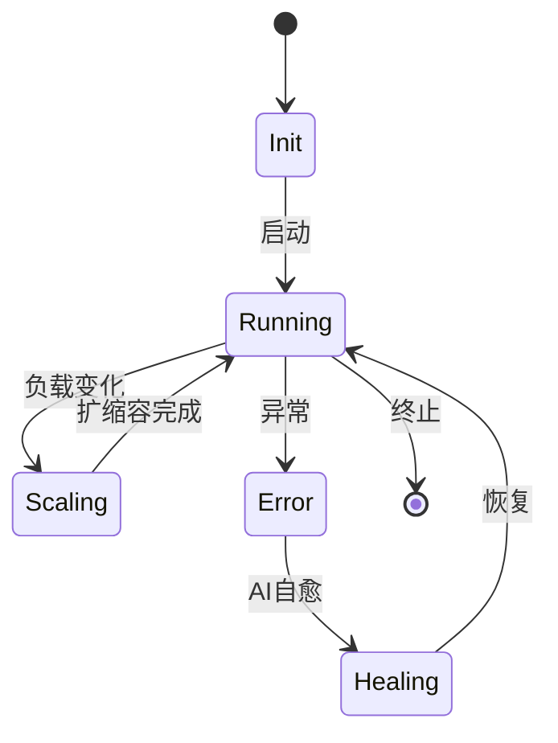
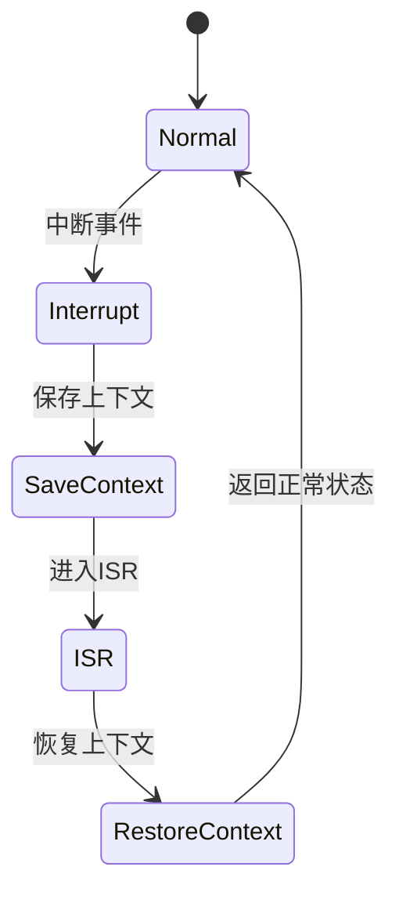

# 7.8.1 形式语义定义

## 1. 形式语义基本概念

- **状态空间**：系统所有可能状态的集合。
- **转移关系**：状态之间的变化规则。
- **观测量与不变式**：可观测属性与系统保持不变的性质。
- **性质与断言**：需验证的系统行为或属性。

## 2. 容器系统形式语义

- **状态机建模**：



- **行为逻辑与约束**：如“容器在未启动前不能接收流量”。
- **语义一致性**：多节点容器状态同步。

## 3. 微服务系统形式语义

- **服务状态与交互**：服务可处于“待机/运行/降级/故障”等状态。
- **合同与契约语义**：服务间接口、输入输出、前后置条件。
- **组合与聚合语义**：多个服务组合成业务流程，聚合语义需保持一致性。

## 4. 递归语义结构

- **分层语义建模**：如“平台层-服务层-功能层”递归分解。
- **递归组合与分解**：复杂系统可分解为子系统，子系统语义递归组合。

---
> 本文件为7.8.1形式语义定义的内容填充示例，后续可继续递归细化。

## 7.8.1.x 中断上下文的起点

### 1. 概念与定义

- 形式语义视角下的中断上下文：用数学/逻辑语言描述容器/微服务系统中断发生时的上下文保存、切换与恢复机制。
- 起点：中断事件触发，系统状态从“正常”转为“中断处理”前的状态转移点。

### 2. 结构化流程



### 3. 伪代码

```pseudo
on_interrupt():
    Save_Context()
    Enter_ISR()
    ISR_Handler()
    Restore_Context()
    Return_To_Normal()
```

### 4. 关键数据结构

- 状态机节点：`State = {Normal, Interrupt, SaveContext, ISR, RestoreContext}`
- 上下文结构体：`Context = {PC, SP, Registers, Flags, ServiceState}`

### 5. 形式化描述

- $Interrupt \rightarrow Save\_Context \rightarrow ISR\_Entry$
- LTL公式：`G (interrupt -> F isr_entry)`

### 6. 工程案例

- Kubernetes调度模型的中断语义建模
- Docker容器中断上下文的形式化分析

### 7. 未来展望

- 多级中断递归语义、Serverless/多租户场景下的上下文隔离与验证
