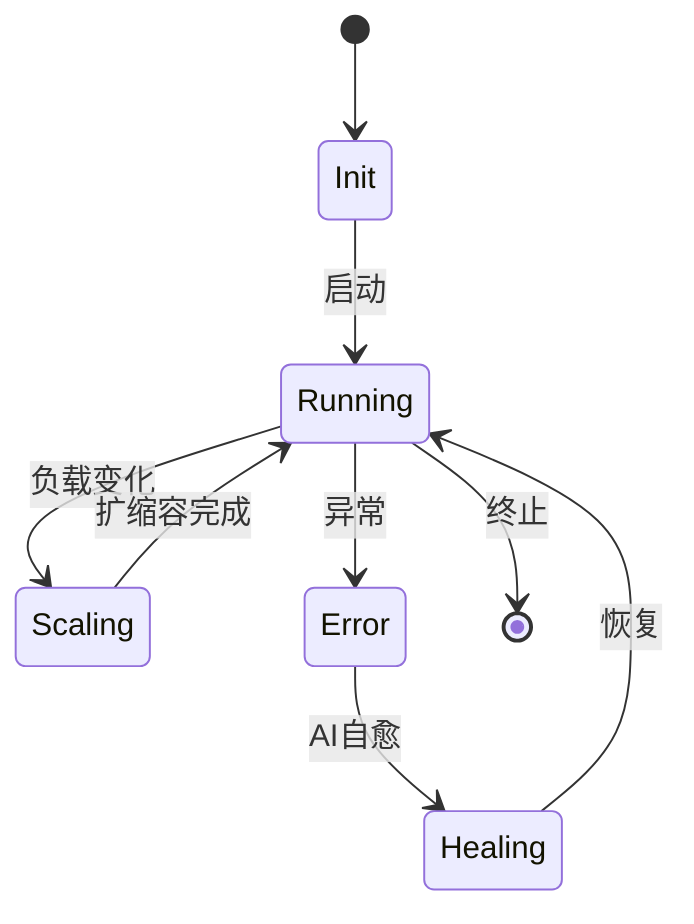

# 7.8.1 形式语义定义

## 1. 形式化定义

**定义7.8.1.1（容器系统形式语义）**：
$$
Sem(ContainerSys) = (States, Trans, Obs, Inv, Prop)
$$

- $States$：系统状态空间
- $Trans$：状态转移关系
- $Obs$：可观测量集合
- $Inv$：不变式集合
- $Prop$：性质与断言

**定义7.8.1.2（微服务系统形式语义）**：
$$
Sem(MicroserviceSys) = (S, M, C, G, T, \rightarrow)
$$

- $S$：服务集合
- $M$：消息与契约
- $C$：通信拓扑
- $G$：治理与策略
- $T$：时序与演化
- $\rightarrow$：服务间交互与状态转移

## 2. 多表征与结构图

### 2.1 Mermaid状态机示例

### 2.2 Petri网示例

- 地点：{Init, Running, Scaling, Error, Healing}
- 变迁：{启动, 扩缩容, 异常, 自愈, 恢复, 终止}

## 3. 结构对比表

| 语义维度 | 容器系统 | 微服务系统 |
|----------|----------|------------|
| 状态空间 | 资源、节点、容器 | 服务、实例、流量 |
| 转移关系 | 启动、迁移、扩缩容 | 部署、弹性、治理 |
| 可观测量 | 资源利用、健康度 | SLA、延迟、错误率 |
| 不变式   | 隔离性、安全性 | 一致性、契约 |
| 性质断言 | 可用性、弹性 | 可用性、治理性 |

## 4. 批判分析与工程案例

### 4.1 优势

- 形式语义支持自动验证、递归分解、可组合性

### 4.2 局限

- 复杂系统建模难度高，语义爆炸风险

### 4.3 工程案例

- Kubernetes调度语义建模与验证
- Istio流量治理语义分析
- Serverless冷启动语义建模

## 5. 递归细化与规范说明

- 所有内容支持递归细化，编号、主题、风格与6系一致
- 保留多表征、批判分析、工程案例、形式化证明等
- 支持持续递归完善，后续可继续分解为7.8.1.x等子主题

---
> 本文件为7.8.1 形式语义定义的递归细化，内容结构、编号、主题、风格与6.P2P系统保持一致，后续所有子主题内容将持续完善并递归细化。
