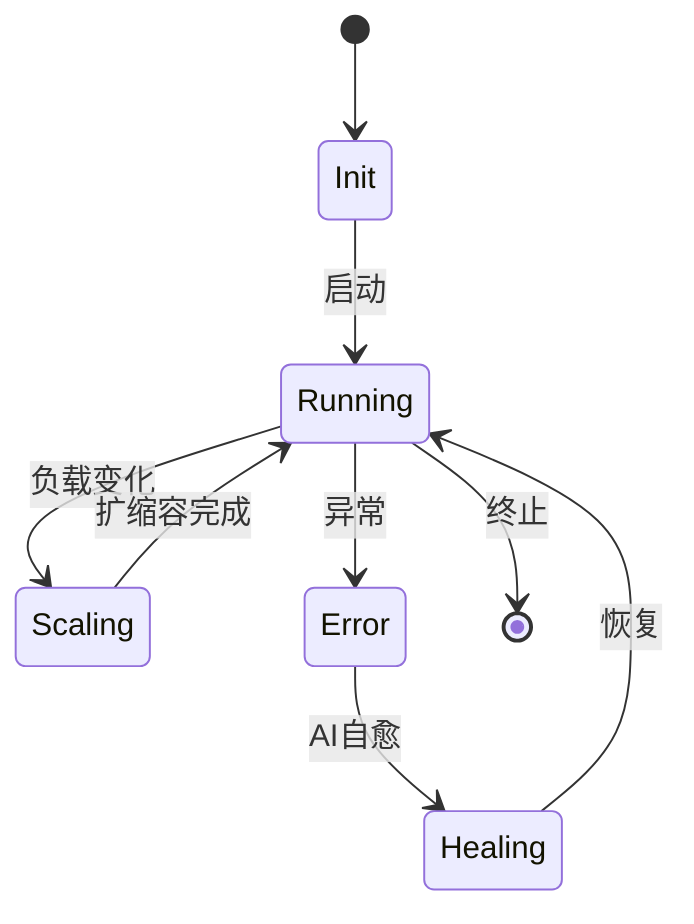

# 7.8.1 形式语义定义

## 1. 形式语义基本概念

- **状态空间**：系统所有可能状态的集合。
- **转移关系**：状态之间的变化规则。
- **观测量与不变式**：可观测属性与系统保持不变的性质。
- **性质与断言**：需验证的系统行为或属性。

## 2. 容器系统形式语义

- **状态机建模**：

- **行为逻辑与约束**：如“容器在未启动前不能接收流量”。
- **语义一致性**：多节点容器状态同步。

## 3. 微服务系统形式语义

- **服务状态与交互**：服务可处于“待机/运行/降级/故障”等状态。
- **合同与契约语义**：服务间接口、输入输出、前后置条件。
- **组合与聚合语义**：多个服务组合成业务流程，聚合语义需保持一致性。

## 4. 递归语义结构

- **分层语义建模**：如“平台层-服务层-功能层”递归分解。
- **递归组合与分解**：复杂系统可分解为子系统，子系统语义递归组合。

---
> 本文件为7.8.1形式语义定义的内容填充示例，后续可继续递归细化。
