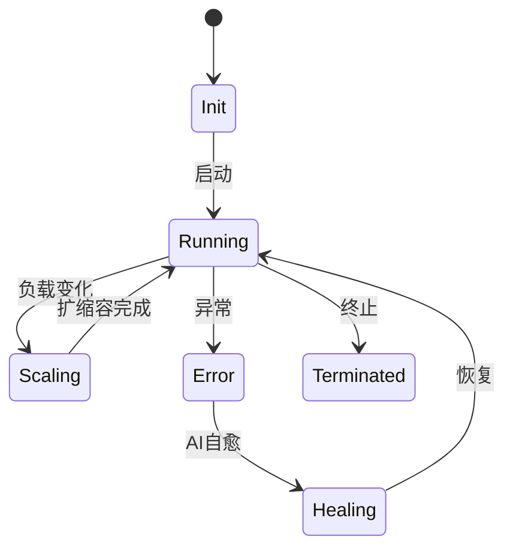

# 7.8.1.1 状态空间与转移关系

## 1. 形式化定义

- 状态空间（States）：系统所有可能状态的集合
- 状态转移（Trans）：状态之间的变化规则

**定义7.8.1.1.1（容器系统状态空间）**：
$$
States_{Container} = \{Init, Running, Scaling, Error, Healing, Terminated\}
$$

**定义7.8.1.1.2（微服务系统状态空间）**：
$$
States_{Microservice} = \{Deploying, Active, Scaling, Degraded, Recovering, Retired\}
$$

## 2. 状态转移关系

- 容器系统：
  - Init → Running（启动）
  - Running → Scaling（负载变化）
  - Scaling → Running（扩缩容完成）
  - Running → Error（异常）
  - Error → Healing（AI自愈）
  - Healing → Running（恢复）
  - Running → Terminated（终止）

- 微服务系统：
  - Deploying → Active（部署完成）
  - Active → Scaling（弹性伸缩）
  - Scaling → Active（扩缩容完成）
  - Active → Degraded（性能下降）
  - Degraded → Recovering（自愈）
  - Recovering → Active（恢复）
  - Active → Retired（下线）

## 3. 多表征

### 3.1 Mermaid状态机图

### 3.2 Petri网结构

- 地点：{Init, Running, Scaling, Error, Healing, Terminated}
- 变迁：{启动, 负载变化, 扩缩容, 异常, AI自愈, 恢复, 终止}

## 4. 结构对比表

| 系统类型 | 状态空间 | 主要转移 | 异常处理 | 弹性机制 |
|----------|----------|----------|----------|----------|
| 容器系统 | Init, Running, ... | 启动、扩缩容 | AI自愈 | Scaling, Healing |
| 微服务系统 | Deploying, Active, ... | 部署、弹性 | 自愈、降级 | Scaling, Recovering |

## 5. 批判分析与工程案例

### 5.1 优势

- 明确建模、便于自动化分析与验证

### 5.2 局限

- 状态爆炸、复杂系统难以穷举

### 5.3 工程案例

- Kubernetes容器生命周期状态建模
- Istio服务网格异常与自愈状态分析

## 6. 递归细化与规范说明

- 所有内容支持递归细化，编号、主题、风格与6系一致
- 保留多表征、批判分析、工程案例、形式化证明等
- 支持持续递归完善，后续可继续分解为7.8.1.1.x等子主题

---
> 本文件为7.8.1.1 状态空间与转移关系的递归细化，内容结构、编号、主题、风格与6.P2P系统保持一致，后续所有子主题内容将持续完善并递归细化。
