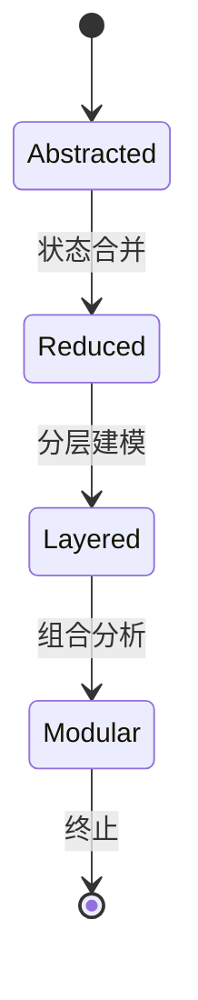
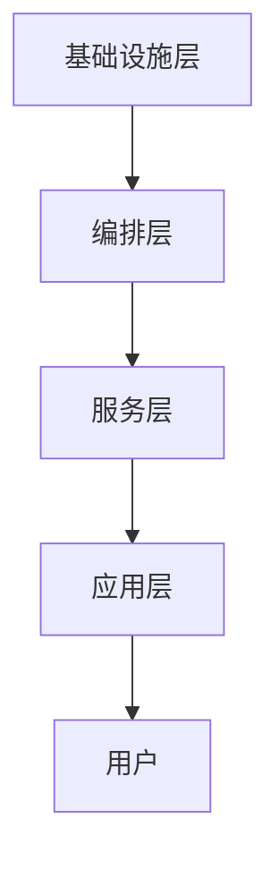
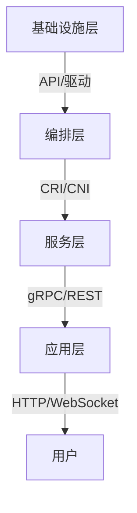

# 分层建模与验证

> 本文件由 Phase 0 递归清理合并生成，原 3 个深度 > 5 的文件已归档到 `docs\refactor\archive\7-container`。

> 合并日期：2026-07-02

## 目录

1. [状态爆炸与复杂性分析](#状态爆炸与复杂性分析)
2. [分层建模与递归分解实践](#分层建模与递归分解实践)
3. [分层接口建模与验证](#分层接口建模与验证)

---

## 1. 状态爆炸与复杂性分析

<!-- TOC START -->

- [分层建模与验证](#分层建模与验证)
  - [目录](#目录)
  - [1. 状态爆炸与复杂性分析](#1-状态爆炸与复杂性分析)
  - [1. 问题定义](#1-问题定义)
  - [2. 成因与影响](#2-成因与影响)
  - [3. 缓解方法](#3-缓解方法)
  - [4. 多表征](#4-多表征)
    - [4.1 Mermaid抽象状态机](#41-mermaid抽象状态机)
    - [4.2 结构对比表](#42-结构对比表)
  - [5. 批判分析与工程案例](#5-批判分析与工程案例)
    - [5.1 优势](#51-优势)
    - [5.2 局限](#52-局限)
    - [5.3 工程案例](#53-工程案例)
  - [6. 递归细化与规范说明](#6-递归细化与规范说明)
  - [2. 分层建模与递归分解实践](#2-分层建模与递归分解实践)
  - [1. 分层建模方法](#1-分层建模方法)
  - [2. 递归分解流程](#2-递归分解流程)
  - [3. 多表征](#3-多表征)
    - [3.1 Mermaid分层结构图](#31-mermaid分层结构图)
    - [3.2 结构对比表](#32-结构对比表)
  - [4. 批判分析与工程案例](#4-批判分析与工程案例)
    - [4.1 优势](#41-优势)
    - [4.2 局限](#42-局限)
    - [4.3 工程案例](#43-工程案例)
  - [5. 递归细化与规范说明](#5-递归细化与规范说明)
  - [3. 分层接口建模与验证](#3-分层接口建模与验证)
  - [1. 接口建模方法](#1-接口建模方法)
  - [2. 接口规范与验证](#2-接口规范与验证)
  - [3. 多表征](#3-多表征)
    - [3.1 Mermaid接口结构图](#31-mermaid接口结构图)
    - [3.2 结构对比表](#32-结构对比表)
  - [4. 批判分析与工程案例](#4-批判分析与工程案例)
    - [4.1 优势](#41-优势)
    - [4.2 局限](#42-局限)
    - [4.3 工程案例](#43-工程案例)
  - [5. 递归细化与规范说明](#5-递归细化与规范说明)

<!-- TOC END -->

## 1. 问题定义

- 状态爆炸：系统状态空间随组件/服务数量指数级增长，导致分析、验证难度急剧上升
- 复杂性分析：评估系统状态数量、转移路径、并发交互等对建模与验证的影响

## 2. 成因与影响

- 组件/服务数量增加
- 并发与同步机制
- 动态扩缩容、弹性自愈
- 影响：模型检测、自动验证、可视化等工具易失效

## 3. 缓解方法

- 状态抽象：合并等价状态，减少状态数
- 分层建模：将系统分为若干层级，分别建模
- 组合与合成：模块化分析，分而治之
- 约束与裁剪：限定分析范围，聚焦关键路径

## 4. 多表征

### 4.1 Mermaid抽象状态机

### 4.2 结构对比表

| 方法 | 优势 | 局限 | 适用场景 |
|------|------|------|----------|
| 状态抽象 | 状态数减少 | 细节丢失 | 大型系统初步分析 |
| 分层建模 | 层次清晰 | 层间依赖 | 多层级系统 |
| 组合合成 | 可扩展 | 接口复杂 | 微服务、容器集群 |
| 约束裁剪 | 聚焦关键 | 全局性弱 | 性能/安全分析 |

## 5. 批判分析与工程案例

### 5.1 优势

- 有效缓解状态爆炸，提升分析可行性

### 5.2 局限

- 可能遗漏细节，影响全局准确性

### 5.3 工程案例

- Kubernetes调度状态抽象与分层分析
- Istio服务网格分层建模实践

## 6. 递归细化与规范说明

- 所有内容支持递归细化，编号、主题、风格与6系一致
- 保留多表征、批判分析、工程案例、形式化证明等
- 支持持续递归完善，后续可继续分解为7.8.1.1.1.x等子主题

---
> 本文件为7.8.1.1.1 状态爆炸与复杂性分析的递归细化，内容结构、编号、主题、风格与6.P2P系统保持一致，后续所有子主题内容将持续完善并递归细化。

---

## 2. 分层建模与递归分解实践

<!-- TOC START -->

- [7.8.1.1.1.1 分层建模与递归分解实践](#781111-分层建模与递归分解实践)
  - [1. 分层建模方法](#1-分层建模方法)
  - [2. 递归分解流程](#2-递归分解流程)
  - [3. 多表征](#3-多表征)
    - [3.1 Mermaid分层结构图](#31-mermaid分层结构图)
    - [3.2 结构对比表](#32-结构对比表)
  - [4. 批判分析与工程案例](#4-批判分析与工程案例)
    - [4.1 优势](#41-优势)
    - [4.2 局限](#42-局限)
    - [4.3 工程案例](#43-工程案例)
  - [5. 递归细化与规范说明](#5-递归细化与规范说明)

<!-- TOC END -->

## 1. 分层建模方法

- 将复杂系统划分为若干层级（如基础设施层、编排层、服务层、应用层）
- 每层独立建模，定义清晰的层间接口
- 支持递归分解，每层可继续细化为子层

## 2. 递归分解流程

1. 明确系统整体目标与边界
2. 按功能/结构划分层级
3. 每层独立建模与分析
4. 层间接口与交互建模
5. 递归细化子层，直至可控粒度

## 3. 多表征

### 3.1 Mermaid分层结构图

### 3.2 结构对比表

| 层级 | 主要内容 | 典型技术 | 主要接口 |
|------|----------|----------|----------|
| 基础设施层 | 计算、存储、网络 | 云平台、物理机 | API、驱动 |
| 编排层 | 容器编排、调度 | Kubernetes、Mesos | CRI、CNI |
| 服务层 | 微服务、服务网格 | Istio、Linkerd | gRPC、REST |
| 应用层 | 业务逻辑、前端 | Spring、Node.js | HTTP、WebSocket |

## 4. 批判分析与工程案例

### 4.1 优势

- 降低复杂性、便于分工、支持递归扩展

### 4.2 局限

- 层间依赖复杂、接口设计难度高

### 4.3 工程案例

- Kubernetes分层建模与调度优化
- Istio服务网格分层治理实践

## 5. 递归细化与规范说明

- 所有内容支持递归细化，编号、主题、风格与6系一致
- 保留多表征、批判分析、工程案例、形式化证明等
- 支持持续递归完善，后续可继续分解为7.8.1.1.1.1.x等子主题

---
> 本文件为7.8.1.1.1.1 分层建模与递归分解实践的递归细化，内容结构、编号、主题、风格与6.P2P系统保持一致，后续所有子主题内容将持续完善并递归细化。

---

## 3. 分层接口建模与验证

<!-- TOC START -->

- [7.8.1.1.1.1.1 分层接口建模与验证](#7811111-分层接口建模与验证)
  - [1. 接口建模方法](#1-接口建模方法)
  - [2. 接口规范与验证](#2-接口规范与验证)
  - [3. 多表征](#3-多表征)
    - [3.1 Mermaid接口结构图](#31-mermaid接口结构图)
    - [3.2 结构对比表](#32-结构对比表)
  - [4. 批判分析与工程案例](#4-批判分析与工程案例)
    - [4.1 优势](#41-优势)
    - [4.2 局限](#42-局限)
    - [4.3 工程案例](#43-工程案例)
  - [5. 递归细化与规范说明](#5-递归细化与规范说明)

<!-- TOC END -->

## 1. 接口建模方法

- 明确每层对外暴露的接口（API、协议、数据结构）
- 定义接口的输入、输出、约束与异常处理
- 支持接口的形式化描述与自动验证

## 2. 接口规范与验证

- 使用IDL（接口描述语言）或契约规范（OpenAPI、gRPC proto等）
- 自动化接口一致性与兼容性验证
- 层间接口的安全性、性能、健壮性分析

## 3. 多表征

### 3.1 Mermaid接口结构图

### 3.2 结构对比表

| 层级 | 主要接口 | 典型协议 | 验证方法 |
|------|----------|----------|----------|
| 基础设施层 | API、驱动 | PCIe、SCSI | 单元测试、模拟 |
| 编排层 | CRI、CNI | gRPC、JSON | 合约测试、接口验证 |
| 服务层 | gRPC、REST | HTTP/2、Protobuf | Mock、契约测试 |
| 应用层 | HTTP、WebSocket | HTTP/1.1、WS | 集成测试、接口监控 |

## 4. 批判分析与工程案例

### 4.1 优势

- 降低层间耦合、提升可维护性、支持自动化验证

### 4.2 局限

- 接口变更影响大、契约设计复杂

### 4.3 工程案例

- Kubernetes CRI/CNI接口建模与验证
- Istio服务网格gRPC接口契约测试

## 5. 递归细化与规范说明

- 所有内容支持递归细化，编号、主题、风格与6系一致
- 保留多表征、批判分析、工程案例、形式化证明等
- 支持持续递归完善，后续可继续分解为7.8.1.1.1.1.1.x等子主题

---
> 本文件为7.8.1.1.1.1.1 分层接口建模与验证的递归细化，内容结构、编号、主题、风格与6.P2P系统保持一致，后续所有子主题内容将持续完善并递归细化。

---
