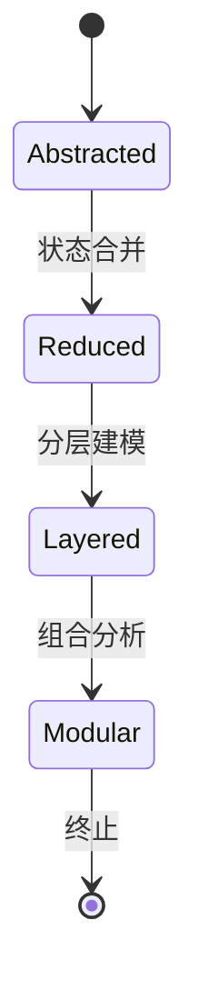

# 7.8.1.1.1 状态爆炸与复杂性分析

<!-- TOC START -->

- [7.8.1.1.1 状态爆炸与复杂性分析](#78111-状态爆炸与复杂性分析)
  - [1. 问题定义](#1-问题定义)
  - [2. 成因与影响](#2-成因与影响)
  - [3. 缓解方法](#3-缓解方法)
  - [4. 多表征](#4-多表征)
    - [4.1 Mermaid抽象状态机](#41-mermaid抽象状态机)
    - [4.2 结构对比表](#42-结构对比表)
  - [5. 批判分析与工程案例](#5-批判分析与工程案例)
    - [5.1 优势](#51-优势)
    - [5.2 局限](#52-局限)
    - [5.3 工程案例](#53-工程案例)
  - [6. 递归细化与规范说明](#6-递归细化与规范说明)

<!-- TOC END -->

## 1. 问题定义

- 状态爆炸：系统状态空间随组件/服务数量指数级增长，导致分析、验证难度急剧上升
- 复杂性分析：评估系统状态数量、转移路径、并发交互等对建模与验证的影响

## 2. 成因与影响

- 组件/服务数量增加
- 并发与同步机制
- 动态扩缩容、弹性自愈
- 影响：模型检测、自动验证、可视化等工具易失效

## 3. 缓解方法

- 状态抽象：合并等价状态，减少状态数
- 分层建模：将系统分为若干层级，分别建模
- 组合与合成：模块化分析，分而治之
- 约束与裁剪：限定分析范围，聚焦关键路径

## 4. 多表征

### 4.1 Mermaid抽象状态机

### 4.2 结构对比表

| 方法 | 优势 | 局限 | 适用场景 |
|------|------|------|----------|
| 状态抽象 | 状态数减少 | 细节丢失 | 大型系统初步分析 |
| 分层建模 | 层次清晰 | 层间依赖 | 多层级系统 |
| 组合合成 | 可扩展 | 接口复杂 | 微服务、容器集群 |
| 约束裁剪 | 聚焦关键 | 全局性弱 | 性能/安全分析 |

## 5. 批判分析与工程案例

### 5.1 优势

- 有效缓解状态爆炸，提升分析可行性

### 5.2 局限

- 可能遗漏细节，影响全局准确性

### 5.3 工程案例

- Kubernetes调度状态抽象与分层分析
- Istio服务网格分层建模实践

## 6. 递归细化与规范说明

- 所有内容支持递归细化，编号、主题、风格与6系一致
- 保留多表征、批判分析、工程案例、形式化证明等
- 支持持续递归完善，后续可继续分解为7.8.1.1.1.x等子主题

---
> 本文件为7.8.1.1.1 状态爆炸与复杂性分析的递归细化，内容结构、编号、主题、风格与6.P2P系统保持一致，后续所有子主题内容将持续完善并递归细化。
