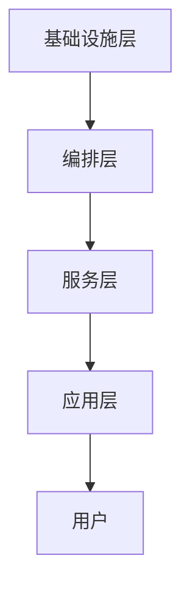

# 7.8.1.1.1.1 分层建模与递归分解实践

## 1. 分层建模方法

- 将复杂系统划分为若干层级（如基础设施层、编排层、服务层、应用层）
- 每层独立建模，定义清晰的层间接口
- 支持递归分解，每层可继续细化为子层

## 2. 递归分解流程

1. 明确系统整体目标与边界
2. 按功能/结构划分层级
3. 每层独立建模与分析
4. 层间接口与交互建模
5. 递归细化子层，直至可控粒度

## 3. 多表征

### 3.1 Mermaid分层结构图

### 3.2 结构对比表

| 层级 | 主要内容 | 典型技术 | 主要接口 |
|------|----------|----------|----------|
| 基础设施层 | 计算、存储、网络 | 云平台、物理机 | API、驱动 |
| 编排层 | 容器编排、调度 | Kubernetes、Mesos | CRI、CNI |
| 服务层 | 微服务、服务网格 | Istio、Linkerd | gRPC、REST |
| 应用层 | 业务逻辑、前端 | Spring、Node.js | HTTP、WebSocket |

## 4. 批判分析与工程案例

### 4.1 优势

- 降低复杂性、便于分工、支持递归扩展

### 4.2 局限

- 层间依赖复杂、接口设计难度高

### 4.3 工程案例

- Kubernetes分层建模与调度优化
- Istio服务网格分层治理实践

## 5. 递归细化与规范说明

- 所有内容支持递归细化，编号、主题、风格与6系一致
- 保留多表征、批判分析、工程案例、形式化证明等
- 支持持续递归完善，后续可继续分解为7.8.1.1.1.1.x等子主题

---
> 本文件为7.8.1.1.1.1 分层建模与递归分解实践的递归细化，内容结构、编号、主题、风格与6.P2P系统保持一致，后续所有子主题内容将持续完善并递归细化。
