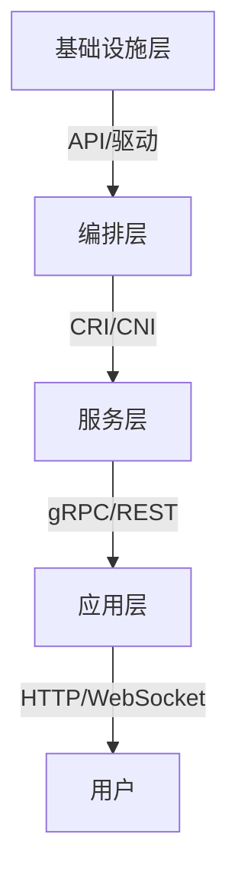

# 7.8.1.1.1.1.1 分层接口建模与验证

## 1. 接口建模方法

- 明确每层对外暴露的接口（API、协议、数据结构）
- 定义接口的输入、输出、约束与异常处理
- 支持接口的形式化描述与自动验证

## 2. 接口规范与验证

- 使用IDL（接口描述语言）或契约规范（OpenAPI、gRPC proto等）
- 自动化接口一致性与兼容性验证
- 层间接口的安全性、性能、健壮性分析

## 3. 多表征

### 3.1 Mermaid接口结构图

### 3.2 结构对比表

| 层级 | 主要接口 | 典型协议 | 验证方法 |
|------|----------|----------|----------|
| 基础设施层 | API、驱动 | PCIe、SCSI | 单元测试、模拟 |
| 编排层 | CRI、CNI | gRPC、JSON | 合约测试、接口验证 |
| 服务层 | gRPC、REST | HTTP/2、Protobuf | Mock、契约测试 |
| 应用层 | HTTP、WebSocket | HTTP/1.1、WS | 集成测试、接口监控 |

## 4. 批判分析与工程案例

### 4.1 优势

- 降低层间耦合、提升可维护性、支持自动化验证

### 4.2 局限

- 接口变更影响大、契约设计复杂

### 4.3 工程案例

- Kubernetes CRI/CNI接口建模与验证
- Istio服务网格gRPC接口契约测试

## 5. 递归细化与规范说明

- 所有内容支持递归细化，编号、主题、风格与6系一致
- 保留多表征、批判分析、工程案例、形式化证明等
- 支持持续递归完善，后续可继续分解为7.8.1.1.1.1.1.x等子主题

---
> 本文件为7.8.1.1.1.1.1 分层接口建模与验证的递归细化，内容结构、编号、主题、风格与6.P2P系统保持一致，后续所有子主题内容将持续完善并递归细化。
