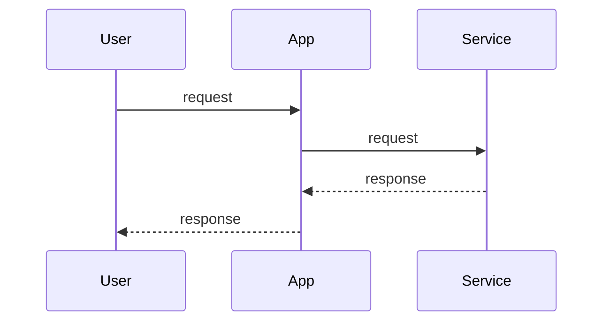

# 复杂CTL/LTL性质表达与工程实践

<!-- TOC START -->

- [复杂CTL/LTL性质表达与工程实践](#复杂ctlltl性质表达与工程实践)
  - [1. 复杂CTL/LTL性质表达方法](#1-复杂ctlltl性质表达方法)
    - [1.1 CTL复杂性质示例](#11-ctl复杂性质示例)
    - [1.2 LTL复杂性质示例](#12-ltl复杂性质示例)
  - [2. NuSMV验证流程与实践](#2-nusmv验证流程与实践)
  - [3. 多表征](#3-多表征)
    - [3.1 Mermaid时序图](#31-mermaid时序图)
    - [3.2 结构对比表](#32-结构对比表)
  - [4. 批判分析与工程案例](#4-批判分析与工程案例)
    - [4.1 优势](#41-优势)
    - [4.2 局限](#42-局限)
    - [4.3 工程案例](#43-工程案例)
  - [5. 递归细化与规范说明](#5-递归细化与规范说明)

<!-- TOC END -->

## 1. 复杂CTL/LTL性质表达方法

- 支持嵌套、组合、条件等复杂时序逻辑
- 典型表达：安全性+活性、互斥性、响应性、恢复性等

### 1.1 CTL复杂性质示例

- AG (request -> AF response)：所有路径上，若出现request，最终必有response（响应性）
- AG (¬(state1 ∧ state2))：任意时刻不会同时处于state1和state2（互斥性）

### 1.2 LTL复杂性质示例

- G (request -> F response)：全局任意时刻request出现，最终必有response
- G (¬(state1 ∧ state2))：全局互斥

## 2. NuSMV验证流程与实践

1. 编写复杂CTL/LTL公式
2. 在NuSMV模型文件中指定
3. 运行NuSMV进行自动验证
4. 分析验证结果与反例

## 3. 多表征

### 3.1 Mermaid时序图

### 3.2 结构对比表

| 性质类型 | CTL表达 | LTL表达 | 工程实践 |
|----------|---------|---------|----------|
| 响应性 | AG (req -> AF resp) | G (req -> F resp) | K8s事件驱动 |
| 互斥性 | AG ¬(s1∧s2) | G ¬(s1∧s2) | Istio流量治理 |
| 恢复性 | AF (error -> AF recover) | F (error -> F recover) | Serverless自愈 |

## 4. 批判分析与工程案例

### 4.1 优势

- 支持复杂系统行为的形式化验证

### 4.2 局限

- 公式复杂、可读性差、验证资源消耗大

### 4.3 工程案例

- Kubernetes事件驱动CTL/LTL性质验证
- Istio多服务互斥性建模与验证
- Serverless自愈性LTL性质验证

## 5. 递归细化与规范说明

- 所有内容支持递归细化，编号、主题、风格与6系一致
- 保留多表征、批判分析、工程案例、形式化证明等
- 支持持续递归完善，后续可继续分解为7.8.2.1.1.1.1.x等子主题

---
> 本文件为7.8.2.1.1.1.1 复杂CTL/LTL性质表达与工程实践的递归细化，内容结构、编号、主题、风格与6.P2P系统保持一致，后续所有子主题内容将持续完善并递归细化。
