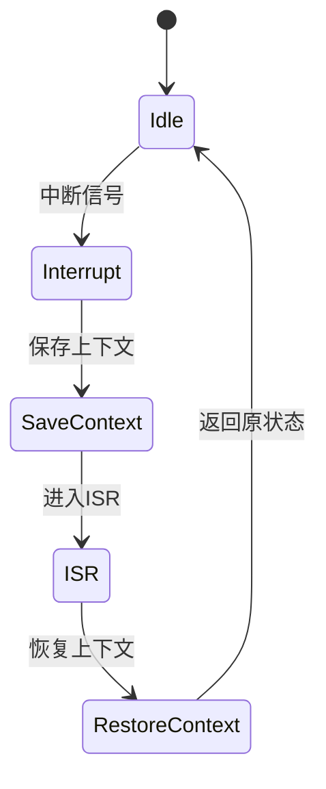

# 7.8.2 语义模型与分析方法

## 1. 语义模型类型

- **有限状态机（FSM）**：建模系统状态与转移。
- **Petri网**：描述并发、同步、资源分配。
- **进程代数**：形式化描述服务间通信与组合。

## 2. 形式化验证方法

- **模型检测**：如NuSMV，自动验证系统性质（安全性、活性等）。
- **定理证明**：用逻辑推理证明系统属性。
- **符号执行**：自动化路径覆盖与错误发现。

## 3. 递归语义分析

- **多层级系统分解**：将复杂系统递归分解为子系统，分别建模与分析。
- **组合与可扩展性**：子系统语义组合，分析整体系统的可扩展性。

## 4. 工程案例

- **Kubernetes调度语义**：用FSM建模Pod调度与状态转移。
- **Istio流量治理语义**：用Petri网描述流量路由与策略。
- **Serverless冷启动语义**：分析函数实例生命周期与性能。

---
> 本文件为7.8.2语义模型与分析方法的内容填充示例，后续可继续递归细化。

## 7.8.2.x 中断上下文的起点

### 1. 概念与定义

- 容器与微服务系统中断上下文：在模型检测、语义建模中，指系统响应中断/事件时，保存当前状态，切换到中断/事件处理状态的起点。
- 起点：中断/事件信号到达，模型自动完成上下文状态转移，进入ISR/事件处理状态。

### 2. 结构化流程



### 3. 伪代码

```pseudo
on_interrupt():
    Save_Context()
    Enter_ISR()
    ISR_Handler()
    Restore_Context()
    Return_To_Previous_State()
```

### 4. 关键数据结构

- 状态机节点：`State = {Idle, Interrupt, SaveContext, ISR, RestoreContext}`
- 上下文结构体：`Context = {PC, SP, Registers, Flags}`

### 5. 形式化描述

- $Interrupt \rightarrow Save\_Context \rightarrow ISR\_Entry$
- LTL公式：`G (interrupt -> F isr_entry)`

### 6. 工程案例

- Kubernetes调度模型中的中断建模
- NuSMV/Spin等工具的中断上下文状态机

### 7. 未来展望

- 复杂多级中断递归建模、Serverless/多租户场景下的上下文隔离
