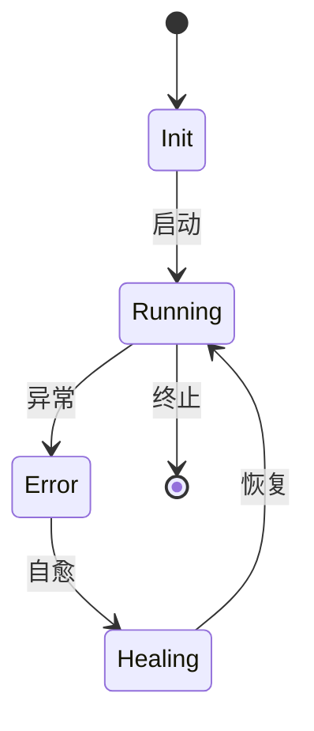

# 7.8.2.1 FSM建模与验证

## 1. FSM基本概念

- 有限状态机（FSM）用于建模系统的有限状态及其转移。
- 包括状态集合、输入集合、转移函数、初始状态、终止状态。

## 2. 建模方法

- **状态定义**：列举系统所有可能状态（如Init、Running、Error等）。
- **转移规则**：定义状态间的转移条件和事件。
- **输入/输出建模**：描述输入事件与输出行为。
- **Mermaid状态机图**：

## 3. 验证流程

- **属性表达**：用CTL/LTL等时序逻辑表达需验证的性质。
- **模型检测**：用NuSMV等工具自动验证FSM模型的安全性、活性等。
- **反例分析**：若验证失败，分析反例定位问题。

## 4. 工程案例

- **容器生命周期管理**：FSM建模容器状态转移，验证“不会进入死锁或未定义状态”。
- **微服务降级与恢复**：FSM建模服务降级、熔断、恢复等流程。

---
> 本文件为7.8.2.1 FSM建模与验证的内容填充示例，后续可继续递归细化。
