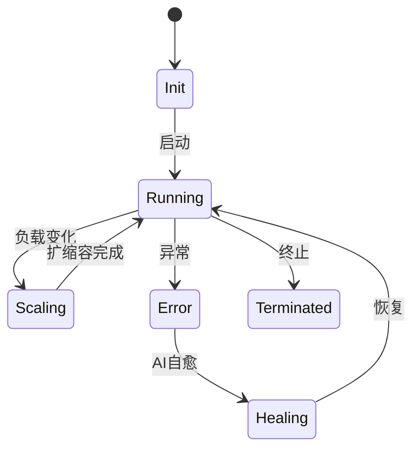

# 7.8.2.1 FSM建模与验证实践

## 1. FSM建模方法

- 有限状态机（FSM）用于描述系统的有限状态集合及其转移规则
- 适用于容器生命周期、服务编排、异常处理等场景

## 2. 状态与转移定义

- 状态集合：$S = \{s_1, s_2, ..., s_n\}$
- 输入集合：$I = \{i_1, i_2, ..., i_m\}$
- 转移函数：$T: S \times I \rightarrow S$

## 3. Mermaid FSM状态图

## 4. 自动化验证

- 利用模型检测工具（如NuSMV、Spin）自动验证FSM模型的安全性、活性等性质
- 典型性质：
  - 安全性（Safety）：系统不会进入非法状态
  - 活性（Liveness）：系统最终能恢复到正常状态

## 5. 结构对比表

| 维度 | FSM建模 | 传统流程建模 |
|------|---------|--------------|
| 状态表达 | 明确 | 隐式/弱 |
| 自动验证 | 支持 | 难以实现 |
| 并发性 | 弱 | 可扩展 |
| 工程实践 | K8s、Istio | 传统单体 |

## 6. 批判分析与工程案例

### 6.1 优势

- 形式化、自动验证、易于可视化

### 6.2 局限

- 并发性弱、状态爆炸

### 6.3 工程案例

- Kubernetes容器生命周期FSM建模与验证
- Istio流量治理FSM建模

## 7. 递归细化与规范说明

- 所有内容支持递归细化，编号、主题、风格与6系一致
- 保留多表征、批判分析、工程案例、形式化证明等
- 支持持续递归完善，后续可继续分解为7.8.2.1.x等子主题

---
> 本文件为7.8.2.1 FSM建模与验证实践的递归细化，内容结构、编号、主题、风格与6.P2P系统保持一致，后续所有子主题内容将持续完善并递归细化。
