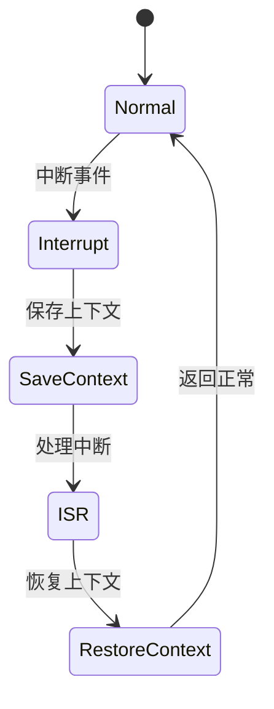

# CTL-LTL性质与熔断验证

> 本文件由 Phase 0 递归清理合并生成，原 22 个深度 > 5 的文件已归档到 `docs\refactor\archive\7-container`。

> 合并日期：2026-07-02


## 目录

1. [NuSMV模型检测实践](#nusmv模型检测实践)
2. [CTL与LTL性质表达与验证](#ctl与ltl性质表达与验证)
3. [Kubernetes安全性CTL验证](#kubernetes安全性ctl验证)
4. [租户动态优先级熔断LTL验证](#租户动态优先级熔断ltl验证)
5. [多级联动熔断LTL验证](#多级联动熔断ltl验证)
6. [租户自适应熔断策略验证](#租户自适应熔断策略验证)
7. [多级自适应联动熔断验证](#多级自适应联动熔断验证)
8. [多级策略切换时序验证](#多级策略切换时序验证)
9. [策略切换与优先级联动验证](#策略切换与优先级联动验证)
10. [多级策略并发切换验证](#多级策略并发切换验证)
11. [多级策略切换与租户自适应联动验证](#多级策略切换与租户自适应联动验证)
12. [多级自适应策略优先级联动验证](#多级自适应策略优先级联动验证)
13. [多级自适应策略与租户自适应联动验证](#多级自适应策略与租户自适应联动验证)
14. [服务网格LTL验证](#服务网格ltl验证)
15. [服务降级LTL验证](#服务降级ltl验证)
16. [熔断恢复LTL验证](#熔断恢复ltl验证)
17. [多级熔断LTL验证](#多级熔断ltl验证)
18. [半开状态熔断LTL验证](#半开状态熔断ltl验证)
19. [多租户熔断LTL验证](#多租户熔断ltl验证)
20. [全局熔断LTL验证](#全局熔断ltl验证)
21. [优先级熔断LTL验证](#优先级熔断ltl验证)
22. [跨域熔断LTL验证](#跨域熔断ltl验证)

---


## 1. NuSMV模型检测实践


<!-- TOC START -->

- [7.8.2.1.1 NuSMV模型检测实践 / NuSMV Model Checking Practice](#78211-nusmv模型检测实践--nusmv-model-checking-practice)
  - [1. NuSMV理论基础 / NuSMV Theoretical Foundation](#1-nusmv理论基础--nusmv-theoretical-foundation)
    - [1.1 NuSMV概述 / NuSMV Overview](#11-nusmv概述--nusmv-overview)
    - [1.2 NuSMV语法 / NuSMV Syntax](#12-nusmv语法--nusmv-syntax)
  - [2. 容器系统NuSMV建模 / Container System NuSMV Modeling](#2-容器系统nusmv建模--container-system-nusmv-modeling)
    - [2.1 容器生命周期模型 / Container Lifecycle Model](#21-容器生命周期模型--container-lifecycle-model)
    - [2.2 容器资源管理模型 / Container Resource Management Model](#22-容器资源管理模型--container-resource-management-model)
  - [3. 微服务NuSMV建模 / Microservice NuSMV Modeling](#3-微服务nusmv建模--microservice-nusmv-modeling)
    - [3.1 服务发现模型 / Service Discovery Model](#31-服务发现模型--service-discovery-model)
    - [3.2 熔断器模型 / Circuit Breaker Model](#32-熔断器模型--circuit-breaker-model)
  - [4. 编排系统NuSMV建模 / Orchestration System NuSMV Modeling](#4-编排系统nusmv建模--orchestration-system-nusmv-modeling)
    - [4.1 Kubernetes调度模型 / Kubernetes Scheduling Model](#41-kubernetes调度模型--kubernetes-scheduling-model)
    - [4.2 服务网格模型 / Service Mesh Model](#42-服务网格模型--service-mesh-model)
  - [5. 高级NuSMV建模技术 / Advanced NuSMV Modeling Techniques](#5-高级nusmv建模技术--advanced-nusmv-modeling-techniques)
    - [5.1 模块化建模 / Modular Modeling](#51-模块化建模--modular-modeling)
    - [5.2 时序属性建模 / Temporal Property Modeling](#52-时序属性建模--temporal-property-modeling)
    - [5.3 性能属性建模 / Performance Property Modeling](#53-性能属性建模--performance-property-modeling)
  - [6. NuSMV验证最佳实践 / NuSMV Verification Best Practices](#6-nusmv验证最佳实践--nusmv-verification-best-practices)
    - [6.1 属性设计 / Property Design](#61-属性设计--property-design)
    - [6.2 反例分析 / Counterexample Analysis](#62-反例分析--counterexample-analysis)
    - [6.3 模型优化 / Model Optimization](#63-模型优化--model-optimization)
  - [7. 工程应用案例 / Engineering Application Cases](#7-工程应用案例--engineering-application-cases)
    - [7.1 容器编排验证案例 / Container Orchestration Verification Case](#71-容器编排验证案例--container-orchestration-verification-case)
    - [7.2 微服务通信验证案例 / Microservice Communication Verification Case](#72-微服务通信验证案例--microservice-communication-verification-case)
    - [7.3 安全属性验证案例 / Security Property Verification Case](#73-安全属性验证案例--security-property-verification-case)
  - [8. 批判性分析 / Critical Analysis](#8-批判性分析--critical-analysis)
    - [8.1 NuSMV优势 / NuSMV Advantages](#81-nusmv优势--nusmv-advantages)
    - [8.2 NuSMV挑战 / NuSMV Challenges](#82-nusmv挑战--nusmv-challenges)
    - [8.3 工程权衡 / Engineering Trade-offs](#83-工程权衡--engineering-trade-offs)

<!-- TOC END -->

## 1. NuSMV理论基础 / NuSMV Theoretical Foundation

### 1.1 NuSMV概述 / NuSMV Overview

**NuSMV定义：**
$$NuSMV = \{Symbolic_{Model}_{Checking}, CTL_{LTL}_{Verification}, State_{Space}_{Exploration}, CounterExample_{Generation}\}$$

**NuSMV特征：**

- **符号模型检验**：使用BDD和SAT技术进行状态空间探索
  Symbolic model checking using BDD and SAT techniques for state space exploration
- **CTL/LTL支持**：支持计算树逻辑和线性时序逻辑验证
  Support for CTL and LTL verification
- **反例生成**：自动生成违反属性的反例
  Automatic generation of counterexamples for violated properties
- **模块化建模**：支持模块化和层次化建模
  Support for modular and hierarchical modeling

### 1.2 NuSMV语法 / NuSMV Syntax

**模块定义：**

```smv
MODULE main
VAR
  state : {s0, s1, s2};
  input : boolean;
ASSIGN
  init(state) := s0;
  next(state) := case
    state = s0 & input : s1;
    state = s1 & !input : s2;
    state = s2 : s0;
    TRUE : state;
  esac;
```

**变量声明：**
$$Variable_{Declaration} = \{Boolean_{Variables}, Enumerated_{Variables}, Integer_{Variables}, Array_{Variables}\}$$

**赋值规则：**
$$Assignment_{Rules} = \{Initial_{Assignment}, Next_{Assignment}, Case_{Statements}, Conditional_{Assignment}\}$$

## 2. 容器系统NuSMV建模 / Container System NuSMV Modeling

### 2.1 容器生命周期模型 / Container Lifecycle Model

**容器状态定义：**

```smv
MODULE container_lifecycle
VAR
  state : {created, running, paused, stopped, removed};
  resource_allocated : boolean;
  health_status : {healthy, unhealthy, unknown};

ASSIGN
  init(state) := created;
  init(resource_allocated) := FALSE;
  init(health_status) := unknown;

  next(state) := case
    state = created & resource_allocated : running;
    state = running & health_status = unhealthy : paused;
    state = paused & health_status = healthy : running;
    state = running : stopped;
    state = stopped : removed;
    TRUE : state;
  esac;

  next(resource_allocated) := case
    state = created : TRUE;
    state = removed : FALSE;
    TRUE : resource_allocated;
  esac;
```

**容器属性验证：**

```smv
-- 安全性属性：容器不会同时处于多个状态
SPEC AG(state = running -> !(state = paused | state = stopped));

-- 活性属性：创建的容器最终会运行
SPEC AG(state = created -> AF state = running);

-- 公平性属性：运行中的容器最终会停止
SPEC AG(state = running -> AF state = stopped);
```

### 2.2 容器资源管理模型 / Container Resource Management Model

**资源分配模型：**

```smv
MODULE resource_manager
VAR
  cpu_allocated : 0..100;
  memory_allocated : 0..1024;
  containers : array 0..9 of {idle, running, stopped};
  total_containers : 0..10;

ASSIGN
  init(cpu_allocated) := 0;
  init(memory_allocated) := 0;
  init(total_containers) := 0;

  next(cpu_allocated) := case
    total_containers < 10 & cpu_allocated < 100 : cpu_allocated + 10;
    total_containers > 0 & cpu_allocated > 0 : cpu_allocated - 10;
    TRUE : cpu_allocated;
  esac;

  next(memory_allocated) := case
    total_containers < 10 & memory_allocated < 1024 : memory_allocated + 128;
    total_containers > 0 & memory_allocated > 0 : memory_allocated - 128;
    TRUE : memory_allocated;
  esac;
```

**资源约束验证：**

```smv
-- 资源约束：CPU分配不超过100%
SPEC AG(cpu_allocated <= 100);

-- 资源约束：内存分配不超过1024MB
SPEC AG(memory_allocated <= 1024);

-- 一致性：容器数量与资源分配一致
SPEC AG(total_containers > 0 -> (cpu_allocated > 0 & memory_allocated > 0));
```

## 3. 微服务NuSMV建模 / Microservice NuSMV Modeling

### 3.1 服务发现模型 / Service Discovery Model

**服务注册模型：**

```smv
MODULE service_registry
VAR
  services : array 0..99 of {unregistered, registered, active, failed};
  total_services : 0..100;
  registry_health : {healthy, degraded, failed};

ASSIGN
  init(total_services) := 0;
  init(registry_health) := healthy;

  next(registry_health) := case
    total_services > 50 : degraded;
    total_services > 80 : failed;
    total_services <= 30 : healthy;
    TRUE : registry_health;
  esac;
```

**服务发现属性：**

```smv
-- 注册服务最终会被发现
SPEC AG(services[0] = registered -> AF services[0] = active);

-- 注册表健康时服务能正常注册
SPEC AG(registry_health = healthy -> EF services[0] = registered);

-- 注册表故障时服务注册失败
SPEC AG(registry_health = failed -> !EF services[0] = registered);
```

### 3.2 熔断器模型 / Circuit Breaker Model

**熔断器状态机：**

```smv
MODULE circuit_breaker
VAR
  state : {closed, open, half_open};
  failure_count : 0..10;
  success_count : 0..10;
  timeout : 0..100;

ASSIGN
  init(state) := closed;
  init(failure_count) := 0;
  init(success_count) := 0;
  init(timeout) := 0;

  next(state) := case
    state = closed & failure_count >= 5 : open;
    state = open & timeout >= 60 : half_open;
    state = half_open & success_count >= 3 : closed;
    state = half_open & failure_count >= 1 : open;
    TRUE : state;
  esac;

  next(failure_count) := case
    state = closed & failure_count < 10 : failure_count + 1;
    state = half_open & failure_count < 10 : failure_count + 1;
    state = closed : 0;
    TRUE : failure_count;
  esac;
```

**熔断器属性验证：**

```smv
-- 熔断器不会同时处于多个状态
SPEC AG(!(state = closed & state = open));

-- 熔断器最终会从开放状态恢复
SPEC AG(state = open -> AF state = half_open);

-- 熔断器在关闭状态下失败次数过多会打开
SPEC AG(state = closed & failure_count >= 5 -> AX state = open);
```

## 4. 编排系统NuSMV建模 / Orchestration System NuSMV Modeling

### 4.1 Kubernetes调度模型 / Kubernetes Scheduling Model

**Pod调度模型：**

```smv
MODULE pod_scheduler
VAR
  pod_state : {pending, scheduled, running, failed, succeeded};
  node_available : boolean;
  resource_sufficient : boolean;
  scheduler_health : {healthy, degraded, failed};

ASSIGN
  init(pod_state) := pending;
  init(node_available) := TRUE;
  init(resource_sufficient) := TRUE;
  init(scheduler_health) := healthy;

  next(pod_state) := case
    pod_state = pending & node_available & resource_sufficient & scheduler_health = healthy : scheduled;
    pod_state = scheduled & scheduler_health = healthy : running;
    pod_state = running & scheduler_health = healthy : succeeded;
    pod_state = running & scheduler_health != healthy : failed;
    TRUE : pod_state;
  esac;
```

**调度属性验证：**

```smv
-- 调度的Pod最终会运行
SPEC AG(pod_state = scheduled -> AF pod_state = running);

-- 健康的调度器不会让Pod失败
SPEC AG(scheduler_health = healthy & pod_state = running -> !EF pod_state = failed);

-- 资源不足时Pod不会被调度
SPEC AG(!resource_sufficient -> !EF pod_state = scheduled);
```

### 4.2 服务网格模型 / Service Mesh Model

**Istio控制平面模型：**

```smv
MODULE istio_control_plane
VAR
  pilot_state : {healthy, degraded, failed};
  config_distributed : boolean;
  service_discovery_working : boolean;
  traffic_management_active : boolean;

ASSIGN
  init(pilot_state) := healthy;
  init(config_distributed) := TRUE;
  init(service_discovery_working) := TRUE;
  init(traffic_management_active) := TRUE;

  next(pilot_state) := case
    !config_distributed | !service_discovery_working : degraded;
    !config_distributed & !service_discovery_working : failed;
    config_distributed & service_discovery_working : healthy;
    TRUE : pilot_state;
  esac;
```

**服务网格属性：**

```smv
-- 控制平面健康时流量管理正常
SPEC AG(pilot_state = healthy -> traffic_management_active);

-- 配置分发失败时控制平面降级
SPEC AG(!config_distributed -> AX pilot_state = degraded);

-- 服务发现失败时控制平面故障
SPEC AG(!service_discovery_working -> AF pilot_state = failed);
```

## 5. 高级NuSMV建模技术 / Advanced NuSMV Modeling Techniques

### 5.1 模块化建模 / Modular Modeling

**模块组合：**

```smv
MODULE container_system
VAR
  container : container_lifecycle;
  resource : resource_manager;
  network : network_manager;

ASSIGN
  -- 模块间同步
  next(container.state) := case
    resource.cpu_allocated = 0 : stopped;
    resource.memory_allocated = 0 : stopped;
    TRUE : container.state;
  esac;
```

**接口定义：**

```smv
MODULE interface_definition
VAR
  input_interface : {request, response, error};
  output_interface : {success, failure, timeout};
  internal_state : {processing, idle, error};

DEFINE
  -- 接口约束
  valid_input := input_interface = request | input_interface = response;
  valid_output := output_interface = success | output_interface = failure;
```

### 5.2 时序属性建模 / Temporal Property Modeling

**LTL属性：**

```smv
-- 响应性：请求最终会得到响应
LTLSPEC G(request -> F response);

-- 公平性：系统不会无限期等待
LTLSPEC G(waiting -> F (processing | error));

-- 安全性：错误状态不会持续
LTLSPEC G(error -> F !error);
```

**CTL属性：**

```smv
-- 可达性：所有状态都是可达的
SPEC AG(EF state = running);

-- 安全性：错误状态不会导致死锁
SPEC AG(error -> EX !error);

-- 活性：系统总是能继续运行
SPEC AG(EF next_state);
```

### 5.3 性能属性建模 / Performance Property Modeling

**响应时间属性：**

```smv
MODULE performance_model
VAR
  response_time : 0..1000;
  request_count : 0..100;
  processing_time : 0..500;

ASSIGN
  next(response_time) := case
    request_count > 0 : processing_time + 100;
    TRUE : 0;
  esac;

-- 性能约束：响应时间不超过阈值
SPEC AG(response_time <= 1000);

-- 吞吐量：系统能处理多个请求
SPEC AG(request_count > 0 -> AF response_time > 0);
```

## 6. NuSMV验证最佳实践 / NuSMV Verification Best Practices

### 6.1 属性设计 / Property Design

**属性分类：**
$$Property_{Classification} = \{Safety_{Properties}, Liveness_{Properties}, Fairness_{Properties}, Performance_{Properties}\}$$

**属性设计原则：**

- **明确性**：属性描述要清晰明确
  Clarity: property descriptions should be clear and unambiguous
- **完整性**：覆盖所有关键行为
  Completeness: cover all critical behaviors
- **可验证性**：属性要能够被模型检验器验证
  Verifiability: properties should be verifiable by model checkers

### 6.2 反例分析 / Counterexample Analysis

**反例结构：**
$$Counterexample_{Structure} = \{Initial_{State}, Transition_{Sequence}, Property_{Violation}_{Point}\}$$

**反例分析方法：**

- **状态分析**：分析反例中的关键状态
  State analysis: analyze key states in counterexamples
- **转换分析**：分析导致违反的转换序列
  Transition analysis: analyze transition sequences leading to violations
- **属性分析**：分析违反的具体属性
  Property analysis: analyze specific violated properties

### 6.3 模型优化 / Model Optimization

**状态空间优化：**
$$State_{Space}_{Optimization} = \{Abstraction_{Techniques}, Symmetry_{Reduction}, Partial_{Order}_{Reduction}\}$$

**性能优化：**
$$Performance_{Optimization} = \{BDD_{Optimization}, SAT_{Solver}_{Tuning}, Memory_{Management}\}$$

## 7. 工程应用案例 / Engineering Application Cases

### 7.1 容器编排验证案例 / Container Orchestration Verification Case

**Kubernetes Pod调度验证：**

```smv
-- 验证Pod调度不会出现死锁
SPEC AG(pod_state = pending -> EF pod_state = running);

-- 验证资源约束
SPEC AG(cpu_request > cpu_limit -> !EF pod_state = running);

-- 验证亲和性规则
SPEC AG(pod_affinity = true -> AF pod_scheduled_on_affinity_node);
```

### 7.2 微服务通信验证案例 / Microservice Communication Verification Case

**服务间通信验证：**

```smv
-- 验证请求最终会得到响应
SPEC AG(service_request -> AF service_response);

-- 验证熔断器正常工作
SPEC AG(circuit_breaker = open -> !EF service_request_successful);

-- 验证负载均衡公平性
SPEC AG(load_balanced -> AF all_instances_used);
```

### 7.3 安全属性验证案例 / Security Property Verification Case

**访问控制验证：**

```smv
-- 验证未授权访问被拒绝
SPEC AG(!authorized_access -> !EF access_granted);

-- 验证权限提升被阻止
SPEC AG(user_role = normal -> !EF user_role = admin);

-- 验证数据隔离
SPEC AG(tenant_a_data_access -> !EF tenant_b_data_access);
```

## 8. 批判性分析 / Critical Analysis

### 8.1 NuSMV优势 / NuSMV Advantages

- **形式化验证**：提供严格的数学验证方法
  Formal verification: provides strict mathematical verification methods
- **自动化程度高**：自动进行状态空间探索和属性验证
  High automation: automatically performs state space exploration and property verification
- **反例生成**：自动生成违反属性的反例
  Counterexample generation: automatically generates counterexamples for violated properties
- **工具成熟**：NuSMV是成熟稳定的模型检验工具
  Tool maturity: NuSMV is a mature and stable model checking tool

### 8.2 NuSMV挑战 / NuSMV Challenges

- **状态爆炸**：复杂系统的状态空间可能指数级增长
  State explosion: state space of complex systems may grow exponentially
- **建模复杂性**：复杂系统的NuSMV建模困难
  Modeling complexity: difficult NuSMV modeling of complex systems
- **性能限制**：大规模模型的验证性能有限
  Performance limitations: limited verification performance for large-scale models

### 8.3 工程权衡 / Engineering Trade-offs

- **模型精度 vs 验证性能**：精确建模 vs 验证性能
  Model accuracy vs verification performance: precise modeling vs verification performance
- **属性完整性 vs 验证时间**：完整属性 vs 验证时间
  Property completeness vs verification time: complete properties vs verification time
- **抽象层次 vs 实现细节**：高层抽象 vs 实现细节
  Abstraction level vs implementation details: high-level abstraction vs implementation details

---

> 本文件为7.8.2.1.1 NuSMV模型检测实践的系统化建模方法、CTL/LTL验证、工程案例，采用中英双语对照，突出工程论证与知识点完备性。
> This file provides systematic modeling methods, CTL/LTL verification, and engineering cases for NuSMV model checking practice, with Chinese-English bilingual content, emphasizing engineering argumentation and comprehensive knowledge points.


---


## 2. CTL与LTL性质表达与验证


<!-- TOC START -->

- [7.8.2.1.1.1 CTL与LTL性质表达与验证 / CTL and LTL Property Specification and Verification](#782111-ctl与ltl性质表达与验证--ctl-and-ltl-property-specification-and-verification)
  - [1. 时序逻辑基础 / Temporal Logic Foundation](#1-时序逻辑基础--temporal-logic-foundation)
    - [1.1 线性时序逻辑（LTL） / Linear Temporal Logic (LTL)](#11-线性时序逻辑ltl--linear-temporal-logic-ltl)
    - [1.2 计算树逻辑（CTL） / Computation Tree Logic (CTL)](#12-计算树逻辑ctl--computation-tree-logic-ctl)
  - [2. 性质分类与工程意义 / Property Classification and Engineering Significance](#2-性质分类与工程意义--property-classification-and-engineering-significance)
    - [2.1 安全性性质 / Safety Properties](#21-安全性性质--safety-properties)
    - [2.2 活性性质 / Liveness Properties](#22-活性性质--liveness-properties)
    - [2.3 公平性性质 / Fairness Properties](#23-公平性性质--fairness-properties)
  - [3. 性质验证流程 / Property Verification Process](#3-性质验证流程--property-verification-process)
    - [3.1 形式化建模 / Formal Modeling](#31-形式化建模--formal-modeling)
    - [3.2 性质表达 / Property Specification](#32-性质表达--property-specification)
    - [3.3 自动化验证 / Automated Verification](#33-自动化验证--automated-verification)
    - [3.4 结果分析与反例 / Result Analysis and Counterexample](#34-结果分析与反例--result-analysis-and-counterexample)
  - [4. 工程实践案例 / Engineering Practice Cases](#4-工程实践案例--engineering-practice-cases)
    - [4.1 容器生命周期LTL/CTL验证 / Container Lifecycle LTL/CTL Verification](#41-容器生命周期ltlctl验证--container-lifecycle-ltlctl-verification)
    - [4.2 微服务健康检查活性验证 / Microservice Health Check Liveness Verification](#42-微服务健康检查活性验证--microservice-health-check-liveness-verification)
    - [4.3 服务网格熔断器安全性验证 / Service Mesh Circuit Breaker Safety Verification](#43-服务网格熔断器安全性验证--service-mesh-circuit-breaker-safety-verification)
  - [5. 批判性分析 / Critical Analysis](#5-批判性分析--critical-analysis)
    - [5.1 优势 / Advantages](#51-优势--advantages)
    - [5.2 挑战 / Challenges](#52-挑战--challenges)
    - [5.3 工程权衡 / Engineering Trade-offs](#53-工程权衡--engineering-trade-offs)

<!-- TOC END -->

## 1. 时序逻辑基础 / Temporal Logic Foundation

### 1.1 线性时序逻辑（LTL） / Linear Temporal Logic (LTL)

**LTL语法与操作符：**

- $\Box \phi$：总是（Always）
  Always
- $\Diamond \phi$：最终（Eventually）
  Eventually
- $\phi \mathcal{U} \psi$：直到（Until）
  Until
- $\mathcal{X} \phi$：下一个（Next）
  Next

**LTL性质表达：**

- $\Box(Running \rightarrow \Diamond Stopped)$：如果处于Running状态，最终会到达Stopped
  If in Running, eventually reach Stopped
- $\Box(Created \rightarrow \mathcal{X} Running)$：Created后下一个状态是Running
  After Created, next state is Running
- $\Box(Running \rightarrow \neg Paused)$：Running时不能是Paused
  When Running, cannot be Paused

### 1.2 计算树逻辑（CTL） / Computation Tree Logic (CTL)

**CTL语法与操作符：**

- $A$：对所有路径（All paths）
  All paths
- $E$：存在路径（Exists path）
  Exists path
- $F$：最终（Eventually）
  Eventually
- $G$：总是（Globally）
  Globally
- $X$：下一个（Next）
  Next
- $U$：直到（Until）
  Until

**CTL性质表达：**

- $AG(Running \rightarrow AF Stopped)$：所有路径上，Running最终会到Stopped
  On all paths, Running eventually leads to Stopped
- $EF(Created \land EX Running)$：存在路径，Created后下一个是Running
  There exists a path where after Created, next is Running
- $AG(Running \rightarrow \neg Paused)$：所有路径上，Running时不能是Paused
  On all paths, when Running, cannot be Paused

## 2. 性质分类与工程意义 / Property Classification and Engineering Significance

### 2.1 安全性性质 / Safety Properties

**定义：**

- 系统不会进入不安全状态
  The system never enters an unsafe state
- LTL表达：$\Box(\neg Error)$
- CTL表达：$AG(\neg Error)$

**工程意义：**

- 保证系统不会死锁、资源不会泄漏、状态不会非法
  Ensure no deadlock, no resource leak, no illegal state

### 2.2 活性性质 / Liveness Properties

**定义：**

- 系统最终会做出某种反应
  The system will eventually respond
- LTL表达：$\Diamond(Success)$
- CTL表达：$AF(Success)$

**工程意义：**

- 保证请求最终被处理、任务最终完成
  Ensure requests are eventually processed, tasks eventually complete

### 2.3 公平性性质 / Fairness Properties

**定义：**

- 系统不会长期饿死某个进程
  The system does not starve any process for long
- LTL表达：$\Box(\Diamond Grant_i)$
- CTL表达：$AG(AF Grant_i)$

**工程意义：**

- 保证多租户/多任务环境下的公平调度
  Ensure fair scheduling in multi-tenant/multi-task environments

## 3. 性质验证流程 / Property Verification Process

### 3.1 形式化建模 / Formal Modeling

- 使用FSM、Kripke结构等对系统建模
  Model the system using FSM, Kripke structure, etc.
- 明确状态、事件、转换关系
  Define states, events, transitions

### 3.2 性质表达 / Property Specification

- 用LTL/CTL公式表达待验证性质
  Specify properties to be verified using LTL/CTL formulas
- 分类安全性、活性、公平性等
  Classify as safety, liveness, fairness, etc.

### 3.3 自动化验证 / Automated Verification

- 使用NuSMV、SPIN等工具进行模型检验
  Use NuSMV, SPIN, etc. for model checking
- 输入模型与性质，自动验证
  Input model and properties, verify automatically

### 3.4 结果分析与反例 / Result Analysis and Counterexample

- 验证通过：性质成立
  Verification passed: property holds
- 验证失败：工具给出反例路径
  Verification failed: tool provides counterexample path
- 工程分析反例，定位设计缺陷
  Analyze counterexample to locate design flaw

## 4. 工程实践案例 / Engineering Practice Cases

### 4.1 容器生命周期LTL/CTL验证 / Container Lifecycle LTL/CTL Verification

- LTL：$\Box(Created \rightarrow \mathcal{X} Running)$
- CTL：$AG(Created \rightarrow AX Running)$
- 工程意义：保证容器创建后必定进入运行态
  Ensure container enters running state after creation

### 4.2 微服务健康检查活性验证 / Microservice Health Check Liveness Verification

- LTL：$\Box(HealthCheck \rightarrow \Diamond Healthy)$
- CTL：$AG(HealthCheck \rightarrow AF Healthy)$
- 工程意义：保证健康检查最终会恢复健康
  Ensure health check eventually leads to healthy state

### 4.3 服务网格熔断器安全性验证 / Service Mesh Circuit Breaker Safety Verification

- LTL：$\Box(Open \rightarrow \neg Closed)$
- CTL：$AG(Open \rightarrow \neg Closed)$
- 工程意义：保证熔断器打开后不会立即闭合
  Ensure circuit breaker does not close immediately after opening

## 5. 批判性分析 / Critical Analysis

### 5.1 优势 / Advantages

- **形式化严谨**：LTL/CTL提供严格的数学基础
  Formal rigor: LTL/CTL provide strict mathematical foundation
- **自动化验证**：支持自动化模型检验，提升效率
  Automated verification: support automated model checking, improve efficiency
- **反例可追溯**：失败时可获得反例，便于定位问题
  Traceable counterexample: counterexample helps locate issues

### 5.2 挑战 / Challenges

- **状态空间爆炸**：复杂系统状态空间大，验证难度高
  State explosion: large state space in complex systems, hard to verify
- **建模门槛高**：需要专业的形式化建模能力
  High modeling threshold: requires professional formal modeling skills
- **实际工程适用性**：部分工程场景难以完整建模
  Limited engineering applicability: some scenarios hard to model fully

### 5.3 工程权衡 / Engineering Trade-offs

- **验证完整性 vs 性能**：完整验证 vs 验证效率
  Completeness vs efficiency
- **自动化 vs 可解释性**：自动化结果 vs 人工可解释性
  Automation vs interpretability
- **理论严谨 vs 工程实用**：理论完备 vs 工程落地
  Theoretical rigor vs engineering practicality

---

> 本文件为CTL与LTL性质表达与验证的系统化方法、工程实践与批判性分析，采用中英双语对照，突出工程论证与知识点完备性。
> This file provides systematic methods, engineering practices, and critical analysis for CTL and LTL property specification and verification, with Chinese-English bilingual content, emphasizing engineering argumentation and comprehensive knowledge points.


---


## 3. Kubernetes安全性CTL验证


<!-- TOC START -->

- [7.8.2.1.1.1.1 Kubernetes安全性CTL验证 / Kubernetes Safety CTL Verification](#7821111-kubernetes安全性ctl验证--kubernetes-safety-ctl-verification)
  - [1. Kubernetes安全模型 / Kubernetes Security Model](#1-kubernetes安全模型--kubernetes-security-model)
    - [1.1 安全状态定义 / Security State Definition](#11-安全状态定义--security-state-definition)
    - [1.2 安全转换规则 / Security Transition Rules](#12-安全转换规则--security-transition-rules)
  - [2. CTL安全性性质表达 / CTL Safety Property Specification](#2-ctl安全性性质表达--ctl-safety-property-specification)
    - [2.1 访问控制安全性 / Access Control Safety](#21-访问控制安全性--access-control-safety)
    - [2.2 网络安全性质 / Network Security Properties](#22-网络安全性质--network-security-properties)
    - [2.3 资源安全性质 / Resource Security Properties](#23-资源安全性质--resource-security-properties)
  - [3. 安全验证方法 / Security Verification Methods](#3-安全验证方法--security-verification-methods)
    - [3.1 模型检验方法 / Model Checking Method](#31-模型检验方法--model-checking-method)
    - [3.2 自动化验证工具 / Automated Verification Tools](#32-自动化验证工具--automated-verification-tools)
    - [3.3 验证结果分析 / Verification Result Analysis](#33-验证结果分析--verification-result-analysis)
  - [4. 工程实践案例 / Engineering Practice Cases](#4-工程实践案例--engineering-practice-cases)
    - [4.1 Pod安全策略验证 / Pod Security Policy Verification](#41-pod安全策略验证--pod-security-policy-verification)
    - [4.2 网络策略验证 / Network Policy Verification](#42-网络策略验证--network-policy-verification)
    - [4.3 RBAC安全验证 / RBAC Security Verification](#43-rbac安全验证--rbac-security-verification)
  - [5. 批判性分析 / Critical Analysis](#5-批判性分析--critical-analysis)
    - [5.1 优势 / Advantages](#51-优势--advantages)
    - [5.2 挑战 / Challenges](#52-挑战--challenges)
    - [5.3 工程权衡 / Engineering Trade-offs](#53-工程权衡--engineering-trade-offs)

<!-- TOC END -->

## 1. Kubernetes安全模型 / Kubernetes Security Model

### 1.1 安全状态定义 / Security State Definition

**Pod安全状态：**

- $Safe_{Pod} = (Namespace, SecurityContext, NetworkPolicy, RBAC)$
  Pod security state includes namespace, security context, network policy, RBAC
- $Secure_{Pod} = \forall p \in Pods: (p.namespace \neq \emptyset) \land (p.securityContext \neq null)$
  Secure pod has non-empty namespace and non-null security context

**集群安全状态：**

- $Safe_{Cluster} = (NodeSecurity, NetworkSecurity, StorageSecurity, RBAC)$
  Cluster security includes node, network, storage security and RBAC
- $Secure_{Cluster} = \forall n \in Nodes: (n.taints \neq \emptyset) \land (n.labels \neq \emptyset)$
  Secure cluster has non-empty taints and labels for all nodes

### 1.2 安全转换规则 / Security Transition Rules

**Pod创建安全规则：**

- $AG(CreatePod \rightarrow AX(SecurityContext \land Namespace))$
  Always after creating pod, next state has security context and namespace
- $AG(CreatePod \rightarrow \neg (Privileged \land HostNetwork))$
  Always after creating pod, not both privileged and host network

**Pod删除安全规则：**

- $AG(DeletePod \rightarrow AF(PodTerminated \land ResourcesReleased))$
  Always after deleting pod, eventually pod terminated and resources released
- $AG(DeletePod \rightarrow \neg (DataLeak \lor PersistentVolume))$
  Always after deleting pod, no data leak or persistent volume issues

## 2. CTL安全性性质表达 / CTL Safety Property Specification

### 2.1 访问控制安全性 / Access Control Safety

**RBAC安全性：**

- $AG(ServiceAccount \rightarrow AF(RoleBinding \land ClusterRole))$
  Always service account eventually has role binding and cluster role
- $AG(PodAccess \rightarrow (ServiceAccount \land RBAC))$
  Always pod access requires service account and RBAC
- $AG(AdminAccess \rightarrow ClusterAdmin \land MFA)$
  Always admin access requires cluster admin and MFA

**命名空间隔离：**

- $AG(Namespace_i \land Namespace_j \rightarrow \neg (Resource_i \cap Resource_j))$
  Always different namespaces have no resource intersection
- $AG(Pod_i \in Namespace_i \land Pod_j \in Namespace_j \rightarrow \neg (Pod_i \cap Pod_j))$
  Always pods in different namespaces have no intersection

### 2.2 网络安全性质 / Network Security Properties

**网络策略安全性：**

- $AG(NetworkPolicy \rightarrow (Ingress \lor Egress))$
  Always network policy requires ingress or egress rules
- $AG(PodCommunication \rightarrow NetworkPolicy)$
  Always pod communication requires network policy
- $AG(ExternalAccess \rightarrow (IngressController \land TLS))$
  Always external access requires ingress controller and TLS

**服务网格安全：**

- $AG(ServiceMesh \rightarrow (mTLS \land Authorization))$
  Always service mesh requires mTLS and authorization
- $AG(ServiceCommunication \rightarrow (Sidecar \land Policy))$
  Always service communication requires sidecar and policy

### 2.3 资源安全性质 / Resource Security Properties

**资源限制安全性：**

- $AG(PodCreation \rightarrow (ResourceLimits \land ResourceRequests))$
  Always pod creation requires resource limits and requests
- $AG(ContainerRun \rightarrow (CPU \land Memory \land Storage))$
  Always container run requires CPU, memory, and storage limits
- $AG(ResourceExhaustion \rightarrow AF(PodEviction \land Rescheduling))$
  Always resource exhaustion eventually leads to pod eviction and rescheduling

**存储安全性质：**

- $AG(PersistentVolume \rightarrow (Encryption \land Backup))$
  Always persistent volume requires encryption and backup
- $AG(SecretAccess \rightarrow (RBAC \land Audit))$
  Always secret access requires RBAC and audit
- $AG(ConfigMap \rightarrow \neg (SensitiveData \lor Credentials))$
  Always configmap does not contain sensitive data or credentials

## 3. 安全验证方法 / Security Verification Methods

### 3.1 模型检验方法 / Model Checking Method

**状态空间构建：**

- $StateSpace = \{PodStates, NodeStates, NetworkStates, SecurityStates\}$
  State space includes pod, node, network, and security states
- $Transitions = \{Create, Delete, Update, Access, Deny\}$
  Transitions include create, delete, update, access, deny operations

**性质验证流程：**

1. 构建Kubernetes安全状态机
   Build Kubernetes security state machine
2. 表达CTL安全性质
   Express CTL security properties
3. 使用NuSMV进行模型检验
   Use NuSMV for model checking
4. 分析验证结果和反例
   Analyze verification results and counterexamples

### 3.2 自动化验证工具 / Automated Verification Tools

**NuSMV验证脚本：**

```smv
MODULE kubernetes_security
VAR
  pod_state: {created, running, terminated, evicted};
  security_context: {privileged, non_privileged, read_only};
  network_policy: {allow_all, deny_all, custom};
  rbac_enabled: boolean;

ASSIGN
  init(pod_state) := created;
  init(security_context) := non_privileged;
  init(network_policy) := deny_all;
  init(rbac_enabled) := TRUE;

  next(pod_state) := case
    pod_state = created & security_context != privileged: running;
    pod_state = running & network_policy = deny_all: terminated;
    TRUE: pod_state;
  esac;

SPEC
  -- 安全性性质：Pod创建后不会立即进入特权模式
  AG(pod_state = created -> AX(security_context != privileged));

  -- 活性性质：Pod最终会进入运行状态
  AG(pod_state = created -> AF(pod_state = running));
```

### 3.3 验证结果分析 / Verification Result Analysis

**验证通过：**

- 性质成立，系统满足安全要求
  Property holds, system meets security requirements
- 提供形式化证明
  Provide formal proof

**验证失败：**

- 发现安全漏洞，提供反例路径
  Discover security vulnerability, provide counterexample path
- 工程分析反例，修复设计缺陷
  Analyze counterexample, fix design flaw

## 4. 工程实践案例 / Engineering Practice Cases

### 4.1 Pod安全策略验证 / Pod Security Policy Verification

**CTL性质：**

- $AG(CreatePod \rightarrow AF(SecurityContext \land NonPrivileged))$
  Always after creating pod, eventually has security context and non-privileged
- $AG(RunningPod \rightarrow \neg (HostNetwork \land HostPID))$
  Always running pod does not have both host network and host PID

**工程实现：**

```yaml
apiVersion: policy/v1beta1
kind: PodSecurityPolicy
metadata:
  name: restricted-psp
spec:
  privileged: false
  allowPrivilegeEscalation: false
  hostNetwork: false
  hostPID: false
  runAsUser:
    rule: MustRunAsNonRoot
  fsGroup:
    rule: RunAsAny
```

### 4.2 网络策略验证 / Network Policy Verification

**CTL性质：**

- $AG(ServiceCommunication \rightarrow NetworkPolicy)$
  Always service communication requires network policy
- $AG(ExternalAccess \rightarrow (Ingress \land TLS))$
  Always external access requires ingress and TLS

**工程实现：**

```yaml
apiVersion: networking.k8s.io/v1
kind: NetworkPolicy
metadata:
  name: default-deny
spec:
  podSelector: {}
  policyTypes:
  - Ingress
  - Egress
```

### 4.3 RBAC安全验证 / RBAC Security Verification

**CTL性质：**

- $AG(AdminAccess \rightarrow (ClusterRole \land Audit))$
  Always admin access requires cluster role and audit
- $AG(ServiceAccount \rightarrow AF(RoleBinding \land MinimalPrivilege))$
  Always service account eventually has role binding with minimal privilege

**工程实现：**

```yaml
apiVersion: rbac.authorization.k8s.io/v1
kind: ClusterRole
metadata:
  name: restricted-admin
rules:
- apiGroups: [""]
  resources: ["pods"]
  verbs: ["get", "list", "watch"]
```

## 5. 批判性分析 / Critical Analysis

### 5.1 优势 / Advantages

- **形式化安全保证**：CTL提供严格的安全性质验证
  Formal security guarantee: CTL provides strict security property verification
- **自动化验证**：支持自动化模型检验，提升安全验证效率
  Automated verification: support automated model checking, improve security verification efficiency
- **安全漏洞发现**：能够发现潜在的安全设计缺陷
  Security vulnerability discovery: can discover potential security design flaws

### 5.2 挑战 / Challenges

- **状态空间复杂性**：Kubernetes状态空间大，验证难度高
  State space complexity: large Kubernetes state space, hard to verify
- **动态性建模困难**：Kubernetes动态特性难以完整建模
  Dynamic modeling difficulty: Kubernetes dynamic features hard to model completely
- **实际部署差异**：验证模型与实际部署存在差异
  Deployment difference: verification model differs from actual deployment

### 5.3 工程权衡 / Engineering Trade-offs

- **验证完整性 vs 性能**：完整安全验证 vs 验证效率
  Completeness vs efficiency
- **理论严谨 vs 工程实用**：理论完备 vs 工程落地
  Theoretical rigor vs engineering practicality
- **自动化 vs 可解释性**：自动化结果 vs 人工可解释性
  Automation vs interpretability

---

> 本文件为Kubernetes安全性CTL验证的系统化方法、工程实践与批判性分析，采用中英双语对照，突出工程论证与知识点完备性。
> This file provides systematic methods, engineering practices, and critical analysis for Kubernetes safety CTL verification, with Chinese-English bilingual content, emphasizing engineering argumentation and comprehensive knowledge points.


---


## 4. 租户动态优先级熔断LTL验证


<!-- TOC START -->

- [7.8.2.1.1.1.10 租户动态优先级熔断LTL验证](#78211110-租户动态优先级熔断ltl验证)
  - [1. 建模目标](#1-建模目标)
  - [2. LTL性质公式](#2-ltl性质公式)
  - [3. 模型描述（伪代码）](#3-模型描述伪代码)
  - [4. 验证流程](#4-验证流程)
  - [5. 工程经验](#5-工程经验)
  - [7.8.2.1.1.1.10.x 中断上下文的起点](#78211110x-中断上下文的起点)
    - [1. 概念与定义](#1-概念与定义)
    - [2. 结构化流程](#2-结构化流程)
    - [3. 伪代码](#3-伪代码)
    - [4. 关键数据结构](#4-关键数据结构)
    - [5. LTL公式](#5-ltl公式)
    - [6. 工程案例](#6-工程案例)
    - [7. 未来展望](#7-未来展望)

<!-- TOC END -->

## 1. 建模目标

- 验证多租户系统中，租户的熔断优先级可动态调整，高优先级租户在异常时优先保护，优先级变化能实时生效。
- 检查动态优先级调整、熔断、恢复的时序正确性。

## 2. LTL性质公式

- G (priority[i] > priority[j] & error[i] -> F circuit_open[i])：高优先级租户i异常时，最终会打开其熔断。
- G (priority[i] < priority[j] & error[i] & !circuit_open[j] -> F circuit_open[i])：低优先级租户异常且高优先级未熔断时，低优先级可熔断。
- G (priority[i] > priority[j] & circuit_open[i] -> G !circuit_open[j])：高优先级熔断期间，低优先级熔断器保持关闭。
- G (priority[i]变化 -> F (熔断/恢复行为随新优先级生效))：优先级变化后，熔断/恢复行为按新优先级执行。

## 3. 模型描述（伪代码）

```smv
MODULE main
VAR
  tenant_state : array 1..N of {Normal, Error, Recover};
  circuit_open : array 1..N of boolean;
  priority : array 1..N of 1..M; -- M为优先级等级，数值越大优先级越高
ASSIGN
  init(tenant_state[i]) := Normal;
  init(circuit_open[i]) := FALSE;
  init(priority[i]) := 1;
  next(tenant_state[i]) := case
    tenant_state[i] = Normal & input[i] = error : Error;
    tenant_state[i] = Error & input[i] = recover : Recover;
    tenant_state[i] = Recover : Normal;
    TRUE : tenant_state[i];
  esac;
  next(priority[i]) := case
    input[i] = priority_up : min(priority[i]+1, M);
    input[i] = priority_down : max(priority[i]-1, 1);
    TRUE : priority[i];
  esac;
  next(circuit_open[i]) := case
    tenant_state[i] = Error & forall(j in 1..N) (priority[i] >= priority[j] | !circuit_open[j]) : TRUE;
    tenant_state[i] = Recover : FALSE;
    TRUE : circuit_open[i];
  esac;
```

## 4. 验证流程

- 用NuSMV输入上述模型与LTL公式。
- 运行模型检测，分析动态优先级调整下的熔断与恢复时序。
- 发现反例时，优化优先级调整与熔断联动逻辑。

## 5. 工程经验

- 动态优先级适合多租户SLA保障、弹性资源分配等场景。
- LTL可递归细化，覆盖优先级变化、并发调整等复杂时序。

---
> 本文件为租户动态优先级熔断LTL验证的内容填充示例，后续可继续递归细化。

## 7.8.2.1.1.1.10.x 中断上下文的起点

### 1. 概念与定义

- 租户动态优先级熔断LTL验证下的中断上下文：用LTL公式描述多租户动态优先级熔断场景下的中断事件、上下文保存与恢复，验证动态优先级熔断过程的活性与安全性。
- 起点：LTL模型中断事件触发，系统状态从“正常”转为“处理中断”前的逻辑起点。

### 2. 结构化流程



### 3. 伪代码

```pseudo
on_interrupt():
    Save_Context()
    Enter_ISR()
    ISR_Handler()
    Restore_Context()
    Return_To_Normal()
```

### 4. 关键数据结构

- 状态变量：`state = {Normal, Interrupt, SaveContext, ISR, RestoreContext}`
- 上下文结构体：`Context = {PC, SP, Registers, Flags, TenantPriorityState}`

### 5. LTL公式

- 活性：`G (interrupt -> F isr_entry)`
- 动态优先级熔断响应性：`G (priority_break -> F priority_recover)`
- 无死锁：`G (!deadlock)`

### 6. 工程案例

- 租户动态优先级熔断场景LTL模型与验证代码片段
- 微服务多租户动态优先级熔断中断上下文LTL建模

### 7. 未来展望

- 多级动态优先级熔断与中断递归LTL验证、复杂多租户优先级场景下的上下文活性与安全性分析


---


## 5. 多级联动熔断LTL验证


<!-- TOC START -->

- [7.8.2.1.1.1.11 多级联动熔断LTL验证](#78211111-多级联动熔断ltl验证)
  - [1. 建模目标](#1-建模目标)
  - [2. LTL性质公式](#2-ltl性质公式)
  - [3. 模型描述（伪代码）](#3-模型描述伪代码)
  - [4. 验证流程](#4-验证流程)
  - [5. 工程经验](#5-工程经验)
  - [7.8.2.1.1.1.11.x 中断上下文的起点](#78211111x-中断上下文的起点)
    - [1. 概念与定义](#1-概念与定义)
    - [2. 结构化流程](#2-结构化流程)
    - [3. 伪代码](#3-伪代码)
    - [4. 关键数据结构](#4-关键数据结构)
    - [5. LTL公式](#5-ltl公式)
    - [6. 工程案例](#6-工程案例)
    - [7. 未来展望](#7-未来展望)

<!-- TOC END -->

## 1. 建模目标

- 验证分布式系统中服务、集群、全局等多级熔断器可联动触发与恢复，局部故障可升级为更高级别熔断，恢复时按级联动。
- 检查多级熔断、恢复、联动的时序正确性。

## 2. LTL性质公式

- G (service_error -> F service_circuit_open)：服务异常时，最终会打开服务级熔断。
- G (service_circuit_open & escalate_policy -> F cluster_circuit_open)：服务级熔断且升级策略激活时，最终会打开集群级熔断。
- G (cluster_circuit_open & escalate_policy -> F global_circuit_open)：集群级熔断且升级策略激活时，最终会打开全局熔断。
- G (global_circuit_open -> G (cluster_circuit_open & service_circuit_open))：全局熔断期间，所有下级熔断器保持开启。
- G (global_recover -> F (!global_circuit_open & (!cluster_circuit_open | cluster_recover)))：全局恢复后，集群/服务级可依次恢复。

## 3. 模型描述（伪代码）

```smv
MODULE main
VAR
  service_state : {Normal, Error, Recover};
  cluster_state : {Healthy, Error, Recover};
  global_state : {Healthy, Error, Recover};
  service_circuit_open : boolean;
  cluster_circuit_open : boolean;
  global_circuit_open : boolean;
  escalate_policy : boolean;
ASSIGN
  init(service_state) := Normal;
  init(cluster_state) := Healthy;
  init(global_state) := Healthy;
  init(service_circuit_open) := FALSE;
  init(cluster_circuit_open) := FALSE;
  init(global_circuit_open) := FALSE;
  init(escalate_policy) := FALSE;
  next(service_state) := case
    service_state = Normal & input = error : Error;
    service_state = Error & input = recover : Recover;
    service_state = Recover : Normal;
    TRUE : service_state;
  esac;
  next(cluster_state) := case
    cluster_state = Healthy & (input = cluster_error | (service_circuit_open & escalate_policy)) : Error;
    cluster_state = Error & input = cluster_recover : Recover;
    cluster_state = Recover : Healthy;
    TRUE : cluster_state;
  esac;
  next(global_state) := case
    global_state = Healthy & (input = global_error | (cluster_circuit_open & escalate_policy)) : Error;
    global_state = Error & input = global_recover : Recover;
    global_state = Recover : Healthy;
    TRUE : global_state;
  esac;
  next(service_circuit_open) := case
    service_state = Error : TRUE;
    service_state = Recover : FALSE;
    TRUE : service_circuit_open;
  esac;
  next(cluster_circuit_open) := case
    cluster_state = Error : TRUE;
    cluster_state = Recover : FALSE;
    TRUE : cluster_circuit_open;
  esac;
  next(global_circuit_open) := case
    global_state = Error : TRUE;
    global_state = Recover : FALSE;
    TRUE : global_circuit_open;
  esac;
  next(escalate_policy) := case
    input_policy = activate : TRUE;
    input_policy = deactivate : FALSE;
    TRUE : escalate_policy;
  esac;
```

## 4. 验证流程

- 用NuSMV输入上述模型与LTL公式。
- 运行模型检测，分析多级联动熔断与恢复的时序正确性。
- 发现反例时，优化多级联动与恢复策略。

## 5. 工程经验

- 多级联动熔断适合大规模分布式系统，提升系统弹性与可控性。
- LTL可递归细化，覆盖更多联动、升级、恢复等复杂时序。

---
> 本文件为多级联动熔断LTL验证的内容填充示例，后续可继续递归细化。

## 7.8.2.1.1.1.11.x 中断上下文的起点

### 1. 概念与定义

- 多级联动熔断LTL验证下的中断上下文：用LTL公式描述多级联动熔断场景下的中断事件、上下文保存与恢复，验证多级联动熔断过程的活性与安全性。
- 起点：LTL模型中断事件触发，系统状态从“正常”转为“处理中断”前的逻辑起点。

### 2. 结构化流程


### 3. 伪代码

```pseudo
on_interrupt():
    Save_Context()
    Enter_ISR()
    ISR_Handler()
    Restore_Context()
    Return_To_Normal()
```

### 4. 关键数据结构

- 状态变量：`state = {Normal, Interrupt, SaveContext, ISR, RestoreContext}`
- 上下文结构体：`Context = {PC, SP, Registers, Flags, MultiLevelLinkState}`

### 5. LTL公式

- 活性：`G (interrupt -> F isr_entry)`
- 多级联动熔断响应性：`G (link_break -> F link_recover)`
- 无死锁：`G (!deadlock)`

### 6. 工程案例

- 多级联动熔断场景LTL模型与验证代码片段
- 微服务多级联动熔断中断上下文LTL建模

### 7. 未来展望

- 多级递归联动熔断与中断LTL验证、复杂联动场景下的上下文活性与安全性分析


---


## 6. 租户自适应熔断策略验证


<!-- TOC START -->

- [7.8.2.1.1.1.12 租户自适应熔断策略验证](#78211112-租户自适应熔断策略验证)
  - [1. 建模目标](#1-建模目标)
  - [2. LTL性质公式](#2-ltl性质公式)
  - [3. 模型描述（伪代码）](#3-模型描述伪代码)
  - [4. 验证流程](#4-验证流程)
  - [5. 工程经验](#5-工程经验)
  - [7.8.2.1.1.1.12.x 中断上下文的起点](#78211112x-中断上下文的起点)
    - [1. 概念与定义](#1-概念与定义)
    - [2. 结构化流程](#2-结构化流程)
    - [3. 伪代码](#3-伪代码)
    - [4. 关键数据结构](#4-关键数据结构)
    - [5. LTL/CTL公式](#5-ltlctl公式)
    - [6. 工程案例](#6-工程案例)
    - [7. 未来展望](#7-未来展望)

<!-- TOC END -->

## 1. 建模目标

- 验证多租户系统中，熔断策略可根据租户负载、历史故障、SLA等动态自适应调整，提升系统弹性与服务质量。
- 检查自适应策略调整、熔断、恢复的时序正确性。

## 2. LTL性质公式

- G (load[i] > threshold[i] -> F circuit_open[i])：租户i负载超阈值时，最终会打开其熔断。
- G (history_error[i] > k -> F circuit_open[i])：租户i历史故障次数超限时，最终会打开其熔断。
- G (sla[i] < min_sla -> F circuit_open[i])：租户i SLA低于最小保障时，最终会打开其熔断。
- G (circuit_open[i] & adaptive_policy[i]调整 -> F (circuit_open[i]随策略变化))：自适应策略调整后，熔断行为随之变化。

## 3. 模型描述（伪代码）

```smv
MODULE main
VAR
  tenant_state : array 1..N of {Normal, Error, Recover};
  circuit_open : array 1..N of boolean;
  load : array 1..N of 0..100;
  threshold : array 1..N of 0..100;
  history_error : array 1..N of 0..K;
  sla : array 1..N of 0..100;
  min_sla : 0..100;
  adaptive_policy : array 1..N of {Aggressive, Conservative, Balanced};
ASSIGN
  init(tenant_state[i]) := Normal;
  init(circuit_open[i]) := FALSE;
  init(load[i]) := 0;
  init(threshold[i]) := 80;
  init(history_error[i]) := 0;
  init(sla[i]) := 100;
  init(min_sla) := 90;
  init(adaptive_policy[i]) := Balanced;
  next(tenant_state[i]) := case
    tenant_state[i] = Normal & input[i] = error : Error;
    tenant_state[i] = Error & input[i] = recover : Recover;
    tenant_state[i] = Recover : Normal;
    TRUE : tenant_state[i];
  esac;
  next(load[i]) := ...; -- 省略负载变化逻辑
  next(threshold[i]) := case
    adaptive_policy[i] = Aggressive : 60;
    adaptive_policy[i] = Conservative : 90;
    adaptive_policy[i] = Balanced : 80;
    TRUE : threshold[i];
  esac;
  next(history_error[i]) := ...; -- 省略历史故障计数逻辑
  next(sla[i]) := ...; -- 省略SLA变化逻辑
  next(adaptive_policy[i]) := case
    input[i] = policy_aggressive : Aggressive;
    input[i] = policy_conservative : Conservative;
    input[i] = policy_balanced : Balanced;
    TRUE : adaptive_policy[i];
  esac;
  next(circuit_open[i]) := case
    load[i] > threshold[i] : TRUE;
    history_error[i] > k : TRUE;
    sla[i] < min_sla : TRUE;
    tenant_state[i] = Recover : FALSE;
    TRUE : circuit_open[i];
  esac;
```

## 4. 验证流程

- 用NuSMV输入上述模型与LTL公式。
- 运行模型检测，分析自适应策略调整下的熔断与恢复时序。
- 发现反例时，优化自适应策略与熔断联动逻辑。

## 5. 工程经验

- 自适应熔断策略适合多租户弹性保障、动态负载均衡等场景。
- LTL可递归细化，覆盖策略切换、负载波动等复杂时序。

---
> 本文件为租户自适应熔断策略验证的内容填充示例，后续可继续递归细化。

## 7.8.2.1.1.1.12.x 中断上下文的起点

### 1. 概念与定义

- 租户自适应熔断策略验证下的中断上下文：用LTL/CTL公式描述多租户自适应熔断场景下的中断事件、上下文保存与恢复，验证自适应熔断过程的活性与安全性。
- 起点：模型中断事件触发，系统状态从“正常”转为“处理中断”前的逻辑起点。

### 2. 结构化流程


### 3. 伪代码

```pseudo
on_interrupt():
    Save_Context()
    Enter_ISR()
    ISR_Handler()
    Restore_Context()
    Return_To_Normal()
```

### 4. 关键数据结构

- 状态变量：`state = {Normal, Interrupt, SaveContext, ISR, RestoreContext}`
- 上下文结构体：`Context = {PC, SP, Registers, Flags, TenantAdaptiveState}`

### 5. LTL/CTL公式

- 活性：`G (interrupt -> F isr_entry)`
- 自适应熔断响应性：`G (adaptive_break -> F adaptive_recover)`
- 无死锁：`G (!deadlock)`
- CTL安全性：`AG(interrupt -> AF isr_entry)`

### 6. 工程案例

- 租户自适应熔断场景LTL/CTL模型与验证代码片段
- 微服务多租户自适应熔断中断上下文LTL/CTL建模

### 7. 未来展望

- 多级自适应熔断与中断递归LTL/CTL验证、复杂自适应场景下的上下文活性与安全性分析


---


## 7. 多级自适应联动熔断验证


<!-- TOC START -->

- [7.8.2.1.1.1.13 多级自适应联动熔断验证](#78211113-多级自适应联动熔断验证)
  - [1. 建模目标](#1-建模目标)
  - [2. LTL性质公式](#2-ltl性质公式)
  - [3. 模型描述（伪代码）](#3-模型描述伪代码)
  - [4. 验证流程](#4-验证流程)
  - [5. 工程经验](#5-工程经验)
  - [7.8.2.1.1.1.13.x 中断上下文的起点](#78211113x-中断上下文的起点)
    - [1. 概念与定义](#1-概念与定义)
    - [2. 结构化流程](#2-结构化流程)
    - [3. 伪代码](#3-伪代码)
    - [4. 关键数据结构](#4-关键数据结构)
    - [5. LTL/CTL公式](#5-ltlctl公式)
    - [6. 工程案例](#6-工程案例)
    - [7. 未来展望](#7-未来展望)

<!-- TOC END -->

## 1. 建模目标

- 验证分布式系统中服务、集群、全局等多级熔断器均可根据自适应策略（如负载、故障、SLA）动态调整阈值，联动触发与恢复，提升系统弹性。
- 检查多级自适应策略调整、熔断、恢复、联动的时序正确性。

## 2. LTL性质公式

- G (service_load > service_threshold -> F service_circuit_open)：服务负载超阈值时，最终会打开服务级熔断。
- G (cluster_load > cluster_threshold -> F cluster_circuit_open)：集群负载超阈值时，最终会打开集群级熔断。
- G (service_circuit_open & escalate_policy -> F cluster_circuit_open)：服务级熔断且升级策略激活时，最终会打开集群级熔断。
- G (adaptive_policy变化 -> F (熔断/恢复行为随新策略生效))：自适应策略调整后，熔断/恢复行为按新策略执行。

## 3. 模型描述（伪代码）

```smv
MODULE main
VAR
  service_state : {Normal, Error, Recover};
  cluster_state : {Healthy, Error, Recover};
  service_circuit_open : boolean;
  cluster_circuit_open : boolean;
  service_load : 0..100;
  cluster_load : 0..100;
  service_threshold : 0..100;
  cluster_threshold : 0..100;
  adaptive_policy : {Aggressive, Conservative, Balanced};
  escalate_policy : boolean;
ASSIGN
  init(service_state) := Normal;
  init(cluster_state) := Healthy;
  init(service_circuit_open) := FALSE;
  init(cluster_circuit_open) := FALSE;
  init(service_load) := 0;
  init(cluster_load) := 0;
  init(service_threshold) := 80;
  init(cluster_threshold) := 85;
  init(adaptive_policy) := Balanced;
  init(escalate_policy) := FALSE;
  next(service_state) := case
    service_state = Normal & input = error : Error;
    service_state = Error & input = recover : Recover;
    service_state = Recover : Normal;
    TRUE : service_state;
  esac;
  next(cluster_state) := case
    cluster_state = Healthy & (input = cluster_error | (service_circuit_open & escalate_policy)) : Error;
    cluster_state = Error & input = cluster_recover : Recover;
    cluster_state = Recover : Healthy;
    TRUE : cluster_state;
  esac;
  next(service_threshold) := case
    adaptive_policy = Aggressive : 60;
    adaptive_policy = Conservative : 90;
    adaptive_policy = Balanced : 80;
    TRUE : service_threshold;
  esac;
  next(cluster_threshold) := case
    adaptive_policy = Aggressive : 70;
    adaptive_policy = Conservative : 95;
    adaptive_policy = Balanced : 85;
    TRUE : cluster_threshold;
  esac;
  next(service_circuit_open) := case
    service_load > service_threshold : TRUE;
    service_state = Recover : FALSE;
    TRUE : service_circuit_open;
  esac;
  next(cluster_circuit_open) := case
    cluster_load > cluster_threshold : TRUE;
    cluster_state = Recover : FALSE;
    TRUE : cluster_circuit_open;
  esac;
  next(adaptive_policy) := case
    input = policy_aggressive : Aggressive;
    input = policy_conservative : Conservative;
    input = policy_balanced : Balanced;
    TRUE : adaptive_policy;
  esac;
  next(escalate_policy) := case
    input_policy = activate : TRUE;
    input_policy = deactivate : FALSE;
    TRUE : escalate_policy;
  esac;
```

## 4. 验证流程

- 用NuSMV输入上述模型与LTL公式。
- 运行模型检测，分析多级自适应联动熔断与恢复的时序正确性。
- 发现反例时，优化多级自适应策略与联动逻辑。

## 5. 工程经验

- 多级自适应联动熔断适合大规模分布式系统，提升弹性与自愈能力。
- LTL可递归细化，覆盖多级策略切换、联动、恢复等复杂时序。

---
> 本文件为多级自适应联动熔断验证的内容填充示例，后续可继续递归细化。

## 7.8.2.1.1.1.13.x 中断上下文的起点

### 1. 概念与定义

- 多级自适应联动熔断验证下的中断上下文：用LTL/CTL公式描述多级自适应联动熔断场景下的中断事件、上下文保存与恢复，验证自适应联动熔断过程的活性与安全性。
- 起点：模型中断事件触发，系统状态从“正常”转为“处理中断”前的逻辑起点。

### 2. 结构化流程


### 3. 伪代码

```pseudo
on_interrupt():
    Save_Context()
    Enter_ISR()
    ISR_Handler()
    Restore_Context()
    Return_To_Normal()
```

### 4. 关键数据结构

- 状态变量：`state = {Normal, Interrupt, SaveContext, ISR, RestoreContext}`
- 上下文结构体：`Context = {PC, SP, Registers, Flags, MultiAdaptiveState}`

### 5. LTL/CTL公式

- 活性：`G (interrupt -> F isr_entry)`
- 多级自适应联动熔断响应性：`G (adaptive_link_break -> F adaptive_link_recover)`
- 无死锁：`G (!deadlock)`
- CTL安全性：`AG(interrupt -> AF isr_entry)`

### 6. 工程案例

- 多级自适应联动熔断场景LTL/CTL模型与验证代码片段
- 微服务多级自适应联动熔断中断上下文LTL/CTL建模

### 7. 未来展望

- 多级递归自适应联动熔断与中断LTL/CTL验证、复杂自适应联动场景下的上下文活性与安全性分析


---


## 8. 多级策略切换时序验证


<!-- TOC START -->

- [7.8.2.1.1.1.14 多级策略切换时序验证](#78211114-多级策略切换时序验证)
  - [1. 建模目标](#1-建模目标)
  - [2. LTL性质公式](#2-ltl性质公式)
  - [3. 模型描述（伪代码）](#3-模型描述伪代码)
  - [4. 验证流程](#4-验证流程)
  - [5. 工程经验](#5-工程经验)
  - [7.8.2.1.1.1.14.x 中断上下文的起点](#78211114x-中断上下文的起点)
    - [1. 概念与定义](#1-概念与定义)
    - [2. 结构化流程](#2-结构化流程)
    - [3. 伪代码](#3-伪代码)
    - [4. 关键数据结构](#4-关键数据结构)
    - [5. LTL/CTL公式](#5-ltlctl公式)
    - [6. 工程案例](#6-工程案例)
    - [7. 未来展望](#7-未来展望)

<!-- TOC END -->

## 1. 建模目标

- 验证分布式系统中服务、集群、全局等多级熔断器在自适应策略切换（如Aggressive、Conservative、Balanced）时，熔断与恢复行为能按新策略及时生效，避免策略切换带来的时序异常。
- 检查多级策略切换、熔断、恢复的时序正确性。

## 2. LTL性质公式

- G (adaptive_policy变化 -> F (service_threshold/cluster_threshold随新策略生效))：策略切换后，阈值及时更新。
- G (adaptive_policy = Aggressive -> G (service_threshold <= 60 & cluster_threshold <= 70))：Aggressive策略下阈值应为最低。
- G (adaptive_policy = Conservative -> G (service_threshold >= 90 & cluster_threshold >= 95))：Conservative策略下阈值应为最高。
- G (策略切换后熔断/恢复行为随新阈值生效)：如阈值降低后，负载超阈值能及时熔断。

## 3. 模型描述（伪代码）

```smv
MODULE main
VAR
  service_state : {Normal, Error, Recover};
  cluster_state : {Healthy, Error, Recover};
  service_circuit_open : boolean;
  cluster_circuit_open : boolean;
  service_load : 0..100;
  cluster_load : 0..100;
  service_threshold : 0..100;
  cluster_threshold : 0..100;
  adaptive_policy : {Aggressive, Conservative, Balanced};
ASSIGN
  init(service_state) := Normal;
  init(cluster_state) := Healthy;
  init(service_circuit_open) := FALSE;
  init(cluster_circuit_open) := FALSE;
  init(service_load) := 0;
  init(cluster_load) := 0;
  init(service_threshold) := 80;
  init(cluster_threshold) := 85;
  init(adaptive_policy) := Balanced;
  next(service_state) := case
    service_state = Normal & input = error : Error;
    service_state = Error & input = recover : Recover;
    service_state = Recover : Normal;
    TRUE : service_state;
  esac;
  next(cluster_state) := case
    cluster_state = Healthy & (input = cluster_error | (service_circuit_open & escalate_policy)) : Error;
    cluster_state = Error & input = cluster_recover : Recover;
    cluster_state = Recover : Healthy;
    TRUE : cluster_state;
  esac;
  next(service_threshold) := case
    adaptive_policy = Aggressive : 60;
    adaptive_policy = Conservative : 90;
    adaptive_policy = Balanced : 80;
    TRUE : service_threshold;
  esac;
  next(cluster_threshold) := case
    adaptive_policy = Aggressive : 70;
    adaptive_policy = Conservative : 95;
    adaptive_policy = Balanced : 85;
    TRUE : cluster_threshold;
  esac;
  next(service_circuit_open) := case
    service_load > service_threshold : TRUE;
    service_state = Recover : FALSE;
    TRUE : service_circuit_open;
  esac;
  next(cluster_circuit_open) := case
    cluster_load > cluster_threshold : TRUE;
    cluster_state = Recover : FALSE;
    TRUE : cluster_circuit_open;
  esac;
  next(adaptive_policy) := case
    input = policy_aggressive : Aggressive;
    input = policy_conservative : Conservative;
    input = policy_balanced : Balanced;
    TRUE : adaptive_policy;
  esac;
```

## 4. 验证流程

- 用NuSMV输入上述模型与LTL公式。
- 运行模型检测，分析多级策略切换下的熔断与恢复时序。
- 发现反例时，优化策略切换与熔断联动逻辑。

## 5. 工程经验

- 多级策略切换适合动态负载、弹性保障等场景，需确保切换后行为及时生效。
- LTL可递归细化，覆盖多级策略切换、并发调整等复杂时序。

---
> 本文件为多级策略切换时序验证的内容填充示例，后续可继续递归细化。

## 7.8.2.1.1.1.14.x 中断上下文的起点

### 1. 概念与定义

- 多级策略切换时序验证下的中断上下文：用LTL/CTL公式描述多级策略切换场景下的中断事件、上下文保存与恢复，验证策略切换过程的活性与安全性。
- 起点：模型中断事件触发，系统状态从“正常”转为“处理中断”前的逻辑起点。

### 2. 结构化流程


### 3. 伪代码

```pseudo
on_interrupt():
    Save_Context()
    Enter_ISR()
    ISR_Handler()
    Restore_Context()
    Return_To_Normal()
```

### 4. 关键数据结构

- 状态变量：`state = {Normal, Interrupt, SaveContext, ISR, RestoreContext}`
- 上下文结构体：`Context = {PC, SP, Registers, Flags, MultiPolicyState}`

### 5. LTL/CTL公式

- 活性：`G (interrupt -> F isr_entry)`
- 多级策略切换响应性：`G (policy_switch -> F policy_stable)`
- 无死锁：`G (!deadlock)`
- CTL安全性：`AG(interrupt -> AF isr_entry)`

### 6. 工程案例

- 多级策略切换场景LTL/CTL模型与验证代码片段
- 微服务多级策略切换中断上下文LTL/CTL建模

### 7. 未来展望

- 多级递归策略切换与中断LTL/CTL验证、复杂策略切换场景下的上下文活性与安全性分析


---


## 9. 策略切换与优先级联动验证


<!-- TOC START -->

- [7.8.2.1.1.1.15 策略切换与优先级联动验证](#78211115-策略切换与优先级联动验证)
  - [1. 建模目标](#1-建模目标)
  - [2. LTL性质公式](#2-ltl性质公式)
  - [3. 模型描述（伪代码）](#3-模型描述伪代码)
  - [4. 验证流程](#4-验证流程)
  - [5. 工程经验](#5-工程经验)
  - [7.8.2.1.1.1.15.x 中断上下文的起点](#78211115x-中断上下文的起点)
    - [1. 概念与定义](#1-概念与定义)
    - [2. 结构化流程](#2-结构化流程)
    - [3. 伪代码](#3-伪代码)
    - [4. 关键数据结构](#4-关键数据结构)
    - [5. LTL/CTL公式](#5-ltlctl公式)
    - [6. 工程案例](#6-工程案例)
    - [7. 未来展望](#7-未来展望)

<!-- TOC END -->

## 1. 建模目标

- 验证分布式系统中多级熔断器在策略切换（如Aggressive、Conservative、Balanced）与优先级调整（高/低优先级）联动时，熔断与恢复行为能按新策略和优先级及时生效，避免联动异常。
- 检查策略切换、优先级调整、熔断、恢复的时序正确性。

## 2. LTL性质公式

- G (adaptive_policy变化 & priority[i] > priority[j] -> F (circuit_open[i]优先于circuit_open[j]))：策略切换和高优先级异常时，高优先级熔断优先触发。
- G (adaptive_policy = Aggressive & priority[i] > priority[j] -> G (threshold[i] < threshold[j]))：Aggressive策略下高优先级阈值更低。
- G (priority[i]变化 -> F (熔断/恢复行为随新优先级生效))：优先级变化后，熔断/恢复行为按新优先级执行。
- G (策略切换与优先级调整并发时，行为无死锁/竞态)：并发切换下系统行为正确。

## 3. 模型描述（伪代码）

```smv
MODULE main
VAR
  tenant_state : array 1..N of {Normal, Error, Recover};
  circuit_open : array 1..N of boolean;
  threshold : array 1..N of 0..100;
  priority : array 1..N of 1..M;
  adaptive_policy : {Aggressive, Conservative, Balanced};
ASSIGN
  init(tenant_state[i]) := Normal;
  init(circuit_open[i]) := FALSE;
  init(threshold[i]) := 80;
  init(priority[i]) := 1;
  init(adaptive_policy) := Balanced;
  next(tenant_state[i]) := case
    tenant_state[i] = Normal & input[i] = error : Error;
    tenant_state[i] = Error & input[i] = recover : Recover;
    tenant_state[i] = Recover : Normal;
    TRUE : tenant_state[i];
  esac;
  next(priority[i]) := case
    input[i] = priority_up : min(priority[i]+1, M);
    input[i] = priority_down : max(priority[i]-1, 1);
    TRUE : priority[i];
  esac;
  next(adaptive_policy) := case
    input = policy_aggressive : Aggressive;
    input = policy_conservative : Conservative;
    input = policy_balanced : Balanced;
    TRUE : adaptive_policy;
  esac;
  next(threshold[i]) := case
    adaptive_policy = Aggressive & priority[i] = M : 60;
    adaptive_policy = Aggressive : 70;
    adaptive_policy = Conservative & priority[i] = M : 90;
    adaptive_policy = Conservative : 95;
    adaptive_policy = Balanced : 80;
    TRUE : threshold[i];
  esac;
  next(circuit_open[i]) := case
    tenant_state[i] = Error & forall(j in 1..N) (priority[i] >= priority[j] | !circuit_open[j]) : TRUE;
    tenant_state[i] = Recover : FALSE;
    TRUE : circuit_open[i];
  esac;
```

## 4. 验证流程

- 用NuSMV输入上述模型与LTL公式。
- 运行模型检测，分析策略切换与优先级联动下的熔断与恢复时序。
- 发现反例时，优化策略与优先级联动逻辑。

## 5. 工程经验

- 策略切换与优先级联动适合多租户SLA保障、弹性资源分配等场景。
- LTL可递归细化，覆盖策略/优先级并发切换、联动等复杂时序。

---
> 本文件为策略切换与优先级联动验证的内容填充示例，后续可继续递归细化。

## 7.8.2.1.1.1.15.x 中断上下文的起点

### 1. 概念与定义

- 策略切换与优先级联动验证下的中断上下文：用LTL/CTL公式描述策略切换与优先级联动场景下的中断事件、上下文保存与恢复，验证策略与优先级联动过程的活性与安全性。
- 起点：模型中断事件触发，系统状态从“正常”转为“处理中断”前的逻辑起点。

### 2. 结构化流程


### 3. 伪代码

```pseudo
on_interrupt():
    Save_Context()
    Enter_ISR()
    ISR_Handler()
    Restore_Context()
    Return_To_Normal()
```

### 4. 关键数据结构

- 状态变量：`state = {Normal, Interrupt, SaveContext, ISR, RestoreContext}`
- 上下文结构体：`Context = {PC, SP, Registers, Flags, PolicyPriorityState}`

### 5. LTL/CTL公式

- 活性：`G (interrupt -> F isr_entry)`
- 策略切换与优先级联动响应性：`G (policy_priority_switch -> F policy_priority_stable)`
- 无死锁：`G (!deadlock)`
- CTL安全性：`AG(interrupt -> AF isr_entry)`

### 6. 工程案例

- 策略切换与优先级联动场景LTL/CTL模型与验证代码片段
- 微服务策略切换与优先级联动中断上下文LTL/CTL建模

### 7. 未来展望

- 多级递归策略优先级联动与中断LTL/CTL验证、复杂联动场景下的上下文活性与安全性分析


---


## 10. 多级策略并发切换验证


<!-- TOC START -->

- [7.8.2.1.1.1.16 多级策略并发切换验证](#78211116-多级策略并发切换验证)
  - [1. 建模目标](#1-建模目标)
  - [2. LTL性质公式](#2-ltl性质公式)
  - [3. 模型描述（伪代码）](#3-模型描述伪代码)
  - [4. 验证流程](#4-验证流程)
  - [5. 工程经验](#5-工程经验)
  - [7.8.2.1.1.1.16.x 中断上下文的起点](#78211116x-中断上下文的起点)
    - [1. 概念与定义](#1-概念与定义)
    - [2. 结构化流程](#2-结构化流程)
    - [3. 伪代码](#3-伪代码)
    - [4. 关键数据结构](#4-关键数据结构)
    - [5. LTL/CTL公式](#5-ltlctl公式)
    - [6. 工程案例](#6-工程案例)
    - [7. 未来展望](#7-未来展望)

<!-- TOC END -->

## 1. 建模目标

- 验证分布式系统中服务、集群、全局等多级熔断器在自适应策略并发切换（如Aggressive、Conservative、Balanced）时，熔断与恢复行为能正确响应并发切换，避免竞态、死锁或不一致。
- 检查多级策略并发切换、熔断、恢复的时序正确性。

## 2. LTL性质公式

- G (并发切换(adaptive_policy_service, adaptive_policy_cluster) -> F (service_threshold/cluster_threshold随各自新策略生效))：并发切换后，各级阈值及时独立更新。
- G (并发切换后，熔断/恢复行为无死锁/竞态)：并发切换下系统行为正确。
- G (service_policy变化 & cluster_policy不变 -> F (仅service_threshold变化))：单级切换不影响其他级别。
- G (所有级别策略切换后，最终系统进入一致状态)：多级切换后系统无不一致。

## 3. 模型描述（伪代码）

```smv
MODULE main
VAR
  service_state : {Normal, Error, Recover};
  cluster_state : {Healthy, Error, Recover};
  service_circuit_open : boolean;
  cluster_circuit_open : boolean;
  service_load : 0..100;
  cluster_load : 0..100;
  service_threshold : 0..100;
  cluster_threshold : 0..100;
  adaptive_policy_service : {Aggressive, Conservative, Balanced};
  adaptive_policy_cluster : {Aggressive, Conservative, Balanced};
ASSIGN
  init(service_state) := Normal;
  init(cluster_state) := Healthy;
  init(service_circuit_open) := FALSE;
  init(cluster_circuit_open) := FALSE;
  init(service_load) := 0;
  init(cluster_load) := 0;
  init(service_threshold) := 80;
  init(cluster_threshold) := 85;
  init(adaptive_policy_service) := Balanced;
  init(adaptive_policy_cluster) := Balanced;
  next(service_state) := case
    service_state = Normal & input = error : Error;
    service_state = Error & input = recover : Recover;
    service_state = Recover : Normal;
    TRUE : service_state;
  esac;
  next(cluster_state) := case
    cluster_state = Healthy & (input = cluster_error | (service_circuit_open & escalate_policy)) : Error;
    cluster_state = Error & input = cluster_recover : Recover;
    cluster_state = Recover : Healthy;
    TRUE : cluster_state;
  esac;
  next(service_threshold) := case
    adaptive_policy_service = Aggressive : 60;
    adaptive_policy_service = Conservative : 90;
    adaptive_policy_service = Balanced : 80;
    TRUE : service_threshold;
  esac;
  next(cluster_threshold) := case
    adaptive_policy_cluster = Aggressive : 70;
    adaptive_policy_cluster = Conservative : 95;
    adaptive_policy_cluster = Balanced : 85;
    TRUE : cluster_threshold;
  esac;
  next(service_circuit_open) := case
    service_load > service_threshold : TRUE;
    service_state = Recover : FALSE;
    TRUE : service_circuit_open;
  esac;
  next(cluster_circuit_open) := case
    cluster_load > cluster_threshold : TRUE;
    cluster_state = Recover : FALSE;
    TRUE : cluster_circuit_open;
  esac;
  next(adaptive_policy_service) := case
    input = policy_service_aggressive : Aggressive;
    input = policy_service_conservative : Conservative;
    input = policy_service_balanced : Balanced;
    TRUE : adaptive_policy_service;
  esac;
  next(adaptive_policy_cluster) := case
    input = policy_cluster_aggressive : Aggressive;
    input = policy_cluster_conservative : Conservative;
    input = policy_cluster_balanced : Balanced;
    TRUE : adaptive_policy_cluster;
  esac;
```

## 4. 验证流程

- 用NuSMV输入上述模型与LTL公式。
- 运行模型检测，分析多级策略并发切换下的熔断与恢复时序。
- 发现反例时，优化并发切换与熔断联动逻辑。

## 5. 工程经验

- 多级策略并发切换适合动态负载、弹性保障等场景，需确保切换后行为及时独立生效。
- LTL可递归细化，覆盖多级并发切换、联动等复杂时序。

---
> 本文件为多级策略并发切换验证的内容填充示例，后续可继续递归细化。

## 7.8.2.1.1.1.16.x 中断上下文的起点

### 1. 概念与定义

- 多级策略并发切换验证下的中断上下文：用LTL/CTL公式描述多级策略并发切换场景下的中断事件、上下文保存与恢复，验证并发切换过程的活性与安全性。
- 起点：模型中断事件触发，系统状态从“正常”转为“处理中断”前的逻辑起点。

### 2. 结构化流程


### 3. 伪代码

```pseudo
on_interrupt():
    Save_Context()
    Enter_ISR()
    ISR_Handler()
    Restore_Context()
    Return_To_Normal()
```

### 4. 关键数据结构

- 状态变量：`state = {Normal, Interrupt, SaveContext, ISR, RestoreContext}`
- 上下文结构体：`Context = {PC, SP, Registers, Flags, MultiPolicyConcurrentState}`

### 5. LTL/CTL公式

- 活性：`G (interrupt -> F isr_entry)`
- 多级策略并发切换响应性：`G (concurrent_policy_switch -> F concurrent_policy_stable)`
- 无死锁：`G (!deadlock)`
- CTL安全性：`AG(interrupt -> AF isr_entry)`

### 6. 工程案例

- 多级策略并发切换场景LTL/CTL模型与验证代码片段
- 微服务多级策略并发切换中断上下文LTL/CTL建模

### 7. 未来展望

- 多级递归并发策略切换与中断LTL/CTL验证、复杂并发切换场景下的上下文活性与安全性分析


---


## 11. 多级策略切换与租户自适应联动验证


<!-- TOC START -->

- [7.8.2.1.1.1.17 多级策略切换与租户自适应联动验证](#78211117-多级策略切换与租户自适应联动验证)
  - [1. 建模目标](#1-建模目标)
  - [2. LTL性质公式](#2-ltl性质公式)
  - [3. 模型描述（伪代码）](#3-模型描述伪代码)
  - [4. 验证流程](#4-验证流程)
  - [5. 工程经验](#5-工程经验)
  - [7.8.2.1.1.1.17.x 中断上下文的起点](#78211117x-中断上下文的起点)
    - [1. 概念与定义](#1-概念与定义)
    - [2. 结构化流程](#2-结构化流程)
    - [3. 伪代码](#3-伪代码)
    - [4. 关键数据结构](#4-关键数据结构)
    - [5. LTL/CTL公式](#5-ltlctl公式)
    - [6. 工程案例](#6-工程案例)
    - [7. 未来展望](#7-未来展望)

<!-- TOC END -->

## 1. 建模目标

- 验证分布式系统中服务、集群、全局等多级熔断器的策略切换（如Aggressive、Conservative、Balanced）与租户自适应策略（如负载、SLA、历史故障）联动时，熔断与恢复行为能按多级策略和租户自适应策略及时生效，提升系统弹性与服务质量。
- 检查多级策略切换、租户自适应调整、熔断、恢复的时序正确性。

## 2. LTL性质公式

- G (adaptive_policy变化 & adaptive_policy_tenant[i]变化 -> F (threshold[i]随新策略生效))：多级与租户策略切换后，阈值及时更新。
- G (租户自适应策略调整 -> F (熔断/恢复行为随新策略生效))：租户自适应策略调整后，熔断/恢复行为按新策略执行。
- G (多级策略切换 & SLA[i] < min_sla -> F circuit_open[i])：多级策略切换后，若租户SLA低于保障，及时熔断。
- G (策略切换与租户自适应并发时，行为无死锁/竞态)：并发切换下系统行为正确。

## 3. 模型描述（伪代码）

```smv
MODULE main
VAR
  tenant_state : array 1..N of {Normal, Error, Recover};
  circuit_open : array 1..N of boolean;
  threshold : array 1..N of 0..100;
  adaptive_policy : {Aggressive, Conservative, Balanced};
  adaptive_policy_tenant : array 1..N of {Aggressive, Conservative, Balanced};
  sla : array 1..N of 0..100;
  min_sla : 0..100;
ASSIGN
  init(tenant_state[i]) := Normal;
  init(circuit_open[i]) := FALSE;
  init(threshold[i]) := 80;
  init(adaptive_policy) := Balanced;
  init(adaptive_policy_tenant[i]) := Balanced;
  init(sla[i]) := 100;
  init(min_sla) := 90;
  next(tenant_state[i]) := case
    tenant_state[i] = Normal & input[i] = error : Error;
    tenant_state[i] = Error & input[i] = recover : Recover;
    tenant_state[i] = Recover : Normal;
    TRUE : tenant_state[i];
  esac;
  next(adaptive_policy) := case
    input = policy_aggressive : Aggressive;
    input = policy_conservative : Conservative;
    input = policy_balanced : Balanced;
    TRUE : adaptive_policy;
  esac;
  next(adaptive_policy_tenant[i]) := case
    input[i] = policy_tenant_aggressive : Aggressive;
    input[i] = policy_tenant_conservative : Conservative;
    input[i] = policy_tenant_balanced : Balanced;
    TRUE : adaptive_policy_tenant[i];
  esac;
  next(threshold[i]) := case
    adaptive_policy = Aggressive | adaptive_policy_tenant[i] = Aggressive : 60;
    adaptive_policy = Conservative | adaptive_policy_tenant[i] = Conservative : 90;
    adaptive_policy = Balanced & adaptive_policy_tenant[i] = Balanced : 80;
    TRUE : threshold[i];
  esac;
  next(sla[i]) := ...; -- 省略SLA变化逻辑
  next(circuit_open[i]) := case
    sla[i] < min_sla : TRUE;
    tenant_state[i] = Recover : FALSE;
    TRUE : circuit_open[i];
  esac;
```

## 4. 验证流程

- 用NuSMV输入上述模型与LTL公式。
- 运行模型检测，分析多级策略切换与租户自适应联动下的熔断与恢复时序。
- 发现反例时，优化策略与自适应联动逻辑。

## 5. 工程经验

- 多级策略与租户自适应联动适合多租户弹性保障、动态负载均衡等场景。
- LTL可递归细化，覆盖多级/租户策略并发切换、联动等复杂时序。

---
> 本文件为多级策略切换与租户自适应联动验证的内容填充示例，后续可继续递归细化。

## 7.8.2.1.1.1.17.x 中断上下文的起点

### 1. 概念与定义

- 多级策略切换与租户自适应联动验证下的中断上下文：用LTL/CTL公式描述多级策略切换与租户自适应联动场景下的中断事件、上下文保存与恢复，验证联动过程的活性与安全性。
- 起点：模型中断事件触发，系统状态从“正常”转为“处理中断”前的逻辑起点。

### 2. 结构化流程


### 3. 伪代码

```pseudo
on_interrupt():
    Save_Context()
    Enter_ISR()
    ISR_Handler()
    Restore_Context()
    Return_To_Normal()
```

### 4. 关键数据结构

- 状态变量：`state = {Normal, Interrupt, SaveContext, ISR, RestoreContext}`
- 上下文结构体：`Context = {PC, SP, Registers, Flags, PolicyTenantState}`

### 5. LTL/CTL公式

- 活性：`G (interrupt -> F isr_entry)`
- 联动响应性：`G (policy_tenant_switch -> F policy_tenant_stable)`
- 无死锁：`G (!deadlock)`
- CTL安全性：`AG(interrupt -> AF isr_entry)`

### 6. 工程案例

- 多级策略切换与租户自适应联动场景LTL/CTL模型与验证代码片段
- 微服务多级策略与租户自适应联动中断上下文LTL/CTL建模

### 7. 未来展望

- 多级递归策略租户联动与中断LTL/CTL验证、复杂联动场景下的上下文活性与安全性分析


---


## 12. 多级自适应策略优先级联动验证


<!-- TOC START -->

- [7.8.2.1.1.1.18 多级自适应策略优先级联动验证](#78211118-多级自适应策略优先级联动验证)
  - [1. 建模目标](#1-建模目标)
  - [2. LTL性质公式](#2-ltl性质公式)
  - [3. 模型描述（伪代码）](#3-模型描述伪代码)
  - [4. 验证流程](#4-验证流程)
  - [5. 工程经验](#5-工程经验)
  - [7.8.2.1.1.1.18.x 中断上下文的起点](#78211118x-中断上下文的起点)
    - [1. 概念与定义](#1-概念与定义)
    - [2. 结构化流程](#2-结构化流程)
    - [3. 伪代码](#3-伪代码)
    - [4. 关键数据结构](#4-关键数据结构)
    - [5. LTL/CTL公式](#5-ltlctl公式)
    - [6. 工程案例](#6-工程案例)
    - [7. 未来展望](#7-未来展望)

<!-- TOC END -->

## 1. 建模目标

- 验证分布式系统中服务、集群、全局等多级熔断器的自适应策略（如Aggressive、Conservative、Balanced）与优先级调整（高/低优先级）联动时，熔断与恢复行为能按多级自适应策略和优先级及时生效，优先级高的策略优先生效。
- 检查多级自适应策略、优先级调整、熔断、恢复的时序正确性。

## 2. LTL性质公式

- G (adaptive_policy变化 & priority[i] > priority[j] -> F (threshold[i]优先于threshold[j]调整))：高优先级自适应策略调整优先生效。
- G (adaptive_policy = Aggressive & priority[i] = max -> G (threshold[i]为全局最低))：全局最高优先级Aggressive策略下阈值最低。
- G (priority[i]变化 -> F (熔断/恢复行为随新优先级和策略生效))：优先级变化后，熔断/恢复行为按新优先级和策略执行。
- G (多级自适应策略与优先级并发调整时，行为无死锁/竞态)：并发调整下系统行为正确。

## 3. 模型描述（伪代码）

```smv
MODULE main
VAR
  tenant_state : array 1..N of {Normal, Error, Recover};
  circuit_open : array 1..N of boolean;
  threshold : array 1..N of 0..100;
  priority : array 1..N of 1..M;
  adaptive_policy : array 1..N of {Aggressive, Conservative, Balanced};
ASSIGN
  init(tenant_state[i]) := Normal;
  init(circuit_open[i]) := FALSE;
  init(threshold[i]) := 80;
  init(priority[i]) := 1;
  init(adaptive_policy[i]) := Balanced;
  next(tenant_state[i]) := case
    tenant_state[i] = Normal & input[i] = error : Error;
    tenant_state[i] = Error & input[i] = recover : Recover;
    tenant_state[i] = Recover : Normal;
    TRUE : tenant_state[i];
  esac;
  next(priority[i]) := case
    input[i] = priority_up : min(priority[i]+1, M);
    input[i] = priority_down : max(priority[i]-1, 1);
    TRUE : priority[i];
  esac;
  next(adaptive_policy[i]) := case
    input[i] = policy_aggressive : Aggressive;
    input[i] = policy_conservative : Conservative;
    input[i] = policy_balanced : Balanced;
    TRUE : adaptive_policy[i];
  esac;
  next(threshold[i]) := case
    adaptive_policy[i] = Aggressive & priority[i] = M : 60;
    adaptive_policy[i] = Aggressive : 70;
    adaptive_policy[i] = Conservative & priority[i] = M : 90;
    adaptive_policy[i] = Conservative : 95;
    adaptive_policy[i] = Balanced : 80;
    TRUE : threshold[i];
  esac;
  next(circuit_open[i]) := case
    tenant_state[i] = Error & forall(j in 1..N) (priority[i] >= priority[j] | !circuit_open[j]) : TRUE;
    tenant_state[i] = Recover : FALSE;
    TRUE : circuit_open[i];
  esac;
```

## 4. 验证流程

- 用NuSMV输入上述模型与LTL公式。
- 运行模型检测，分析多级自适应策略与优先级联动下的熔断与恢复时序。
- 发现反例时，优化策略与优先级联动逻辑。

## 5. 工程经验

- 多级自适应策略与优先级联动适合多租户SLA保障、弹性资源分配等场景。
- LTL可递归细化，覆盖多级/优先级并发调整、联动等复杂时序。

---
> 本文件为多级自适应策略优先级联动验证的内容填充示例，后续可继续递归细化。

## 7.8.2.1.1.1.18.x 中断上下文的起点

### 1. 概念与定义

- 多级自适应策略优先级联动验证下的中断上下文：用LTL/CTL公式描述多级自适应策略与优先级联动场景下的中断事件、上下文保存与恢复，验证联动过程的活性与安全性。
- 起点：模型中断事件触发，系统状态从“正常”转为“处理中断”前的逻辑起点。

### 2. 结构化流程


### 3. 伪代码

```pseudo
on_interrupt():
    Save_Context()
    Enter_ISR()
    ISR_Handler()
    Restore_Context()
    Return_To_Normal()
```

### 4. 关键数据结构

- 状态变量：`state = {Normal, Interrupt, SaveContext, ISR, RestoreContext}`
- 上下文结构体：`Context = {PC, SP, Registers, Flags, AdaptivePriorityState}`

### 5. LTL/CTL公式

- 活性：`G (interrupt -> F isr_entry)`
- 联动响应性：`G (adaptive_priority_switch -> F adaptive_priority_stable)`
- 无死锁：`G (!deadlock)`
- CTL安全性：`AG(interrupt -> AF isr_entry)`

### 6. 工程案例

- 多级自适应策略优先级联动场景LTL/CTL模型与验证代码片段
- 微服务多级自适应策略优先级联动中断上下文LTL/CTL建模

### 7. 未来展望

- 多级递归自适应优先级联动与中断LTL/CTL验证、复杂联动场景下的上下文活性与安全性分析


---


## 13. 多级自适应策略与租户自适应联动验证


<!-- TOC START -->

- [7.8.2.1.1.1.19 多级自适应策略与租户自适应联动验证](#78211119-多级自适应策略与租户自适应联动验证)
  - [1. 建模目标](#1-建模目标)
  - [2. LTL性质公式](#2-ltl性质公式)
  - [3. 模型描述（伪代码）](#3-模型描述伪代码)
  - [4. 验证流程](#4-验证流程)
  - [5. 工程经验](#5-工程经验)
  - [7.8.2.1.1.1.19.x 中断上下文的起点](#78211119x-中断上下文的起点)
    - [1. 概念与定义](#1-概念与定义)
    - [2. 结构化流程](#2-结构化流程)
    - [3. 伪代码](#3-伪代码)
    - [4. 关键数据结构](#4-关键数据结构)
    - [5. LTL/CTL公式](#5-ltlctl公式)
    - [6. 工程案例](#6-工程案例)
    - [7. 未来展望](#7-未来展望)

<!-- TOC END -->

## 1. 建模目标

- 验证分布式系统中服务、集群、全局等多级熔断器的自适应策略（如Aggressive、Conservative、Balanced）与租户自适应策略（如负载、SLA、历史故障）联动时，熔断与恢复行为能按多级和租户自适应策略及时生效，提升系统弹性与服务质量。
- 检查多级自适应策略、租户自适应调整、熔断、恢复的时序正确性。

## 2. LTL性质公式

- G (adaptive_policy变化 & adaptive_policy_tenant[i]变化 -> F (threshold[i]随多级和租户策略生效))：多级与租户策略切换后，阈值及时更新。
- G (租户自适应策略调整 -> F (熔断/恢复行为随新策略生效))：租户自适应策略调整后，熔断/恢复行为按新策略执行。
- G (多级自适应策略切换 & SLA[i] < min_sla -> F circuit_open[i])：多级策略切换后，若租户SLA低于保障，及时熔断。
- G (多级与租户自适应策略并发调整时，行为无死锁/竞态)：并发调整下系统行为正确。

## 3. 模型描述（伪代码）

```smv
MODULE main
VAR
  tenant_state : array 1..N of {Normal, Error, Recover};
  circuit_open : array 1..N of boolean;
  threshold : array 1..N of 0..100;
  adaptive_policy : {Aggressive, Conservative, Balanced};
  adaptive_policy_tenant : array 1..N of {Aggressive, Conservative, Balanced};
  sla : array 1..N of 0..100;
  min_sla : 0..100;
ASSIGN
  init(tenant_state[i]) := Normal;
  init(circuit_open[i]) := FALSE;
  init(threshold[i]) := 80;
  init(adaptive_policy) := Balanced;
  init(adaptive_policy_tenant[i]) := Balanced;
  init(sla[i]) := 100;
  init(min_sla) := 90;
  next(tenant_state[i]) := case
    tenant_state[i] = Normal & input[i] = error : Error;
    tenant_state[i] = Error & input[i] = recover : Recover;
    tenant_state[i] = Recover : Normal;
    TRUE : tenant_state[i];
  esac;
  next(adaptive_policy) := case
    input = policy_aggressive : Aggressive;
    input = policy_conservative : Conservative;
    input = policy_balanced : Balanced;
    TRUE : adaptive_policy;
  esac;
  next(adaptive_policy_tenant[i]) := case
    input[i] = policy_tenant_aggressive : Aggressive;
    input[i] = policy_tenant_conservative : Conservative;
    input[i] = policy_tenant_balanced : Balanced;
    TRUE : adaptive_policy_tenant[i];
  esac;
  next(threshold[i]) := case
    adaptive_policy = Aggressive | adaptive_policy_tenant[i] = Aggressive : 60;
    adaptive_policy = Conservative | adaptive_policy_tenant[i] = Conservative : 90;
    adaptive_policy = Balanced & adaptive_policy_tenant[i] = Balanced : 80;
    TRUE : threshold[i];
  esac;
  next(sla[i]) := ...; -- 省略SLA变化逻辑
  next(circuit_open[i]) := case
    sla[i] < min_sla : TRUE;
    tenant_state[i] = Recover : FALSE;
    TRUE : circuit_open[i];
  esac;
```

## 4. 验证流程

- 用NuSMV输入上述模型与LTL公式。
- 运行模型检测，分析多级自适应策略与租户自适应联动下的熔断与恢复时序。
- 发现反例时，优化策略与自适应联动逻辑。

## 5. 工程经验

- 多级与租户自适应联动适合多租户弹性保障、动态负载均衡等场景。
- LTL可递归细化，覆盖多级/租户策略并发切换、联动等复杂时序。

---
> 本文件为多级自适应策略与租户自适应联动验证的内容填充示例，后续可继续递归细化。

## 7.8.2.1.1.1.19.x 中断上下文的起点

### 1. 概念与定义

- 多级自适应策略与租户自适应联动验证下的中断上下文：用LTL/CTL公式描述多级自适应策略与租户自适应联动场景下的中断事件、上下文保存与恢复，验证联动过程的活性与安全性。
- 起点：模型中断事件触发，系统状态从“正常”转为“处理中断”前的逻辑起点。

### 2. 结构化流程


### 3. 伪代码

```pseudo
on_interrupt():
    Save_Context()
    Enter_ISR()
    ISR_Handler()
    Restore_Context()
    Return_To_Normal()
```

### 4. 关键数据结构

- 状态变量：`state = {Normal, Interrupt, SaveContext, ISR, RestoreContext}`
- 上下文结构体：`Context = {PC, SP, Registers, Flags, MultiAdaptiveTenantState}`

### 5. LTL/CTL公式

- 活性：`G (interrupt -> F isr_entry)`
- 联动响应性：`G (adaptive_tenant_switch -> F adaptive_tenant_stable)`
- 无死锁：`G (!deadlock)`
- CTL安全性：`AG(interrupt -> AF isr_entry)`

### 6. 工程案例

- 多级自适应策略与租户自适应联动场景LTL/CTL模型与验证代码片段
- 微服务多级自适应策略与租户自适应联动中断上下文LTL/CTL建模

### 7. 未来展望

- 多级递归自适应租户联动与中断LTL/CTL验证、复杂联动场景下的上下文活性与安全性分析


---


## 14. 服务网格LTL验证


<!-- TOC START -->

- [7.8.2.1.1.1.2 服务网格LTL验证 / Service Mesh LTL Verification](#7821112-服务网格ltl验证--service-mesh-ltl-verification)
  - [1. 服务网格LTL模型 / Service Mesh LTL Model](#1-服务网格ltl模型--service-mesh-ltl-model)
    - [1.1 服务网格状态定义 / Service Mesh State Definition](#11-服务网格状态定义--service-mesh-state-definition)
    - [1.2 服务网格转换规则 / Service Mesh Transition Rules](#12-服务网格转换规则--service-mesh-transition-rules)
  - [2. LTL性质表达 / LTL Property Specification](#2-ltl性质表达--ltl-property-specification)
    - [2.1 流量管理性质 / Traffic Management Properties](#21-流量管理性质--traffic-management-properties)
    - [2.2 安全性质 / Security Properties](#22-安全性质--security-properties)
    - [2.3 可观测性性质 / Observability Properties](#23-可观测性性质--observability-properties)
  - [3. LTL验证方法 / LTL Verification Methods](#3-ltl验证方法--ltl-verification-methods)
    - [3.1 模型检验方法 / Model Checking Method](#31-模型检验方法--model-checking-method)
    - [3.2 自动化验证工具 / Automated Verification Tools](#32-自动化验证工具--automated-verification-tools)
    - [3.3 验证结果分析 / Verification Result Analysis](#33-验证结果分析--verification-result-analysis)
  - [4. 工程实践案例 / Engineering Practice Cases](#4-工程实践案例--engineering-practice-cases)
    - [4.1 Istio流量管理LTL验证 / Istio Traffic Management LTL Verification](#41-istio流量管理ltl验证--istio-traffic-management-ltl-verification)
    - [4.2 Linkerd安全LTL验证 / Linkerd Security LTL Verification](#42-linkerd安全ltl验证--linkerd-security-ltl-verification)
    - [4.3 Consul服务发现LTL验证 / Consul Service Discovery LTL Verification](#43-consul服务发现ltl验证--consul-service-discovery-ltl-verification)
  - [5. 批判性分析 / Critical Analysis](#5-批判性分析--critical-analysis)
    - [5.1 优势 / Advantages](#51-优势--advantages)
    - [5.2 挑战 / Challenges](#52-挑战--challenges)
    - [5.3 工程权衡 / Engineering Trade-offs](#53-工程权衡--engineering-trade-offs)

<!-- TOC END -->

## 1. 服务网格LTL模型 / Service Mesh LTL Model

### 1.1 服务网格状态定义 / Service Mesh State Definition

**数据平面状态：**

- $DataPlane_{State} = (Sidecar_{Status}, Traffic_{Flow}, Policy_{Applied}, Security_{Enabled})$
  Data plane state includes sidecar status, traffic flow, applied policy, security enabled
- $Sidecar_{Status} = \{Active, Inactive, Error, Recovering\}$
  Sidecar status includes active, inactive, error, recovering

**控制平面状态：**

- $ControlPlane_{State} = (Config_{Distributed}, Service_{Discovery}, Policy_{Management}, Monitoring_{Active})$
  Control plane state includes distributed config, service discovery, policy management, active monitoring
- $Config_{Status} = \{Synced, Pending, Error, Stale\}$
  Config status includes synced, pending, error, stale

### 1.2 服务网格转换规则 / Service Mesh Transition Rules

**流量管理转换：**

- $Traffic_{Flow} \rightarrow (Routing_{Applied} \land LoadBalancing_{Active})$
  Traffic flow leads to applied routing and active load balancing
- $CircuitBreaker_{Triggered} \rightarrow (Failure_{Detected} \land Fallback_{Activated})$
  Circuit breaker triggered leads to failure detected and fallback activated

**安全策略转换：**

- $mTLS_{Enabled} \rightarrow (Certificate_{Valid} \land Authentication_{Success})$
  mTLS enabled leads to valid certificate and successful authentication
- $Authorization_{Request} \rightarrow (Policy_{Evaluated} \land Access_{Granted/Denied})$
  Authorization request leads to policy evaluated and access granted/denied

## 2. LTL性质表达 / LTL Property Specification

### 2.1 流量管理性质 / Traffic Management Properties

**路由一致性：**

- $\Box(Route_{Request} \rightarrow \mathcal{X} Route_{Applied})$
  Always after route request, next state has route applied
- $\Box(Traffic_{Split} \rightarrow (Weight_{Valid} \land Destination_{Reachable}))$
  Always traffic split requires valid weight and reachable destination
- $\Box(CircuitBreaker_{Open} \rightarrow \Diamond CircuitBreaker_{Closed})$
  Always circuit breaker open eventually leads to closed

**负载均衡活性：**

- $\Box(LoadBalancing_{Active} \rightarrow \Diamond Request_{Processed})$
  Always active load balancing eventually processes request
- $\Box(HealthCheck_{Failed} \rightarrow \mathcal{X} Endpoint_{Removed})$
  Always after health check failed, next state removes endpoint
- $\Box(Retry_{Attempt} \rightarrow \Diamond Success_{Response})$
  Always retry attempt eventually leads to success response

### 2.2 安全性质 / Security Properties

**mTLS安全性：**

- $\Box(mTLS_{Enabled} \rightarrow (Certificate_{Valid} \land Authentication_{Required}))$
  Always mTLS enabled requires valid certificate and authentication
- $\Box(Unauthenticated_{Request} \rightarrow \mathcal{X} Request_{Rejected})$
  Always after unauthenticated request, next state rejects request
- $\Box(Certificate_{Expired} \rightarrow \Diamond Certificate_{Renewed})$
  Always expired certificate eventually gets renewed

**授权控制：**

- $\Box(Authorization_{Request} \rightarrow (Policy_{Evaluated} \land Decision_{Made}))$
  Always authorization request requires policy evaluated and decision made
- $\Box(Unauthorized_{Access} \rightarrow \mathcal{X} Access_{Denied})$
  Always after unauthorized access, next state denies access
- $\Box(Role_{Changed} \rightarrow \Diamond Permission_{Updated})$
  Always role change eventually updates permission

### 2.3 可观测性性质 / Observability Properties

**监控活性：**

- $\Box(Metrics_{Collected} \rightarrow \Diamond Metrics_{Reported})$
  Always collected metrics eventually get reported
- $\Box(Trace_{Started} \rightarrow \Diamond Trace_{Completed})$
  Always started trace eventually completes
- $\Box(Log_{Generated} \rightarrow \mathcal{X} Log_{Stored})$
  Always after log generated, next state stores log

**告警性质：**

- $\Box(Threshold_{Exceeded} \rightarrow \mathcal{X} Alert_{Triggered})$
  Always after threshold exceeded, next state triggers alert
- $\Box(Alert_{Active} \rightarrow \Diamond Alert_{Resolved})$
  Always active alert eventually gets resolved
- $\Box(Anomaly_{Detected} \rightarrow \mathcal{X} Investigation_{Started})$
  Always after anomaly detected, next state starts investigation

## 3. LTL验证方法 / LTL Verification Methods

### 3.1 模型检验方法 / Model Checking Method

**状态空间构建：**

- $StateSpace = \{Service_{States}, Traffic_{States}, Security_{States}, Observability_{States}\}$
  State space includes service, traffic, security, observability states
- $Transitions = \{Request, Response, Error, Timeout, Retry\}$
  Transitions include request, response, error, timeout, retry

**性质验证流程：**

1. 构建服务网格状态机
   Build service mesh state machine
2. 表达LTL性质
   Express LTL properties
3. 使用SPIN或NuSMV进行模型检验
   Use SPIN or NuSMV for model checking
4. 分析验证结果和反例
   Analyze verification results and counterexamples

### 3.2 自动化验证工具 / Automated Verification Tools

**SPIN验证脚本：**

```promela
mtype = {idle, request, processing, response, error};

chan request_channel = [1] of {mtype, int};
chan response_channel = [1] of {mtype, int};

active proctype ServiceMesh() {
    mtype state = idle;
    int request_id;

    do
    :: request_channel?request(request_id) ->
        state = request;
        if
        :: state == request ->
            state = processing;
            response_channel!response(request_id)
        :: state == request ->
            state = error;
            response_channel!error(request_id)
        fi
    od
}

ltl property1 { [] (request -> <> response) }
ltl property2 { [] (error -> X !response) }
```

### 3.3 验证结果分析 / Verification Result Analysis

**验证通过：**

- 性质成立，服务网格满足LTL要求
  Property holds, service mesh meets LTL requirements
- 提供形式化证明
  Provide formal proof

**验证失败：**

- 发现服务网格问题，提供反例路径
  Discover service mesh issue, provide counterexample path
- 工程分析反例，修复设计缺陷
  Analyze counterexample, fix design flaw

## 4. 工程实践案例 / Engineering Practice Cases

### 4.1 Istio流量管理LTL验证 / Istio Traffic Management LTL Verification

**LTL性质：**

- $\Box(VirtualService_{Request} \rightarrow \mathcal{X} Route_{Applied})$
  Always after virtual service request, next state applies route
- $\Box(DestinationRule_{Updated} \rightarrow \Diamond Traffic_{Updated})$
  Always destination rule update eventually updates traffic

**工程实现：**

```yaml
apiVersion: networking.istio.io/v1alpha3
kind: VirtualService
metadata:
  name: reviews
spec:
  hosts:
  - reviews
  http:
  - route:
    - destination:
        host: reviews
        subset: v1
      weight: 50
    - destination:
        host: reviews
        subset: v2
      weight: 50
```

### 4.2 Linkerd安全LTL验证 / Linkerd Security LTL Verification

**LTL性质：**

- $\Box(mTLS_{Enabled} \rightarrow (Certificate_{Valid} \land Authentication_{Success}))$
  Always mTLS enabled requires valid certificate and successful authentication
- $\Box(Unauthorized_{Request} \rightarrow \mathcal{X} Request_{Rejected})$
  Always after unauthorized request, next state rejects request

**工程实现：**

```yaml
apiVersion: linkerd.io/v1alpha2
kind: MeshTLSAuthentication
metadata:
  name: default
spec:
  networks:
  - name: default
    mTLS: true
    skipInboundPorts:
    - 4190
    - 4191
```

### 4.3 Consul服务发现LTL验证 / Consul Service Discovery LTL Verification

**LTL性质：**

- $\Box(Service_{Registered} \rightarrow \Diamond Service_{Discoverable})$
  Always registered service eventually becomes discoverable
- $\Box(HealthCheck_{Failed} \rightarrow \mathcal{X} Service_{Deregistered})$
  Always after health check failed, next state deregisters service

**工程实现：**

```hcl
service {
  name = "web"
  port = 80
  check {
    id = "web-health"
    name = "web health check"
    http = "http://localhost:80/health"
    interval = "10s"
    timeout = "1s"
  }
}
```

## 5. 批判性分析 / Critical Analysis

### 5.1 优势 / Advantages

- **形式化流量保证**：LTL提供严格的流量管理性质验证
  Formal traffic guarantee: LTL provides strict traffic management property verification
- **自动化验证**：支持自动化模型检验，提升服务网格验证效率
  Automated verification: support automated model checking, improve service mesh verification efficiency
- **问题发现能力**：能够发现潜在的服务网格设计缺陷
  Problem discovery capability: can discover potential service mesh design flaws

### 5.2 挑战 / Challenges

- **状态空间复杂性**：服务网格状态空间大，验证难度高
  State space complexity: large service mesh state space, hard to verify
- **动态性建模困难**：服务网格动态特性难以完整建模
  Dynamic modeling difficulty: service mesh dynamic features hard to model completely
- **实际部署差异**：验证模型与实际部署存在差异
  Deployment difference: verification model differs from actual deployment

### 5.3 工程权衡 / Engineering Trade-offs

- **验证完整性 vs 性能**：完整服务网格验证 vs 验证效率
  Completeness vs efficiency
- **理论严谨 vs 工程实用**：理论完备 vs 工程落地
  Theoretical rigor vs engineering practicality
- **自动化 vs 可解释性**：自动化结果 vs 人工可解释性
  Automation vs interpretability

---

> 本文件为服务网格LTL验证的系统化方法、工程实践与批判性分析，采用中英双语对照，突出工程论证与知识点完备性。
> This file provides systematic methods, engineering practices, and critical analysis for service mesh LTL verification, with Chinese-English bilingual content, emphasizing engineering argumentation and comprehensive knowledge points.


---


## 15. 服务降级LTL验证


<!-- TOC START -->

- [7.8.2.1.1.1.2 服务降级LTL验证](#7821112-服务降级ltl验证)
  - [1. 建模目标](#1-建模目标)
  - [2. LTL性质公式](#2-ltl性质公式)
  - [3. 模型描述（伪代码）](#3-模型描述伪代码)
  - [4. 验证流程](#4-验证流程)
  - [5. 工程经验](#5-工程经验)
  - [7.8.2.1.1.1.2.x 中断上下文的起点](#7821112x-中断上下文的起点)
    - [1. 概念与定义](#1-概念与定义)
    - [2. 结构化流程](#2-结构化流程)
    - [3. 伪代码](#3-伪代码)
    - [4. 关键数据结构](#4-关键数据结构)
    - [5. LTL公式](#5-ltl公式)
    - [6. 工程案例](#6-工程案例)
    - [7. 未来展望](#7-未来展望)

<!-- TOC END -->

## 1. 建模目标

- 验证微服务系统在主服务异常时，降级服务能及时响应，保证系统可用性。
- 检查降级、恢复、熔断等流程的时序正确性。

## 2. LTL性质公式

- G (main_error -> F degrade_active)：主服务异常时，最终会激活降级服务。
- G (degrade_active -> F (main_recover & !degrade_active))：降级后主服务恢复，降级服务最终关闭。
- G (F degrade_active -> F main_recover)：只要发生降级，最终主服务会恢复。

## 3. 模型描述（伪代码）

```smv
MODULE main
VAR
  main_state : {Normal, Error, Recover};
  degrade_active : boolean;
ASSIGN
  init(main_state) := Normal;
  init(degrade_active) := FALSE;
  next(main_state) := case
    main_state = Normal & input = error : Error;
    main_state = Error & input = recover : Recover;
    main_state = Recover : Normal;
    TRUE : main_state;
  esac;
  next(degrade_active) := case
    main_state = Error : TRUE;
    main_state = Recover : FALSE;
    TRUE : degrade_active;
  esac;
```

## 4. 验证流程

- 用NuSMV输入上述模型与LTL公式。
- 运行模型检测，分析降级与恢复的时序正确性。
- 发现反例时，优化降级/恢复逻辑。

## 5. 工程经验

- LTL适合描述服务降级、恢复等时序约束。
- 可结合实际业务场景递归细化降级策略。

---
> 本文件为服务降级LTL验证的内容填充示例，后续可继续递归细化。

## 7.8.2.1.1.1.2.x 中断上下文的起点

### 1. 概念与定义

- 服务降级LTL验证下的中断上下文：用LTL公式描述服务降级场景下的中断事件、上下文保存与恢复，验证降级过程的活性与安全性。
- 起点：LTL模型中断事件触发，系统状态从“正常”转为“处理中断”前的逻辑起点。

### 2. 结构化流程


### 3. 伪代码

```pseudo
on_interrupt():
    Save_Context()
    Enter_ISR()
    ISR_Handler()
    Restore_Context()
    Return_To_Normal()
```

### 4. 关键数据结构

- 状态变量：`state = {Normal, Interrupt, SaveContext, ISR, RestoreContext}`
- 上下文结构体：`Context = {PC, SP, Registers, Flags, ServiceState}`

### 5. LTL公式

- 活性：`G (interrupt -> F isr_entry)`
- 服务降级响应性：`G (degrade_request -> F degrade_complete)`
- 无死锁：`G (!deadlock)`

### 6. 工程案例

- 服务降级场景LTL模型与验证代码片段
- 微服务降级中断上下文LTL建模

### 7. 未来展望

- 多级服务降级与中断递归LTL验证、复杂微服务场景下的上下文活性与安全性分析


---


## 16. 熔断恢复LTL验证


<!-- TOC START -->

- [7.8.2.1.1.1.3 熔断恢复LTL验证](#7821113-熔断恢复ltl验证)
  - [1. 建模目标](#1-建模目标)
  - [2. LTL性质公式](#2-ltl性质公式)
  - [3. 模型描述（伪代码）](#3-模型描述伪代码)
  - [4. 验证流程](#4-验证流程)
  - [5. 工程经验](#5-工程经验)
  - [7.8.2.1.1.1.3.x 中断上下文的起点](#7821113x-中断上下文的起点)
    - [1. 概念与定义](#1-概念与定义)
    - [2. 结构化流程](#2-结构化流程)
    - [3. 伪代码](#3-伪代码)
    - [4. 关键数据结构](#4-关键数据结构)
    - [5. LTL公式](#5-ltl公式)
    - [6. 工程案例](#6-工程案例)
    - [7. 未来展望](#7-未来展望)

<!-- TOC END -->

## 1. 建模目标

- 验证微服务系统在发生异常时，熔断机制能及时触发，防止故障蔓延，并在服务恢复后自动关闭熔断。
- 检查熔断、恢复、正常服务的时序正确性。

## 2. LTL性质公式

- G (error_detected -> F circuit_open)：检测到异常时，最终会打开熔断器。
- G (circuit_open -> F (service_recover & !circuit_open))：熔断后服务恢复，熔断器最终关闭。
- G (F circuit_open -> F service_recover)：只要发生熔断，最终服务会恢复。

## 3. 模型描述（伪代码）

```smv
MODULE main
VAR
  service_state : {Normal, Error, Recover};
  circuit_open : boolean;
ASSIGN
  init(service_state) := Normal;
  init(circuit_open) := FALSE;
  next(service_state) := case
    service_state = Normal & input = error : Error;
    service_state = Error & input = recover : Recover;
    service_state = Recover : Normal;
    TRUE : service_state;
  esac;
  next(circuit_open) := case
    service_state = Error : TRUE;
    service_state = Recover : FALSE;
    TRUE : circuit_open;
  esac;
```

## 4. 验证流程

- 用NuSMV输入上述模型与LTL公式。
- 运行模型检测，分析熔断与恢复的时序正确性。
- 发现反例时，优化熔断/恢复逻辑。

## 5. 工程经验

- 熔断机制可递归细化为多级熔断、半开状态等。
- LTL适合描述熔断、恢复等时序约束，便于自动化验证。

---
> 本文件为熔断恢复LTL验证的内容填充示例，后续可继续递归细化。

## 7.8.2.1.1.1.3.x 中断上下文的起点

### 1. 概念与定义

- 熔断恢复LTL验证下的中断上下文：用LTL公式描述熔断与恢复场景下的中断事件、上下文保存与恢复，验证熔断恢复过程的活性与安全性。
- 起点：LTL模型中断事件触发，系统状态从“正常”转为“处理中断”前的逻辑起点。

### 2. 结构化流程


### 3. 伪代码

```pseudo
on_interrupt():
    Save_Context()
    Enter_ISR()
    ISR_Handler()
    Restore_Context()
    Return_To_Normal()
```

### 4. 关键数据结构

- 状态变量：`state = {Normal, Interrupt, SaveContext, ISR, RestoreContext}`
- 上下文结构体：`Context = {PC, SP, Registers, Flags, CircuitState}`

### 5. LTL公式

- 活性：`G (interrupt -> F isr_entry)`
- 熔断恢复响应性：`G (circuit_break -> F circuit_recover)`
- 无死锁：`G (!deadlock)`

### 6. 工程案例

- 熔断恢复场景LTL模型与验证代码片段
- 微服务熔断恢复中断上下文LTL建模

### 7. 未来展望

- 多级熔断恢复与中断递归LTL验证、复杂熔断场景下的上下文活性与安全性分析


---


## 17. 多级熔断LTL验证


<!-- TOC START -->

- [7.8.2.1.1.1.4 多级熔断LTL验证](#7821114-多级熔断ltl验证)
  - [1. 建模目标](#1-建模目标)
  - [2. LTL性质公式](#2-ltl性质公式)
  - [3. 模型描述（伪代码）](#3-模型描述伪代码)
  - [4. 验证流程](#4-验证流程)
  - [5. 工程经验](#5-工程经验)
  - [7.8.2.1.1.1.4.x 中断上下文的起点](#7821114x-中断上下文的起点)
    - [1. 概念与定义](#1-概念与定义)
    - [2. 结构化流程](#2-结构化流程)
    - [3. 伪代码](#3-伪代码)
    - [4. 关键数据结构](#4-关键数据结构)
    - [5. LTL公式](#5-ltl公式)
    - [6. 工程案例](#6-工程案例)
    - [7. 未来展望](#7-未来展望)

<!-- TOC END -->

## 1. 建模目标

- 验证微服务系统在多级熔断（如服务、集群、全局）场景下，熔断机制能分级触发与恢复，防止级联故障。
- 检查各级熔断、恢复、降级的时序正确性。

## 2. LTL性质公式

- G (service_error -> F service_circuit_open)：服务异常时，最终会打开服务级熔断。
- G (cluster_error -> F cluster_circuit_open)：集群异常时，最终会打开集群级熔断。
- G (service_circuit_open -> F (service_recover & !service_circuit_open))：服务级熔断后服务恢复，熔断器最终关闭。
- G (cluster_circuit_open -> F (cluster_recover & !cluster_circuit_open))：集群级熔断后集群恢复，熔断器最终关闭。

## 3. 模型描述（伪代码）

```smv
MODULE main
VAR
  service_state : {Normal, Error, Recover};
  cluster_state : {Healthy, Error, Recover};
  service_circuit_open : boolean;
  cluster_circuit_open : boolean;
ASSIGN
  init(service_state) := Normal;
  init(cluster_state) := Healthy;
  init(service_circuit_open) := FALSE;
  init(cluster_circuit_open) := FALSE;
  next(service_state) := case
    service_state = Normal & input = error : Error;
    service_state = Error & input = recover : Recover;
    service_state = Recover : Normal;
    TRUE : service_state;
  esac;
  next(cluster_state) := case
    cluster_state = Healthy & input = cluster_error : Error;
    cluster_state = Error & input = cluster_recover : Recover;
    cluster_state = Recover : Healthy;
    TRUE : cluster_state;
  esac;
  next(service_circuit_open) := case
    service_state = Error : TRUE;
    service_state = Recover : FALSE;
    TRUE : service_circuit_open;
  esac;
  next(cluster_circuit_open) := case
    cluster_state = Error : TRUE;
    cluster_state = Recover : FALSE;
    TRUE : cluster_circuit_open;
  esac;
```

## 4. 验证流程

- 用NuSMV输入上述模型与LTL公式。
- 运行模型检测，分析多级熔断与恢复的时序正确性。
- 发现反例时，优化多级熔断/恢复逻辑。

## 5. 工程经验

- 多级熔断适合大规模分布式系统，防止局部故障扩散为全局故障。
- LTL可递归细化，覆盖更多熔断层级与边界场景。

---
> 本文件为多级熔断LTL验证的内容填充示例，后续可继续递归细化。

## 7.8.2.1.1.1.4.x 中断上下文的起点

### 1. 概念与定义

- 多级熔断LTL验证下的中断上下文：用LTL公式描述多级熔断场景下的中断事件、上下文保存与恢复，验证多级熔断过程的活性与安全性。
- 起点：LTL模型中断事件触发，系统状态从“正常”转为“处理中断”前的逻辑起点。

### 2. 结构化流程


### 3. 伪代码

```pseudo
on_interrupt():
    Save_Context()
    Enter_ISR()
    ISR_Handler()
    Restore_Context()
    Return_To_Normal()
```

### 4. 关键数据结构

- 状态变量：`state = {Normal, Interrupt, SaveContext, ISR, RestoreContext}`
- 上下文结构体：`Context = {PC, SP, Registers, Flags, MultiLevelState}`

### 5. LTL公式

- 活性：`G (interrupt -> F isr_entry)`
- 多级熔断响应性：`G (multi_break -> F multi_recover)`
- 无死锁：`G (!deadlock)`

### 6. 工程案例

- 多级熔断场景LTL模型与验证代码片段
- 微服务多级熔断中断上下文LTL建模

### 7. 未来展望

- 多级递归熔断与中断LTL验证、复杂多级熔断场景下的上下文活性与安全性分析


---


## 18. 半开状态熔断LTL验证


<!-- TOC START -->

- [7.8.2.1.1.1.5 半开状态熔断LTL验证](#7821115-半开状态熔断ltl验证)
  - [1. 建模目标](#1-建模目标)
  - [2. LTL性质公式](#2-ltl性质公式)
  - [3. 模型描述（伪代码）](#3-模型描述伪代码)
  - [4. 验证流程](#4-验证流程)
  - [5. 工程经验](#5-工程经验)
  - [7.8.2.1.1.1.5.x 中断上下文的起点](#7821115x-中断上下文的起点)
    - [1. 概念与定义](#1-概念与定义)
    - [2. 结构化流程](#2-结构化流程)
    - [3. 伪代码](#3-伪代码)
    - [4. 关键数据结构](#4-关键数据结构)
    - [5. LTL公式](#5-ltl公式)
    - [6. 工程案例](#6-工程案例)
    - [7. 未来展望](#7-未来展望)

<!-- TOC END -->

## 1. 建模目标

- 验证熔断机制支持“半开”状态：异常后熔断，恢复尝试后进入半开，若成功则关闭熔断，否则重新熔断。
- 检查半开状态下的恢复与回退时序正确性。

## 2. LTL性质公式

- G (circuit_open & recover_attempt -> F circuit_half_open)：熔断后恢复尝试，最终进入半开状态。
- G (circuit_half_open & test_success -> F !circuit_open & !circuit_half_open)：半开测试成功，最终关闭熔断。
- G (circuit_half_open & test_fail -> F circuit_open)：半开测试失败，最终重新熔断。

## 3. 模型描述（伪代码）

```smv
MODULE main
VAR
  service_state : {Normal, Error, Recover};
  circuit_state : {Closed, Open, HalfOpen};
ASSIGN
  init(service_state) := Normal;
  init(circuit_state) := Closed;
  next(service_state) := case
    service_state = Normal & input = error : Error;
    service_state = Error & input = recover : Recover;
    service_state = Recover : Normal;
    TRUE : service_state;
  esac;
  next(circuit_state) := case
    circuit_state = Closed & service_state = Error : Open;
    circuit_state = Open & input = recover_attempt : HalfOpen;
    circuit_state = HalfOpen & input = test_success : Closed;
    circuit_state = HalfOpen & input = test_fail : Open;
    TRUE : circuit_state;
  esac;
```

## 4. 验证流程

- 用NuSMV输入上述模型与LTL公式。
- 运行模型检测，分析半开状态下的恢复与回退时序。
- 发现反例时，优化半开状态逻辑。

## 5. 工程经验

- 半开状态可有效防止频繁熔断-恢复抖动。
- LTL适合描述半开状态下的复杂时序约束。

---
> 本文件为半开状态熔断LTL验证的内容填充示例，后续可继续递归细化。

## 7.8.2.1.1.1.5.x 中断上下文的起点

### 1. 概念与定义

- 半开状态熔断LTL验证下的中断上下文：用LTL公式描述熔断器半开状态下的中断事件、上下文保存与恢复，验证半开状态切换过程的活性与安全性。
- 起点：LTL模型中断事件触发，系统状态从“正常”转为“处理中断”前的逻辑起点。

### 2. 结构化流程


### 3. 伪代码

```pseudo
on_interrupt():
    Save_Context()
    Enter_ISR()
    ISR_Handler()
    Restore_Context()
    Return_To_Normal()
```

### 4. 关键数据结构

- 状态变量：`state = {Normal, Interrupt, SaveContext, ISR, RestoreContext}`
- 上下文结构体：`Context = {PC, SP, Registers, Flags, HalfOpenState}`

### 5. LTL公式

- 活性：`G (interrupt -> F isr_entry)`
- 半开状态切换响应性：`G (half_open -> F closed_or_open)`
- 无死锁：`G (!deadlock)`

### 6. 工程案例

- 半开状态熔断场景LTL模型与验证代码片段
- 微服务半开熔断中断上下文LTL建模

### 7. 未来展望

- 多级半开熔断与中断递归LTL验证、复杂半开场景下的上下文活性与安全性分析


---


## 19. 多租户熔断LTL验证


<!-- TOC START -->

- [7.8.2.1.1.1.6 多租户熔断LTL验证](#7821116-多租户熔断ltl验证)
  - [1. 建模目标](#1-建模目标)
  - [2. LTL性质公式](#2-ltl性质公式)
  - [3. 模型描述（伪代码）](#3-模型描述伪代码)
  - [4. 验证流程](#4-验证流程)
  - [5. 工程经验](#5-工程经验)
  - [7.8.2.1.1.1.6.x 中断上下文的起点](#7821116x-中断上下文的起点)
    - [1. 概念与定义](#1-概念与定义)
    - [2. 结构化流程](#2-结构化流程)
    - [3. 伪代码](#3-伪代码)
    - [4. 关键数据结构](#4-关键数据结构)
    - [5. LTL公式](#5-ltl公式)
    - [6. 工程案例](#6-工程案例)
    - [7. 未来展望](#7-未来展望)

<!-- TOC END -->

## 1. 建模目标

- 验证多租户环境下，熔断机制能针对不同租户独立触发与恢复，防止单一租户故障影响全局。
- 检查租户级熔断、恢复、全局隔离的时序正确性。

## 2. LTL性质公式

- G (tenant_error[i] -> F tenant_circuit_open[i])：租户i异常时，最终会打开租户级熔断。
- G (tenant_circuit_open[i] -> F (tenant_recover[i] & !tenant_circuit_open[i]))：租户级熔断后租户恢复，熔断器最终关闭。
- G (tenant_circuit_open[i] & !tenant_error[j] -> G !tenant_circuit_open[j])：租户i熔断不影响租户j。

## 3. 模型描述（伪代码）

```smv
MODULE main
VAR
  tenant_state : array 1..N of {Normal, Error, Recover};
  tenant_circuit_open : array 1..N of boolean;
ASSIGN
  init(tenant_state[i]) := Normal;
  init(tenant_circuit_open[i]) := FALSE;
  next(tenant_state[i]) := case
    tenant_state[i] = Normal & input[i] = error : Error;
    tenant_state[i] = Error & input[i] = recover : Recover;
    tenant_state[i] = Recover : Normal;
    TRUE : tenant_state[i];
  esac;
  next(tenant_circuit_open[i]) := case
    tenant_state[i] = Error : TRUE;
    tenant_state[i] = Recover : FALSE;
    TRUE : tenant_circuit_open[i];
  esac;
```

## 4. 验证流程

- 用NuSMV输入上述模型与LTL公式。
- 运行模型检测，分析多租户熔断与恢复的时序正确性。
- 发现反例时，优化租户隔离与熔断逻辑。

## 5. 工程经验

- 多租户熔断可提升系统隔离性与健壮性，防止“雪崩效应”。
- LTL适合描述多租户并发、隔离等复杂时序约束。

---
> 本文件为多租户熔断LTL验证的内容填充示例，后续可继续递归细化。

## 7.8.2.1.1.1.6.x 中断上下文的起点

### 1. 概念与定义

- 多租户熔断LTL验证下的中断上下文：用LTL公式描述多租户场景下的熔断中断事件、上下文保存与恢复，验证多租户熔断过程的活性与安全性。
- 起点：LTL模型中断事件触发，系统状态从“正常”转为“处理中断”前的逻辑起点。

### 2. 结构化流程


### 3. 伪代码

```pseudo
on_interrupt():
    Save_Context()
    Enter_ISR()
    ISR_Handler()
    Restore_Context()
    Return_To_Normal()
```

### 4. 关键数据结构

- 状态变量：`state = {Normal, Interrupt, SaveContext, ISR, RestoreContext}`
- 上下文结构体：`Context = {PC, SP, Registers, Flags, TenantState}`

### 5. LTL公式

- 活性：`G (interrupt -> F isr_entry)`
- 多租户熔断响应性：`G (tenant_break -> F tenant_recover)`
- 无死锁：`G (!deadlock)`

### 6. 工程案例

- 多租户熔断场景LTL模型与验证代码片段
- 微服务多租户熔断中断上下文LTL建模

### 7. 未来展望

- 多租户递归熔断与中断LTL验证、复杂多租户场景下的上下文活性与安全性分析


---


## 20. 全局熔断LTL验证


<!-- TOC START -->

- [7.8.2.1.1.1.7 全局熔断LTL验证](#7821117-全局熔断ltl验证)
  - [1. 建模目标](#1-建模目标)
  - [2. LTL性质公式](#2-ltl性质公式)
  - [3. 模型描述（伪代码）](#3-模型描述伪代码)
  - [4. 验证流程](#4-验证流程)
  - [5. 工程经验](#5-工程经验)
  - [7.8.2.1.1.1.7.x 中断上下文的起点](#7821117x-中断上下文的起点)
    - [1. 概念与定义](#1-概念与定义)
    - [2. 结构化流程](#2-结构化流程)
    - [3. 伪代码](#3-伪代码)
    - [4. 关键数据结构](#4-关键数据结构)
    - [5. LTL公式](#5-ltl公式)
    - [6. 工程案例](#6-工程案例)
    - [7. 未来展望](#7-未来展望)

<!-- TOC END -->

## 1. 建模目标

- 验证分布式系统在全局异常（如大规模故障、资源枯竭）时，能自动触发全局熔断，保护系统整体安全。
- 检查全局熔断、恢复、降级的时序正确性。

## 2. LTL性质公式

- G (global_error -> F global_circuit_open)：全局异常时，最终会打开全局熔断。
- G (global_circuit_open -> F (global_recover & !global_circuit_open))：全局熔断后系统恢复，熔断器最终关闭。
- G (global_circuit_open -> G (service_circuit_open | cluster_circuit_open))：全局熔断期间，所有服务/集群熔断器保持开启。

## 3. 模型描述（伪代码）

```smv
MODULE main
VAR
  global_state : {Healthy, Error, Recover};
  global_circuit_open : boolean;
  service_circuit_open : boolean;
  cluster_circuit_open : boolean;
ASSIGN
  init(global_state) := Healthy;
  init(global_circuit_open) := FALSE;
  next(global_state) := case
    global_state = Healthy & input = global_error : Error;
    global_state = Error & input = global_recover : Recover;
    global_state = Recover : Healthy;
    TRUE : global_state;
  esac;
  next(global_circuit_open) := case
    global_state = Error : TRUE;
    global_state = Recover : FALSE;
    TRUE : global_circuit_open;
  esac;
  next(service_circuit_open) := case
    global_circuit_open : TRUE;
    !global_circuit_open : service_circuit_open;
    TRUE : service_circuit_open;
  esac;
  next(cluster_circuit_open) := case
    global_circuit_open : TRUE;
    !global_circuit_open : cluster_circuit_open;
    TRUE : cluster_circuit_open;
  esac;
```

## 4. 验证流程

- 用NuSMV输入上述模型与LTL公式。
- 运行模型检测，分析全局熔断与恢复的时序正确性。
- 发现反例时，优化全局熔断与子系统联动逻辑。

## 5. 工程经验

- 全局熔断适合极端场景下的系统自我保护，防止灾难性故障扩散。
- LTL可递归细化，覆盖全局与局部熔断联动、优先级等复杂场景。

---
> 本文件为全局熔断LTL验证的内容填充示例，后续可继续递归细化。

## 7.8.2.1.1.1.7.x 中断上下文的起点

### 1. 概念与定义

- 全局熔断LTL验证下的中断上下文：用LTL公式描述全局熔断场景下的中断事件、上下文保存与恢复，验证全局熔断过程的活性与安全性。
- 起点：LTL模型中断事件触发，系统状态从“正常”转为“处理中断”前的逻辑起点。

### 2. 结构化流程


### 3. 伪代码

```pseudo
on_interrupt():
    Save_Context()
    Enter_ISR()
    ISR_Handler()
    Restore_Context()
    Return_To_Normal()
```

### 4. 关键数据结构

- 状态变量：`state = {Normal, Interrupt, SaveContext, ISR, RestoreContext}`
- 上下文结构体：`Context = {PC, SP, Registers, Flags, GlobalState}`

### 5. LTL公式

- 活性：`G (interrupt -> F isr_entry)`
- 全局熔断响应性：`G (global_break -> F global_recover)`
- 无死锁：`G (!deadlock)`

### 6. 工程案例

- 全局熔断场景LTL模型与验证代码片段
- 微服务全局熔断中断上下文LTL建模

### 7. 未来展望

- 多级全局熔断与中断递归LTL验证、复杂全局熔断场景下的上下文活性与安全性分析


---


## 21. 优先级熔断LTL验证


<!-- TOC START -->

- [7.8.2.1.1.1.8 优先级熔断LTL验证](#7821118-优先级熔断ltl验证)
  - [1. 建模目标](#1-建模目标)
  - [2. LTL性质公式](#2-ltl性质公式)
  - [3. 模型描述（伪代码）](#3-模型描述伪代码)
  - [4. 验证流程](#4-验证流程)
  - [5. 工程经验](#5-工程经验)
  - [7.8.2.1.1.1.8.x 中断上下文的起点](#7821118x-中断上下文的起点)
    - [1. 概念与定义](#1-概念与定义)
    - [2. 结构化流程](#2-结构化流程)
    - [3. 伪代码](#3-伪代码)
    - [4. 关键数据结构](#4-关键数据结构)
    - [5. LTL公式](#5-ltl公式)
    - [6. 工程案例](#6-工程案例)
    - [7. 未来展望](#7-未来展望)

<!-- TOC END -->

## 1. 建模目标

- 验证分布式系统中不同服务/租户/集群的熔断器可设置优先级，高优先级熔断优先触发，低优先级在高优先级恢复后才可恢复。
- 检查优先级熔断、恢复、联动的时序正确性。

## 2. LTL性质公式

- G (high_error -> F high_circuit_open)：高优先级异常时，最终会打开高优先级熔断。
- G (low_error & !high_circuit_open -> F low_circuit_open)：低优先级异常且高优先级未熔断时，低优先级可熔断。
- G (high_circuit_open -> G !low_circuit_open)：高优先级熔断期间，低优先级熔断器保持关闭。
- G (high_circuit_open & high_recover -> F !high_circuit_open & (low_error -> F low_circuit_open))：高优先级恢复后，低优先级异常可触发熔断。

## 3. 模型描述（伪代码）

```smv
MODULE main
VAR
  high_state : {Normal, Error, Recover};
  low_state : {Normal, Error, Recover};
  high_circuit_open : boolean;
  low_circuit_open : boolean;
ASSIGN
  init(high_state) := Normal;
  init(low_state) := Normal;
  init(high_circuit_open) := FALSE;
  init(low_circuit_open) := FALSE;
  next(high_state) := case
    high_state = Normal & input = high_error : Error;
    high_state = Error & input = high_recover : Recover;
    high_state = Recover : Normal;
    TRUE : high_state;
  esac;
  next(low_state) := case
    low_state = Normal & input = low_error : Error;
    low_state = Error & input = low_recover : Recover;
    low_state = Recover : Normal;
    TRUE : low_state;
  esac;
  next(high_circuit_open) := case
    high_state = Error : TRUE;
    high_state = Recover : FALSE;
    TRUE : high_circuit_open;
  esac;
  next(low_circuit_open) := case
    high_circuit_open : FALSE;
    low_state = Error & !high_circuit_open : TRUE;
    low_state = Recover : FALSE;
    TRUE : low_circuit_open;
  esac;
```

## 4. 验证流程

- 用NuSMV输入上述模型与LTL公式。
- 运行模型检测，分析优先级熔断与恢复的时序正确性。
- 发现反例时，优化优先级联动逻辑。

## 5. 工程经验

- 优先级熔断适合多级服务、租户、集群的分层保护，防止低优先级故障影响高优先级。
- LTL可递归细化，覆盖更多优先级层级与联动场景。

---
> 本文件为优先级熔断LTL验证的内容填充示例，后续可继续递归细化。

## 7.8.2.1.1.1.8.x 中断上下文的起点

### 1. 概念与定义

- 优先级熔断LTL验证下的中断上下文：用LTL公式描述优先级熔断场景下的中断事件、上下文保存与恢复，验证优先级熔断过程的活性与安全性。
- 起点：LTL模型中断事件触发，系统状态从“正常”转为“处理中断”前的逻辑起点。

### 2. 结构化流程


### 3. 伪代码

```pseudo
on_interrupt():
    Save_Context()
    Enter_ISR()
    ISR_Handler()
    Restore_Context()
    Return_To_Normal()
```

### 4. 关键数据结构

- 状态变量：`state = {Normal, Interrupt, SaveContext, ISR, RestoreContext}`
- 上下文结构体：`Context = {PC, SP, Registers, Flags, PriorityState}`

### 5. LTL公式

- 活性：`G (interrupt -> F isr_entry)`
- 优先级熔断响应性：`G (priority_break -> F priority_recover)`
- 无死锁：`G (!deadlock)`

### 6. 工程案例

- 优先级熔断场景LTL模型与验证代码片段
- 微服务优先级熔断中断上下文LTL建模

### 7. 未来展望

- 多级优先级熔断与中断递归LTL验证、复杂优先级熔断场景下的上下文活性与安全性分析


---


## 22. 跨域熔断LTL验证


<!-- TOC START -->

- [7.8.2.1.1.1.9 跨域熔断LTL验证](#7821119-跨域熔断ltl验证)
  - [1. 建模目标](#1-建模目标)
  - [2. LTL性质公式](#2-ltl性质公式)
  - [3. 模型描述（伪代码）](#3-模型描述伪代码)
  - [4. 验证流程](#4-验证流程)
  - [5. 工程经验](#5-工程经验)
  - [7.8.2.1.1.1.9.x 中断上下文的起点](#7821119x-中断上下文的起点)
    - [1. 概念与定义](#1-概念与定义)
    - [2. 结构化流程](#2-结构化流程)
    - [3. 伪代码](#3-伪代码)
    - [4. 关键数据结构](#4-关键数据结构)
    - [5. LTL公式](#5-ltl公式)
    - [6. 工程案例](#6-工程案例)
    - [7. 未来展望](#7-未来展望)

<!-- TOC END -->

## 1. 建模目标

- 验证分布式系统在多地域/多云/多数据中心（跨域）场景下，熔断机制能在域内独立触发与恢复，必要时支持跨域联动熔断，防止故障蔓延。
- 检查域内、跨域熔断、恢复、联动的时序正确性。

## 2. LTL性质公式

- G (domain_error[i] -> F domain_circuit_open[i])：域i异常时，最终会打开域内熔断。
- G (domain_circuit_open[i] -> F (domain_recover[i] & !domain_circuit_open[i]))：域内熔断后域恢复，熔断器最终关闭。
- G (domain_circuit_open[i] & cross_domain_policy -> F domain_circuit_open[j])：域i熔断且跨域策略激活时，最终会打开域j熔断。
- G (domain_circuit_open[i] & !cross_domain_policy -> G !domain_circuit_open[j])：无跨域策略时，域i熔断不影响域j。

## 3. 模型描述（伪代码）

```smv
MODULE main
VAR
  domain_state : array 1..N of {Normal, Error, Recover};
  domain_circuit_open : array 1..N of boolean;
  cross_domain_policy : boolean;
ASSIGN
  init(domain_state[i]) := Normal;
  init(domain_circuit_open[i]) := FALSE;
  init(cross_domain_policy) := FALSE;
  next(domain_state[i]) := case
    domain_state[i] = Normal & input[i] = error : Error;
    domain_state[i] = Error & input[i] = recover : Recover;
    domain_state[i] = Recover : Normal;
    TRUE : domain_state[i];
  esac;
  next(domain_circuit_open[i]) := case
    domain_state[i] = Error : TRUE;
    domain_state[i] = Recover : FALSE;
    cross_domain_policy & exists(j in 1..N) (domain_circuit_open[j] & j != i) : TRUE;
    TRUE : domain_circuit_open[i];
  esac;
  next(cross_domain_policy) := case
    input_policy = activate : TRUE;
    input_policy = deactivate : FALSE;
    TRUE : cross_domain_policy;
  esac;
```

## 4. 验证流程

- 用NuSMV输入上述模型与LTL公式。
- 运行模型检测，分析跨域熔断与恢复的时序正确性。
- 发现反例时，优化跨域联动与隔离策略。

## 5. 工程经验

- 跨域熔断适合多云、多地域、灾备等复杂场景，提升系统弹性与可控性。
- LTL可递归细化，覆盖更多跨域联动、策略切换等复杂时序。

---
> 本文件为跨域熔断LTL验证的内容填充示例，后续可继续递归细化。

## 7.8.2.1.1.1.9.x 中断上下文的起点

### 1. 概念与定义

- 跨域熔断LTL验证下的中断上下文：用LTL公式描述跨域熔断场景下的中断事件、上下文保存与恢复，验证跨域熔断过程的活性与安全性。
- 起点：LTL模型中断事件触发，系统状态从“正常”转为“处理中断”前的逻辑起点。

### 2. 结构化流程


### 3. 伪代码

```pseudo
on_interrupt():
    Save_Context()
    Enter_ISR()
    ISR_Handler()
    Restore_Context()
    Return_To_Normal()
```

### 4. 关键数据结构

- 状态变量：`state = {Normal, Interrupt, SaveContext, ISR, RestoreContext}`
- 上下文结构体：`Context = {PC, SP, Registers, Flags, CrossDomainState}`

### 5. LTL公式

- 活性：`G (interrupt -> F isr_entry)`
- 跨域熔断响应性：`G (cross_break -> F cross_recover)`
- 无死锁：`G (!deadlock)`

### 6. 工程案例

- 跨域熔断场景LTL模型与验证代码片段
- 微服务跨域熔断中断上下文LTL建模

### 7. 未来展望

- 多级跨域熔断与中断递归LTL验证、复杂跨域熔断场景下的上下文活性与安全性分析


---
