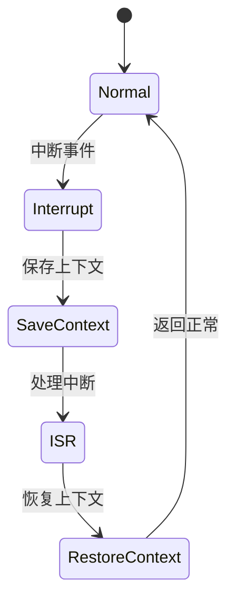

# 7.8.2.1.1 NuSMV模型检测实践

## 1. NuSMV简介

- NuSMV是一款主流的模型检测工具，支持CTL/LTL等时序逻辑的自动验证。
- 适用于有限状态机、分布式系统、协议等形式化建模与验证。

## 2. 建模流程

- **系统建模**：用SMV语言描述系统状态、转移、变量。
- **性质表达**：用CTL/LTL公式描述需验证的安全性、活性、不变式等。
- **模型检测**：运行NuSMV自动验证性质是否成立，输出验证结果与反例。

## 3. CTL/LTL验证示例

- **CTL示例**：
  - AG (state != Error)：所有路径上始终不会进入Error状态。
  - AF (state = Running)：所有路径上最终会进入Running状态。
- **LTL示例**：
  - G (request -> F response)：每次请求最终都会有响应。

## 4. 工程案例

- **Kubernetes Pod调度安全性**：建模Pod状态转移，验证“Pod不会进入未定义状态”。
- **服务网格流量治理**：建模流量路由，验证“流量不会丢失或死循环”。

## 5. 实践经验

- 复杂系统可分层建模，递归验证子系统性质。
- 反例分析有助于定位系统设计缺陷。

---
> 本文件为7.8.2.1.1 NuSMV模型检测实践的内容填充示例，后续可继续递归细化。

## 7.8.2.1.1.x 中断上下文的起点

### 1. 概念与定义

- NuSMV模型检测下的中断上下文：用SMV语言建模中断事件、上下文保存与恢复的状态转移，验证中断处理的正确性与安全性。
- 起点：模型中断事件触发，系统状态从“正常”转为“处理中断”前的转移点。

### 2. 结构化流程



### 3. 伪代码

```pseudo
on_interrupt():
    Save_Context()
    Enter_ISR()
    ISR_Handler()
    Restore_Context()
    Return_To_Normal()
```

### 4. 关键数据结构

- SMV状态变量：`state = {Normal, Interrupt, SaveContext, ISR, RestoreContext}`
- 上下文结构体：`Context = {PC, SP, Registers, Flags, ModelState}`

### 5. 形式化描述

- $Interrupt \rightarrow Save\_Context \rightarrow ISR\_Entry$
- LTL公式：`G (interrupt -> F isr_entry)`

### 6. 工程案例

- NuSMV中断上下文模型检测代码片段
- Kubernetes调度中断的SMV建模与验证

### 7. 未来展望

- 多级中断递归模型检测、复杂系统中断安全性与活性验证
