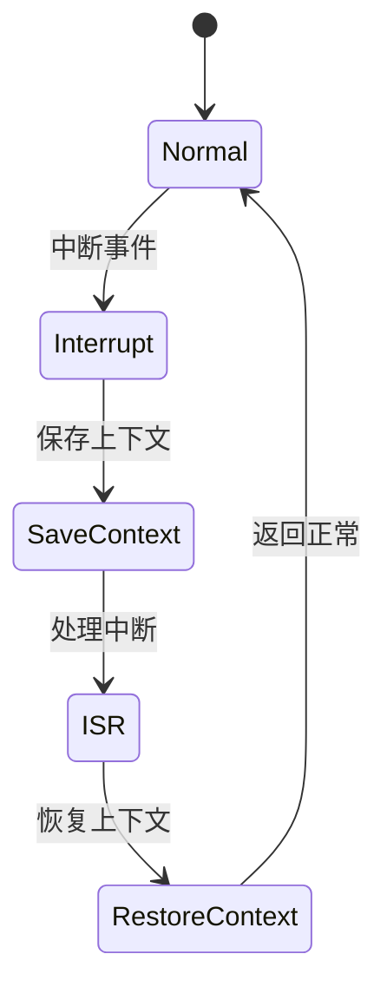

# 7.8.2.1.1.1 CTL与LTL性质表达与验证

## 1. CTL与LTL基本概念

- **CTL（计算树逻辑）**：可表达分支时序性质，适合描述多路径系统行为。
- **LTL（线性时序逻辑）**：描述系统在单一路径上的时序性质。
- **语法与语义**：如A（所有路径）、E（存在路径）、G（全局）、F（最终）、X（下一个）、U（直到）。

## 2. 性质表达

- **安全性**：如“始终不会进入错误状态”
- **活性**：如“最终一定会进入目标状态”
- **不变式**：如“某变量始终大于0”
- **可达性**：如“存在路径使得服务最终可用”

## 3. 验证方法

- **模型检测工具**：如NuSMV，输入CTL/LTL公式自动验证。
- **公式推理与自动验证**：用工具自动推导性质是否成立。

## 4. 工程实践

- **容器编排系统CTL/LTL应用**：如Kubernetes生命周期安全性验证。
- **微服务一致性与安全性验证**：如服务降级、熔断等时序逻辑表达。

---
> 本文件为7.8.2.1.1.1 CTL与LTL性质表达与验证的内容填充示例，后续可继续递归细化。

## 7.8.2.1.1.1.x 中断上下文的起点

### 1. 概念与定义

- CTL/LTL性质表达下的中断上下文：用CTL/LTL公式描述中断事件、上下文保存与恢复的时序约束，验证中断处理的安全性、活性与公平性。
- 起点：CTL/LTL公式中断事件触发，系统状态从“正常”转为“处理中断”前的逻辑起点。

### 2. 结构化流程



### 3. 伪代码

```pseudo
on_interrupt():
    Save_Context()
    Enter_ISR()
    ISR_Handler()
    Restore_Context()
    Return_To_Normal()
```

### 4. 关键数据结构

- 状态变量：`state = {Normal, Interrupt, SaveContext, ISR, RestoreContext}`
- 上下文结构体：`Context = {PC, SP, Registers, Flags, PropertyState}`

### 5. 形式化描述

- $Interrupt \rightarrow Save\_Context \rightarrow ISR\_Entry$
- LTL公式：`G (interrupt -> F isr_entry)`
- CTL公式：`AG(interrupt -> AF isr_entry)`

### 6. 工程案例

- NuSMV/Spin中断上下文CTL/LTL性质验证
- Kubernetes调度中断CTL/LTL安全性建模

### 7. 未来展望

- 多级中断CTL/LTL递归性质表达、复杂系统中断公平性与活性验证
