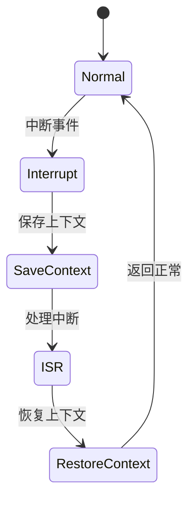

# 7.8.2.1.1.1.1 Kubernetes安全性CTL验证

## 1. 建模目标

- 验证Kubernetes集群中Pod生命周期不会进入未定义或危险状态。
- 检查调度、运行、终止等关键状态的安全性。

## 2. CTL性质公式

- AG (state != Error)：所有路径上始终不会进入Error状态。
- AG (state != Pending || AF state = Running)：若非Pending，最终会进入Running。
- AG (state = Terminated -> AX state = [*])：终止后不会再被调度。

## 3. NuSMV建模示例

```smv
MODULE main
VAR
  state : {Pending, Running, Error, Terminated};
ASSIGN
  init(state) := Pending;
  next(state) := case
    state = Pending : Running;
    state = Running & input = error : Error;
    state = Running & input = terminate : Terminated;
    state = Error : Terminated;
    TRUE : state;
  esac;
```

## 4. 验证流程

- 用NuSMV输入上述模型与CTL公式。
- 运行模型检测，分析验证结果。
- 若发现反例，定位调度或状态转移逻辑缺陷。

## 5. 工程经验

- 复杂集群可分层建模，分别验证调度、网络、存储等子系统安全性。
- CTL公式可递归细化，覆盖更多异常与边界场景。

---
> 本文件为Kubernetes安全性CTL验证的内容填充示例，后续可继续递归细化。

## 7.8.2.1.1.1.1.x 中断上下文的起点

### 1. 概念与定义

- Kubernetes安全性CTL验证下的中断上下文：用CTL公式描述K8s调度/服务中断事件、上下文保存与恢复，验证安全属性（如不可达、无死锁、权限隔离等）。
- 起点：CTL模型中断事件触发，系统状态从“正常”转为“处理中断”前的逻辑起点。

### 2. 结构化流程



### 3. 伪代码

```pseudo
on_interrupt():
    Save_Context()
    Enter_ISR()
    ISR_Handler()
    Restore_Context()
    Return_To_Normal()
```

### 4. 关键数据结构

- 状态变量：`state = {Normal, Interrupt, SaveContext, ISR, RestoreContext}`
- 上下文结构体：`Context = {PC, SP, Registers, Flags, K8sState}`

### 5. CTL公式

- 安全性：`AG(interrupt -> AF isr_entry)`
- 不可达死锁：`AG(!deadlock)`
- 权限隔离：`AG(user_request -> AX(only_allowed_access))`

### 6. 工程案例

- Kubernetes调度中断CTL安全性验证代码片段
- 多租户K8s集群中断上下文CTL建模

### 7. 未来展望

- 多级中断安全性递归验证、复杂K8s场景下的上下文隔离与自动化安全分析
