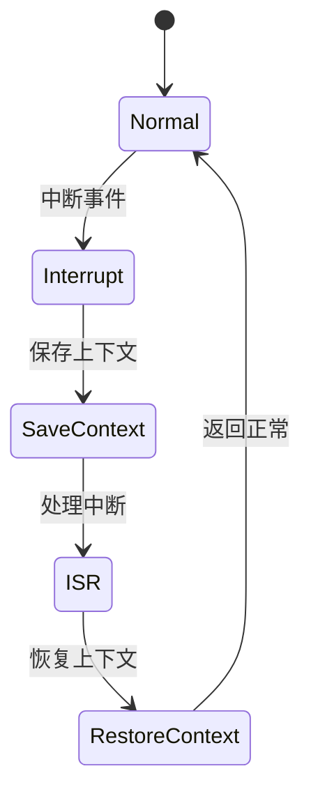

# 7.8.2.1.1.1.10 租户动态优先级熔断LTL验证

<!-- TOC START -->

- [7.8.2.1.1.1.10 租户动态优先级熔断LTL验证](#78211110-租户动态优先级熔断ltl验证)
  - [1. 建模目标](#1-建模目标)
  - [2. LTL性质公式](#2-ltl性质公式)
  - [3. 模型描述（伪代码）](#3-模型描述伪代码)
  - [4. 验证流程](#4-验证流程)
  - [5. 工程经验](#5-工程经验)
  - [7.8.2.1.1.1.10.x 中断上下文的起点](#78211110x-中断上下文的起点)
    - [1. 概念与定义](#1-概念与定义)
    - [2. 结构化流程](#2-结构化流程)
    - [3. 伪代码](#3-伪代码)
    - [4. 关键数据结构](#4-关键数据结构)
    - [5. LTL公式](#5-ltl公式)
    - [6. 工程案例](#6-工程案例)
    - [7. 未来展望](#7-未来展望)

<!-- TOC END -->

## 1. 建模目标

- 验证多租户系统中，租户的熔断优先级可动态调整，高优先级租户在异常时优先保护，优先级变化能实时生效。
- 检查动态优先级调整、熔断、恢复的时序正确性。

## 2. LTL性质公式

- G (priority[i] > priority[j] & error[i] -> F circuit_open[i])：高优先级租户i异常时，最终会打开其熔断。
- G (priority[i] < priority[j] & error[i] & !circuit_open[j] -> F circuit_open[i])：低优先级租户异常且高优先级未熔断时，低优先级可熔断。
- G (priority[i] > priority[j] & circuit_open[i] -> G !circuit_open[j])：高优先级熔断期间，低优先级熔断器保持关闭。
- G (priority[i]变化 -> F (熔断/恢复行为随新优先级生效))：优先级变化后，熔断/恢复行为按新优先级执行。

## 3. 模型描述（伪代码）

```smv
MODULE main
VAR
  tenant_state : array 1..N of {Normal, Error, Recover};
  circuit_open : array 1..N of boolean;
  priority : array 1..N of 1..M; -- M为优先级等级，数值越大优先级越高
ASSIGN
  init(tenant_state[i]) := Normal;
  init(circuit_open[i]) := FALSE;
  init(priority[i]) := 1;
  next(tenant_state[i]) := case
    tenant_state[i] = Normal & input[i] = error : Error;
    tenant_state[i] = Error & input[i] = recover : Recover;
    tenant_state[i] = Recover : Normal;
    TRUE : tenant_state[i];
  esac;
  next(priority[i]) := case
    input[i] = priority_up : min(priority[i]+1, M);
    input[i] = priority_down : max(priority[i]-1, 1);
    TRUE : priority[i];
  esac;
  next(circuit_open[i]) := case
    tenant_state[i] = Error & forall(j in 1..N) (priority[i] >= priority[j] | !circuit_open[j]) : TRUE;
    tenant_state[i] = Recover : FALSE;
    TRUE : circuit_open[i];
  esac;
```

## 4. 验证流程

- 用NuSMV输入上述模型与LTL公式。
- 运行模型检测，分析动态优先级调整下的熔断与恢复时序。
- 发现反例时，优化优先级调整与熔断联动逻辑。

## 5. 工程经验

- 动态优先级适合多租户SLA保障、弹性资源分配等场景。
- LTL可递归细化，覆盖优先级变化、并发调整等复杂时序。

---
> 本文件为租户动态优先级熔断LTL验证的内容填充示例，后续可继续递归细化。

## 7.8.2.1.1.1.10.x 中断上下文的起点

### 1. 概念与定义

- 租户动态优先级熔断LTL验证下的中断上下文：用LTL公式描述多租户动态优先级熔断场景下的中断事件、上下文保存与恢复，验证动态优先级熔断过程的活性与安全性。
- 起点：LTL模型中断事件触发，系统状态从“正常”转为“处理中断”前的逻辑起点。

### 2. 结构化流程



### 3. 伪代码

```pseudo
on_interrupt():
    Save_Context()
    Enter_ISR()
    ISR_Handler()
    Restore_Context()
    Return_To_Normal()
```

### 4. 关键数据结构

- 状态变量：`state = {Normal, Interrupt, SaveContext, ISR, RestoreContext}`
- 上下文结构体：`Context = {PC, SP, Registers, Flags, TenantPriorityState}`

### 5. LTL公式

- 活性：`G (interrupt -> F isr_entry)`
- 动态优先级熔断响应性：`G (priority_break -> F priority_recover)`
- 无死锁：`G (!deadlock)`

### 6. 工程案例

- 租户动态优先级熔断场景LTL模型与验证代码片段
- 微服务多租户动态优先级熔断中断上下文LTL建模

### 7. 未来展望

- 多级动态优先级熔断与中断递归LTL验证、复杂多租户优先级场景下的上下文活性与安全性分析
