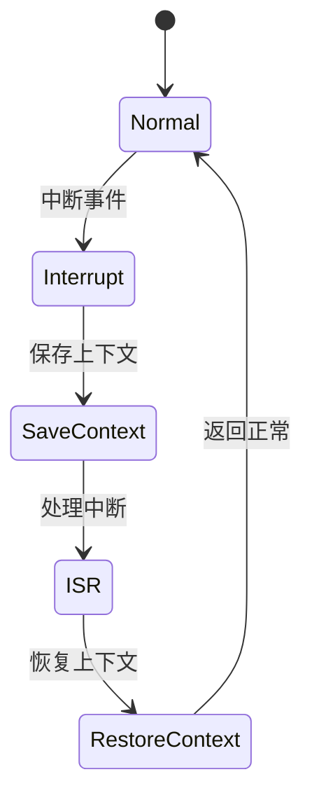

# 7.8.2.1.1.1.12 租户自适应熔断策略验证

<!-- TOC START -->

- [7.8.2.1.1.1.12 租户自适应熔断策略验证](#78211112-租户自适应熔断策略验证)
  - [1. 建模目标](#1-建模目标)
  - [2. LTL性质公式](#2-ltl性质公式)
  - [3. 模型描述（伪代码）](#3-模型描述伪代码)
  - [4. 验证流程](#4-验证流程)
  - [5. 工程经验](#5-工程经验)
  - [7.8.2.1.1.1.12.x 中断上下文的起点](#78211112x-中断上下文的起点)
    - [1. 概念与定义](#1-概念与定义)
    - [2. 结构化流程](#2-结构化流程)
    - [3. 伪代码](#3-伪代码)
    - [4. 关键数据结构](#4-关键数据结构)
    - [5. LTL/CTL公式](#5-ltlctl公式)
    - [6. 工程案例](#6-工程案例)
    - [7. 未来展望](#7-未来展望)

<!-- TOC END -->

## 1. 建模目标

- 验证多租户系统中，熔断策略可根据租户负载、历史故障、SLA等动态自适应调整，提升系统弹性与服务质量。
- 检查自适应策略调整、熔断、恢复的时序正确性。

## 2. LTL性质公式

- G (load[i] > threshold[i] -> F circuit_open[i])：租户i负载超阈值时，最终会打开其熔断。
- G (history_error[i] > k -> F circuit_open[i])：租户i历史故障次数超限时，最终会打开其熔断。
- G (sla[i] < min_sla -> F circuit_open[i])：租户i SLA低于最小保障时，最终会打开其熔断。
- G (circuit_open[i] & adaptive_policy[i]调整 -> F (circuit_open[i]随策略变化))：自适应策略调整后，熔断行为随之变化。

## 3. 模型描述（伪代码）

```smv
MODULE main
VAR
  tenant_state : array 1..N of {Normal, Error, Recover};
  circuit_open : array 1..N of boolean;
  load : array 1..N of 0..100;
  threshold : array 1..N of 0..100;
  history_error : array 1..N of 0..K;
  sla : array 1..N of 0..100;
  min_sla : 0..100;
  adaptive_policy : array 1..N of {Aggressive, Conservative, Balanced};
ASSIGN
  init(tenant_state[i]) := Normal;
  init(circuit_open[i]) := FALSE;
  init(load[i]) := 0;
  init(threshold[i]) := 80;
  init(history_error[i]) := 0;
  init(sla[i]) := 100;
  init(min_sla) := 90;
  init(adaptive_policy[i]) := Balanced;
  next(tenant_state[i]) := case
    tenant_state[i] = Normal & input[i] = error : Error;
    tenant_state[i] = Error & input[i] = recover : Recover;
    tenant_state[i] = Recover : Normal;
    TRUE : tenant_state[i];
  esac;
  next(load[i]) := ...; -- 省略负载变化逻辑
  next(threshold[i]) := case
    adaptive_policy[i] = Aggressive : 60;
    adaptive_policy[i] = Conservative : 90;
    adaptive_policy[i] = Balanced : 80;
    TRUE : threshold[i];
  esac;
  next(history_error[i]) := ...; -- 省略历史故障计数逻辑
  next(sla[i]) := ...; -- 省略SLA变化逻辑
  next(adaptive_policy[i]) := case
    input[i] = policy_aggressive : Aggressive;
    input[i] = policy_conservative : Conservative;
    input[i] = policy_balanced : Balanced;
    TRUE : adaptive_policy[i];
  esac;
  next(circuit_open[i]) := case
    load[i] > threshold[i] : TRUE;
    history_error[i] > k : TRUE;
    sla[i] < min_sla : TRUE;
    tenant_state[i] = Recover : FALSE;
    TRUE : circuit_open[i];
  esac;
```

## 4. 验证流程

- 用NuSMV输入上述模型与LTL公式。
- 运行模型检测，分析自适应策略调整下的熔断与恢复时序。
- 发现反例时，优化自适应策略与熔断联动逻辑。

## 5. 工程经验

- 自适应熔断策略适合多租户弹性保障、动态负载均衡等场景。
- LTL可递归细化，覆盖策略切换、负载波动等复杂时序。

---
> 本文件为租户自适应熔断策略验证的内容填充示例，后续可继续递归细化。

## 7.8.2.1.1.1.12.x 中断上下文的起点

### 1. 概念与定义

- 租户自适应熔断策略验证下的中断上下文：用LTL/CTL公式描述多租户自适应熔断场景下的中断事件、上下文保存与恢复，验证自适应熔断过程的活性与安全性。
- 起点：模型中断事件触发，系统状态从“正常”转为“处理中断”前的逻辑起点。

### 2. 结构化流程



### 3. 伪代码

```pseudo
on_interrupt():
    Save_Context()
    Enter_ISR()
    ISR_Handler()
    Restore_Context()
    Return_To_Normal()
```

### 4. 关键数据结构

- 状态变量：`state = {Normal, Interrupt, SaveContext, ISR, RestoreContext}`
- 上下文结构体：`Context = {PC, SP, Registers, Flags, TenantAdaptiveState}`

### 5. LTL/CTL公式

- 活性：`G (interrupt -> F isr_entry)`
- 自适应熔断响应性：`G (adaptive_break -> F adaptive_recover)`
- 无死锁：`G (!deadlock)`
- CTL安全性：`AG(interrupt -> AF isr_entry)`

### 6. 工程案例

- 租户自适应熔断场景LTL/CTL模型与验证代码片段
- 微服务多租户自适应熔断中断上下文LTL/CTL建模

### 7. 未来展望

- 多级自适应熔断与中断递归LTL/CTL验证、复杂自适应场景下的上下文活性与安全性分析
