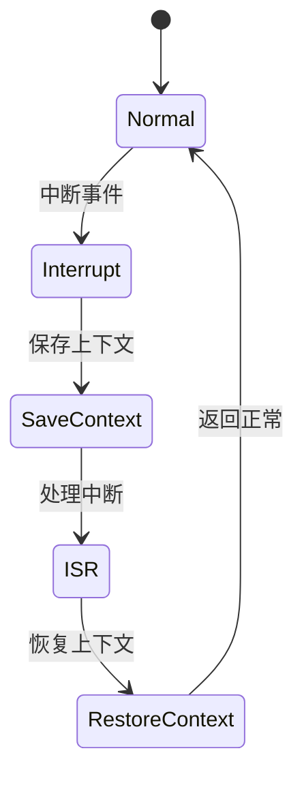

# 7.8.2.1.1.1.15 策略切换与优先级联动验证

## 1. 建模目标

- 验证分布式系统中多级熔断器在策略切换（如Aggressive、Conservative、Balanced）与优先级调整（高/低优先级）联动时，熔断与恢复行为能按新策略和优先级及时生效，避免联动异常。
- 检查策略切换、优先级调整、熔断、恢复的时序正确性。

## 2. LTL性质公式

- G (adaptive_policy变化 & priority[i] > priority[j] -> F (circuit_open[i]优先于circuit_open[j]))：策略切换和高优先级异常时，高优先级熔断优先触发。
- G (adaptive_policy = Aggressive & priority[i] > priority[j] -> G (threshold[i] < threshold[j]))：Aggressive策略下高优先级阈值更低。
- G (priority[i]变化 -> F (熔断/恢复行为随新优先级生效))：优先级变化后，熔断/恢复行为按新优先级执行。
- G (策略切换与优先级调整并发时，行为无死锁/竞态)：并发切换下系统行为正确。

## 3. 模型描述（伪代码）

```smv
MODULE main
VAR
  tenant_state : array 1..N of {Normal, Error, Recover};
  circuit_open : array 1..N of boolean;
  threshold : array 1..N of 0..100;
  priority : array 1..N of 1..M;
  adaptive_policy : {Aggressive, Conservative, Balanced};
ASSIGN
  init(tenant_state[i]) := Normal;
  init(circuit_open[i]) := FALSE;
  init(threshold[i]) := 80;
  init(priority[i]) := 1;
  init(adaptive_policy) := Balanced;
  next(tenant_state[i]) := case
    tenant_state[i] = Normal & input[i] = error : Error;
    tenant_state[i] = Error & input[i] = recover : Recover;
    tenant_state[i] = Recover : Normal;
    TRUE : tenant_state[i];
  esac;
  next(priority[i]) := case
    input[i] = priority_up : min(priority[i]+1, M);
    input[i] = priority_down : max(priority[i]-1, 1);
    TRUE : priority[i];
  esac;
  next(adaptive_policy) := case
    input = policy_aggressive : Aggressive;
    input = policy_conservative : Conservative;
    input = policy_balanced : Balanced;
    TRUE : adaptive_policy;
  esac;
  next(threshold[i]) := case
    adaptive_policy = Aggressive & priority[i] = M : 60;
    adaptive_policy = Aggressive : 70;
    adaptive_policy = Conservative & priority[i] = M : 90;
    adaptive_policy = Conservative : 95;
    adaptive_policy = Balanced : 80;
    TRUE : threshold[i];
  esac;
  next(circuit_open[i]) := case
    tenant_state[i] = Error & forall(j in 1..N) (priority[i] >= priority[j] | !circuit_open[j]) : TRUE;
    tenant_state[i] = Recover : FALSE;
    TRUE : circuit_open[i];
  esac;
```

## 4. 验证流程

- 用NuSMV输入上述模型与LTL公式。
- 运行模型检测，分析策略切换与优先级联动下的熔断与恢复时序。
- 发现反例时，优化策略与优先级联动逻辑。

## 5. 工程经验

- 策略切换与优先级联动适合多租户SLA保障、弹性资源分配等场景。
- LTL可递归细化，覆盖策略/优先级并发切换、联动等复杂时序。

---
> 本文件为策略切换与优先级联动验证的内容填充示例，后续可继续递归细化。

## 7.8.2.1.1.1.15.x 中断上下文的起点

### 1. 概念与定义

- 策略切换与优先级联动验证下的中断上下文：用LTL/CTL公式描述策略切换与优先级联动场景下的中断事件、上下文保存与恢复，验证策略与优先级联动过程的活性与安全性。
- 起点：模型中断事件触发，系统状态从“正常”转为“处理中断”前的逻辑起点。

### 2. 结构化流程



### 3. 伪代码

```pseudo
on_interrupt():
    Save_Context()
    Enter_ISR()
    ISR_Handler()
    Restore_Context()
    Return_To_Normal()
```

### 4. 关键数据结构

- 状态变量：`state = {Normal, Interrupt, SaveContext, ISR, RestoreContext}`
- 上下文结构体：`Context = {PC, SP, Registers, Flags, PolicyPriorityState}`

### 5. LTL/CTL公式

- 活性：`G (interrupt -> F isr_entry)`
- 策略切换与优先级联动响应性：`G (policy_priority_switch -> F policy_priority_stable)`
- 无死锁：`G (!deadlock)`
- CTL安全性：`AG(interrupt -> AF isr_entry)`

### 6. 工程案例

- 策略切换与优先级联动场景LTL/CTL模型与验证代码片段
- 微服务策略切换与优先级联动中断上下文LTL/CTL建模

### 7. 未来展望

- 多级递归策略优先级联动与中断LTL/CTL验证、复杂联动场景下的上下文活性与安全性分析
