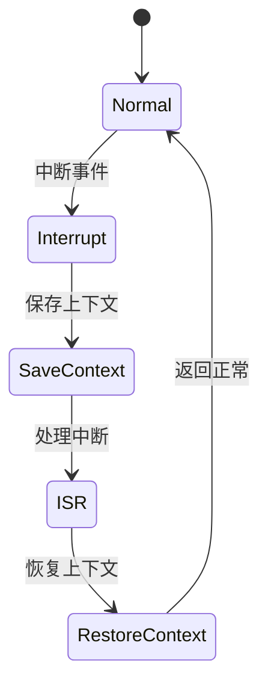

# 7.8.2.1.1.1.16 多级策略并发切换验证


<!-- TOC START -->

- [7.8.2.1.1.1.16 多级策略并发切换验证](#78211116-多级策略并发切换验证)
  - [1. 建模目标](#1-建模目标)
  - [2. LTL性质公式](#2-ltl性质公式)
  - [3. 模型描述（伪代码）](#3-模型描述伪代码)
  - [4. 验证流程](#4-验证流程)
  - [5. 工程经验](#5-工程经验)
  - [7.8.2.1.1.1.16.x 中断上下文的起点](#78211116x-中断上下文的起点)
    - [1. 概念与定义](#1-概念与定义)
    - [2. 结构化流程](#2-结构化流程)
    - [3. 伪代码](#3-伪代码)
    - [4. 关键数据结构](#4-关键数据结构)
    - [5. LTL/CTL公式](#5-ltlctl公式)
    - [6. 工程案例](#6-工程案例)
    - [7. 未来展望](#7-未来展望)

<!-- TOC END -->

## 1. 建模目标

- 验证分布式系统中服务、集群、全局等多级熔断器在自适应策略并发切换（如Aggressive、Conservative、Balanced）时，熔断与恢复行为能正确响应并发切换，避免竞态、死锁或不一致。
- 检查多级策略并发切换、熔断、恢复的时序正确性。

## 2. LTL性质公式

- G (并发切换(adaptive_policy_service, adaptive_policy_cluster) -> F (service_threshold/cluster_threshold随各自新策略生效))：并发切换后，各级阈值及时独立更新。
- G (并发切换后，熔断/恢复行为无死锁/竞态)：并发切换下系统行为正确。
- G (service_policy变化 & cluster_policy不变 -> F (仅service_threshold变化))：单级切换不影响其他级别。
- G (所有级别策略切换后，最终系统进入一致状态)：多级切换后系统无不一致。

## 3. 模型描述（伪代码）

```smv
MODULE main
VAR
  service_state : {Normal, Error, Recover};
  cluster_state : {Healthy, Error, Recover};
  service_circuit_open : boolean;
  cluster_circuit_open : boolean;
  service_load : 0..100;
  cluster_load : 0..100;
  service_threshold : 0..100;
  cluster_threshold : 0..100;
  adaptive_policy_service : {Aggressive, Conservative, Balanced};
  adaptive_policy_cluster : {Aggressive, Conservative, Balanced};
ASSIGN
  init(service_state) := Normal;
  init(cluster_state) := Healthy;
  init(service_circuit_open) := FALSE;
  init(cluster_circuit_open) := FALSE;
  init(service_load) := 0;
  init(cluster_load) := 0;
  init(service_threshold) := 80;
  init(cluster_threshold) := 85;
  init(adaptive_policy_service) := Balanced;
  init(adaptive_policy_cluster) := Balanced;
  next(service_state) := case
    service_state = Normal & input = error : Error;
    service_state = Error & input = recover : Recover;
    service_state = Recover : Normal;
    TRUE : service_state;
  esac;
  next(cluster_state) := case
    cluster_state = Healthy & (input = cluster_error | (service_circuit_open & escalate_policy)) : Error;
    cluster_state = Error & input = cluster_recover : Recover;
    cluster_state = Recover : Healthy;
    TRUE : cluster_state;
  esac;
  next(service_threshold) := case
    adaptive_policy_service = Aggressive : 60;
    adaptive_policy_service = Conservative : 90;
    adaptive_policy_service = Balanced : 80;
    TRUE : service_threshold;
  esac;
  next(cluster_threshold) := case
    adaptive_policy_cluster = Aggressive : 70;
    adaptive_policy_cluster = Conservative : 95;
    adaptive_policy_cluster = Balanced : 85;
    TRUE : cluster_threshold;
  esac;
  next(service_circuit_open) := case
    service_load > service_threshold : TRUE;
    service_state = Recover : FALSE;
    TRUE : service_circuit_open;
  esac;
  next(cluster_circuit_open) := case
    cluster_load > cluster_threshold : TRUE;
    cluster_state = Recover : FALSE;
    TRUE : cluster_circuit_open;
  esac;
  next(adaptive_policy_service) := case
    input = policy_service_aggressive : Aggressive;
    input = policy_service_conservative : Conservative;
    input = policy_service_balanced : Balanced;
    TRUE : adaptive_policy_service;
  esac;
  next(adaptive_policy_cluster) := case
    input = policy_cluster_aggressive : Aggressive;
    input = policy_cluster_conservative : Conservative;
    input = policy_cluster_balanced : Balanced;
    TRUE : adaptive_policy_cluster;
  esac;
```

## 4. 验证流程

- 用NuSMV输入上述模型与LTL公式。
- 运行模型检测，分析多级策略并发切换下的熔断与恢复时序。
- 发现反例时，优化并发切换与熔断联动逻辑。

## 5. 工程经验

- 多级策略并发切换适合动态负载、弹性保障等场景，需确保切换后行为及时独立生效。
- LTL可递归细化，覆盖多级并发切换、联动等复杂时序。

---
> 本文件为多级策略并发切换验证的内容填充示例，后续可继续递归细化。

## 7.8.2.1.1.1.16.x 中断上下文的起点

### 1. 概念与定义

- 多级策略并发切换验证下的中断上下文：用LTL/CTL公式描述多级策略并发切换场景下的中断事件、上下文保存与恢复，验证并发切换过程的活性与安全性。
- 起点：模型中断事件触发，系统状态从“正常”转为“处理中断”前的逻辑起点。

### 2. 结构化流程



### 3. 伪代码

```pseudo
on_interrupt():
    Save_Context()
    Enter_ISR()
    ISR_Handler()
    Restore_Context()
    Return_To_Normal()
```

### 4. 关键数据结构

- 状态变量：`state = {Normal, Interrupt, SaveContext, ISR, RestoreContext}`
- 上下文结构体：`Context = {PC, SP, Registers, Flags, MultiPolicyConcurrentState}`

### 5. LTL/CTL公式

- 活性：`G (interrupt -> F isr_entry)`
- 多级策略并发切换响应性：`G (concurrent_policy_switch -> F concurrent_policy_stable)`
- 无死锁：`G (!deadlock)`
- CTL安全性：`AG(interrupt -> AF isr_entry)`

### 6. 工程案例

- 多级策略并发切换场景LTL/CTL模型与验证代码片段
- 微服务多级策略并发切换中断上下文LTL/CTL建模

### 7. 未来展望

- 多级递归并发策略切换与中断LTL/CTL验证、复杂并发切换场景下的上下文活性与安全性分析
