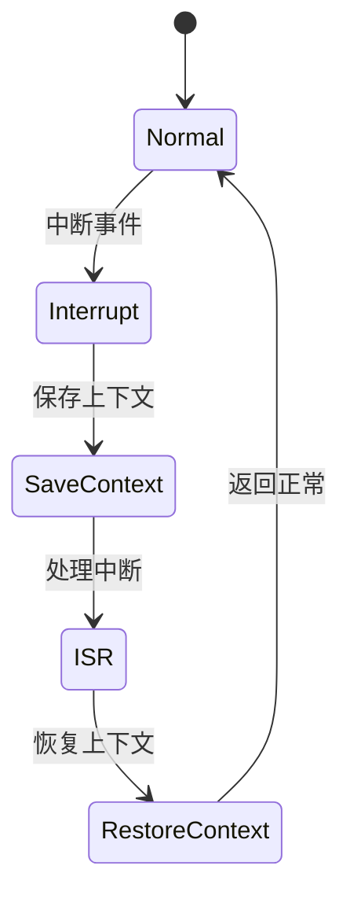

# 7.8.2.1.1.1.18 多级自适应策略优先级联动验证

## 1. 建模目标

- 验证分布式系统中服务、集群、全局等多级熔断器的自适应策略（如Aggressive、Conservative、Balanced）与优先级调整（高/低优先级）联动时，熔断与恢复行为能按多级自适应策略和优先级及时生效，优先级高的策略优先生效。
- 检查多级自适应策略、优先级调整、熔断、恢复的时序正确性。

## 2. LTL性质公式

- G (adaptive_policy变化 & priority[i] > priority[j] -> F (threshold[i]优先于threshold[j]调整))：高优先级自适应策略调整优先生效。
- G (adaptive_policy = Aggressive & priority[i] = max -> G (threshold[i]为全局最低))：全局最高优先级Aggressive策略下阈值最低。
- G (priority[i]变化 -> F (熔断/恢复行为随新优先级和策略生效))：优先级变化后，熔断/恢复行为按新优先级和策略执行。
- G (多级自适应策略与优先级并发调整时，行为无死锁/竞态)：并发调整下系统行为正确。

## 3. 模型描述（伪代码）

```smv
MODULE main
VAR
  tenant_state : array 1..N of {Normal, Error, Recover};
  circuit_open : array 1..N of boolean;
  threshold : array 1..N of 0..100;
  priority : array 1..N of 1..M;
  adaptive_policy : array 1..N of {Aggressive, Conservative, Balanced};
ASSIGN
  init(tenant_state[i]) := Normal;
  init(circuit_open[i]) := FALSE;
  init(threshold[i]) := 80;
  init(priority[i]) := 1;
  init(adaptive_policy[i]) := Balanced;
  next(tenant_state[i]) := case
    tenant_state[i] = Normal & input[i] = error : Error;
    tenant_state[i] = Error & input[i] = recover : Recover;
    tenant_state[i] = Recover : Normal;
    TRUE : tenant_state[i];
  esac;
  next(priority[i]) := case
    input[i] = priority_up : min(priority[i]+1, M);
    input[i] = priority_down : max(priority[i]-1, 1);
    TRUE : priority[i];
  esac;
  next(adaptive_policy[i]) := case
    input[i] = policy_aggressive : Aggressive;
    input[i] = policy_conservative : Conservative;
    input[i] = policy_balanced : Balanced;
    TRUE : adaptive_policy[i];
  esac;
  next(threshold[i]) := case
    adaptive_policy[i] = Aggressive & priority[i] = M : 60;
    adaptive_policy[i] = Aggressive : 70;
    adaptive_policy[i] = Conservative & priority[i] = M : 90;
    adaptive_policy[i] = Conservative : 95;
    adaptive_policy[i] = Balanced : 80;
    TRUE : threshold[i];
  esac;
  next(circuit_open[i]) := case
    tenant_state[i] = Error & forall(j in 1..N) (priority[i] >= priority[j] | !circuit_open[j]) : TRUE;
    tenant_state[i] = Recover : FALSE;
    TRUE : circuit_open[i];
  esac;
```

## 4. 验证流程

- 用NuSMV输入上述模型与LTL公式。
- 运行模型检测，分析多级自适应策略与优先级联动下的熔断与恢复时序。
- 发现反例时，优化策略与优先级联动逻辑。

## 5. 工程经验

- 多级自适应策略与优先级联动适合多租户SLA保障、弹性资源分配等场景。
- LTL可递归细化，覆盖多级/优先级并发调整、联动等复杂时序。

---
> 本文件为多级自适应策略优先级联动验证的内容填充示例，后续可继续递归细化。

## 7.8.2.1.1.1.18.x 中断上下文的起点

### 1. 概念与定义

- 多级自适应策略优先级联动验证下的中断上下文：用LTL/CTL公式描述多级自适应策略与优先级联动场景下的中断事件、上下文保存与恢复，验证联动过程的活性与安全性。
- 起点：模型中断事件触发，系统状态从“正常”转为“处理中断”前的逻辑起点。

### 2. 结构化流程



### 3. 伪代码

```pseudo
on_interrupt():
    Save_Context()
    Enter_ISR()
    ISR_Handler()
    Restore_Context()
    Return_To_Normal()
```

### 4. 关键数据结构

- 状态变量：`state = {Normal, Interrupt, SaveContext, ISR, RestoreContext}`
- 上下文结构体：`Context = {PC, SP, Registers, Flags, AdaptivePriorityState}`

### 5. LTL/CTL公式

- 活性：`G (interrupt -> F isr_entry)`
- 联动响应性：`G (adaptive_priority_switch -> F adaptive_priority_stable)`
- 无死锁：`G (!deadlock)`
- CTL安全性：`AG(interrupt -> AF isr_entry)`

### 6. 工程案例

- 多级自适应策略优先级联动场景LTL/CTL模型与验证代码片段
- 微服务多级自适应策略优先级联动中断上下文LTL/CTL建模

### 7. 未来展望

- 多级递归自适应优先级联动与中断LTL/CTL验证、复杂联动场景下的上下文活性与安全性分析
