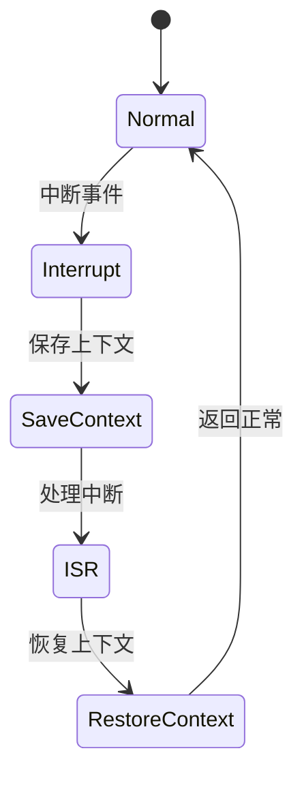

# 7.8.2.1.1.1.19 多级自适应策略与租户自适应联动验证

<!-- TOC START -->

- [7.8.2.1.1.1.19 多级自适应策略与租户自适应联动验证](#78211119-多级自适应策略与租户自适应联动验证)
  - [1. 建模目标](#1-建模目标)
  - [2. LTL性质公式](#2-ltl性质公式)
  - [3. 模型描述（伪代码）](#3-模型描述伪代码)
  - [4. 验证流程](#4-验证流程)
  - [5. 工程经验](#5-工程经验)
  - [7.8.2.1.1.1.19.x 中断上下文的起点](#78211119x-中断上下文的起点)
    - [1. 概念与定义](#1-概念与定义)
    - [2. 结构化流程](#2-结构化流程)
    - [3. 伪代码](#3-伪代码)
    - [4. 关键数据结构](#4-关键数据结构)
    - [5. LTL/CTL公式](#5-ltlctl公式)
    - [6. 工程案例](#6-工程案例)
    - [7. 未来展望](#7-未来展望)

<!-- TOC END -->

## 1. 建模目标

- 验证分布式系统中服务、集群、全局等多级熔断器的自适应策略（如Aggressive、Conservative、Balanced）与租户自适应策略（如负载、SLA、历史故障）联动时，熔断与恢复行为能按多级和租户自适应策略及时生效，提升系统弹性与服务质量。
- 检查多级自适应策略、租户自适应调整、熔断、恢复的时序正确性。

## 2. LTL性质公式

- G (adaptive_policy变化 & adaptive_policy_tenant[i]变化 -> F (threshold[i]随多级和租户策略生效))：多级与租户策略切换后，阈值及时更新。
- G (租户自适应策略调整 -> F (熔断/恢复行为随新策略生效))：租户自适应策略调整后，熔断/恢复行为按新策略执行。
- G (多级自适应策略切换 & SLA[i] < min_sla -> F circuit_open[i])：多级策略切换后，若租户SLA低于保障，及时熔断。
- G (多级与租户自适应策略并发调整时，行为无死锁/竞态)：并发调整下系统行为正确。

## 3. 模型描述（伪代码）

```smv
MODULE main
VAR
  tenant_state : array 1..N of {Normal, Error, Recover};
  circuit_open : array 1..N of boolean;
  threshold : array 1..N of 0..100;
  adaptive_policy : {Aggressive, Conservative, Balanced};
  adaptive_policy_tenant : array 1..N of {Aggressive, Conservative, Balanced};
  sla : array 1..N of 0..100;
  min_sla : 0..100;
ASSIGN
  init(tenant_state[i]) := Normal;
  init(circuit_open[i]) := FALSE;
  init(threshold[i]) := 80;
  init(adaptive_policy) := Balanced;
  init(adaptive_policy_tenant[i]) := Balanced;
  init(sla[i]) := 100;
  init(min_sla) := 90;
  next(tenant_state[i]) := case
    tenant_state[i] = Normal & input[i] = error : Error;
    tenant_state[i] = Error & input[i] = recover : Recover;
    tenant_state[i] = Recover : Normal;
    TRUE : tenant_state[i];
  esac;
  next(adaptive_policy) := case
    input = policy_aggressive : Aggressive;
    input = policy_conservative : Conservative;
    input = policy_balanced : Balanced;
    TRUE : adaptive_policy;
  esac;
  next(adaptive_policy_tenant[i]) := case
    input[i] = policy_tenant_aggressive : Aggressive;
    input[i] = policy_tenant_conservative : Conservative;
    input[i] = policy_tenant_balanced : Balanced;
    TRUE : adaptive_policy_tenant[i];
  esac;
  next(threshold[i]) := case
    adaptive_policy = Aggressive | adaptive_policy_tenant[i] = Aggressive : 60;
    adaptive_policy = Conservative | adaptive_policy_tenant[i] = Conservative : 90;
    adaptive_policy = Balanced & adaptive_policy_tenant[i] = Balanced : 80;
    TRUE : threshold[i];
  esac;
  next(sla[i]) := ...; -- 省略SLA变化逻辑
  next(circuit_open[i]) := case
    sla[i] < min_sla : TRUE;
    tenant_state[i] = Recover : FALSE;
    TRUE : circuit_open[i];
  esac;
```

## 4. 验证流程

- 用NuSMV输入上述模型与LTL公式。
- 运行模型检测，分析多级自适应策略与租户自适应联动下的熔断与恢复时序。
- 发现反例时，优化策略与自适应联动逻辑。

## 5. 工程经验

- 多级与租户自适应联动适合多租户弹性保障、动态负载均衡等场景。
- LTL可递归细化，覆盖多级/租户策略并发切换、联动等复杂时序。

---
> 本文件为多级自适应策略与租户自适应联动验证的内容填充示例，后续可继续递归细化。

## 7.8.2.1.1.1.19.x 中断上下文的起点

### 1. 概念与定义

- 多级自适应策略与租户自适应联动验证下的中断上下文：用LTL/CTL公式描述多级自适应策略与租户自适应联动场景下的中断事件、上下文保存与恢复，验证联动过程的活性与安全性。
- 起点：模型中断事件触发，系统状态从“正常”转为“处理中断”前的逻辑起点。

### 2. 结构化流程



### 3. 伪代码

```pseudo
on_interrupt():
    Save_Context()
    Enter_ISR()
    ISR_Handler()
    Restore_Context()
    Return_To_Normal()
```

### 4. 关键数据结构

- 状态变量：`state = {Normal, Interrupt, SaveContext, ISR, RestoreContext}`
- 上下文结构体：`Context = {PC, SP, Registers, Flags, MultiAdaptiveTenantState}`

### 5. LTL/CTL公式

- 活性：`G (interrupt -> F isr_entry)`
- 联动响应性：`G (adaptive_tenant_switch -> F adaptive_tenant_stable)`
- 无死锁：`G (!deadlock)`
- CTL安全性：`AG(interrupt -> AF isr_entry)`

### 6. 工程案例

- 多级自适应策略与租户自适应联动场景LTL/CTL模型与验证代码片段
- 微服务多级自适应策略与租户自适应联动中断上下文LTL/CTL建模

### 7. 未来展望

- 多级递归自适应租户联动与中断LTL/CTL验证、复杂联动场景下的上下文活性与安全性分析
