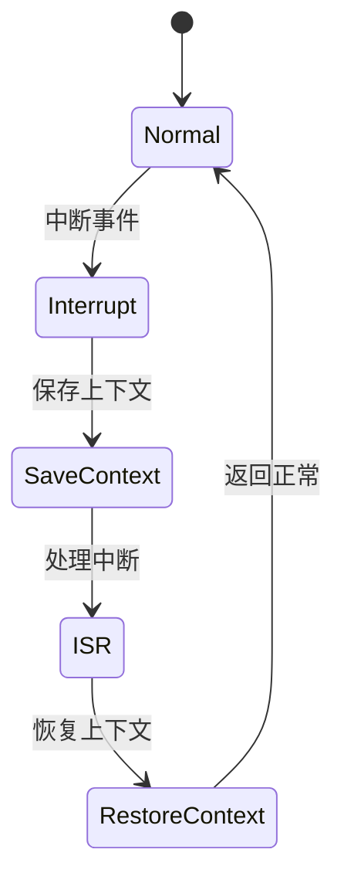

# 7.8.2.1.1.1.2 服务降级LTL验证


<!-- TOC START -->

- [7.8.2.1.1.1.2 服务降级LTL验证](#7821112-服务降级ltl验证)
  - [1. 建模目标](#1-建模目标)
  - [2. LTL性质公式](#2-ltl性质公式)
  - [3. 模型描述（伪代码）](#3-模型描述伪代码)
  - [4. 验证流程](#4-验证流程)
  - [5. 工程经验](#5-工程经验)
  - [7.8.2.1.1.1.2.x 中断上下文的起点](#7821112x-中断上下文的起点)
    - [1. 概念与定义](#1-概念与定义)
    - [2. 结构化流程](#2-结构化流程)
    - [3. 伪代码](#3-伪代码)
    - [4. 关键数据结构](#4-关键数据结构)
    - [5. LTL公式](#5-ltl公式)
    - [6. 工程案例](#6-工程案例)
    - [7. 未来展望](#7-未来展望)

<!-- TOC END -->

## 1. 建模目标

- 验证微服务系统在主服务异常时，降级服务能及时响应，保证系统可用性。
- 检查降级、恢复、熔断等流程的时序正确性。

## 2. LTL性质公式

- G (main_error -> F degrade_active)：主服务异常时，最终会激活降级服务。
- G (degrade_active -> F (main_recover & !degrade_active))：降级后主服务恢复，降级服务最终关闭。
- G (F degrade_active -> F main_recover)：只要发生降级，最终主服务会恢复。

## 3. 模型描述（伪代码）

```smv
MODULE main
VAR
  main_state : {Normal, Error, Recover};
  degrade_active : boolean;
ASSIGN
  init(main_state) := Normal;
  init(degrade_active) := FALSE;
  next(main_state) := case
    main_state = Normal & input = error : Error;
    main_state = Error & input = recover : Recover;
    main_state = Recover : Normal;
    TRUE : main_state;
  esac;
  next(degrade_active) := case
    main_state = Error : TRUE;
    main_state = Recover : FALSE;
    TRUE : degrade_active;
  esac;
```

## 4. 验证流程

- 用NuSMV输入上述模型与LTL公式。
- 运行模型检测，分析降级与恢复的时序正确性。
- 发现反例时，优化降级/恢复逻辑。

## 5. 工程经验

- LTL适合描述服务降级、恢复等时序约束。
- 可结合实际业务场景递归细化降级策略。

---
> 本文件为服务降级LTL验证的内容填充示例，后续可继续递归细化。

## 7.8.2.1.1.1.2.x 中断上下文的起点

### 1. 概念与定义

- 服务降级LTL验证下的中断上下文：用LTL公式描述服务降级场景下的中断事件、上下文保存与恢复，验证降级过程的活性与安全性。
- 起点：LTL模型中断事件触发，系统状态从“正常”转为“处理中断”前的逻辑起点。

### 2. 结构化流程



### 3. 伪代码

```pseudo
on_interrupt():
    Save_Context()
    Enter_ISR()
    ISR_Handler()
    Restore_Context()
    Return_To_Normal()
```

### 4. 关键数据结构

- 状态变量：`state = {Normal, Interrupt, SaveContext, ISR, RestoreContext}`
- 上下文结构体：`Context = {PC, SP, Registers, Flags, ServiceState}`

### 5. LTL公式

- 活性：`G (interrupt -> F isr_entry)`
- 服务降级响应性：`G (degrade_request -> F degrade_complete)`
- 无死锁：`G (!deadlock)`

### 6. 工程案例

- 服务降级场景LTL模型与验证代码片段
- 微服务降级中断上下文LTL建模

### 7. 未来展望

- 多级服务降级与中断递归LTL验证、复杂微服务场景下的上下文活性与安全性分析
