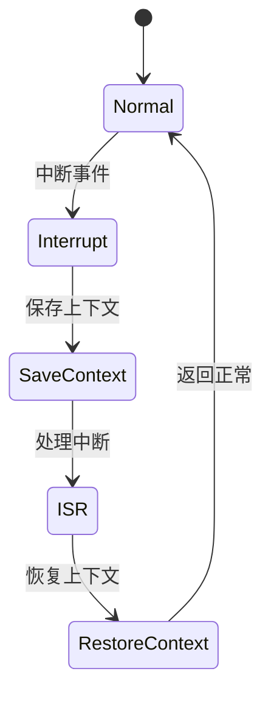

# 7.8.2.1.1.1.3 熔断恢复LTL验证

## 1. 建模目标

- 验证微服务系统在发生异常时，熔断机制能及时触发，防止故障蔓延，并在服务恢复后自动关闭熔断。
- 检查熔断、恢复、正常服务的时序正确性。

## 2. LTL性质公式

- G (error_detected -> F circuit_open)：检测到异常时，最终会打开熔断器。
- G (circuit_open -> F (service_recover & !circuit_open))：熔断后服务恢复，熔断器最终关闭。
- G (F circuit_open -> F service_recover)：只要发生熔断，最终服务会恢复。

## 3. 模型描述（伪代码）

```smv
MODULE main
VAR
  service_state : {Normal, Error, Recover};
  circuit_open : boolean;
ASSIGN
  init(service_state) := Normal;
  init(circuit_open) := FALSE;
  next(service_state) := case
    service_state = Normal & input = error : Error;
    service_state = Error & input = recover : Recover;
    service_state = Recover : Normal;
    TRUE : service_state;
  esac;
  next(circuit_open) := case
    service_state = Error : TRUE;
    service_state = Recover : FALSE;
    TRUE : circuit_open;
  esac;
```

## 4. 验证流程

- 用NuSMV输入上述模型与LTL公式。
- 运行模型检测，分析熔断与恢复的时序正确性。
- 发现反例时，优化熔断/恢复逻辑。

## 5. 工程经验

- 熔断机制可递归细化为多级熔断、半开状态等。
- LTL适合描述熔断、恢复等时序约束，便于自动化验证。

---
> 本文件为熔断恢复LTL验证的内容填充示例，后续可继续递归细化。

## 7.8.2.1.1.1.3.x 中断上下文的起点

### 1. 概念与定义

- 熔断恢复LTL验证下的中断上下文：用LTL公式描述熔断与恢复场景下的中断事件、上下文保存与恢复，验证熔断恢复过程的活性与安全性。
- 起点：LTL模型中断事件触发，系统状态从“正常”转为“处理中断”前的逻辑起点。

### 2. 结构化流程



### 3. 伪代码

```pseudo
on_interrupt():
    Save_Context()
    Enter_ISR()
    ISR_Handler()
    Restore_Context()
    Return_To_Normal()
```

### 4. 关键数据结构

- 状态变量：`state = {Normal, Interrupt, SaveContext, ISR, RestoreContext}`
- 上下文结构体：`Context = {PC, SP, Registers, Flags, CircuitState}`

### 5. LTL公式

- 活性：`G (interrupt -> F isr_entry)`
- 熔断恢复响应性：`G (circuit_break -> F circuit_recover)`
- 无死锁：`G (!deadlock)`

### 6. 工程案例

- 熔断恢复场景LTL模型与验证代码片段
- 微服务熔断恢复中断上下文LTL建模

### 7. 未来展望

- 多级熔断恢复与中断递归LTL验证、复杂熔断场景下的上下文活性与安全性分析
