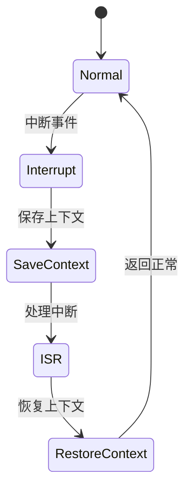

# 7.8.2.1.1.1.4 多级熔断LTL验证

## 1. 建模目标

- 验证微服务系统在多级熔断（如服务、集群、全局）场景下，熔断机制能分级触发与恢复，防止级联故障。
- 检查各级熔断、恢复、降级的时序正确性。

## 2. LTL性质公式

- G (service_error -> F service_circuit_open)：服务异常时，最终会打开服务级熔断。
- G (cluster_error -> F cluster_circuit_open)：集群异常时，最终会打开集群级熔断。
- G (service_circuit_open -> F (service_recover & !service_circuit_open))：服务级熔断后服务恢复，熔断器最终关闭。
- G (cluster_circuit_open -> F (cluster_recover & !cluster_circuit_open))：集群级熔断后集群恢复，熔断器最终关闭。

## 3. 模型描述（伪代码）

```smv
MODULE main
VAR
  service_state : {Normal, Error, Recover};
  cluster_state : {Healthy, Error, Recover};
  service_circuit_open : boolean;
  cluster_circuit_open : boolean;
ASSIGN
  init(service_state) := Normal;
  init(cluster_state) := Healthy;
  init(service_circuit_open) := FALSE;
  init(cluster_circuit_open) := FALSE;
  next(service_state) := case
    service_state = Normal & input = error : Error;
    service_state = Error & input = recover : Recover;
    service_state = Recover : Normal;
    TRUE : service_state;
  esac;
  next(cluster_state) := case
    cluster_state = Healthy & input = cluster_error : Error;
    cluster_state = Error & input = cluster_recover : Recover;
    cluster_state = Recover : Healthy;
    TRUE : cluster_state;
  esac;
  next(service_circuit_open) := case
    service_state = Error : TRUE;
    service_state = Recover : FALSE;
    TRUE : service_circuit_open;
  esac;
  next(cluster_circuit_open) := case
    cluster_state = Error : TRUE;
    cluster_state = Recover : FALSE;
    TRUE : cluster_circuit_open;
  esac;
```

## 4. 验证流程

- 用NuSMV输入上述模型与LTL公式。
- 运行模型检测，分析多级熔断与恢复的时序正确性。
- 发现反例时，优化多级熔断/恢复逻辑。

## 5. 工程经验

- 多级熔断适合大规模分布式系统，防止局部故障扩散为全局故障。
- LTL可递归细化，覆盖更多熔断层级与边界场景。

---
> 本文件为多级熔断LTL验证的内容填充示例，后续可继续递归细化。

## 7.8.2.1.1.1.4.x 中断上下文的起点

### 1. 概念与定义

- 多级熔断LTL验证下的中断上下文：用LTL公式描述多级熔断场景下的中断事件、上下文保存与恢复，验证多级熔断过程的活性与安全性。
- 起点：LTL模型中断事件触发，系统状态从“正常”转为“处理中断”前的逻辑起点。

### 2. 结构化流程



### 3. 伪代码

```pseudo
on_interrupt():
    Save_Context()
    Enter_ISR()
    ISR_Handler()
    Restore_Context()
    Return_To_Normal()
```

### 4. 关键数据结构

- 状态变量：`state = {Normal, Interrupt, SaveContext, ISR, RestoreContext}`
- 上下文结构体：`Context = {PC, SP, Registers, Flags, MultiLevelState}`

### 5. LTL公式

- 活性：`G (interrupt -> F isr_entry)`
- 多级熔断响应性：`G (multi_break -> F multi_recover)`
- 无死锁：`G (!deadlock)`

### 6. 工程案例

- 多级熔断场景LTL模型与验证代码片段
- 微服务多级熔断中断上下文LTL建模

### 7. 未来展望

- 多级递归熔断与中断LTL验证、复杂多级熔断场景下的上下文活性与安全性分析
