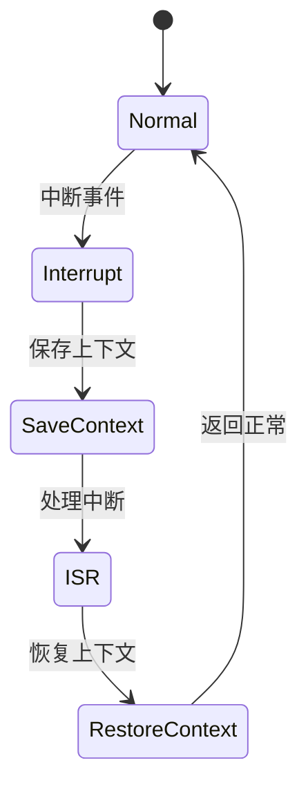

# 7.8.2.1.1.1.5 半开状态熔断LTL验证


<!-- TOC START -->

- [7.8.2.1.1.1.5 半开状态熔断LTL验证](#7821115-半开状态熔断ltl验证)
  - [1. 建模目标](#1-建模目标)
  - [2. LTL性质公式](#2-ltl性质公式)
  - [3. 模型描述（伪代码）](#3-模型描述伪代码)
  - [4. 验证流程](#4-验证流程)
  - [5. 工程经验](#5-工程经验)
  - [7.8.2.1.1.1.5.x 中断上下文的起点](#7821115x-中断上下文的起点)
    - [1. 概念与定义](#1-概念与定义)
    - [2. 结构化流程](#2-结构化流程)
    - [3. 伪代码](#3-伪代码)
    - [4. 关键数据结构](#4-关键数据结构)
    - [5. LTL公式](#5-ltl公式)
    - [6. 工程案例](#6-工程案例)
    - [7. 未来展望](#7-未来展望)

<!-- TOC END -->

## 1. 建模目标

- 验证熔断机制支持“半开”状态：异常后熔断，恢复尝试后进入半开，若成功则关闭熔断，否则重新熔断。
- 检查半开状态下的恢复与回退时序正确性。

## 2. LTL性质公式

- G (circuit_open & recover_attempt -> F circuit_half_open)：熔断后恢复尝试，最终进入半开状态。
- G (circuit_half_open & test_success -> F !circuit_open & !circuit_half_open)：半开测试成功，最终关闭熔断。
- G (circuit_half_open & test_fail -> F circuit_open)：半开测试失败，最终重新熔断。

## 3. 模型描述（伪代码）

```smv
MODULE main
VAR
  service_state : {Normal, Error, Recover};
  circuit_state : {Closed, Open, HalfOpen};
ASSIGN
  init(service_state) := Normal;
  init(circuit_state) := Closed;
  next(service_state) := case
    service_state = Normal & input = error : Error;
    service_state = Error & input = recover : Recover;
    service_state = Recover : Normal;
    TRUE : service_state;
  esac;
  next(circuit_state) := case
    circuit_state = Closed & service_state = Error : Open;
    circuit_state = Open & input = recover_attempt : HalfOpen;
    circuit_state = HalfOpen & input = test_success : Closed;
    circuit_state = HalfOpen & input = test_fail : Open;
    TRUE : circuit_state;
  esac;
```

## 4. 验证流程

- 用NuSMV输入上述模型与LTL公式。
- 运行模型检测，分析半开状态下的恢复与回退时序。
- 发现反例时，优化半开状态逻辑。

## 5. 工程经验

- 半开状态可有效防止频繁熔断-恢复抖动。
- LTL适合描述半开状态下的复杂时序约束。

---
> 本文件为半开状态熔断LTL验证的内容填充示例，后续可继续递归细化。

## 7.8.2.1.1.1.5.x 中断上下文的起点

### 1. 概念与定义

- 半开状态熔断LTL验证下的中断上下文：用LTL公式描述熔断器半开状态下的中断事件、上下文保存与恢复，验证半开状态切换过程的活性与安全性。
- 起点：LTL模型中断事件触发，系统状态从“正常”转为“处理中断”前的逻辑起点。

### 2. 结构化流程



### 3. 伪代码

```pseudo
on_interrupt():
    Save_Context()
    Enter_ISR()
    ISR_Handler()
    Restore_Context()
    Return_To_Normal()
```

### 4. 关键数据结构

- 状态变量：`state = {Normal, Interrupt, SaveContext, ISR, RestoreContext}`
- 上下文结构体：`Context = {PC, SP, Registers, Flags, HalfOpenState}`

### 5. LTL公式

- 活性：`G (interrupt -> F isr_entry)`
- 半开状态切换响应性：`G (half_open -> F closed_or_open)`
- 无死锁：`G (!deadlock)`

### 6. 工程案例

- 半开状态熔断场景LTL模型与验证代码片段
- 微服务半开熔断中断上下文LTL建模

### 7. 未来展望

- 多级半开熔断与中断递归LTL验证、复杂半开场景下的上下文活性与安全性分析
