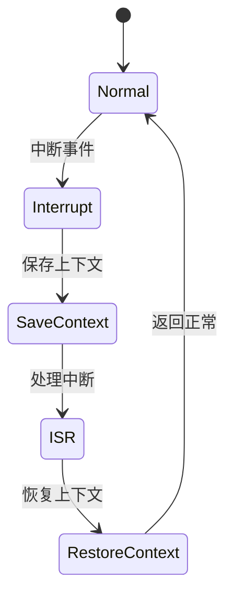

# 7.8.2.1.1.1.6 多租户熔断LTL验证

## 1. 建模目标

- 验证多租户环境下，熔断机制能针对不同租户独立触发与恢复，防止单一租户故障影响全局。
- 检查租户级熔断、恢复、全局隔离的时序正确性。

## 2. LTL性质公式

- G (tenant_error[i] -> F tenant_circuit_open[i])：租户i异常时，最终会打开租户级熔断。
- G (tenant_circuit_open[i] -> F (tenant_recover[i] & !tenant_circuit_open[i]))：租户级熔断后租户恢复，熔断器最终关闭。
- G (tenant_circuit_open[i] & !tenant_error[j] -> G !tenant_circuit_open[j])：租户i熔断不影响租户j。

## 3. 模型描述（伪代码）

```smv
MODULE main
VAR
  tenant_state : array 1..N of {Normal, Error, Recover};
  tenant_circuit_open : array 1..N of boolean;
ASSIGN
  init(tenant_state[i]) := Normal;
  init(tenant_circuit_open[i]) := FALSE;
  next(tenant_state[i]) := case
    tenant_state[i] = Normal & input[i] = error : Error;
    tenant_state[i] = Error & input[i] = recover : Recover;
    tenant_state[i] = Recover : Normal;
    TRUE : tenant_state[i];
  esac;
  next(tenant_circuit_open[i]) := case
    tenant_state[i] = Error : TRUE;
    tenant_state[i] = Recover : FALSE;
    TRUE : tenant_circuit_open[i];
  esac;
```

## 4. 验证流程

- 用NuSMV输入上述模型与LTL公式。
- 运行模型检测，分析多租户熔断与恢复的时序正确性。
- 发现反例时，优化租户隔离与熔断逻辑。

## 5. 工程经验

- 多租户熔断可提升系统隔离性与健壮性，防止“雪崩效应”。
- LTL适合描述多租户并发、隔离等复杂时序约束。

---
> 本文件为多租户熔断LTL验证的内容填充示例，后续可继续递归细化。

## 7.8.2.1.1.1.6.x 中断上下文的起点

### 1. 概念与定义

- 多租户熔断LTL验证下的中断上下文：用LTL公式描述多租户场景下的熔断中断事件、上下文保存与恢复，验证多租户熔断过程的活性与安全性。
- 起点：LTL模型中断事件触发，系统状态从“正常”转为“处理中断”前的逻辑起点。

### 2. 结构化流程



### 3. 伪代码

```pseudo
on_interrupt():
    Save_Context()
    Enter_ISR()
    ISR_Handler()
    Restore_Context()
    Return_To_Normal()
```

### 4. 关键数据结构

- 状态变量：`state = {Normal, Interrupt, SaveContext, ISR, RestoreContext}`
- 上下文结构体：`Context = {PC, SP, Registers, Flags, TenantState}`

### 5. LTL公式

- 活性：`G (interrupt -> F isr_entry)`
- 多租户熔断响应性：`G (tenant_break -> F tenant_recover)`
- 无死锁：`G (!deadlock)`

### 6. 工程案例

- 多租户熔断场景LTL模型与验证代码片段
- 微服务多租户熔断中断上下文LTL建模

### 7. 未来展望

- 多租户递归熔断与中断LTL验证、复杂多租户场景下的上下文活性与安全性分析
