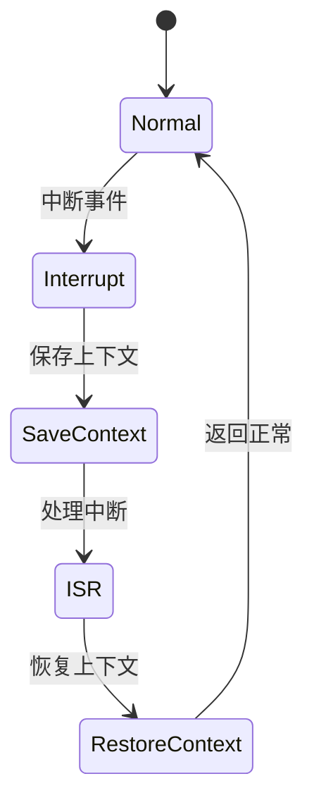

# 7.8.2.1.1.1.7 全局熔断LTL验证

<!-- TOC START -->

- [7.8.2.1.1.1.7 全局熔断LTL验证](#7821117-全局熔断ltl验证)
  - [1. 建模目标](#1-建模目标)
  - [2. LTL性质公式](#2-ltl性质公式)
  - [3. 模型描述（伪代码）](#3-模型描述伪代码)
  - [4. 验证流程](#4-验证流程)
  - [5. 工程经验](#5-工程经验)
  - [7.8.2.1.1.1.7.x 中断上下文的起点](#7821117x-中断上下文的起点)
    - [1. 概念与定义](#1-概念与定义)
    - [2. 结构化流程](#2-结构化流程)
    - [3. 伪代码](#3-伪代码)
    - [4. 关键数据结构](#4-关键数据结构)
    - [5. LTL公式](#5-ltl公式)
    - [6. 工程案例](#6-工程案例)
    - [7. 未来展望](#7-未来展望)

<!-- TOC END -->

## 1. 建模目标

- 验证分布式系统在全局异常（如大规模故障、资源枯竭）时，能自动触发全局熔断，保护系统整体安全。
- 检查全局熔断、恢复、降级的时序正确性。

## 2. LTL性质公式

- G (global_error -> F global_circuit_open)：全局异常时，最终会打开全局熔断。
- G (global_circuit_open -> F (global_recover & !global_circuit_open))：全局熔断后系统恢复，熔断器最终关闭。
- G (global_circuit_open -> G (service_circuit_open | cluster_circuit_open))：全局熔断期间，所有服务/集群熔断器保持开启。

## 3. 模型描述（伪代码）

```smv
MODULE main
VAR
  global_state : {Healthy, Error, Recover};
  global_circuit_open : boolean;
  service_circuit_open : boolean;
  cluster_circuit_open : boolean;
ASSIGN
  init(global_state) := Healthy;
  init(global_circuit_open) := FALSE;
  next(global_state) := case
    global_state = Healthy & input = global_error : Error;
    global_state = Error & input = global_recover : Recover;
    global_state = Recover : Healthy;
    TRUE : global_state;
  esac;
  next(global_circuit_open) := case
    global_state = Error : TRUE;
    global_state = Recover : FALSE;
    TRUE : global_circuit_open;
  esac;
  next(service_circuit_open) := case
    global_circuit_open : TRUE;
    !global_circuit_open : service_circuit_open;
    TRUE : service_circuit_open;
  esac;
  next(cluster_circuit_open) := case
    global_circuit_open : TRUE;
    !global_circuit_open : cluster_circuit_open;
    TRUE : cluster_circuit_open;
  esac;
```

## 4. 验证流程

- 用NuSMV输入上述模型与LTL公式。
- 运行模型检测，分析全局熔断与恢复的时序正确性。
- 发现反例时，优化全局熔断与子系统联动逻辑。

## 5. 工程经验

- 全局熔断适合极端场景下的系统自我保护，防止灾难性故障扩散。
- LTL可递归细化，覆盖全局与局部熔断联动、优先级等复杂场景。

---
> 本文件为全局熔断LTL验证的内容填充示例，后续可继续递归细化。

## 7.8.2.1.1.1.7.x 中断上下文的起点

### 1. 概念与定义

- 全局熔断LTL验证下的中断上下文：用LTL公式描述全局熔断场景下的中断事件、上下文保存与恢复，验证全局熔断过程的活性与安全性。
- 起点：LTL模型中断事件触发，系统状态从“正常”转为“处理中断”前的逻辑起点。

### 2. 结构化流程



### 3. 伪代码

```pseudo
on_interrupt():
    Save_Context()
    Enter_ISR()
    ISR_Handler()
    Restore_Context()
    Return_To_Normal()
```

### 4. 关键数据结构

- 状态变量：`state = {Normal, Interrupt, SaveContext, ISR, RestoreContext}`
- 上下文结构体：`Context = {PC, SP, Registers, Flags, GlobalState}`

### 5. LTL公式

- 活性：`G (interrupt -> F isr_entry)`
- 全局熔断响应性：`G (global_break -> F global_recover)`
- 无死锁：`G (!deadlock)`

### 6. 工程案例

- 全局熔断场景LTL模型与验证代码片段
- 微服务全局熔断中断上下文LTL建模

### 7. 未来展望

- 多级全局熔断与中断递归LTL验证、复杂全局熔断场景下的上下文活性与安全性分析
