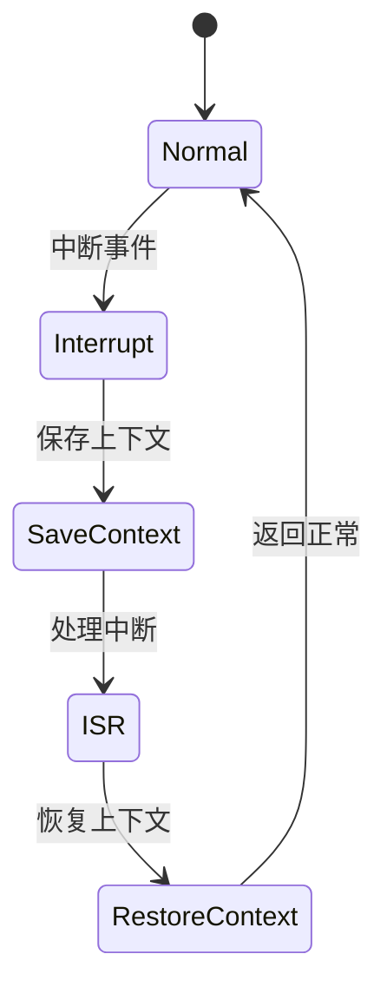

# 7.8.2.1.1.1.8 优先级熔断LTL验证


<!-- TOC START -->

- [7.8.2.1.1.1.8 优先级熔断LTL验证](#7821118-优先级熔断ltl验证)
  - [1. 建模目标](#1-建模目标)
  - [2. LTL性质公式](#2-ltl性质公式)
  - [3. 模型描述（伪代码）](#3-模型描述伪代码)
  - [4. 验证流程](#4-验证流程)
  - [5. 工程经验](#5-工程经验)
  - [7.8.2.1.1.1.8.x 中断上下文的起点](#7821118x-中断上下文的起点)
    - [1. 概念与定义](#1-概念与定义)
    - [2. 结构化流程](#2-结构化流程)
    - [3. 伪代码](#3-伪代码)
    - [4. 关键数据结构](#4-关键数据结构)
    - [5. LTL公式](#5-ltl公式)
    - [6. 工程案例](#6-工程案例)
    - [7. 未来展望](#7-未来展望)

<!-- TOC END -->

## 1. 建模目标

- 验证分布式系统中不同服务/租户/集群的熔断器可设置优先级，高优先级熔断优先触发，低优先级在高优先级恢复后才可恢复。
- 检查优先级熔断、恢复、联动的时序正确性。

## 2. LTL性质公式

- G (high_error -> F high_circuit_open)：高优先级异常时，最终会打开高优先级熔断。
- G (low_error & !high_circuit_open -> F low_circuit_open)：低优先级异常且高优先级未熔断时，低优先级可熔断。
- G (high_circuit_open -> G !low_circuit_open)：高优先级熔断期间，低优先级熔断器保持关闭。
- G (high_circuit_open & high_recover -> F !high_circuit_open & (low_error -> F low_circuit_open))：高优先级恢复后，低优先级异常可触发熔断。

## 3. 模型描述（伪代码）

```smv
MODULE main
VAR
  high_state : {Normal, Error, Recover};
  low_state : {Normal, Error, Recover};
  high_circuit_open : boolean;
  low_circuit_open : boolean;
ASSIGN
  init(high_state) := Normal;
  init(low_state) := Normal;
  init(high_circuit_open) := FALSE;
  init(low_circuit_open) := FALSE;
  next(high_state) := case
    high_state = Normal & input = high_error : Error;
    high_state = Error & input = high_recover : Recover;
    high_state = Recover : Normal;
    TRUE : high_state;
  esac;
  next(low_state) := case
    low_state = Normal & input = low_error : Error;
    low_state = Error & input = low_recover : Recover;
    low_state = Recover : Normal;
    TRUE : low_state;
  esac;
  next(high_circuit_open) := case
    high_state = Error : TRUE;
    high_state = Recover : FALSE;
    TRUE : high_circuit_open;
  esac;
  next(low_circuit_open) := case
    high_circuit_open : FALSE;
    low_state = Error & !high_circuit_open : TRUE;
    low_state = Recover : FALSE;
    TRUE : low_circuit_open;
  esac;
```

## 4. 验证流程

- 用NuSMV输入上述模型与LTL公式。
- 运行模型检测，分析优先级熔断与恢复的时序正确性。
- 发现反例时，优化优先级联动逻辑。

## 5. 工程经验

- 优先级熔断适合多级服务、租户、集群的分层保护，防止低优先级故障影响高优先级。
- LTL可递归细化，覆盖更多优先级层级与联动场景。

---
> 本文件为优先级熔断LTL验证的内容填充示例，后续可继续递归细化。

## 7.8.2.1.1.1.8.x 中断上下文的起点

### 1. 概念与定义

- 优先级熔断LTL验证下的中断上下文：用LTL公式描述优先级熔断场景下的中断事件、上下文保存与恢复，验证优先级熔断过程的活性与安全性。
- 起点：LTL模型中断事件触发，系统状态从“正常”转为“处理中断”前的逻辑起点。

### 2. 结构化流程



### 3. 伪代码

```pseudo
on_interrupt():
    Save_Context()
    Enter_ISR()
    ISR_Handler()
    Restore_Context()
    Return_To_Normal()
```

### 4. 关键数据结构

- 状态变量：`state = {Normal, Interrupt, SaveContext, ISR, RestoreContext}`
- 上下文结构体：`Context = {PC, SP, Registers, Flags, PriorityState}`

### 5. LTL公式

- 活性：`G (interrupt -> F isr_entry)`
- 优先级熔断响应性：`G (priority_break -> F priority_recover)`
- 无死锁：`G (!deadlock)`

### 6. 工程案例

- 优先级熔断场景LTL模型与验证代码片段
- 微服务优先级熔断中断上下文LTL建模

### 7. 未来展望

- 多级优先级熔断与中断递归LTL验证、复杂优先级熔断场景下的上下文活性与安全性分析
