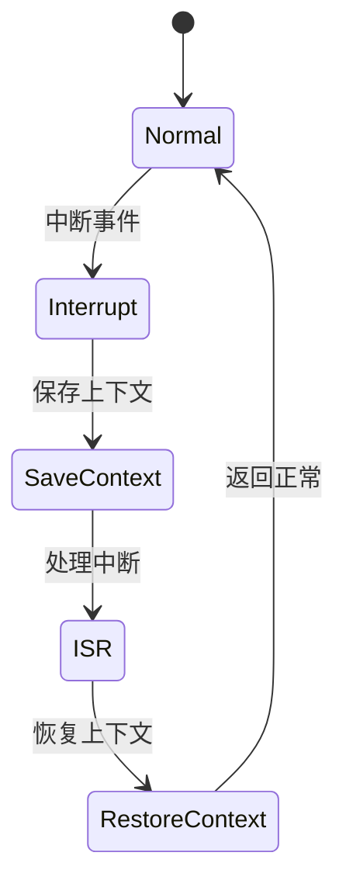

# 7.8.2.1.1.1.9 跨域熔断LTL验证

## 1. 建模目标

- 验证分布式系统在多地域/多云/多数据中心（跨域）场景下，熔断机制能在域内独立触发与恢复，必要时支持跨域联动熔断，防止故障蔓延。
- 检查域内、跨域熔断、恢复、联动的时序正确性。

## 2. LTL性质公式

- G (domain_error[i] -> F domain_circuit_open[i])：域i异常时，最终会打开域内熔断。
- G (domain_circuit_open[i] -> F (domain_recover[i] & !domain_circuit_open[i]))：域内熔断后域恢复，熔断器最终关闭。
- G (domain_circuit_open[i] & cross_domain_policy -> F domain_circuit_open[j])：域i熔断且跨域策略激活时，最终会打开域j熔断。
- G (domain_circuit_open[i] & !cross_domain_policy -> G !domain_circuit_open[j])：无跨域策略时，域i熔断不影响域j。

## 3. 模型描述（伪代码）

```smv
MODULE main
VAR
  domain_state : array 1..N of {Normal, Error, Recover};
  domain_circuit_open : array 1..N of boolean;
  cross_domain_policy : boolean;
ASSIGN
  init(domain_state[i]) := Normal;
  init(domain_circuit_open[i]) := FALSE;
  init(cross_domain_policy) := FALSE;
  next(domain_state[i]) := case
    domain_state[i] = Normal & input[i] = error : Error;
    domain_state[i] = Error & input[i] = recover : Recover;
    domain_state[i] = Recover : Normal;
    TRUE : domain_state[i];
  esac;
  next(domain_circuit_open[i]) := case
    domain_state[i] = Error : TRUE;
    domain_state[i] = Recover : FALSE;
    cross_domain_policy & exists(j in 1..N) (domain_circuit_open[j] & j != i) : TRUE;
    TRUE : domain_circuit_open[i];
  esac;
  next(cross_domain_policy) := case
    input_policy = activate : TRUE;
    input_policy = deactivate : FALSE;
    TRUE : cross_domain_policy;
  esac;
```

## 4. 验证流程

- 用NuSMV输入上述模型与LTL公式。
- 运行模型检测，分析跨域熔断与恢复的时序正确性。
- 发现反例时，优化跨域联动与隔离策略。

## 5. 工程经验

- 跨域熔断适合多云、多地域、灾备等复杂场景，提升系统弹性与可控性。
- LTL可递归细化，覆盖更多跨域联动、策略切换等复杂时序。

---
> 本文件为跨域熔断LTL验证的内容填充示例，后续可继续递归细化。

## 7.8.2.1.1.1.9.x 中断上下文的起点

### 1. 概念与定义

- 跨域熔断LTL验证下的中断上下文：用LTL公式描述跨域熔断场景下的中断事件、上下文保存与恢复，验证跨域熔断过程的活性与安全性。
- 起点：LTL模型中断事件触发，系统状态从“正常”转为“处理中断”前的逻辑起点。

### 2. 结构化流程



### 3. 伪代码

```pseudo
on_interrupt():
    Save_Context()
    Enter_ISR()
    ISR_Handler()
    Restore_Context()
    Return_To_Normal()
```

### 4. 关键数据结构

- 状态变量：`state = {Normal, Interrupt, SaveContext, ISR, RestoreContext}`
- 上下文结构体：`Context = {PC, SP, Registers, Flags, CrossDomainState}`

### 5. LTL公式

- 活性：`G (interrupt -> F isr_entry)`
- 跨域熔断响应性：`G (cross_break -> F cross_recover)`
- 无死锁：`G (!deadlock)`

### 6. 工程案例

- 跨域熔断场景LTL模型与验证代码片段
- 微服务跨域熔断中断上下文LTL建模

### 7. 未来展望

- 多级跨域熔断与中断递归LTL验证、复杂跨域熔断场景下的上下文活性与安全性分析
