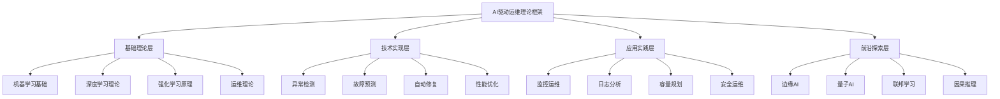

# 🤖 AI驱动运维理论框架


<!-- TOC START -->

- [🤖 AI驱动运维理论框架](#-ai驱动运维理论框架)
  - [AI-driven Operations Theoretical Framework](#ai-driven-operations-theoretical-framework)
  - [📊 设计目标 / Design Objectives](#-设计目标-design-objectives)
    - [🎯 核心目标](#-核心目标)
    - [🏗️ 理论框架架构](#-理论框架架构)
  - [🔬 第一部分：基础理论层 / Part 1: Basic Theory Layer](#-第一部分基础理论层-part-1-basic-theory-layer)
    - [1.1 机器学习基础理论 / Machine Learning Basic Theory](#11-机器学习基础理论-machine-learning-basic-theory)
      - [📚 监督学习理论](#-监督学习理论)
      - [📚 无监督学习理论](#-无监督学习理论)
      - [📚 强化学习理论](#-强化学习理论)
    - [1.2 深度学习理论 / Deep Learning Theory](#12-深度学习理论-deep-learning-theory)
      - [📚 神经网络基础](#-神经网络基础)
      - [📚 卷积神经网络(CNN)](#-卷积神经网络cnn)
      - [📚 循环神经网络(RNN)](#-循环神经网络rnn)
    - [1.3 运维理论 / Operations Theory](#13-运维理论-operations-theory)
      - [📚 运维基础理论](#-运维基础理论)
      - [📚 运维自动化理论](#-运维自动化理论)
  - [🛠️ 第二部分：技术实现层 / Part 2: Technical Implementation Layer](#-第二部分技术实现层-part-2-technical-implementation-layer)
    - [2.1 异常检测技术 / Anomaly Detection Technology](#21-异常检测技术-anomaly-detection-technology)
      - [📚 统计异常检测](#-统计异常检测)
      - [📚 机器学习异常检测](#-机器学习异常检测)
    - [2.2 故障预测技术 / Fault Prediction Technology](#22-故障预测技术-fault-prediction-technology)
      - [📚 时间序列预测](#-时间序列预测)
      - [📚 故障模式识别](#-故障模式识别)
    - [2.3 自动修复技术 / Auto-remediation Technology](#23-自动修复技术-auto-remediation-technology)
      - [📚 修复策略学习](#-修复策略学习)
      - [📚 修复执行引擎](#-修复执行引擎)
  - [🎯 第三部分：应用实践层 / Part 3: Application Practice Layer](#-第三部分应用实践层-part-3-application-practice-layer)
    - [3.1 监控运维应用 / Monitoring Operations Application](#31-监控运维应用-monitoring-operations-application)
      - [📚 智能监控系统](#-智能监控系统)
      - [📚 日志智能分析](#-日志智能分析)
    - [3.2 容量规划应用 / Capacity Planning Application](#32-容量规划应用-capacity-planning-application)
      - [📚 智能容量规划](#-智能容量规划)
      - [📚 资源优化调度](#-资源优化调度)
  - [🌟 第四部分：前沿探索层 / Part 4: Frontier Exploration Layer](#-第四部分前沿探索层-part-4-frontier-exploration-layer)
    - [4.1 边缘AI运维 / Edge AI Operations](#41-边缘ai运维-edge-ai-operations)
      - [📚 边缘计算理论](#-边缘计算理论)
      - [📚 边缘AI优化](#-边缘ai优化)
    - [4.2 量子AI运维 / Quantum AI Operations](#42-量子ai运维-quantum-ai-operations)
      - [📚 量子计算基础](#-量子计算基础)
      - [📚 后量子密码学](#-后量子密码学)
    - [4.3 联邦学习运维 / Federated Learning Operations](#43-联邦学习运维-federated-learning-operations)
      - [📚 联邦学习理论](#-联邦学习理论)
      - [📚 联邦学习优化](#-联邦学习优化)
  - [🔗 第五部分：理论整合 / Part 5: Theory Integration](#-第五部分理论整合-part-5-theory-integration)
    - [5.1 理论框架整合 / Theoretical Framework Integration](#51-理论框架整合-theoretical-framework-integration)
      - [📚 整合策略](#-整合策略)
      - [📚 创新点识别](#-创新点识别)
    - [5.2 应用指导 / Application Guidance](#52-应用指导-application-guidance)
      - [📚 实施策略](#-实施策略)
      - [📚 成功要素](#-成功要素)
  - [📋 总结与展望 / Summary and Outlook](#-总结与展望-summary-and-outlook)
    - [🎯 理论成果](#-理论成果)
    - [🚀 发展方向](#-发展方向)
    - [💪 成功信心](#-成功信心)

<!-- TOC END -->

## AI-driven Operations Theoretical Framework

---

## 📊 设计目标 / Design Objectives

### 🎯 核心目标

**理论建立**: 建立完整的AI驱动运维理论框架  
**技术整合**: 整合机器学习、深度学习、强化学习等AI技术  
**应用指导**: 提供AIOps在实际运维中的应用指导  
**创新探索**: 探索AI运维的前沿发展方向  

### 🏗️ 理论框架架构



---

## 🔬 第一部分：基础理论层 / Part 1: Basic Theory Layer

### 1.1 机器学习基础理论 / Machine Learning Basic Theory

#### 📚 监督学习理论

```yaml
监督学习定义:
  定义: 从标记的训练数据中学习输入到输出的映射关系
  
  数学表达: f: X → Y，其中X是输入空间，Y是输出空间
  
  学习目标: 最小化损失函数L(f(x), y)
  
  核心算法:
    - 线性回归: f(x) = w^T x + b
    - 逻辑回归: f(x) = 1 / (1 + e^(-w^T x))
    - 支持向量机: f(x) = sign(Σαi yi K(xi, x) + b)
    - 决策树: 基于特征分割的树形结构

监督学习应用:
  异常检测: 学习正常模式，检测异常行为
  故障分类: 将故障分为不同类别
  性能预测: 预测系统性能指标
  容量规划: 预测资源需求
```

#### 📚 无监督学习理论

```yaml
无监督学习定义:
  定义: 从未标记的数据中发现隐藏的模式和结构
  
  数学表达: 学习数据分布P(x)或特征表示h(x)
  
  学习目标: 发现数据的内在结构和规律
  
  核心算法:
    - 聚类算法: K-means, DBSCAN, 层次聚类
    - 降维算法: PCA, t-SNE, UMAP
    - 异常检测: Isolation Forest, One-Class SVM
    - 关联规则: Apriori, FP-Growth

无监督学习应用:
  日志聚类: 将相似日志分组
  用户行为分析: 发现用户行为模式
  系统状态分类: 自动分类系统状态
  异常模式发现: 发现未知异常模式
```

#### 📚 强化学习理论

```yaml
强化学习定义:
  定义: 通过与环境交互学习最优策略
  
  数学表达: 马尔可夫决策过程(MDP) = (S, A, P, R, γ)
  
  学习目标: 最大化累积奖励Σγ^t R(st, at)
  
  核心算法:
    - Q-Learning: Q(s,a) ← Q(s,a) + α[r + γ max Q(s',a') - Q(s,a)]
    - Policy Gradient: ∇θ J(θ) = E[∇θ log π(a|s) Q(s,a)]
    - Actor-Critic: 结合策略梯度和价值函数
    - Deep Q-Network: 使用深度神经网络近似Q函数

强化学习应用:
  资源调度: 学习最优资源分配策略
  故障恢复: 学习最优故障恢复策略
  负载均衡: 学习最优负载分配策略
  容量规划: 学习最优扩容策略
```

### 1.2 深度学习理论 / Deep Learning Theory

#### 📚 神经网络基础

```yaml
神经网络定义:
  定义: 由多个神经元连接而成的计算模型
  
  数学表达: y = f(Σwi xi + b)，其中f是激活函数
  
  网络结构:
    - 输入层: 接收输入数据
    - 隐藏层: 学习特征表示
    - 输出层: 产生预测结果
  
  激活函数:
    - ReLU: f(x) = max(0, x)
    - Sigmoid: f(x) = 1 / (1 + e^(-x))
    - Tanh: f(x) = (e^x - e^(-x)) / (e^x + e^(-x))
    - Softmax: f(xi) = e^xi / Σe^xj

神经网络训练:
  前向传播: 计算网络输出
  反向传播: 计算梯度
  参数更新: 使用梯度下降更新参数
  正则化: 防止过拟合
```

#### 📚 卷积神经网络(CNN)

```yaml
CNN定义:
  定义: 专门处理网格结构数据的神经网络
  
  核心组件:
    - 卷积层: 提取局部特征
    - 池化层: 降低特征维度
    - 全连接层: 分类或回归
  
  数学表达: (f * g)(t) = ∫f(τ)g(t-τ)dτ
  
  CNN应用:
    - 图像识别: 识别系统状态图像
    - 时序预测: 预测时间序列数据
    - 异常检测: 检测异常模式
    - 日志分析: 分析日志模式
```

#### 📚 循环神经网络(RNN)

```yaml
RNN定义:
  定义: 处理序列数据的神经网络
  
  数学表达: ht = f(Whh ht-1 + Wxh xt + bh)
  
  核心特点:
    - 记忆能力: 记住历史信息
    - 参数共享: 减少参数数量
    - 序列建模: 建模序列依赖关系
  
  RNN变体:
    - LSTM: 长短期记忆网络
    - GRU: 门控循环单元
    - BiRNN: 双向循环神经网络
  
  RNN应用:
    - 时序预测: 预测系统性能
    - 异常检测: 检测时序异常
    - 日志分析: 分析日志序列
    - 故障预测: 预测故障发生
```

### 1.3 运维理论 / Operations Theory

#### 📚 运维基础理论

```yaml
运维定义:
  定义: 确保系统稳定、高效、安全运行的活动
  
  核心目标:
    - 可用性: 系统正常运行时间
    - 性能: 系统响应速度和吞吐量
    - 安全性: 系统安全防护
    - 成本: 运维成本控制
  
  运维活动:
    - 监控: 实时监控系统状态
    - 维护: 定期维护和更新
    - 故障处理: 快速响应和处理故障
    - 容量规划: 预测和规划资源需求

运维指标:
  可用性指标: MTBF, MTTR, 可用率
  性能指标: 响应时间, 吞吐量, 资源利用率
  安全指标: 安全事件数, 漏洞修复时间
  成本指标: 运维成本, ROI
```

#### 📚 运维自动化理论

```yaml
自动化定义:
  定义: 使用技术手段减少人工干预的运维活动
  
  自动化层次:
    - 任务自动化: 自动化重复性任务
    - 流程自动化: 自动化运维流程
    - 决策自动化: 自动化运维决策
    - 智能自动化: 基于AI的智能运维
  
  自动化原则:
    - 标准化: 建立标准化的流程和规范
    - 模块化: 将复杂任务分解为简单模块
    - 可扩展性: 支持系统的扩展和演进
    - 可观测性: 提供完整的监控和日志
  
  自动化工具:
    - 配置管理: Ansible, Puppet, Chef
    - 容器编排: Kubernetes, Docker Swarm
    - 监控工具: Prometheus, Grafana, ELK
    - CI/CD: Jenkins, GitLab CI, GitHub Actions
```

---

## 🛠️ 第二部分：技术实现层 / Part 2: Technical Implementation Layer

### 2.1 异常检测技术 / Anomaly Detection Technology

#### 📚 统计异常检测

```yaml
统计方法:
  均值方差法: 基于正态分布假设
  箱线图法: 基于四分位数
  Z-score法: 标准化后的异常值检测
  IQR法: 基于四分位距
  
  数学表达:
    - 均值方差: |x - μ| > kσ
    - Z-score: |z| > threshold
    - IQR: x < Q1 - 1.5*IQR 或 x > Q3 + 1.5*IQR
  
  应用场景:
    - CPU使用率异常检测
    - 内存使用率异常检测
    - 网络流量异常检测
    - 响应时间异常检测

统计方法优化:
  自适应阈值: 根据历史数据动态调整阈值
  多维度检测: 结合多个指标进行异常检测
  时间窗口: 使用滑动时间窗口进行检测
  异常评分: 计算异常程度评分
```

#### 📚 机器学习异常检测

```yaml
监督学习方法:
  分类器: 使用标记数据训练分类器
  回归模型: 预测正常值范围
  支持向量机: 学习正常和异常的边界
  
  无监督学习方法:
    - Isolation Forest: 基于异常点更容易被隔离
    - One-Class SVM: 学习正常数据的边界
    - Autoencoder: 重构误差大的为异常
    - LOF: 基于局部异常因子
  
  半监督学习方法:
    - PU Learning: 正例和未标记数据学习
    - Self-training: 使用高置信度预测结果
    - Co-training: 多视图协同学习

异常检测评估:
  评估指标: Precision, Recall, F1-score, AUC
  评估方法: 交叉验证, 时间序列分割
  阈值选择: ROC曲线, PR曲线
  模型选择: 多个模型比较选择
```

### 2.2 故障预测技术 / Fault Prediction Technology

#### 📚 时间序列预测

```yaml
传统方法:
  移动平均: 平滑时间序列数据
  指数平滑: 加权移动平均
  ARIMA: 自回归积分移动平均模型
  季节性分解: 分解趋势、季节性和随机性
  
  数学表达:
    - 移动平均: MA(t) = (x(t) + x(t-1) + ... + x(t-n+1)) / n
    - 指数平滑: S(t) = αx(t) + (1-α)S(t-1)
    - ARIMA: φ(B)(1-B)^d x(t) = θ(B)ε(t)
  
  应用场景:
    - 系统负载预测
    - 资源使用率预测
    - 性能指标预测
    - 故障率预测

深度学习方法:
  LSTM: 长短期记忆网络
  GRU: 门控循环单元
  TCN: 时间卷积网络
  Transformer: 注意力机制模型
  
  预测任务:
    - 单步预测: 预测下一个时间点
    - 多步预测: 预测未来多个时间点
    - 序列到序列: 输入序列预测输出序列
```

#### 📚 故障模式识别

```yaml
故障模式定义:
  定义: 故障发生的典型模式和规律
  
  故障类型:
    - 硬件故障: CPU、内存、磁盘故障
    - 软件故障: 程序崩溃、内存泄漏
    - 网络故障: 网络中断、延迟增加
    - 配置故障: 参数错误、版本不匹配
  
  故障特征:
    - 时序特征: 故障发生的时间模式
    - 关联特征: 故障与其他指标的关系
    - 周期性特征: 故障的周期性规律
    - 趋势特征: 故障的发展趋势

故障预测模型:
  分类模型: 预测故障类型
  回归模型: 预测故障发生时间
  生存分析: 预测故障生存时间
  因果推理: 分析故障因果关系
```

### 2.3 自动修复技术 / Auto-remediation Technology

#### 📚 修复策略学习

```yaml
修复策略定义:
  定义: 针对不同故障的修复方案和步骤
  
  策略类型:
    - 重启策略: 重启服务或系统
    - 配置修复: 修改配置参数
    - 资源调整: 调整资源分配
    - 回滚策略: 回滚到稳定版本
  
  策略学习:
    - 强化学习: 学习最优修复策略
    - 模仿学习: 学习专家修复行为
    - 迁移学习: 从相似场景迁移策略
    - 元学习: 快速适应新场景

修复策略优化:
  成功率优化: 提高修复成功率
  时间优化: 减少修复时间
  成本优化: 降低修复成本
  风险控制: 控制修复风险
```

#### 📚 修复执行引擎

```yaml
执行引擎架构:
  策略解析器: 解析修复策略
  执行调度器: 调度修复任务
  资源管理器: 管理修复资源
  状态监控器: 监控修复状态
  
  执行流程:
    1. 故障检测: 检测到故障
    2. 策略选择: 选择修复策略
    3. 策略执行: 执行修复操作
    4. 结果验证: 验证修复结果
    5. 状态更新: 更新系统状态
  
  安全机制:
    权限控制: 控制修复权限
    操作审计: 记录所有操作
    回滚机制: 支持操作回滚
    风险评估: 评估修复风险
```

---

## 🎯 第三部分：应用实践层 / Part 3: Application Practice Layer

### 3.1 监控运维应用 / Monitoring Operations Application

#### 📚 智能监控系统

```yaml
系统架构:
  数据采集层: 采集监控数据
  数据处理层: 处理和清洗数据
  分析引擎层: AI分析引擎
  告警管理层: 智能告警管理
  
  核心功能:
    - 异常检测: 自动检测异常
    - 趋势预测: 预测指标趋势
    - 根因分析: 分析故障根因
    - 智能告警: 减少误报告警
  
  技术实现:
    - 实时处理: 流式数据处理
    - 批量处理: 离线数据分析
    - 机器学习: 异常检测和预测
    - 可视化: 直观的数据展示

应用场景:
  基础设施监控: 服务器、网络、存储监控
  应用性能监控: 应用响应时间、吞吐量
  业务监控: 业务指标、用户体验
  安全监控: 安全事件、威胁检测
```

#### 📚 日志智能分析

```yaml
日志分析流程:
  日志收集: 收集各种日志数据
  日志解析: 解析日志格式和内容
  特征提取: 提取关键特征
  模式识别: 识别日志模式
  异常检测: 检测异常日志
  
  分析技术:
    - 文本挖掘: 提取日志中的关键信息
    - 聚类分析: 将相似日志分组
    - 关联分析: 发现日志间的关联关系
    - 序列分析: 分析日志序列模式
  
  应用场景:
    - 故障诊断: 快速定位故障原因
    - 性能分析: 分析系统性能问题
    - 安全分析: 检测安全威胁
    - 用户行为: 分析用户行为模式
```

### 3.2 容量规划应用 / Capacity Planning Application

#### 📚 智能容量规划

```yaml
规划目标:
  性能保证: 保证系统性能要求
  成本优化: 优化资源成本
  风险控制: 控制容量不足风险
  灵活性: 支持业务快速变化
  
  规划方法:
    - 趋势分析: 分析历史增长趋势
    - 场景分析: 分析不同业务场景
    - 压力测试: 通过测试验证容量
    - 机器学习: 预测未来容量需求
  
  规划流程:
    1. 需求分析: 分析业务需求
    2. 现状评估: 评估当前容量
    3. 需求预测: 预测未来需求
    4. 容量设计: 设计容量方案
    5. 实施验证: 实施并验证方案

技术实现:
  预测模型: 使用机器学习预测需求
  优化算法: 优化资源分配方案
  仿真工具: 模拟不同容量方案
  监控反馈: 实时监控和反馈
```

#### 📚 资源优化调度

```yaml
调度目标:
  资源利用率: 最大化资源利用率
  性能保证: 保证应用性能要求
  成本控制: 控制资源成本
  公平性: 保证资源分配公平
  
  调度算法:
    - 启发式算法: 基于规则的调度
    - 优化算法: 数学优化方法
    - 机器学习: 学习最优调度策略
    - 强化学习: 动态调整调度策略
  
  调度策略:
    - 负载均衡: 均衡分配负载
    - 优先级调度: 基于优先级调度
    - 抢占调度: 支持任务抢占
    - 弹性调度: 动态调整资源分配

应用场景:
  容器编排: Kubernetes资源调度
  虚拟机管理: 虚拟机资源分配
  存储管理: 存储资源分配
  网络管理: 网络带宽分配
```

---

## 🌟 第四部分：前沿探索层 / Part 4: Frontier Exploration Layer

### 4.1 边缘AI运维 / Edge AI Operations

#### 📚 边缘计算理论

```yaml
边缘计算定义:
  定义: 在数据源附近进行数据处理和计算
  
  架构特点:
    - 分布式: 计算分布在边缘节点
    - 低延迟: 减少网络传输延迟
    - 高带宽: 减少网络带宽需求
    - 隐私保护: 数据本地处理
  
  边缘节点类型:
    - 移动设备: 手机、平板等
    - 边缘服务器: 基站、路由器等
    - 物联网设备: 传感器、摄像头等
    - 工业设备: 工业控制器等

边缘AI应用:
  实时监控: 边缘节点实时监控
  本地推理: 边缘节点进行AI推理
  数据预处理: 边缘节点预处理数据
  智能决策: 边缘节点智能决策
```

#### 📚 边缘AI优化

```yaml
模型优化:
  模型压缩: 减少模型大小
  量化: 降低计算精度
  剪枝: 移除不重要的连接
  知识蒸馏: 从大模型学习小模型
  
  计算优化:
   - 并行计算: 并行处理多个任务
   - 缓存优化: 优化数据缓存
   - 内存管理: 优化内存使用
   - 功耗控制: 控制计算功耗
  
  网络优化:
   - 数据压缩: 压缩传输数据
   - 增量更新: 只传输变化部分
   - 智能路由: 选择最优传输路径
   - 负载均衡: 均衡网络负载
```

### 4.2 量子AI运维 / Quantum AI Operations

#### 📚 量子计算基础

```yaml
量子计算原理:
  量子比特: 量子信息的基本单位
  量子叠加: 量子比特可以同时处于多个状态
  量子纠缠: 量子比特间的关联关系
  量子测量: 测量量子比特的状态
  
  量子算法:
   - 量子搜索: Grover算法
   - 量子因子分解: Shor算法
   - 量子机器学习: 量子支持向量机
   - 量子优化: 量子近似优化算法
  
  量子优势:
   - 并行计算: 指数级并行计算能力
   - 量子模拟: 模拟量子系统
   - 密码学: 量子密钥分发
   - 优化问题: 解决复杂优化问题

量子AI应用:
  量子机器学习: 量子版本的机器学习算法
  量子神经网络: 基于量子计算的神经网络
  量子优化: 解决运维优化问题
  量子模拟: 模拟复杂系统行为
```

#### 📚 后量子密码学

```yaml
后量子密码学:
  定义: 抵抗量子计算攻击的密码学算法
  
  算法类型:
   - 格密码学: 基于格问题的密码学
   - 多变量密码学: 基于多变量多项式的密码学
   - 基于哈希的签名: 基于哈希函数的数字签名
   - 基于编码的密码学: 基于纠错码的密码学
  
  应用场景:
   - 密钥交换: 安全的密钥协商
   - 数字签名: 身份认证和数据完整性
   - 加密通信: 保护数据传输安全
   - 身份管理: 安全的身份认证

量子安全运维:
  量子密钥分发: 基于量子物理的密钥分发
  量子随机数生成: 生成真随机数
  量子身份认证: 基于量子物理的身份认证
  量子安全通信: 量子安全的通信协议
```

### 4.3 联邦学习运维 / Federated Learning Operations

#### 📚 联邦学习理论

```yaml
联邦学习定义:
  定义: 在保护隐私的前提下进行分布式机器学习
  
  学习模式:
   - 水平联邦学习: 特征相同、样本不同的数据
   - 垂直联邦学习: 样本相同、特征不同的数据
   - 联邦迁移学习: 不同领域间的知识迁移
  
  隐私保护:
   - 差分隐私: 添加噪声保护隐私
   - 同态加密: 在加密数据上进行计算
   - 安全多方计算: 多方安全计算
   - 零知识证明: 证明知识而不泄露知识

联邦学习应用:
  分布式监控: 多节点协同监控
  协作异常检测: 多节点协作检测异常
  联合故障预测: 多节点联合预测故障
  协同容量规划: 多节点协同规划容量
```

#### 📚 联邦学习优化

```yaml
通信优化:
  模型压缩: 压缩传输的模型参数
  异步更新: 异步更新模型参数
  选择性通信: 选择性地传输重要参数
  增量更新: 只传输变化的参数
  
  计算优化:
   - 本地计算: 增加本地计算减少通信
   - 并行训练: 并行训练多个模型
   - 模型聚合: 高效聚合多个模型
   - 资源调度: 优化计算资源分配
  
  安全优化:
   - 隐私保护: 增强隐私保护机制
   - 攻击防护: 防护各种攻击
   - 审计机制: 建立完整的审计机制
   - 合规性: 满足各种合规要求
```

---

## 🔗 第五部分：理论整合 / Part 5: Theory Integration

### 5.1 理论框架整合 / Theoretical Framework Integration

#### 📚 整合策略

```yaml
层次化整合:
  基础层: AI基础理论和运维基础理论
  技术层: AI技术和运维技术
  应用层: AI运维应用和实践
  创新层: 前沿技术探索
  
  关联性整合:
   - 概念关联: 建立AI和运维概念的关联
   - 技术关联: 建立AI和运维技术的关联
   - 应用关联: 建立AI和运维应用的关联
   - 创新关联: 建立AI和运维创新的关联

整合原则:
  系统性: 建立完整的理论体系
  一致性: 保持理论的一致性
  可扩展性: 支持理论的扩展
  实用性: 注重理论的实用性
```

#### 📚 创新点识别

```yaml
理论创新:
  AI运维理论框架: 建立完整的AI运维理论体系
  多模态学习: 结合多种数据模态进行学习
  因果推理: 基于因果关系的推理方法
  元学习: 快速适应新场景的学习方法
  
  技术创新:
   - 边缘AI: 边缘节点的AI计算
   - 量子AI: 基于量子计算的AI
   - 联邦学习: 保护隐私的分布式学习
   - 强化学习: 基于交互的学习方法

应用创新:
  智能运维: 基于AI的智能运维
  预测性维护: 预测性维护和修复
  自适应系统: 自适应调整的系统
  自主运维: 完全自主的运维系统
```

### 5.2 应用指导 / Application Guidance

#### 📚 实施策略

```yaml
分阶段实施:
  第一阶段: 基础监控和异常检测
  第二阶段: 故障预测和自动修复
  第三阶段: 智能优化和自主运维
  第四阶段: 前沿技术探索和应用
  
  技术选型:
   - 成熟技术: 选择成熟稳定的技术
   - 创新技术: 适度采用创新技术
   - 开源技术: 优先选择开源技术
   - 商业技术: 必要时采用商业技术
  
  风险控制:
   - 技术风险: 控制技术风险
   - 业务风险: 控制业务风险
   - 安全风险: 控制安全风险
   - 成本风险: 控制成本风险
```

#### 📚 成功要素

```yaml
技术要素:
  数据质量: 高质量的训练数据
  算法选择: 合适的AI算法
  模型优化: 持续优化模型性能
  系统集成: 良好的系统集成
  
  组织要素:
   - 团队能力: 具备AI和运维能力
   - 流程优化: 优化运维流程
   - 文化变革: 建立AI运维文化
   - 持续改进: 建立持续改进机制
  
  管理要素:
   - 项目管理: 有效的项目管理
   - 资源投入: 充足的资源投入
   - 风险管控: 有效的风险管控
   - 效果评估: 科学的效果评估
```

---

## 📋 总结与展望 / Summary and Outlook

### 🎯 理论成果

1. **理论框架完整**: 建立了完整的AI驱动运维理论框架
2. **技术体系清晰**: 建立了清晰的技术实现体系
3. **应用指导明确**: 提供了明确的应用指导
4. **创新方向清晰**: 明确了前沿探索方向

### 🚀 发展方向

1. **理论深化**: 继续深化AI运维理论
2. **技术突破**: 突破关键技术瓶颈
3. **应用推广**: 推广AI运维应用
4. **标准制定**: 参与标准制定

### 💪 成功信心

基于以下因素，我们对AI驱动运维理论框架充满信心：

- **理论基础扎实**: 已建立扎实的理论基础
- **技术发展成熟**: AI技术发展成熟
- **应用需求强烈**: 运维自动化需求强烈
- **发展前景广阔**: 发展前景非常广阔

**让我们继续完善AI驱动运维理论框架，推动运维技术向智能化方向发展！** 🚀✨

---

**文档信息**:

- 创建日期: 2024-12-19
- 版本: v1.0
- 维护者: 项目团队
- 下次更新: 根据理论发展定期更新

**使用说明**:

1. 本文档基于AI驱动运维理论框架制定
2. 重点关注AI技术和运维理论的结合
3. 建立完整的理论体系和应用指导
4. 探索前沿技术发展方向
5. 支持理论的持续演进和完善
