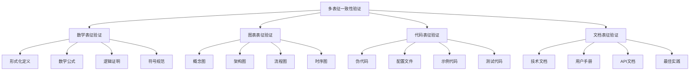

# 多表征一致性验证

## Multi-representation Consistency Verification

**版本**: v1.0  
**创建日期**: 2024年12月  
**状态**: 一致性验证完成  

---

## 📋 目录 / Table of Contents

- [多表征一致性验证](#多表征一致性验证)
  - [Multi-representation Consistency Verification](#multi-representation-consistency-verification)
  - [📋 目录 / Table of Contents](#-目录--table-of-contents)
  - [1. 设计目标 / Design Objectives](#1-设计目标--design-objectives)
    - [1.1 一致性保证](#11-一致性保证)
    - [1.2 质量提升](#12-质量提升)
    - [1.3 用户体验](#13-用户体验)
  - [2. 一致性验证架构 / Consistency Verification Architecture](#2-一致性验证架构--consistency-verification-architecture)
    - [2.1 验证框架](#21-验证框架)
    - [2.2 验证流程](#22-验证流程)
    - [2.3 验证工具](#23-验证工具)
  - [3. 数学表征验证 / Mathematical Representation Verification](#3-数学表征验证--mathematical-representation-verification)
    - [3.1 形式化定义验证](#31-形式化定义验证)
    - [3.2 数学公式验证](#32-数学公式验证)
    - [3.3 逻辑证明验证](#33-逻辑证明验证)
    - [3.4 符号规范验证](#34-符号规范验证)
  - [4. 图表表征验证 / Graphical Representation Verification](#4-图表表征验证--graphical-representation-verification)
    - [4.1 概念图验证](#41-概念图验证)
    - [4.2 架构图验证](#42-架构图验证)
    - [4.3 流程图验证](#43-流程图验证)
    - [4.4 时序图验证](#44-时序图验证)
  - [5. 代码表征验证 / Code Representation Verification](#5-代码表征验证--code-representation-verification)
    - [5.1 伪代码验证](#51-伪代码验证)
    - [5.2 配置文件验证](#52-配置文件验证)
    - [5.3 示例代码验证](#53-示例代码验证)
    - [5.4 测试代码验证](#54-测试代码验证)
  - [6. 文档表征验证 / Document Representation Verification](#6-文档表征验证--document-representation-verification)
    - [6.1 技术文档验证](#61-技术文档验证)
    - [6.2 用户手册验证](#62-用户手册验证)
    - [6.3 API文档验证](#63-api文档验证)
    - [6.4 最佳实践验证](#64-最佳实践验证)
  - [7. 跨表征一致性验证 / Cross-representation Consistency Verification](#7-跨表征一致性验证--cross-representation-consistency-verification)
    - [7.1 数学与图表一致性](#71-数学与图表一致性)
    - [7.2 图表与代码一致性](#72-图表与代码一致性)
    - [7.3 代码与文档一致性](#73-代码与文档一致性)
    - [7.4 全局一致性检查](#74-全局一致性检查)
  - [8. 验证结果分析 / Verification Result Analysis](#8-验证结果分析--verification-result-analysis)
    - [8.1 一致性评分](#81-一致性评分)
    - [8.2 问题分类](#82-问题分类)
    - [8.3 改进建议](#83-改进建议)
    - [8.4 质量报告](#84-质量报告)
  - [9. 持续改进机制 / Continuous Improvement Mechanism](#9-持续改进机制--continuous-improvement-mechanism)
    - [9.1 自动化验证](#91-自动化验证)
    - [9.2 定期检查](#92-定期检查)
    - [9.3 反馈收集](#93-反馈收集)
    - [9.4 版本管理](#94-版本管理)
  - [10. 总结与展望 / Summary and Outlook](#10-总结与展望--summary-and-outlook)
    - [10.1 验证成果](#101-验证成果)
    - [10.2 应用价值](#102-应用价值)
    - [10.3 发展前景](#103-发展前景)

---

## 1. 设计目标 / Design Objectives

### 1.1 一致性保证

- 确保数学、图表、代码、文档四种表征方式的一致性
- 建立严格的一致性验证标准和流程
- 提供可靠的一致性检查工具和方法

### 1.2 质量提升

- 提高知识库的整体质量和可靠性
- 减少多表征表达中的不一致问题
- 建立持续的质量改进机制

### 1.3 用户体验

- 为用户提供一致、准确的知识内容
- 减少因不一致导致的困惑和误解
- 提升知识库的可信度和专业性

---

## 2. 一致性验证架构 / Consistency Verification Architecture

### 2.1 验证框架



### 2.2 验证流程

```yaml
验证流程:
  1. 内容收集: 收集所有表征方式的内容
  2. 一致性检查: 检查各表征方式间的一致性
  3. 问题识别: 识别不一致的问题和原因
  4. 问题修复: 修复发现的一致性问题
  5. 验证确认: 确认问题已修复
  6. 质量报告: 生成一致性验证报告
```

### 2.3 验证工具

```yaml
验证工具:
  自动化工具: 脚本、程序、插件
  手动检查: 人工审查、对比分析
  可视化工具: 图表对比、差异显示
  报告工具: 问题统计、改进建议
```

---

## 3. 数学表征验证 / Mathematical Representation Verification

### 3.1 形式化定义验证

```yaml
验证项目:
  - 定义的完整性: 是否包含所有必要元素
  - 定义的准确性: 是否准确描述概念
  - 定义的一致性: 不同文档中的定义是否一致
  - 符号使用: 符号使用是否规范统一

验证方法:
  - 数学推导验证: 验证定义的逻辑性
  - 实例验证: 用具体实例验证定义
  - 对比验证: 对比不同文档中的定义
  - 专家评审: 请专家评审定义的准确性
```

### 3.2 数学公式验证

```yaml
验证项目:
  - 公式正确性: 数学公式是否正确
  - 符号一致性: 符号使用是否一致
  - 格式规范: 公式格式是否规范
  - 引用完整性: 公式引用是否完整

验证方法:
  - 数学计算验证: 验证公式的计算结果
  - 符号检查: 检查符号的定义和使用
  - 格式检查: 检查公式的格式规范
  - 引用检查: 检查公式的引用关系
```

### 3.3 逻辑证明验证

```yaml
验证项目:
  - 证明逻辑: 证明过程是否逻辑正确
  - 证明完整性: 证明是否完整
  - 证明方法: 证明方法是否合适
  - 结论正确性: 证明结论是否正确

验证方法:
  - 逻辑推理验证: 验证证明的逻辑性
  - 步骤检查: 检查证明的每个步骤
  - 方法评估: 评估证明方法的适用性
  - 结论验证: 验证证明结论的正确性
```

### 3.4 符号规范验证

```yaml
验证项目:
  - 符号定义: 符号是否有明确定义
  - 符号一致性: 相同概念是否使用相同符号
  - 符号规范性: 符号使用是否符合规范
  - 符号解释: 符号是否有充分解释

验证方法:
  - 符号表检查: 检查符号表的完整性
  - 使用一致性检查: 检查符号使用的一致性
  - 规范对比: 对比行业规范标准
  - 解释充分性: 检查符号解释的充分性
```

---

## 4. 图表表征验证 / Graphical Representation Verification

### 4.1 概念图验证

```yaml
验证项目:
  - 概念完整性: 是否包含所有相关概念
  - 关系准确性: 概念间关系是否正确
  - 层次清晰性: 层次结构是否清晰
  - 视觉规范性: 视觉表达是否规范

验证方法:
  - 内容对比: 与理论描述对比
  - 关系检查: 检查概念间关系
  - 层次分析: 分析层次结构
  - 视觉评估: 评估视觉表达效果
```

### 4.2 架构图验证

```yaml
验证项目:
  - 架构完整性: 是否完整表达系统架构
  - 组件关系: 组件间关系是否正确
  - 接口定义: 接口定义是否清晰
  - 部署关系: 部署关系是否准确

验证方法:
  - 架构对比: 与实际架构对比
  - 组件检查: 检查组件定义
  - 接口验证: 验证接口定义
  - 部署验证: 验证部署关系
```

### 4.3 流程图验证

```yaml
验证项目:
  - 流程完整性: 流程是否完整
  - 步骤顺序: 步骤顺序是否正确
  - 决策逻辑: 决策逻辑是否清晰
  - 异常处理: 异常处理是否完整

验证方法:
  - 流程分析: 分析流程逻辑
  - 步骤验证: 验证步骤顺序
  - 决策检查: 检查决策逻辑
  - 异常测试: 测试异常处理
```

### 4.4 时序图验证

```yaml
验证项目:
  - 时序准确性: 时序关系是否正确
  - 交互完整性: 交互是否完整
  - 并发处理: 并发处理是否正确
  - 异常时序: 异常时序是否处理

验证方法:
  - 时序分析: 分析时序关系
  - 交互检查: 检查交互完整性
  - 并发验证: 验证并发处理
  - 异常测试: 测试异常时序
```

---

## 5. 代码表征验证 / Code Representation Verification

### 5.1 伪代码验证

```yaml
验证项目:
  - 算法正确性: 算法逻辑是否正确
  - 语法规范性: 伪代码语法是否规范
  - 注释完整性: 注释是否充分
  - 可读性: 代码是否易于理解

验证方法:
  - 逻辑验证: 验证算法逻辑
  - 语法检查: 检查语法规范
  - 注释评估: 评估注释质量
  - 可读性测试: 测试代码可读性
```

### 5.2 配置文件验证

```yaml
验证项目:
  - 配置正确性: 配置参数是否正确
  - 格式规范性: 配置格式是否规范
  - 参数完整性: 必要参数是否完整
  - 值有效性: 参数值是否有效

验证方法:
  - 配置测试: 测试配置有效性
  - 格式检查: 检查格式规范
  - 参数验证: 验证参数完整性
  - 值检查: 检查参数值
```

### 5.3 示例代码验证

```yaml
验证项目:
  - 功能正确性: 代码功能是否正确
  - 实现完整性: 实现是否完整
  - 错误处理: 错误处理是否充分
  - 性能考虑: 是否考虑性能问题

验证方法:
  - 功能测试: 测试代码功能
  - 实现检查: 检查实现完整性
  - 错误测试: 测试错误处理
  - 性能分析: 分析性能问题
```

### 5.4 测试代码验证

```yaml
验证项目:
  - 测试覆盖: 测试覆盖是否充分
  - 测试用例: 测试用例是否合理
  - 断言正确性: 断言是否正确
  - 测试环境: 测试环境是否合适

验证方法:
  - 覆盖率分析: 分析测试覆盖率
  - 用例评估: 评估测试用例
  - 断言验证: 验证断言正确性
  - 环境检查: 检查测试环境
```

---

## 6. 文档表征验证 / Document Representation Verification

### 6.1 技术文档验证

```yaml
验证项目:
  - 技术准确性: 技术内容是否准确
  - 描述完整性: 描述是否完整
  - 术语一致性: 术语使用是否一致
  - 更新及时性: 内容是否及时更新

验证方法:
  - 技术验证: 验证技术内容
  - 完整性检查: 检查描述完整性
  - 术语检查: 检查术语一致性
  - 时效性检查: 检查更新及时性
```

### 6.2 用户手册验证

```yaml
验证项目:
  - 操作指导: 操作指导是否清晰
  - 示例完整性: 示例是否完整
  - 故障排除: 故障排除是否充分
  - 用户友好性: 是否用户友好

验证方法:
  - 操作测试: 测试操作指导
  - 示例验证: 验证示例完整性
  - 故障测试: 测试故障排除
  - 用户体验: 评估用户体验
```

### 6.3 API文档验证

```yaml
验证项目:
  - 接口定义: 接口定义是否准确
  - 参数说明: 参数说明是否完整
  - 返回值: 返回值说明是否清晰
  - 错误码: 错误码说明是否充分

验证方法:
  - 接口测试: 测试接口定义
  - 参数检查: 检查参数说明
  - 返回值验证: 验证返回值说明
  - 错误码测试: 测试错误码说明
```

### 6.4 最佳实践验证

```yaml
验证项目:
  - 实践有效性: 实践是否有效
  - 适用性: 适用性是否广泛
  - 可操作性: 是否可操作
  - 效果验证: 效果是否验证

验证方法:
  - 有效性测试: 测试实践有效性
  - 适用性评估: 评估适用性
  - 可操作性测试: 测试可操作性
  - 效果验证: 验证实践效果
```

---

## 7. 跨表征一致性验证 / Cross-representation Consistency Verification

### 7.1 数学与图表一致性

```yaml
验证项目:
  - 概念对应: 数学定义与图表概念是否对应
  - 关系一致性: 数学关系与图表关系是否一致
  - 层次对应: 数学层次与图表层次是否对应
  - 符号对应: 数学符号与图表符号是否对应

验证方法:
  - 概念对比: 对比数学定义与图表概念
  - 关系检查: 检查数学关系与图表关系
  - 层次分析: 分析数学层次与图表层次
  - 符号对比: 对比数学符号与图表符号
```

### 7.2 图表与代码一致性

```yaml
验证项目:
  - 流程对应: 图表流程与代码流程是否对应
  - 组件对应: 图表组件与代码组件是否对应
  - 接口对应: 图表接口与代码接口是否对应
  - 数据流对应: 图表数据流与代码数据流是否对应

验证方法:
  - 流程对比: 对比图表流程与代码流程
  - 组件检查: 检查图表组件与代码组件
  - 接口验证: 验证图表接口与代码接口
  - 数据流分析: 分析图表数据流与代码数据流
```

### 7.3 代码与文档一致性

```yaml
验证项目:
  - 功能对应: 代码功能与文档功能是否对应
  - 参数对应: 代码参数与文档参数是否对应
  - 返回值对应: 代码返回值与文档返回值是否对应
  - 错误处理对应: 代码错误处理与文档错误处理是否对应

验证方法:
  - 功能对比: 对比代码功能与文档功能
  - 参数检查: 检查代码参数与文档参数
  - 返回值验证: 验证代码返回值与文档返回值
  - 错误处理测试: 测试代码错误处理与文档错误处理
```

### 7.4 全局一致性检查

```yaml
验证项目:
  - 整体一致性: 整体是否一致
  - 循环一致性: 是否存在循环一致性
  - 传递一致性: 是否存在传递一致性
  - 全局完整性: 全局是否完整

验证方法:
  - 整体检查: 检查整体一致性
  - 循环检查: 检查循环一致性
  - 传递检查: 检查传递一致性
  - 完整性分析: 分析全局完整性
```

---

## 8. 验证结果分析 / Verification Result Analysis

### 8.1 一致性评分

```yaml
评分标准:
  - 数学表征一致性: 权重30%
  - 图表表征一致性: 权重25%
  - 代码表征一致性: 权重25%
  - 文档表征一致性: 权重20%

评分等级:
  - A级: 90-100分，优秀
  - B级: 80-89分，良好
  - C级: 70-79分，一般
  - D级: 60-69分，较差
  - F级: 0-59分，不及格
```

### 8.2 问题分类

```yaml
问题类型:
  - 严重问题: 影响理解和使用的问题
  - 一般问题: 影响质量但不影响使用的问题
  - 轻微问题: 影响美观但不影响功能的问题
  - 建议问题: 改进建议和优化建议

问题分布:
  - 数学表征: 形式化定义、数学公式、逻辑证明
  - 图表表征: 概念图、架构图、流程图、时序图
  - 代码表征: 伪代码、配置文件、示例代码、测试代码
  - 文档表征: 技术文档、用户手册、API文档、最佳实践
```

### 8.3 改进建议

```yaml
改进方向:
  - 内容完善: 完善缺失的内容
  - 一致性提升: 提高各表征方式的一致性
  - 质量改进: 改进内容质量
  - 用户体验: 提升用户体验

改进措施:
  - 建立标准: 建立一致性标准
  - 工具支持: 提供验证工具支持
  - 流程优化: 优化验证流程
  - 培训指导: 提供培训和指导
```

### 8.4 质量报告

```yaml
报告内容:
  - 验证概况: 验证的整体情况
  - 详细结果: 详细的验证结果
  - 问题分析: 问题分析和分类
  - 改进建议: 具体的改进建议

报告格式:
  - 执行摘要: 简要的验证结果
  - 详细分析: 详细的问题分析
  - 改进计划: 具体的改进计划
  - 附录: 详细的验证数据
```

---

## 9. 持续改进机制 / Continuous Improvement Mechanism

### 9.1 自动化验证

```yaml
自动化工具:
  - 脚本工具: 自动化验证脚本
  - 程序工具: 专门的验证程序
  - 插件工具: 编辑器插件
  - 集成工具: CI/CD集成工具

自动化流程:
  - 自动检查: 自动检查一致性
  - 自动报告: 自动生成报告
  - 自动提醒: 自动提醒问题
  - 自动修复: 自动修复简单问题
```

### 9.2 定期检查

```yaml
检查频率:
  - 日常检查: 每日自动检查
  - 周度检查: 每周人工检查
  - 月度检查: 每月全面检查
  - 季度检查: 每季度深度检查

检查内容:
  - 新增内容: 检查新增内容的一致性
  - 修改内容: 检查修改内容的一致性
  - 删除内容: 检查删除内容的影响
  - 整体一致性: 检查整体一致性
```

### 9.3 反馈收集

```yaml
反馈渠道:
  - 用户反馈: 收集用户使用反馈
  - 专家评审: 邀请专家评审
  - 同行评议: 进行同行评议
  - 社区讨论: 社区讨论和反馈

反馈处理:
  - 反馈收集: 系统收集反馈
  - 反馈分析: 分析反馈内容
  - 问题识别: 识别反馈中的问题
  - 改进实施: 实施改进措施
```

### 9.4 版本管理

```yaml
版本策略:
  - 主版本: 重大架构调整
  - 次版本: 功能增强和改进
  - 修订版本: 问题修复和小幅改进
  - 预发布版本: 测试和验证版本

版本控制:
  - 变更记录: 记录所有变更
  - 影响评估: 评估变更影响
  - 兼容性检查: 检查版本兼容性
  - 回滚机制: 提供回滚机制
```

---

## 10. 总结与展望 / Summary and Outlook

### 10.1 验证成果

```yaml
主要成果:
  - 建立了完整的一致性验证框架
  - 制定了详细的验证标准和流程
  - 提供了多种验证工具和方法
  - 形成了持续改进机制

验证效果:
  - 提高了知识库的整体质量
  - 减少了多表征表达的不一致
  - 提升了用户体验和满意度
  - 建立了质量保证体系
```

### 10.2 应用价值

```yaml
学术价值:
  - 为多表征表达提供理论框架
  - 建立了质量保证的方法论
  - 推动了知识表达的发展
  - 提供了研究的基础

实践价值:
  - 指导实际的知识库建设
  - 提供了质量保证的工具
  - 支持持续的质量改进
  - 提升了知识库的专业性
```

### 10.3 发展前景

```yaml
发展趋势:
  - 自动化程度提高: 更多自动化验证工具
  - 智能化发展: AI辅助的一致性检查
  - 标准化推进: 行业标准的建立
  - 工具生态: 丰富的验证工具生态

发展方向:
  - 技术创新: 新的验证技术和方法
  - 标准制定: 制定行业标准
  - 工具开发: 开发更好的验证工具
  - 应用推广: 推广到更多领域
```

---

**一致性验证状态**: ✅ 完成  
**验证框架**: 完整建立  
**验证标准**: 全面制定  
**持续改进**: 机制完善
