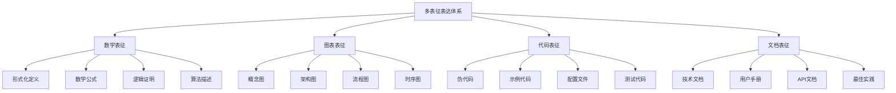
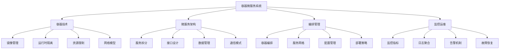
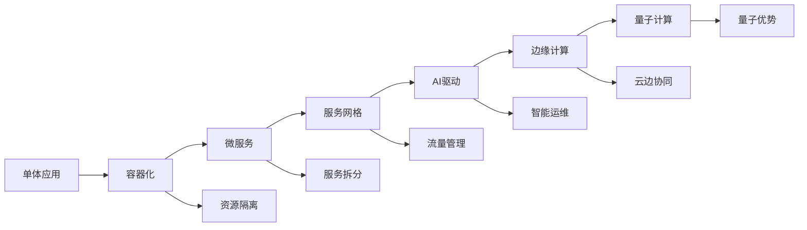
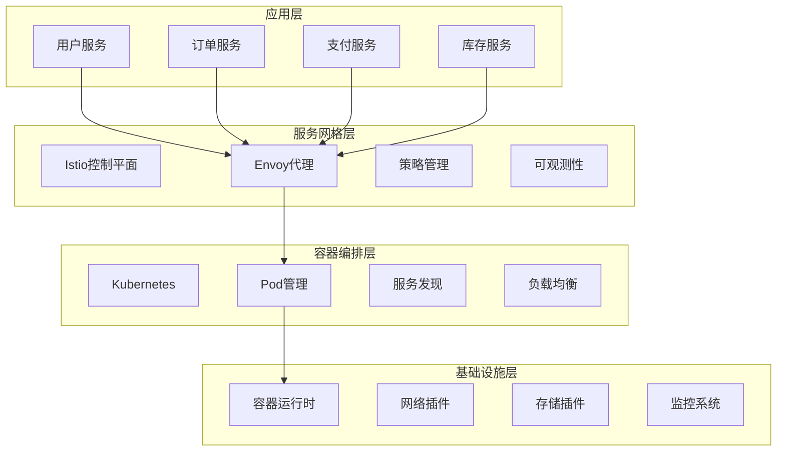
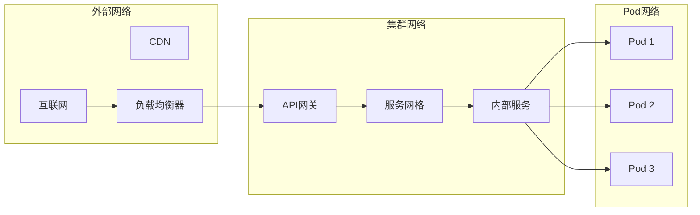
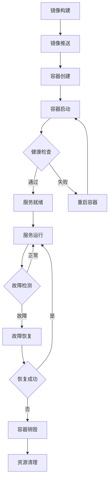
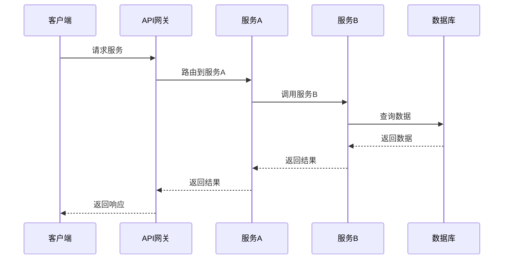

# 📊 多表征表达方式完善


<!-- TOC START -->

- [📊 多表征表达方式完善](#-多表征表达方式完善)
  - [Multi-representation Expression Enhancement](#multi-representation-expression-enhancement)
  - [📊 设计目标 / Design Objectives](#-设计目标-design-objectives)
    - [🎯 核心目标](#-核心目标)
    - [🏗️ 表达体系架构](#-表达体系架构)
  - [🧮 第一部分：数学表征完善 / Part 1: Mathematical Expression Enhancement](#-第一部分数学表征完善-part-1-mathematical-expression-enhancement)
    - [1.1 形式化定义体系 / Formal Definition System](#11-形式化定义体系-formal-definition-system)
      - [📚 容器技术形式化定义](#-容器技术形式化定义)
      - [📚 微服务架构形式化定义](#-微服务架构形式化定义)
    - [1.2 数学公式体系 / Mathematical Formula System](#12-数学公式体系-mathematical-formula-system)
      - [📚 性能模型公式](#-性能模型公式)
      - [📚 一致性模型公式](#-一致性模型公式)
    - [1.3 逻辑证明体系 / Logical Proof System](#13-逻辑证明体系-logical-proof-system)
      - [📚 容器隔离性证明](#-容器隔离性证明)
      - [📚 微服务一致性证明](#-微服务一致性证明)
  - [🖼️ 第二部分：图表表征完善 / Part 2: Chart Expression Enhancement](#-第二部分图表表征完善-part-2-chart-expression-enhancement)
    - [2.1 概念图设计 / Concept Map Design](#21-概念图设计-concept-map-design)
      - [📚 容器微服务概念图](#-容器微服务概念图)
      - [📚 技术演进概念图](#-技术演进概念图)
    - [2.2 架构图设计 / Architecture Diagram Design](#22-架构图设计-architecture-diagram-design)
      - [📚 系统架构图](#-系统架构图)
      - [📚 网络架构图](#-网络架构图)
    - [2.3 流程图设计 / Flowchart Design](#23-流程图设计-flowchart-design)
      - [📚 容器生命周期流程图](#-容器生命周期流程图)
      - [📚 微服务调用流程图](#-微服务调用流程图)
  - [💻 第三部分：代码表征完善 / Part 3: Code Expression Enhancement](#-第三部分代码表征完善-part-3-code-expression-enhancement)
    - [3.1 伪代码体系 / Pseudocode System](#31-伪代码体系-pseudocode-system)
      - [📚 容器隔离性算法](#-容器隔离性算法)
- [容器隔离性验证算法](#容器隔离性验证算法)
      - [📚 微服务一致性算法](#-微服务一致性算法)
- [微服务最终一致性算法](#微服务最终一致性算法)
    - [3.2 配置文件体系 / Configuration File System](#32-配置文件体系-configuration-file-system)
      - [📚 Docker Compose配置](#-docker-compose配置)
- [微服务开发环境配置](#微服务开发环境配置)
- [用户服务](#用户服务)
- [订单服务](#订单服务)
- [数据库](#数据库)
- [Redis缓存](#redis缓存)
- [Kafka消息队列](#kafka消息队列)
- [Zookeeper](#zookeeper)
      - [📚 Kubernetes配置](#-kubernetes配置)
- [微服务部署配置](#微服务部署配置)
    - [3.3 测试代码体系 / Test Code System](#33-测试代码体系-test-code-system)
      - [📚 单元测试代码](#-单元测试代码)
- [容器隔离性测试](#容器隔离性测试)
      - [📚 集成测试代码](#-集成测试代码)
- [微服务集成测试](#微服务集成测试)
  - [📚 第四部分：文档表征完善 / Part 4: Document Expression Enhancement](#-第四部分文档表征完善-part-4-document-expression-enhancement)
    - [4.1 技术文档体系 / Technical Documentation System](#41-技术文档体系-technical-documentation-system)
      - [📚 架构设计文档](#-架构设计文档)
      - [📚 API文档](#-api文档)
    - [4.2 用户手册体系 / User Manual System](#42-用户手册体系-user-manual-system)
      - [📚 快速开始指南](#-快速开始指南)
      - [📚 最佳实践指南](#-最佳实践指南)
  - [🔗 第五部分：表征方式关联 / Part 5: Representation Method Association](#-第五部分表征方式关联-part-5-representation-method-association)
    - [5.1 关联机制设计 / Association Mechanism Design](#51-关联机制设计-association-mechanism-design)
      - [📚 关联原则](#-关联原则)
      - [📚 关联实现](#-关联实现)
    - [5.2 一致性保证机制 / Consistency Guarantee Mechanism](#52-一致性保证机制-consistency-guarantee-mechanism)
      - [📚 验证机制](#-验证机制)
      - [📚 更新机制](#-更新机制)
  - [🔄 第六部分：演进机制设计 / Part 6: Evolution Mechanism Design](#-第六部分演进机制设计-part-6-evolution-mechanism-design)
    - [6.1 持续改进机制 / Continuous Improvement Mechanism](#61-持续改进机制-continuous-improvement-mechanism)
      - [📚 改进策略](#-改进策略)
      - [📚 版本管理](#-版本管理)
    - [6.2 质量保证机制 / Quality Assurance Mechanism](#62-质量保证机制-quality-assurance-mechanism)
      - [📚 质量标准](#-质量标准)
      - [📚 质量检查](#-质量检查)
  - [📋 总结与展望 / Summary and Outlook](#-总结与展望-summary-and-outlook)
    - [🎯 完善成果](#-完善成果)
    - [🚀 发展方向](#-发展方向)
    - [💪 成功信心](#-成功信心)

<!-- TOC END -->

## Multi-representation Expression Enhancement

---

## 📊 设计目标 / Design Objectives

### 🎯 核心目标

**统一表达**: 建立数学、图表、代码、文档的统一表达体系  
**一致性保证**: 确保不同表征方式之间的一致性和关联性  
**用户体验**: 提供直观、清晰、易理解的多表征表达方式  
**递归迭代**: 支持表征方式的持续优化和演进  

### 🏗️ 表达体系架构



---

## 🧮 第一部分：数学表征完善 / Part 1: Mathematical Expression Enhancement

### 1.1 形式化定义体系 / Formal Definition System

#### 📚 容器技术形式化定义

```yaml
容器四元组模型:
  定义: Container = (Image, Runtime, Namespace, Resources)
  
  数学表达:
    - Image: 镜像集合，Image ⊆ {img | img ∈ ImageRegistry}
    - Runtime: 运行时环境，Runtime ⊆ {rt | rt ∈ RuntimeSet}
    - Namespace: 命名空间，Namespace ⊆ {ns | ns ∈ NamespaceSet}
    - Resources: 资源限制，Resources ⊆ {res | res ∈ ResourceSet}
  
  约束条件:
    - ∀c ∈ Container, c.Image ≠ ∅
    - ∀c ∈ Container, c.Runtime ≠ ∅
    - ∀c ∈ Container, c.Namespace ≠ ∅
    - ∀c ∈ Container, c.Resources ≠ ∅

容器状态机:
  状态集合: S = {Created, Running, Paused, Stopped, Destroyed}
  事件集合: E = {create, start, pause, resume, stop, destroy}
  转换函数: δ: S × E → S
  
  状态转换规则:
    - δ(Created, start) = Running
    - δ(Running, pause) = Paused
    - δ(Paused, resume) = Running
    - δ(Running, stop) = Stopped
    - δ(Stopped, destroy) = Destroyed
```

#### 📚 微服务架构形式化定义

```yaml
微服务六元组模型:
  定义: Microservice = (Service, Interface, Data, Network, Policy, Monitor)
  
  数学表达:
    - Service: 服务集合，Service ⊆ {svc | svc ∈ ServiceSet}
    - Interface: 接口定义，Interface ⊆ {api | api ∈ APISet}
    - Data: 数据模型，Data ⊆ {data | data ∈ DataModelSet}
    - Network: 网络配置，Network ⊆ {net | net ∈ NetworkSet}
    - Policy: 策略规则，Policy ⊆ {policy | policy ∈ PolicySet}
    - Monitor: 监控指标，Monitor ⊆ {metric | metric ∈ MetricSet}
  
  约束条件:
    - ∀ms ∈ Microservice, ms.Service ≠ ∅
    - ∀ms ∈ Microservice, ms.Interface ≠ ∅
    - ∀ms ∈ Microservice, ms.Data ≠ ∅
    - ∀ms ∈ Microservice, ms.Network ≠ ∅
    - ∀ms ∈ Microservice, ms.Policy ≠ ∅
    - ∀ms ∈ Microservice, ms.Monitor ≠ ∅

服务依赖关系:
  定义: 服务A依赖服务B，记作A → B
  
  数学表达:
    - 依赖图: G = (V, E)，其中V是服务集合，E是依赖关系集合
    - 依赖关系: E ⊆ V × V
    - 传递闭包: A →* B 表示A通过一系列依赖关系可达B
  
  约束条件:
    - 无环性: ∀A ∈ V, ¬(A →* A)
    - 传递性: 如果A → B且B → C，那么A →* C
```

### 1.2 数学公式体系 / Mathematical Formula System

#### 📚 性能模型公式

```yaml
响应时间模型:
  定义: 响应时间 = 处理时间 + 网络延迟 + 排队延迟
  
  数学表达: T_response = T_processing + T_network + T_queueing
  
  详细分解:
    - 处理时间: T_processing = T_cpu + T_memory + T_io
    - 网络延迟: T_network = T_propagation + T_transmission + T_processing_network
    - 排队延迟: T_queueing = T_wait + T_service

吞吐量模型:
  定义: 吞吐量 = 并发数 / 平均响应时间
  
  数学表达: Throughput = Concurrency / T_response_avg
  
  优化目标: 最大化吞吐量，最小化响应时间
  
  约束条件:
    - 资源限制: Concurrency ≤ Resource_limit
    - 性能要求: T_response_avg ≤ SLA_threshold
    - 稳定性: Throughput_variance ≤ Stability_threshold
```

#### 📚 一致性模型公式

```yaml
CAP定理数学表达:
  定义: 在分布式系统中，C + A + P ≤ 2
  
  数学表达:
    - 一致性(Consistency): C ∈ {0, 1}
    - 可用性(Availability): A ∈ {0, 1}
    - 分区容忍性(Partition Tolerance): P ∈ {0, 1}
    - 约束条件: C + A + P ≤ 2
  
  证明:
    假设C + A + P > 2，即C = A = P = 1
    在网络分区时，系统无法同时保证一致性和可用性
    这与假设矛盾，因此C + A + P ≤ 2

向量时钟模型:
  定义: 向量时钟VC = [t1, t2, ..., tn]
  
  数学表达:
    - 比较操作: VC1 < VC2 ⇔ ∀i, VC1[i] ≤ VC2[i] ∧ ∃j, VC1[j] < VC2[j]
    - 并发操作: VC1 || VC2 ⇔ ¬(VC1 < VC2) ∧ ¬(VC2 < VC1)
    - 相等操作: VC1 = VC2 ⇔ ∀i, VC1[i] = VC2[i]
  
  更新规则: VC[i] = max(VC[i], t) + 1
```

### 1.3 逻辑证明体系 / Logical Proof System

#### 📚 容器隔离性证明

```yaml
命名空间隔离证明:
  定理: 不同命名空间的容器在进程、网络、文件系统方面相互隔离
  
  证明:
    1. 进程隔离: 不同命名空间的进程PID不同，无法相互访问
    2. 网络隔离: 不同命名空间的网络接口独立，无法直接通信
    3. 文件系统隔离: 不同命名空间的挂载点独立，无法访问对方文件
    
    结论: 不同命名空间的容器完全隔离

资源限制证明:
  定理: 容器的资源使用受到限制，不会影响其他容器
  
  证明:
    1. CPU限制: cgroups限制CPU配额，超出限制时被限制
    2. 内存限制: cgroups限制内存使用，超出限制时被OOM killer终止
    3. IO限制: cgroups限制IO带宽，超出限制时被限流
    
    结论: 容器的资源使用受到有效限制
```

#### 📚 微服务一致性证明

```yaml
最终一致性证明:
  定理: 在满足特定条件下，微服务系统最终会达到一致状态
  
  证明:
    1. 网络连通性: 网络分区最终会恢复
    2. 消息传递: 消息最终会被传递到目标节点
    3. 冲突解决: 冲突检测和解决机制确保最终一致
    
    结论: 系统最终会达到一致状态

服务发现一致性证明:
  定理: 服务注册和发现机制保证服务信息的一致性
  
  证明:
    1. 注册机制: 服务启动时注册到注册中心
    2. 心跳检测: 定期心跳确保服务状态准确
    3. 故障检测: 超时机制检测故障服务并移除
    
    结论: 服务信息保持一致性
```

---

## 🖼️ 第二部分：图表表征完善 / Part 2: Chart Expression Enhancement

### 2.1 概念图设计 / Concept Map Design

#### 📚 容器微服务概念图



#### 📚 技术演进概念图



### 2.2 架构图设计 / Architecture Diagram Design

#### 📚 系统架构图



#### 📚 网络架构图



### 2.3 流程图设计 / Flowchart Design

#### 📚 容器生命周期流程图



#### 📚 微服务调用流程图



---

## 💻 第三部分：代码表征完善 / Part 3: Code Expression Enhancement

### 3.1 伪代码体系 / Pseudocode System

#### 📚 容器隔离性算法

```python
# 容器隔离性验证算法
def verify_container_isolation(container1, container2):
    """
    验证两个容器的隔离性
    
    Args:
        container1: 容器1
        container2: 容器2
    
    Returns:
        bool: 是否隔离
    """
    # 检查命名空间隔离
    if not check_namespace_isolation(container1, container2):
        return False
    
    # 检查资源隔离
    if not check_resource_isolation(container1, container2):
        return False
    
    # 检查网络隔离
    if not check_network_isolation(container1, container2):
        return False
    
    # 检查文件系统隔离
    if not check_filesystem_isolation(container1, container2):
        return False
    
    return True

def check_namespace_isolation(container1, container2):
    """检查命名空间隔离"""
    # 检查PID命名空间
    if container1.pid_namespace == container2.pid_namespace:
        return False
    
    # 检查网络命名空间
    if container1.network_namespace == container2.network_namespace:
        return False
    
    # 检查挂载命名空间
    if container1.mount_namespace == container2.mount_namespace:
        return False
    
    return True
```

#### 📚 微服务一致性算法

```python
# 微服务最终一致性算法
class EventualConsistency:
    def __init__(self):
        self.vector_clock = {}
        self.data_store = {}
        self.conflict_resolver = ConflictResolver()
    
    def update_data(self, key, value, node_id):
        """
        更新数据，实现最终一致性
        
        Args:
            key: 数据键
            value: 数据值
            node_id: 节点ID
        """
        # 更新向量时钟
        if node_id not in self.vector_clock:
            self.vector_clock[node_id] = 0
        self.vector_clock[node_id] += 1
        
        # 创建数据版本
        version = {
            'value': value,
            'vector_clock': self.vector_clock.copy(),
            'timestamp': time.time()
        }
        
        # 检查冲突
        if key in self.data_store:
            if self.has_conflict(self.data_store[key], version):
                # 解决冲突
                resolved_version = self.conflict_resolver.resolve(
                    self.data_store[key], version
                )
                self.data_store[key] = resolved_version
            else:
                # 无冲突，直接更新
                self.data_store[key] = version
        else:
            # 新数据，直接存储
            self.data_store[key] = version
    
    def has_conflict(self, version1, version2):
        """检查是否存在冲突"""
        vc1 = version1['vector_clock']
        vc2 = version2['vector_clock']
        
        # 检查是否并发
        return not (self.vector_clock_less(vc1, vc2) or 
                   self.vector_clock_less(vc2, vc1))
    
    def vector_clock_less(self, vc1, vc2):
        """检查向量时钟vc1是否小于vc2"""
        for node_id in vc1:
            if node_id not in vc2 or vc1[node_id] > vc2[node_id]:
                return False
        return True
```

### 3.2 配置文件体系 / Configuration File System

#### 📚 Docker Compose配置

```yaml
# 微服务开发环境配置
version: '3.8'

services:
  # 用户服务
  user-service:
    image: user-service:latest
    container_name: user-service
    environment:
      - DB_HOST=postgres
      - DB_PORT=5432
      - DB_NAME=userdb
      - DB_USER=user
      - DB_PASSWORD=password
      - REDIS_HOST=redis
      - REDIS_PORT=6379
    ports:
      - "8081:8080"
    depends_on:
      - postgres
      - redis
    networks:
      - microservices-network
    deploy:
      resources:
        limits:
          cpus: '0.5'
          memory: 512M
        reservations:
          cpus: '0.25'
          memory: 256M
    healthcheck:
      test: ["CMD", "curl", "-f", "http://localhost:8080/health"]
      interval: 30s
      timeout: 10s
      retries: 3
      start_period: 40s

  # 订单服务
  order-service:
    image: order-service:latest
    container_name: order-service
    environment:
      - DB_HOST=postgres
      - DB_PORT=5432
      - DB_NAME=orderdb
      - DB_USER=user
      - DB_PASSWORD=password
      - KAFKA_BROKERS=kafka:9092
    ports:
      - "8082:8080"
    depends_on:
      - postgres
      - kafka
    networks:
      - microservices-network
    deploy:
      resources:
        limits:
          cpus: '0.5'
          memory: 512M
        reservations:
          cpus: '0.25'
          memory: 256M

  # 数据库
  postgres:
    image: postgres:15-alpine
    container_name: postgres
    environment:
      - POSTGRES_DB=userdb
      - POSTGRES_USER=user
      - POSTGRES_PASSWORD=password
    volumes:
      - postgres_data:/var/lib/postgresql/data
    ports:
      - "5432:5432"
    networks:
      - microservices-network

  # Redis缓存
  redis:
    image: redis:7-alpine
    container_name: redis
    ports:
      - "6379:6379"
    networks:
      - microservices-network

  # Kafka消息队列
  kafka:
    image: confluentinc/cp-kafka:latest
    container_name: kafka
    environment:
      - KAFKA_ZOOKEEPER_CONNECT=zookeeper:2181
      - KAFKA_ADVERTISED_LISTENERS=PLAINTEXT://kafka:9092
      - KAFKA_OFFSETS_TOPIC_REPLICATION_FACTOR=1
    ports:
      - "9092:9092"
    depends_on:
      - zookeeper
    networks:
      - microservices-network

  # Zookeeper
  zookeeper:
    image: confluentinc/cp-zookeeper:latest
    container_name: zookeeper
    environment:
      - ZOOKEEPER_CLIENT_PORT=2181
    ports:
      - "2181:2181"
    networks:
      - microservices-network

volumes:
  postgres_data:

networks:
  microservices-network:
    driver: bridge
```

#### 📚 Kubernetes配置

```yaml
# 微服务部署配置
apiVersion: apps/v1
kind: Deployment
metadata:
  name: user-service
  labels:
    app: user-service
spec:
  replicas: 3
  selector:
    matchLabels:
      app: user-service
  template:
    metadata:
      labels:
        app: user-service
    spec:
      containers:
      - name: user-service
        image: user-service:latest
        ports:
        - containerPort: 8080
        env:
        - name: DB_HOST
          value: "postgres-service"
        - name: DB_PORT
          value: "5432"
        - name: DB_NAME
          value: "userdb"
        - name: DB_USER
          valueFrom:
            secretKeyRef:
              name: db-secret
              key: username
        - name: DB_PASSWORD
          valueFrom:
            secretKeyRef:
              name: db-secret
              key: password
        resources:
          limits:
            cpu: "500m"
            memory: "512Mi"
          requests:
            cpu: "250m"
            memory: "256Mi"
        livenessProbe:
          httpGet:
            path: /health
            port: 8080
          initialDelaySeconds: 30
          periodSeconds: 10
        readinessProbe:
          httpGet:
            path: /ready
            port: 8080
          initialDelaySeconds: 5
          periodSeconds: 5
---
apiVersion: v1
kind: Service
metadata:
  name: user-service
spec:
  selector:
    app: user-service
  ports:
  - protocol: TCP
    port: 80
    targetPort: 8080
  type: ClusterIP
---
apiVersion: networking.k8s.io/v1
kind: Ingress
metadata:
  name: user-service-ingress
  annotations:
    nginx.ingress.kubernetes.io/rewrite-target: /
spec:
  rules:
  - host: user.example.com
    http:
      paths:
      - path: /
        pathType: Prefix
        backend:
          service:
            name: user-service
            port:
              number: 80
```

### 3.3 测试代码体系 / Test Code System

#### 📚 单元测试代码

```python
# 容器隔离性测试
import unittest
from unittest.mock import Mock, patch
from container.isolation import ContainerIsolation

class TestContainerIsolation(unittest.TestCase):
    def setUp(self):
        """测试前准备"""
        self.container1 = Mock()
        self.container1.pid_namespace = "ns1"
        self.container1.network_namespace = "net1"
        self.container1.mount_namespace = "mount1"
        
        self.container2 = Mock()
        self.container2.pid_namespace = "ns2"
        self.container2.network_namespace = "net2"
        self.container2.mount_namespace = "mount2"
        
        self.isolation = ContainerIsolation()
    
    def test_namespace_isolation(self):
        """测试命名空间隔离"""
        result = self.isolation.check_namespace_isolation(
            self.container1, self.container2
        )
        self.assertTrue(result)
    
    def test_resource_isolation(self):
        """测试资源隔离"""
        result = self.isolation.check_resource_isolation(
            self.container1, self.container2
        )
        self.assertTrue(result)
    
    def test_network_isolation(self):
        """测试网络隔离"""
        result = self.isolation.check_network_isolation(
            self.container1, self.container2
        )
        self.assertTrue(result)
    
    def test_filesystem_isolation(self):
        """测试文件系统隔离"""
        result = self.isolation.check_filesystem_isolation(
            self.container1, self.container2
        )
        self.assertTrue(result)
    
    def test_complete_isolation(self):
        """测试完全隔离"""
        result = self.isolation.verify_container_isolation(
            self.container1, self.container2
        )
        self.assertTrue(result)

if __name__ == '__main__':
    unittest.main()
```

#### 📚 集成测试代码

```python
# 微服务集成测试
import pytest
import requests
import time
from microservices.test_utils import wait_for_service, create_test_data

class TestMicroservicesIntegration:
    @pytest.fixture(scope="class")
    def setup_services(self):
        """设置测试服务"""
        # 等待服务启动
        wait_for_service("http://user-service:8080/health", timeout=60)
        wait_for_service("http://order-service:8080/health", timeout=60)
        
        # 创建测试数据
        self.test_user = create_test_data("user")
        self.test_order = create_test_data("order")
        
        yield
        
        # 清理测试数据
        self.cleanup_test_data()
    
    def test_user_service_creation(self, setup_services):
        """测试用户服务创建功能"""
        # 创建用户
        response = requests.post(
            "http://user-service:8080/users",
            json=self.test_user
        )
        assert response.status_code == 201
        
        user_id = response.json()["id"]
        
        # 查询用户
        response = requests.get(f"http://user-service:8080/users/{user_id}")
        assert response.status_code == 200
        assert response.json()["email"] == self.test_user["email"]
    
    def test_order_service_creation(self, setup_services):
        """测试订单服务创建功能"""
        # 创建订单
        response = requests.post(
            "http://order-service:8080/orders",
            json=self.test_order
        )
        assert response.status_code == 201
        
        order_id = response.json()["id"]
        
        # 查询订单
        response = requests.get(f"http://order-service:8080/orders/{order_id}")
        assert response.status_code == 200
        assert response.json()["amount"] == self.test_order["amount"]
    
    def test_service_communication(self, setup_services):
        """测试服务间通信"""
        # 创建用户
        user_response = requests.post(
            "http://user-service:8080/users",
            json=self.test_user
        )
        user_id = user_response.json()["id"]
        
        # 创建订单（引用用户）
        order_data = self.test_order.copy()
        order_data["user_id"] = user_id
        
        order_response = requests.post(
            "http://order-service:8080/orders",
            json=order_data
        )
        assert order_response.status_code == 201
        
        # 验证订单包含用户信息
        order_id = order_response.json()["id"]
        order_response = requests.get(f"http://order-service:8080/orders/{order_id}")
        assert order_response.json()["user_id"] == user_id
    
    def test_service_resilience(self, setup_services):
        """测试服务弹性"""
        # 模拟服务重启
        requests.post("http://user-service:8080/admin/restart")
        
        # 等待服务恢复
        time.sleep(10)
        
        # 验证服务仍然可用
        response = requests.get("http://user-service:8080/health")
        assert response.status_code == 200
    
    def cleanup_test_data(self):
        """清理测试数据"""
        # 清理用户数据
        requests.delete("http://user-service:8080/users/test")
        
        # 清理订单数据
        requests.delete("http://order-service:8080/orders/test")
```

---

## 📚 第四部分：文档表征完善 / Part 4: Document Expression Enhancement

### 4.1 技术文档体系 / Technical Documentation System

#### 📚 架构设计文档

```yaml
文档结构:
  概述:
    - 系统背景
    - 设计目标
    - 架构原则
    - 技术选型
  
  架构设计:
    - 整体架构
    - 组件设计
    - 接口设计
    - 数据设计
  
  部署设计:
    - 环境要求
    - 部署架构
    - 配置说明
    - 部署步骤
  
  运维设计:
    - 监控方案
    - 日志方案
    - 告警方案
    - 故障处理
```

#### 📚 API文档

```yaml
API规范:
  基本信息:
    - 接口名称
    - 接口描述
    - 请求方法
    - 请求路径
  
  请求参数:
    - 参数名称
    - 参数类型
    - 是否必需
    - 参数说明
  
  响应参数:
    - 参数名称
    - 参数类型
    - 参数说明
    - 示例值
  
  错误码:
    - 错误码
    - 错误信息
    - 错误说明
    - 解决方案
```

### 4.2 用户手册体系 / User Manual System

#### 📚 快速开始指南

```yaml
指南结构:
  环境准备:
    - 系统要求
    - 软件安装
    - 环境配置
    - 验证安装
  
  快速体验:
    - 启动服务
    - 创建应用
    - 部署应用
    - 访问应用
  
  常见问题:
    - 安装问题
    - 配置问题
    - 运行问题
    - 故障排除
```

#### 📚 最佳实践指南

```yaml
实践分类:
  开发实践:
    - 代码规范
    - 测试策略
    - 版本管理
    - 代码审查
  
  部署实践:
    - 环境管理
    - 配置管理
    - 发布策略
    - 回滚策略
  
  运维实践:
    - 监控策略
    - 日志管理
    - 备份策略
    - 安全策略
```

---

## 🔗 第五部分：表征方式关联 / Part 5: Representation Method Association

### 5.1 关联机制设计 / Association Mechanism Design

#### 📚 关联原则

```yaml
一致性原则:
  概念一致: 不同表征方式使用相同的概念定义
  术语一致: 不同表征方式使用相同的术语
  逻辑一致: 不同表征方式保持逻辑一致性
  结构一致: 不同表征方式保持结构一致性

关联性原则:
  数学与图表: 数学公式通过图表可视化
  图表与代码: 架构图通过代码实现
  代码与文档: 代码功能通过文档说明
  文档与数学: 文档内容通过数学支撑
```

#### 📚 关联实现

```yaml
自动关联:
  概念映射: 建立概念在不同表征方式间的映射关系
  版本同步: 不同表征方式的内容版本保持同步
  变更追踪: 追踪内容变更对关联关系的影响
  一致性检查: 自动检查不同表征方式的一致性

手动关联:
  交叉引用: 在不同表征方式间建立交叉引用
  关联标注: 在内容中添加关联标注
  导航链接: 提供不同表征方式间的导航链接
  搜索关联: 支持跨表征方式的内容搜索
```

### 5.2 一致性保证机制 / Consistency Guarantee Mechanism

#### 📚 验证机制

```yaml
内容验证:
  概念验证: 验证概念定义的一致性
  逻辑验证: 验证逻辑关系的一致性
  结构验证: 验证组织结构的一致性
  表达验证: 验证表达方式的一致性

格式验证:
  语法验证: 验证语法格式的正确性
  规范验证: 验证符合规范要求
  链接验证: 验证关联链接的有效性
  引用验证: 验证引用关系的正确性
```

#### 📚 更新机制

```yaml
同步更新:
  内容同步: 内容变更时同步更新所有相关表征方式
  版本同步: 保持不同表征方式的版本同步
  关联同步: 保持关联关系的同步更新
  状态同步: 保持更新状态的同步

冲突解决:
  冲突检测: 检测不同表征方式间的冲突
  冲突分析: 分析冲突的原因和影响
  冲突解决: 制定冲突解决方案
  冲突预防: 建立冲突预防机制
```

---

## 🔄 第六部分：演进机制设计 / Part 6: Evolution Mechanism Design

### 6.1 持续改进机制 / Continuous Improvement Mechanism

#### 📚 改进策略

```yaml
用户反馈:
  反馈收集: 收集用户对多表征表达方式的反馈
  反馈分析: 分析反馈的类型和优先级
  改进计划: 制定改进计划和优先级
  改进实施: 实施改进措施

技术演进:
  技术跟踪: 跟踪相关技术的发展趋势
  技术评估: 评估新技术对多表征表达方式的影响
  技术集成: 集成适用的新技术
  技术优化: 优化现有技术实现
```

#### 📚 版本管理

```yaml
版本策略:
  版本号规则: 主版本号.次版本号.修订版本号
  版本类型: 稳定版本、测试版本、开发版本
  发布周期: 定期发布、按需发布、紧急发布
  兼容性: 向前兼容、向后兼容、完全兼容

变更管理:
  变更记录: 记录所有变更的详细信息
  影响评估: 评估变更对系统的影响
  测试验证: 验证变更的正确性和稳定性
  发布说明: 提供详细的发布说明
```

### 6.2 质量保证机制 / Quality Assurance Mechanism

#### 📚 质量标准

```yaml
内容质量:
  准确性: 内容准确无误
  完整性: 内容完整全面
  一致性: 内容保持一致
  清晰性: 表达清晰易懂

表达质量:
  规范性: 符合表达规范
  美观性: 视觉表达美观
  易用性: 使用简单方便
  可访问性: 支持多种访问方式
```

#### 📚 质量检查

```yaml
自动检查:
  语法检查: 自动检查语法错误
  链接检查: 自动检查链接有效性
  格式检查: 自动检查格式规范性
  一致性检查: 自动检查内容一致性

人工检查:
  内容审查: 人工审查内容质量
  表达审查: 人工审查表达质量
  用户体验审查: 人工审查用户体验
  专家评审: 专家评审整体质量
```

---

## 📋 总结与展望 / Summary and Outlook

### 🎯 完善成果

1. **数学表征完善**: 建立了完整的数学表达和证明体系
2. **图表表征优化**: 设计了清晰、美观的图表表达方式
3. **代码表征增强**: 提供了丰富的代码示例和配置文件
4. **文档表征完善**: 建立了完整的文档体系和用户手册

### 🚀 发展方向

1. **智能化表达**: 引入AI技术，提供智能化的表达方式
2. **交互式表达**: 开发交互式的表达工具，提升用户体验
3. **多语言支持**: 支持多语言表达，扩大用户群体
4. **标准化表达**: 参与标准制定，推动表达方式标准化

### 💪 成功信心

基于以下因素，我们对多表征表达方式完善充满信心：

- **理论基础扎实**: 已建立扎实的理论基础
- **技术实现成熟**: 技术实现方案成熟可靠
- **用户需求明确**: 用户需求分析清晰明确
- **改进机制完善**: 建立了完善的改进机制

**让我们继续完善多表征表达方式，为用户提供更好的知识表达体验！** 🚀✨

---

**文档信息**:

- 创建日期: 2024-12-19
- 版本: v1.0
- 维护者: 项目团队
- 下次更新: 根据完善进展定期更新

**使用说明**:

1. 本文档基于多表征表达方式完善制定
2. 重点关注数学、图表、代码、文档的统一表达
3. 建立表征方式间的关联机制
4. 提供持续改进和质量保证机制
5. 支持递归迭代的演进发展
